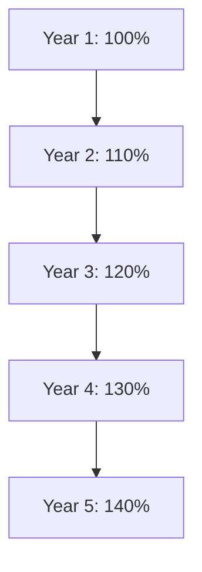

## 15.3 Trend Analysis

Trend analysis is a critical component of financial statement analysis, allowing accountants and financial analysts to evaluate a company's financial performance over multiple periods. This technique involves comparing financial data across several periods to identify patterns, trends, and anomalies that may indicate the company's financial health and operational efficiency. In the Canadian context, trend analysis is particularly important for understanding the implications of International Financial Reporting Standards (IFRS) and Accounting Standards for Private Enterprises (ASPE) on financial reporting.

### Understanding Trend Analysis

Trend analysis involves examining financial statements over a series of periods to detect patterns that can inform decision-making. It is a powerful tool for predicting future financial performance based on historical data. By analyzing trends, accountants can identify whether a company's financial position is improving, deteriorating, or remaining stable.

#### Key Components of Trend Analysis

1. **Time Frame Selection**: Choosing the appropriate time frame is crucial for meaningful trend analysis. Typically, a period of three to five years is considered adequate to identify significant trends.
   
2. **Data Consistency**: Ensuring that the financial data is consistent across periods is essential. Changes in accounting policies, currency fluctuations, or inflation adjustments must be accounted for to maintain data integrity.

3. **Comparative Analysis**: Trend analysis often involves comparing a company's performance against industry averages or key competitors to provide context to the findings.

4. **Visualization**: Graphs and charts are commonly used to visualize trends, making it easier to identify patterns and anomalies in the data.

### Steps in Conducting Trend Analysis

Conducting trend analysis involves several steps, each critical to ensuring accurate and insightful results.

#### Step 1: Data Collection

The first step in trend analysis is collecting relevant financial data from the company's financial statements. This includes data from the income statement, balance sheet, and cash flow statement. It is important to ensure that the data is accurate and consistent across the periods being analyzed.

#### Step 2: Data Adjustment

Adjust the data for any changes in accounting policies, inflation, or currency fluctuations. This step ensures that the data is comparable across periods. For example, if a company has changed its revenue recognition policy, adjustments must be made to ensure that revenue figures are comparable across periods.

#### Step 3: Calculation of Trend Percentages

Calculate trend percentages for each line item in the financial statements. This involves selecting a base year and expressing each subsequent year's figures as a percentage of the base year. The formula for calculating trend percentages is:

 \text{Trend Percentage} = \left( \frac{\text{Current Year Figure}}{\text{Base Year Figure}} \right) \times 100 

#### Step 4: Data Visualization

Visualize the trend percentages using graphs or charts. This step helps in identifying patterns and anomalies in the data. Common types of visualizations include line graphs and bar charts.

#### Step 5: Interpretation of Results

Interpret the results of the trend analysis to identify patterns, trends, and anomalies. This step involves analyzing the data to determine whether the company's financial position is improving, deteriorating, or remaining stable.

### Practical Examples of Trend Analysis

To illustrate the application of trend analysis, let's consider a hypothetical Canadian company, MapleTech Inc., which operates in the technology sector. We will analyze its revenue and net income trends over a five-year period.

#### Example: Revenue Trend Analysis

**Data Collection**: MapleTech Inc.'s revenue figures for the past five years are as follows:

- Year 1: $500,000
- Year 2: $550,000
- Year 3: $600,000
- Year 4: $650,000
- Year 5: $700,000

**Calculation of Trend Percentages**: Using Year 1 as the base year, calculate the trend percentages for each subsequent year:

- Year 1: \\( \frac{500,000}{500,000} \times 100 = 100\% \\)
- Year 2: \\( \frac{550,000}{500,000} \times 100 = 110\% \\)
- Year 3: \\( \frac{600,000}{500,000} \times 100 = 120\% \\)
- Year 4: \\( \frac{650,000}{500,000} \times 100 = 130\% \\)
- Year 5: \\( \frac{700,000}{500,000} \times 100 = 140\% \\)

**Data Visualization**: Plot the trend percentages on a line graph to visualize the revenue trend.

**Interpretation**: The trend analysis indicates a consistent increase in revenue over the five-year period, suggesting that MapleTech Inc. is experiencing growth in its sales.

#### Example: Net Income Trend Analysis

**Data Collection**: MapleTech Inc.'s net income figures for the past five years are as follows:

- Year 1: $50,000
- Year 2: $55,000
- Year 3: $60,000
- Year 4: $65,000
- Year 5: $70,000

**Calculation of Trend Percentages**: Using Year 1 as the base year, calculate the trend percentages for each subsequent year:

- Year 1: \\( \frac{50,000}{50,000} \times 100 = 100\% \\)
- Year 2: \\( \frac{55,000}{50,000} \times 100 = 110\% \\)
- Year 3: \\( \frac{60,000}{50,000} \times 100 = 120\% \\)
- Year 4: \\( \frac{65,000}{50,000} \times 100 = 130\% \\)
- Year 5: \\( \frac{70,000}{50,000} \times 100 = 140\% \\)

**Data Visualization**: Plot the trend percentages on a line graph to visualize the net income trend.

**Interpretation**: The trend analysis indicates a consistent increase in net income over the five-year period, suggesting that MapleTech Inc. is improving its profitability.

### Applications of Trend Analysis in Canadian Accounting

Trend analysis is widely used in the Canadian accounting context for various purposes, including:

1. **Performance Evaluation**: Companies use trend analysis to evaluate their financial performance over time, helping them identify areas of strength and weakness.

2. **Forecasting**: By analyzing historical trends, companies can make informed forecasts about future financial performance, aiding in strategic planning and decision-making.

3. **Benchmarking**: Trend analysis allows companies to benchmark their performance against industry averages or key competitors, providing valuable insights into their competitive position.

4. **Risk Assessment**: Identifying trends in financial data can help companies assess potential risks and take proactive measures to mitigate them.

### Challenges and Limitations of Trend Analysis

While trend analysis is a powerful tool, it has its challenges and limitations:

1. **Data Quality**: The accuracy of trend analysis depends on the quality of the financial data. Inaccurate or inconsistent data can lead to misleading results.

2. **External Factors**: Trend analysis may not account for external factors such as economic conditions, regulatory changes, or industry disruptions that can impact a company's financial performance.

3. **Subjectivity**: The interpretation of trends can be subjective, and different analysts may draw different conclusions from the same data.

4. **Short-Term Focus**: Trend analysis often focuses on short-term trends, which may not provide a complete picture of a company's long-term financial health.

### Best Practices for Effective Trend Analysis

To conduct effective trend analysis, consider the following best practices:

1. **Ensure Data Consistency**: Use consistent data across periods to ensure accurate trend analysis. Adjust for changes in accounting policies, inflation, or currency fluctuations as needed.

2. **Use Multiple Metrics**: Analyze multiple financial metrics to gain a comprehensive understanding of a company's financial performance. Consider metrics such as revenue, net income, cash flow, and return on equity.

3. **Consider External Factors**: Take into account external factors that may impact a company's financial performance, such as economic conditions, regulatory changes, or industry disruptions.

4. **Use Visualization Tools**: Use graphs and charts to visualize trends, making it easier to identify patterns and anomalies in the data.

5. **Benchmark Against Industry Averages**: Compare a company's performance against industry averages or key competitors to provide context to the findings.

### Conclusion

Trend analysis is an essential tool in financial statement analysis, providing valuable insights into a company's financial performance over time. By analyzing trends, accountants and financial analysts can identify patterns, trends, and anomalies that inform decision-making and strategic planning. In the Canadian accounting context, trend analysis is particularly important for understanding the implications of IFRS and ASPE on financial reporting. By following best practices and considering the challenges and limitations of trend analysis, accountants can conduct effective trend analysis that provides meaningful insights into a company's financial health.

## **Ready to Test Your Knowledge?**



### What is the primary purpose of trend analysis in financial statement analysis?

- [x] To evaluate financial performance over multiple periods
- [ ] To calculate financial ratios for a single period
- [ ] To determine the market value of a company
- [ ] To assess the impact of inflation on financial statements

> **Explanation:** Trend analysis involves evaluating financial performance over multiple periods to identify patterns and trends.

### Which of the following is a key component of trend analysis?

- [x] Time frame selection
- [ ] Currency conversion
- [ ] Asset valuation
- [ ] Tax calculation

> **Explanation:** Selecting the appropriate time frame is crucial for meaningful trend analysis.

### How are trend percentages calculated?

- [x] By expressing each year's figures as a percentage of a base year
- [ ] By dividing net income by total assets
- [ ] By multiplying revenue by net income
- [ ] By subtracting liabilities from assets

> **Explanation:** Trend percentages are calculated by expressing each year's figures as a percentage of a base year.

### What is a common visualization tool used in trend analysis?

- [x] Line graphs
- [ ] Pie charts
- [ ] Scatter plots
- [ ] Histograms

> **Explanation:** Line graphs are commonly used to visualize trends in financial data.

### Which of the following is a limitation of trend analysis?

- [x] It may not account for external factors
- [ ] It provides real-time data
- [ ] It is always accurate
- [ ] It eliminates subjectivity

> **Explanation:** Trend analysis may not account for external factors such as economic conditions or regulatory changes.

### Why is data consistency important in trend analysis?

- [x] To ensure accurate comparisons across periods
- [ ] To increase the complexity of analysis
- [ ] To reduce the need for visualization
- [ ] To simplify financial statements

> **Explanation:** Data consistency is important to ensure accurate comparisons across periods in trend analysis.

### What is the benefit of benchmarking in trend analysis?

- [x] It provides context to the findings
- [ ] It eliminates the need for data visualization
- [ ] It simplifies the calculation of trend percentages
- [ ] It focuses solely on internal performance

> **Explanation:** Benchmarking provides context to the findings by comparing performance against industry averages or competitors.

### Which of the following is a best practice for effective trend analysis?

- [x] Use multiple financial metrics
- [ ] Focus only on revenue figures
- [ ] Ignore external factors
- [ ] Avoid data visualization

> **Explanation:** Using multiple financial metrics provides a comprehensive understanding of a company's financial performance.

### What is a challenge associated with trend analysis?

- [x] Subjectivity in interpretation
- [ ] Real-time data availability
- [ ] Elimination of external factors
- [ ] Simplification of financial statements

> **Explanation:** The interpretation of trends can be subjective, leading to different conclusions from the same data.

### Trend analysis is particularly important in the Canadian context for understanding the implications of which accounting standards?

- [x] IFRS and ASPE
- [ ] GAAP and FASB
- [ ] SEC and PCAOB
- [ ] AICPA and IMA

> **Explanation:** In the Canadian context, trend analysis is important for understanding the implications of IFRS and ASPE on financial reporting.


