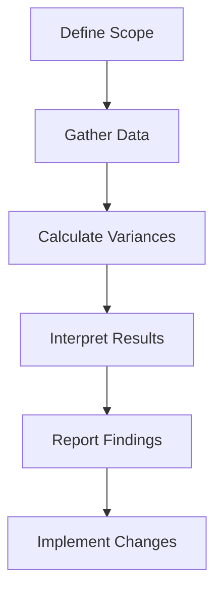

## 19.5 Variance Analysis

Variance analysis is a critical component of management accounting, providing insights into the differences between planned financial outcomes and actual results. This analysis is essential for organizations to understand why variances occur, enabling them to make informed decisions to improve financial performance. In the Canadian context, variance analysis is particularly important for aligning financial practices with local regulations and standards, such as those set by CPA Canada.

### Understanding Variance Analysis

Variance analysis involves comparing actual financial performance to budgeted or standard performance. The primary goal is to identify the causes of variances and take corrective actions. Variances can be favorable or unfavorable, depending on whether they positively or negatively impact the organization's financial performance.

#### Types of Variances

1. **Cost Variances**: These include direct material, direct labor, and overhead variances.
   - **Direct Material Variance**: The difference between the actual cost of materials and the standard cost.
   - **Direct Labor Variance**: The difference between the actual labor cost and the standard labor cost.
   - **Overhead Variance**: The difference between actual overhead costs and standard overhead costs.

2. **Revenue Variances**: These involve differences between actual and budgeted revenue.
   - **Sales Volume Variance**: The difference due to the number of units sold.
   - **Sales Price Variance**: The difference due to the selling price per unit.

3. **Profit Variances**: These reflect the overall impact on profitability.
   - **Operating Profit Variance**: The difference between actual and budgeted operating profit.

### The Importance of Variance Analysis

Variance analysis serves several purposes in management accounting:

- **Performance Measurement**: It helps in assessing the performance of different departments and individuals within an organization.
- **Cost Control**: By identifying areas where costs exceed budgets, organizations can implement cost-saving measures.
- **Decision Making**: Provides management with data to make informed decisions about future operations.
- **Strategic Planning**: Helps in aligning organizational goals with financial performance.

### Steps in Conducting Variance Analysis

1. **Establish Standards and Budgets**: Define the expected costs and revenues based on historical data and future projections.
2. **Measure Actual Performance**: Collect data on actual costs and revenues.
3. **Calculate Variances**: Determine the differences between actual and standard figures.
4. **Analyze Variances**: Identify the reasons for variances and categorize them as controllable or uncontrollable.
5. **Take Corrective Actions**: Implement strategies to address unfavorable variances and enhance favorable ones.

### Practical Examples of Variance Analysis

#### Example 1: Direct Material Variance

Consider a Canadian manufacturing company that produces widgets. The standard cost for materials is $5 per unit, and the company plans to produce 1,000 units, expecting to spend $5,000 on materials. However, the actual cost incurred is $5,500.

- **Material Price Variance**: (Actual Price - Standard Price) x Actual Quantity
  - ($5.50 - $5.00) x 1,000 = $500 Unfavorable

- **Material Quantity Variance**: (Actual Quantity - Standard Quantity) x Standard Price
  - (1,100 - 1,000) x $5.00 = $500 Unfavorable

#### Example 2: Sales Variance

A retail company in Canada budgeted to sell 2,000 units of a product at $10 each. The actual sales were 1,800 units at $11 each.

- **Sales Volume Variance**: (Actual Units Sold - Budgeted Units Sold) x Budgeted Price
  - (1,800 - 2,000) x $10 = $2,000 Unfavorable

- **Sales Price Variance**: (Actual Price - Budgeted Price) x Actual Units Sold
  - ($11 - $10) x 1,800 = $1,800 Favorable

### Real-World Applications and Regulatory Scenarios

In Canada, variance analysis is crucial for compliance with financial reporting standards such as IFRS and ASPE. Companies must ensure that their financial statements accurately reflect their performance, and variance analysis helps in achieving this by identifying discrepancies and ensuring corrective actions are taken.

### Best Practices in Variance Analysis

- **Regular Monitoring**: Conduct variance analysis regularly to promptly identify and address issues.
- **Collaborative Approach**: Involve various departments in the analysis process to gain comprehensive insights.
- **Focus on Material Variances**: Prioritize variances that have a significant impact on financial performance.
- **Use Technology**: Leverage accounting software to automate variance calculations and reporting.

### Common Pitfalls and Challenges

- **Overemphasis on Variances**: Focusing too much on variances can lead to short-term thinking and neglect of strategic goals.
- **Inaccurate Standards**: Setting unrealistic standards can result in misleading variance analysis.
- **Lack of Action**: Identifying variances without taking corrective actions renders the analysis ineffective.

### Strategies to Overcome Challenges

- **Set Realistic Standards**: Use historical data and market trends to establish achievable standards.
- **Integrate Variance Analysis with Strategic Planning**: Align variance analysis with long-term organizational goals.
- **Encourage a Culture of Continuous Improvement**: Foster an environment where employees are motivated to improve performance based on variance analysis insights.

### Step-by-Step Guidance for Conducting Variance Analysis

1. **Define the Scope**: Determine which variances to analyze based on their materiality and impact.
2. **Gather Data**: Collect actual performance data from reliable sources.
3. **Calculate Variances**: Use formulas to compute variances for cost, revenue, and profit.
4. **Interpret Results**: Analyze the reasons behind variances and their implications.
5. **Report Findings**: Prepare comprehensive reports for management, highlighting key variances and recommended actions.
6. **Implement Changes**: Develop and execute plans to address unfavorable variances and capitalize on favorable ones.

### Incorporating Diagrams and Visuals

To enhance understanding, consider using diagrams to illustrate the variance analysis process. For example, a flowchart can depict the steps involved in variance analysis, from data collection to reporting.

### References to Canadian Accounting Standards

Variance analysis should align with Canadian accounting standards, including IFRS and ASPE. CPA Canada provides guidelines on financial reporting and variance analysis, ensuring compliance with national and international standards.

### Additional Resources

For further exploration of variance analysis, consider the following resources:

- CPA Canada: Offers publications and guidelines on management accounting practices.
- International Financial Reporting Standards (IFRS): Provides a comprehensive framework for financial reporting.
- Accounting Standards for Private Enterprises (ASPE): Offers standards for private enterprises in Canada.

### Conclusion

Variance analysis is an indispensable tool in management accounting, enabling organizations to measure performance, control costs, and make informed decisions. By understanding and applying variance analysis, Canadian accountants can enhance financial performance and ensure compliance with local and international standards.

## **Ready to Test Your Knowledge?**



### What is the primary goal of variance analysis?

- [x] To identify the causes of variances and take corrective actions
- [ ] To calculate the total revenue of a company
- [ ] To determine the tax liability of a business
- [ ] To prepare financial statements

> **Explanation:** The primary goal of variance analysis is to identify the causes of variances between actual and budgeted performance and take corrective actions to improve financial outcomes.

### Which of the following is a type of cost variance?

- [x] Direct Material Variance
- [ ] Sales Volume Variance
- [ ] Operating Profit Variance
- [ ] Revenue Variance

> **Explanation:** Direct Material Variance is a type of cost variance, which measures the difference between the actual cost of materials and the standard cost.

### How is Sales Price Variance calculated?

- [x] (Actual Price - Budgeted Price) x Actual Units Sold
- [ ] (Actual Units Sold - Budgeted Units Sold) x Budgeted Price
- [ ] (Actual Revenue - Budgeted Revenue) / Budgeted Revenue
- [ ] (Actual Cost - Budgeted Cost) x Actual Units Sold

> **Explanation:** Sales Price Variance is calculated by taking the difference between the actual price and the budgeted price, multiplied by the actual units sold.

### What is a common pitfall in variance analysis?

- [x] Overemphasis on Variances
- [ ] Regular Monitoring
- [ ] Collaborative Approach
- [ ] Use of Technology

> **Explanation:** Overemphasis on variances can lead to short-term thinking and neglect of strategic goals, making it a common pitfall in variance analysis.

### What should be prioritized in variance analysis?

- [x] Material Variances
- [ ] All Variances
- [ ] Minor Variances
- [ ] Favorable Variances Only

> **Explanation:** Material variances, which have a significant impact on financial performance, should be prioritized in variance analysis.

### Which Canadian organization provides guidelines on financial reporting and variance analysis?

- [x] CPA Canada
- [ ] Canadian Securities Administrators (CSA)
- [ ] International Financial Reporting Standards (IFRS)
- [ ] Accounting Standards Board (AcSB)

> **Explanation:** CPA Canada provides guidelines on financial reporting and variance analysis, ensuring compliance with national and international standards.

### What is the first step in conducting variance analysis?

- [x] Define the Scope
- [ ] Gather Data
- [ ] Calculate Variances
- [ ] Report Findings

> **Explanation:** The first step in conducting variance analysis is to define the scope, determining which variances to analyze based on their materiality and impact.

### Which of the following is a best practice in variance analysis?

- [x] Regular Monitoring
- [ ] Overemphasis on Variances
- [ ] Inaccurate Standards
- [ ] Lack of Action

> **Explanation:** Regular monitoring is a best practice in variance analysis, allowing organizations to promptly identify and address issues.

### What is the formula for Material Price Variance?

- [x] (Actual Price - Standard Price) x Actual Quantity
- [ ] (Actual Quantity - Standard Quantity) x Standard Price
- [ ] (Actual Cost - Budgeted Cost) x Actual Quantity
- [ ] (Actual Revenue - Budgeted Revenue) x Actual Quantity

> **Explanation:** Material Price Variance is calculated by taking the difference between the actual price and the standard price, multiplied by the actual quantity.

### True or False: Variance analysis is only applicable to cost variances.

- [ ] True
- [x] False

> **Explanation:** False. Variance analysis is applicable to cost variances, revenue variances, and profit variances, providing a comprehensive view of financial performance.


