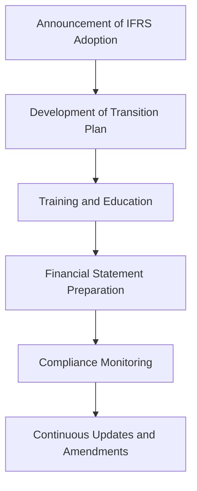

## 2.3 International Financial Reporting Standards (IFRS) Adoption in Canada

The adoption of International Financial Reporting Standards (IFRS) in Canada represents a significant shift in the country's accounting landscape. This transition, which began in earnest in 2011, has aligned Canadian financial reporting with global practices, enhancing comparability and transparency for investors and stakeholders worldwide. This section delves into the intricacies of IFRS adoption in Canada, exploring its history, rationale, regulatory framework, and practical implications for Canadian businesses and accounting professionals.

### Understanding IFRS and Its Global Significance

International Financial Reporting Standards (IFRS) are a set of accounting standards developed by the International Accounting Standards Board (IASB). These standards aim to bring consistency, transparency, and comparability to financial statements across international borders. IFRS is used in over 140 jurisdictions, making it a cornerstone of global financial reporting.

#### Key Objectives of IFRS

1. **Consistency:** Standardized accounting practices across countries.
2. **Transparency:** Clear and understandable financial statements.
3. **Comparability:** Easier comparison of financial statements from different countries.
4. **Efficiency:** Streamlined financial reporting processes.

### Historical Context of IFRS Adoption in Canada

Canada's journey towards IFRS adoption began in the early 2000s, driven by the need to harmonize its accounting standards with international practices. Before IFRS, Canadian companies followed Canadian Generally Accepted Accounting Principles (GAAP), which were distinct from international standards.

#### Timeline of Adoption

- **2006:** The Accounting Standards Board (AcSB) announced its intention to adopt IFRS for publicly accountable enterprises.
- **2011:** Mandatory adoption of IFRS for publicly accountable enterprises, including publicly traded companies and financial institutions.
- **2012 Onwards:** Continuous updates and amendments to align with evolving IFRS standards.

The decision to adopt IFRS was influenced by Canada's desire to attract foreign investment and facilitate Canadian companies' access to global capital markets. By aligning with IFRS, Canadian businesses could present their financial statements in a format familiar to international investors.

### Regulatory Framework Governing IFRS Adoption

The adoption of IFRS in Canada is overseen by several regulatory bodies, each playing a crucial role in ensuring compliance and consistency.

#### The Role of the Accounting Standards Board (AcSB)

The AcSB is responsible for setting accounting standards in Canada. It played a pivotal role in the transition to IFRS by:

- Developing a comprehensive plan for IFRS adoption.
- Providing guidance and resources to assist companies in the transition.
- Monitoring the implementation and addressing emerging issues.

#### Canadian Securities Administrators (CSA)

The CSA, an umbrella organization of Canada's provincial and territorial securities regulators, ensures that publicly accountable enterprises comply with IFRS. It provides regulatory oversight and enforces compliance through its member organizations.

#### CPA Canada

CPA Canada, the national organization representing the accounting profession, supports IFRS adoption by:

- Offering educational resources and training programs.
- Providing updates on IFRS developments.
- Engaging with international bodies to influence IFRS standards.

### Practical Implications of IFRS Adoption

The transition to IFRS has had significant implications for Canadian businesses, affecting various aspects of financial reporting and accounting practices.

#### Financial Statement Preparation

Under IFRS, Canadian companies must prepare financial statements that include:

- **Statement of Financial Position (Balance Sheet):** Reflects the company's financial position at a specific point in time.
- **Statement of Comprehensive Income:** Shows the company's financial performance over a period.
- **Statement of Changes in Equity:** Details changes in equity during the reporting period.
- **Statement of Cash Flows:** Provides insights into cash inflows and outflows.

#### Key Differences Between IFRS and Canadian GAAP

1. **Revenue Recognition:** IFRS provides a more detailed framework for recognizing revenue, emphasizing the transfer of control rather than risks and rewards.
2. **Financial Instruments:** IFRS requires fair value measurement for financial instruments, which can lead to more volatile financial statements.
3. **Leases:** IFRS 16 requires lessees to recognize most leases on the balance sheet, impacting financial ratios and debt covenants.

#### Challenges and Opportunities

**Challenges:**

- **Complexity:** IFRS can be more complex than Canadian GAAP, requiring significant effort to understand and implement.
- **Training and Education:** Accountants and financial professionals need ongoing training to stay updated with IFRS changes.
- **System Changes:** Companies may need to update their accounting systems to accommodate IFRS requirements.

**Opportunities:**

- **Global Comparability:** IFRS enhances the comparability of financial statements, benefiting investors and stakeholders.
- **Access to Capital:** Companies can access global capital markets more easily with IFRS-compliant financial statements.
- **Improved Transparency:** IFRS promotes transparency, leading to better decision-making by management and investors.

### Real-World Applications and Case Studies

To illustrate the practical impact of IFRS adoption, consider the following case studies:

#### Case Study 1: A Canadian Publicly Traded Company

A Canadian publicly traded company transitioning to IFRS faced challenges in revenue recognition, particularly with long-term contracts. By adopting IFRS 15, the company had to reassess its revenue streams, leading to changes in financial reporting and internal processes. This transition required collaboration between finance, operations, and IT departments to ensure compliance and accuracy.

#### Case Study 2: A Financial Institution

A financial institution in Canada had to adjust its accounting for financial instruments under IFRS 9. The new standard required the institution to adopt an expected credit loss model, impacting loan loss provisions and financial performance. This change necessitated enhancements in risk management processes and data analytics capabilities.

### Step-by-Step Guidance for IFRS Compliance

For Canadian companies preparing for IFRS compliance, the following steps can guide the transition:

1. **Conduct a Gap Analysis:** Identify differences between current accounting practices and IFRS requirements.
2. **Develop a Transition Plan:** Outline a timeline and resources needed for the transition.
3. **Train Staff:** Provide training programs for accounting and finance teams to understand IFRS standards.
4. **Update Systems:** Ensure accounting systems can accommodate IFRS reporting requirements.
5. **Engage Stakeholders:** Communicate changes to stakeholders, including investors, auditors, and regulators.
6. **Monitor Compliance:** Continuously monitor compliance with IFRS and update practices as standards evolve.

### Diagrams and Visual Aids

To enhance understanding, consider the following diagram illustrating the IFRS adoption process in Canada:

### Best Practices and Common Pitfalls

**Best Practices:**

- **Stay Informed:** Keep abreast of IFRS updates and amendments.
- **Engage Experts:** Consult with IFRS experts and auditors for guidance.
- **Leverage Technology:** Use technology to streamline IFRS reporting processes.

**Common Pitfalls:**

- **Underestimating Complexity:** Failing to recognize the complexity of IFRS can lead to compliance issues.
- **Inadequate Training:** Insufficient training can result in errors and misinterpretations.
- **Delayed Implementation:** Procrastination in implementing IFRS can lead to last-minute challenges.

### Conclusion

The adoption of IFRS in Canada has transformed the country's accounting landscape, aligning it with global standards and enhancing transparency and comparability. While the transition presents challenges, it also offers opportunities for Canadian businesses to access international markets and improve financial reporting practices. By understanding the regulatory framework, practical implications, and best practices, accounting professionals can navigate the complexities of IFRS and contribute to the success of their organizations.

## **Ready to Test Your Knowledge?**



### What was the primary reason for Canada's adoption of IFRS?

- [x] To align with global accounting practices
- [ ] To simplify Canadian accounting standards
- [ ] To reduce the complexity of financial reporting
- [ ] To eliminate the need for audits

> **Explanation:** Canada adopted IFRS to align its accounting standards with global practices, enhancing comparability and transparency for international investors.

### Which organization is responsible for setting accounting standards in Canada?

- [x] Accounting Standards Board (AcSB)
- [ ] Canadian Securities Administrators (CSA)
- [ ] CPA Canada
- [ ] International Accounting Standards Board (IASB)

> **Explanation:** The Accounting Standards Board (AcSB) is responsible for setting accounting standards in Canada, including the adoption of IFRS.

### What is a key difference between IFRS and Canadian GAAP?

- [x] IFRS requires fair value measurement for financial instruments
- [ ] IFRS allows more flexibility in revenue recognition
- [ ] Canadian GAAP is more complex than IFRS
- [ ] IFRS eliminates the need for financial statements

> **Explanation:** IFRS requires fair value measurement for financial instruments, which can lead to more volatile financial statements compared to Canadian GAAP.

### What is the role of CPA Canada in IFRS adoption?

- [x] Providing educational resources and training
- [ ] Enforcing compliance with IFRS
- [ ] Setting IFRS standards
- [ ] Auditing financial statements

> **Explanation:** CPA Canada supports IFRS adoption by offering educational resources and training programs to help professionals understand and implement the standards.

### Which statement is true about IFRS 16?

- [x] It requires lessees to recognize most leases on the balance sheet
- [ ] It simplifies lease accounting for lessees
- [ ] It eliminates the need for lease disclosures
- [ ] It applies only to financial institutions

> **Explanation:** IFRS 16 requires lessees to recognize most leases on the balance sheet, impacting financial ratios and debt covenants.

### What is a common challenge faced by companies transitioning to IFRS?

- [x] Complexity of the standards
- [ ] Lack of global comparability
- [ ] Reduced access to capital markets
- [ ] Elimination of financial reporting

> **Explanation:** The complexity of IFRS standards is a common challenge faced by companies transitioning from Canadian GAAP.

### How can companies ensure compliance with IFRS?

- [x] Conduct a gap analysis and develop a transition plan
- [ ] Ignore differences between IFRS and Canadian GAAP
- [ ] Rely solely on external auditors
- [ ] Avoid updating accounting systems

> **Explanation:** Conducting a gap analysis and developing a transition plan are essential steps for ensuring compliance with IFRS.

### What is a benefit of IFRS adoption for Canadian companies?

- [x] Enhanced access to global capital markets
- [ ] Simplified financial reporting
- [ ] Reduced need for audits
- [ ] Elimination of financial statements

> **Explanation:** IFRS adoption enhances access to global capital markets by providing financial statements in a format familiar to international investors.

### Which diagram best illustrates the IFRS adoption process in Canada?

- [x] Announcement of IFRS Adoption --> Development of Transition Plan --> Training and Education --> Financial Statement Preparation --> Compliance Monitoring --> Continuous Updates and Amendments
- [ ] Development of Transition Plan --> Announcement of IFRS Adoption --> Training and Education --> Financial Statement Preparation --> Compliance Monitoring --> Continuous Updates and Amendments
- [ ] Compliance Monitoring --> Announcement of IFRS Adoption --> Development of Transition Plan --> Training and Education --> Financial Statement Preparation --> Continuous Updates and Amendments
- [ ] Continuous Updates and Amendments --> Announcement of IFRS Adoption --> Development of Transition Plan --> Training and Education --> Financial Statement Preparation --> Compliance Monitoring

> **Explanation:** The correct sequence illustrates the logical flow of the IFRS adoption process in Canada.

### True or False: IFRS adoption in Canada has eliminated the need for Canadian GAAP.

- [ ] True
- [x] False

> **Explanation:** While IFRS has been adopted for publicly accountable enterprises, Canadian GAAP is still used for private enterprises and other entities not required to follow IFRS.


