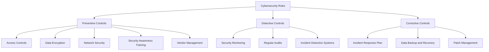

## 20.7 Cybersecurity Risks and Controls

In today's digital age, cybersecurity has become a critical concern for accounting professionals in Canada. As financial information is increasingly stored and transmitted electronically, the risk of cyber threats has grown exponentially. This section will delve into the various cybersecurity risks faced by the accounting industry and the controls necessary to mitigate these threats. By understanding these risks and implementing effective controls, accountants can protect sensitive financial data, ensure compliance with regulatory requirements, and maintain the trust of clients and stakeholders.

### Understanding Cybersecurity Risks in Accounting

Cybersecurity risks in accounting refer to the potential threats and vulnerabilities that can compromise the confidentiality, integrity, and availability of financial information. These risks can arise from various sources, including external attackers, internal threats, and technological vulnerabilities. Understanding these risks is the first step in developing a robust cybersecurity strategy.

#### Types of Cybersecurity Risks

1. **External Threats**: These include cyberattacks from hackers, cybercriminals, and nation-state actors who target financial information for theft, fraud, or disruption. Common external threats include phishing attacks, ransomware, and denial-of-service (DoS) attacks.

2. **Internal Threats**: Insider threats can be intentional or unintentional. Employees or contractors with access to financial data may misuse their privileges, either maliciously or accidentally, leading to data breaches or financial loss.

3. **Technological Vulnerabilities**: These are weaknesses in software, hardware, or network configurations that can be exploited by cybercriminals. Outdated systems, unpatched software, and weak passwords are common technological vulnerabilities.

4. **Social Engineering**: This involves manipulating individuals into divulging confidential information. Phishing emails, pretexting, and baiting are examples of social engineering tactics used to gain unauthorized access to financial data.

5. **Supply Chain Risks**: Third-party vendors and service providers with access to financial systems can introduce cybersecurity risks. A breach in a vendor's system can compromise the security of the accounting firm's data.

#### Impact of Cybersecurity Breaches

Cybersecurity breaches can have severe consequences for accounting firms, including:

- **Financial Loss**: Direct financial losses from theft or fraud, as well as indirect costs such as legal fees, regulatory fines, and remediation expenses.
- **Reputational Damage**: Loss of trust from clients and stakeholders can lead to a decline in business and long-term reputational harm.
- **Legal and Regulatory Consequences**: Non-compliance with cybersecurity regulations can result in penalties and legal action.
- **Operational Disruption**: Cyberattacks can disrupt business operations, leading to downtime and loss of productivity.

### Cybersecurity Controls in Accounting

To mitigate cybersecurity risks, accounting firms must implement a comprehensive set of controls. These controls can be categorized into preventive, detective, and corrective measures.

#### Preventive Controls

1. **Access Controls**: Implement strong access controls to ensure that only authorized individuals have access to financial data. This includes using multi-factor authentication, role-based access controls, and regularly reviewing access permissions.

2. **Data Encryption**: Encrypt sensitive financial information both in transit and at rest to protect it from unauthorized access. Encryption ensures that even if data is intercepted, it cannot be read without the decryption key.

3. **Network Security**: Use firewalls, intrusion detection systems (IDS), and intrusion prevention systems (IPS) to protect the network from external threats. Regularly update and patch network devices to address vulnerabilities.

4. **Security Awareness Training**: Educate employees about cybersecurity risks and best practices. Training should cover topics such as recognizing phishing emails, using strong passwords, and reporting suspicious activities.

5. **Vendor Management**: Conduct thorough due diligence on third-party vendors and service providers. Ensure they have robust cybersecurity measures in place and include cybersecurity clauses in contracts.

#### Detective Controls

1. **Security Monitoring**: Implement continuous monitoring of networks and systems to detect suspicious activities. Use security information and event management (SIEM) systems to analyze security logs and generate alerts.

2. **Regular Audits and Assessments**: Conduct regular cybersecurity audits and vulnerability assessments to identify and address weaknesses in the security posture.

3. **Incident Detection Systems**: Deploy systems that can detect and respond to cybersecurity incidents in real-time. This includes using advanced threat detection tools and establishing a security operations center (SOC).

#### Corrective Controls

1. **Incident Response Plan**: Develop and maintain an incident response plan to quickly and effectively respond to cybersecurity incidents. The plan should outline roles and responsibilities, communication protocols, and recovery procedures.

2. **Data Backup and Recovery**: Regularly back up financial data and test recovery procedures to ensure data can be restored in the event of a breach or data loss.

3. **Patch Management**: Implement a patch management process to ensure that all software and systems are up-to-date with the latest security patches.

### Regulatory Requirements and Compliance

In Canada, accounting firms must comply with various cybersecurity regulations and standards to protect financial information. Key regulatory requirements include:

1. **Personal Information Protection and Electronic Documents Act (PIPEDA)**: PIPEDA sets out the requirements for the collection, use, and disclosure of personal information in the course of commercial activities. Accounting firms must implement appropriate safeguards to protect personal information.

2. **Cybersecurity Guidelines from CPA Canada**: CPA Canada provides guidelines and best practices for cybersecurity in the accounting profession. These guidelines emphasize the importance of risk management, data protection, and incident response.

3. **Industry-Specific Regulations**: Depending on the industry, accounting firms may be subject to additional regulations, such as the Payment Card Industry Data Security Standard (PCI DSS) for firms handling credit card information.

### Best Practices for Cybersecurity in Accounting

To build a strong cybersecurity posture, accounting firms should adopt the following best practices:

1. **Risk Assessment and Management**: Conduct regular risk assessments to identify and prioritize cybersecurity risks. Develop a risk management strategy that includes risk mitigation, transfer, and acceptance.

2. **Cybersecurity Frameworks**: Adopt recognized cybersecurity frameworks, such as the NIST Cybersecurity Framework or ISO/IEC 27001, to guide the development and implementation of cybersecurity controls.

3. **Continuous Improvement**: Cybersecurity is an ongoing process. Regularly review and update cybersecurity policies, procedures, and controls to adapt to evolving threats and technologies.

4. **Collaboration and Information Sharing**: Participate in industry forums and information-sharing initiatives to stay informed about emerging threats and best practices.

### Case Studies and Real-World Examples

#### Case Study 1: Ransomware Attack on a Canadian Accounting Firm

In 2022, a mid-sized accounting firm in Canada fell victim to a ransomware attack. The attackers encrypted the firm's financial data and demanded a ransom for the decryption key. The firm had not implemented adequate data backup and recovery procedures, leading to significant data loss and operational disruption. This incident highlights the importance of preventive controls, such as data encryption and regular backups, as well as having a robust incident response plan.

#### Case Study 2: Insider Threat in a Financial Services Company

An employee at a financial services company in Canada exploited their access to financial systems to embezzle funds over several years. The company lacked proper access controls and monitoring systems, allowing the employee to go undetected. This case underscores the need for strong access controls and continuous monitoring to detect and prevent insider threats.

### Practical Examples and Scenarios

1. **Phishing Simulation Exercise**: Conduct regular phishing simulation exercises to test employees' ability to recognize and respond to phishing emails. Use the results to tailor security awareness training programs.

2. **Vendor Risk Assessment**: Before engaging a third-party vendor, conduct a thorough risk assessment to evaluate their cybersecurity posture. Consider factors such as data handling practices, security certifications, and incident response capabilities.

3. **Incident Response Drill**: Organize regular incident response drills to test the effectiveness of the incident response plan. Involve key stakeholders and simulate various scenarios, such as data breaches and ransomware attacks.

### Diagrams and Visuals

To enhance understanding, the following Mermaid.js diagram illustrates the flow of cybersecurity controls in an accounting firm:

### Conclusion

Cybersecurity is a critical aspect of accounting in Canada, as financial information is a prime target for cybercriminals. By understanding cybersecurity risks and implementing effective controls, accounting professionals can protect sensitive data, ensure compliance with regulatory requirements, and maintain the trust of clients and stakeholders. Continuous improvement, collaboration, and adherence to best practices are essential to building a strong cybersecurity posture.

---

## **Ready to Test Your Knowledge?**



### What are the main types of cybersecurity risks in accounting?

- [x] External threats, internal threats, technological vulnerabilities, social engineering, supply chain risks
- [ ] Only external threats and internal threats
- [ ] Technological vulnerabilities and social engineering only
- [ ] Supply chain risks and external threats only

> **Explanation:** Cybersecurity risks in accounting include external threats, internal threats, technological vulnerabilities, social engineering, and supply chain risks.

### Which of the following is a preventive control in cybersecurity?

- [x] Access Controls
- [ ] Security Monitoring
- [ ] Incident Response Plan
- [ ] Regular Audits

> **Explanation:** Access controls are preventive measures designed to restrict unauthorized access to sensitive data.

### What is the purpose of data encryption in cybersecurity?

- [x] To protect sensitive information from unauthorized access
- [ ] To monitor network activity
- [ ] To respond to cybersecurity incidents
- [ ] To conduct regular audits

> **Explanation:** Data encryption protects sensitive information by making it unreadable to unauthorized users.

### What is a common consequence of a cybersecurity breach?

- [x] Financial Loss
- [ ] Increased productivity
- [ ] Improved reputation
- [ ] Enhanced legal compliance

> **Explanation:** Cybersecurity breaches can lead to financial loss, reputational damage, and legal consequences.

### Which regulation in Canada sets out requirements for the protection of personal information?

- [x] Personal Information Protection and Electronic Documents Act (PIPEDA)
- [ ] Payment Card Industry Data Security Standard (PCI DSS)
- [ ] Sarbanes-Oxley Act (SOX)
- [ ] General Data Protection Regulation (GDPR)

> **Explanation:** PIPEDA sets out the requirements for the protection of personal information in Canada.

### What is a key component of an incident response plan?

- [x] Communication protocols
- [ ] Data encryption
- [ ] Access controls
- [ ] Vendor management

> **Explanation:** An incident response plan includes communication protocols to effectively manage cybersecurity incidents.

### What is the role of security awareness training?

- [x] To educate employees about cybersecurity risks and best practices
- [ ] To encrypt sensitive data
- [ ] To monitor network activity
- [ ] To conduct vulnerability assessments

> **Explanation:** Security awareness training educates employees about cybersecurity risks and best practices to prevent breaches.

### What is a detective control in cybersecurity?

- [x] Security Monitoring
- [ ] Access Controls
- [ ] Data Encryption
- [ ] Incident Response Plan

> **Explanation:** Security monitoring is a detective control used to identify suspicious activities and potential breaches.

### Why is vendor management important in cybersecurity?

- [x] To ensure third-party vendors have robust cybersecurity measures in place
- [ ] To encrypt sensitive data
- [ ] To conduct regular audits
- [ ] To respond to cybersecurity incidents

> **Explanation:** Vendor management ensures that third-party vendors have adequate cybersecurity measures to protect sensitive data.

### True or False: Cybersecurity is a one-time effort that does not require continuous improvement.

- [ ] True
- [x] False

> **Explanation:** Cybersecurity requires continuous improvement to adapt to evolving threats and technologies.


