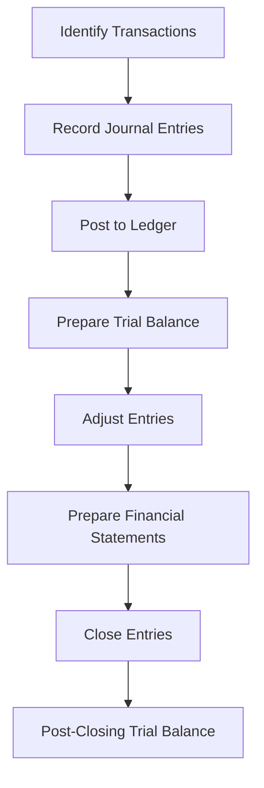
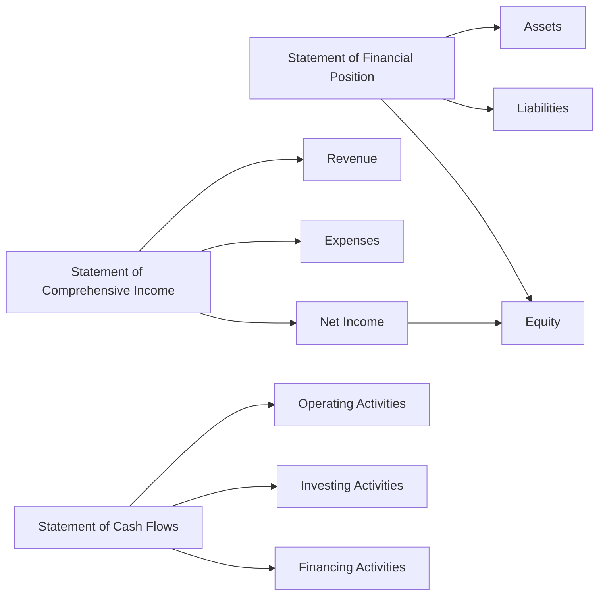

## 26.4 Checklists and Practice Aids

Preparing for Canadian accounting exams requires a thorough understanding of accounting principles, standards, and procedures. This section provides comprehensive checklists and practice aids designed to enhance your study process, ensuring you cover all essential topics and are well-prepared for the exams. These tools will guide you through complex accounting concepts, offering practical examples and real-world applications relevant to the Canadian context.

### **1. Financial Statement Preparation Checklist**

Financial statements are a core component of accounting. Use this checklist to ensure you have covered all necessary steps in preparing accurate and compliant financial statements:

1. **Gather Financial Data:**
   - Collect all relevant financial data, including transaction records, bank statements, and previous financial reports.

2. **Verify Accounting Entries:**
   - Ensure all journal entries are accurate and complete.
   - Double-check for any missing or duplicate entries.

3. **Adjusting Entries:**
   - Identify and record adjusting entries for accrued expenses, prepaid expenses, depreciation, and inventory adjustments.

4. **Trial Balance:**
   - Prepare a trial balance to verify that debits equal credits.
   - Investigate and resolve any discrepancies.

5. **Financial Statement Preparation:**
   - Prepare the Statement of Financial Position (Balance Sheet).
   - Prepare the Statement of Comprehensive Income.
   - Prepare the Statement of Changes in Equity.
   - Prepare the Statement of Cash Flows.

6. **Notes to Financial Statements:**
   - Draft comprehensive notes to the financial statements, including accounting policies and additional disclosures.

7. **Review and Approval:**
   - Review the financial statements for accuracy and compliance with IFRS or ASPE.
   - Obtain approval from management or the board of directors.

### **2. Audit Procedures Checklist**

Auditing is essential for ensuring the accuracy and reliability of financial statements. This checklist outlines the key steps in the audit process:

1. **Planning:**
   - Understand the client's business and industry.
   - Assess risks and determine materiality.
   - Develop an audit plan and timeline.

2. **Internal Controls Evaluation:**
   - Evaluate the effectiveness of the client's internal controls.
   - Identify areas of potential weakness or fraud risk.

3. **Substantive Testing:**
   - Perform tests of details and analytical procedures.
   - Verify account balances and transactions.

4. **Audit Evidence Collection:**
   - Gather sufficient and appropriate audit evidence.
   - Document findings and conclusions.

5. **Review and Reporting:**
   - Review audit workpapers and findings.
   - Prepare the audit report, including the auditor's opinion.

6. **Communication with Management:**
   - Discuss audit findings and recommendations with management.
   - Address any concerns or issues raised during the audit.

### **3. Revenue Recognition Practice Aid**

Revenue recognition is a critical area in accounting, governed by IFRS 15. Use this practice aid to navigate the complexities of revenue recognition:

1. **Identify the Contract:**
   - Ensure there is a valid contract with enforceable rights and obligations.

2. **Identify Performance Obligations:**
   - Determine distinct goods or services promised in the contract.

3. **Determine the Transaction Price:**
   - Calculate the total consideration expected to be received.

4. **Allocate the Transaction Price:**
   - Allocate the transaction price to each performance obligation based on relative standalone selling prices.

5. **Recognize Revenue:**
   - Recognize revenue when (or as) the entity satisfies a performance obligation.

6. **Disclosure Requirements:**
   - Ensure all required disclosures related to revenue recognition are included in the financial statements.

### **4. IFRS vs. ASPE Comparison Checklist**

Understanding the differences between IFRS and ASPE is crucial for Canadian accountants. This checklist highlights key differences:

1. **Conceptual Differences:**
   - Review the conceptual framework differences between IFRS and ASPE.

2. **Revenue Recognition:**
   - Compare revenue recognition criteria and methods under both standards.

3. **Financial Instruments:**
   - Understand the classification and measurement differences for financial instruments.

4. **Property, Plant, and Equipment:**
   - Review differences in recognition, measurement, and depreciation methods.

5. **Leases:**
   - Compare lease accounting treatment under IFRS 16 and ASPE.

6. **Employee Benefits:**
   - Understand the differences in accounting for employee benefits.

7. **Disclosure Requirements:**
   - Review the disclosure requirements under both standards.

### **5. Taxation in Canada Practice Aid**

Taxation is a significant aspect of accounting in Canada. Use this practice aid to navigate the Canadian tax system:

1. **Personal Income Tax:**
   - Understand the structure of personal income tax in Canada.
   - Familiarize yourself with tax brackets and rates.

2. **Corporate Taxation:**
   - Review corporate tax rates and filing requirements.
   - Understand the differences between federal and provincial taxes.

3. **GST/HST:**
   - Understand the application of GST/HST on goods and services.
   - Familiarize yourself with filing and remittance procedures.

4. **Tax Planning Strategies:**
   - Explore common tax planning strategies for individuals and businesses.

5. **Tax Compliance:**
   - Ensure compliance with tax filing deadlines and requirements.
   - Understand the implications of non-compliance.

### **6. Financial Analysis Practice Aid**

Financial analysis is essential for evaluating a company's performance. Use this practice aid to conduct a thorough financial analysis:

1. **Ratio Analysis:**
   - Calculate key financial ratios, including liquidity, solvency, and profitability ratios.

2. **Trend Analysis:**
   - Analyze financial data over multiple periods to identify trends.

3. **Vertical and Horizontal Analysis:**
   - Perform vertical analysis to assess the relative size of financial statement items.
   - Conduct horizontal analysis to evaluate changes over time.

4. **Cash Flow Analysis:**
   - Analyze cash flow statements to assess liquidity and cash management.

5. **Market Value Measures:**
   - Evaluate market value measures, such as earnings per share and price-to-earnings ratio.

### **7. Practice Problems and Exercises**

To reinforce your understanding, work through these practice problems and exercises:

1. **Prepare a Trial Balance:**
   - Use sample data to prepare a trial balance, ensuring debits equal credits.

2. **Journal Entries:**
   - Record journal entries for common transactions, such as sales, purchases, and payroll.

3. **Financial Statement Preparation:**
   - Prepare a complete set of financial statements using provided data.

4. **Revenue Recognition Scenarios:**
   - Apply IFRS 15 to various revenue recognition scenarios.

5. **Tax Calculation:**
   - Calculate personal and corporate taxes using sample data.

6. **Ratio Analysis:**
   - Perform ratio analysis on a sample company's financial statements.

### **8. Visual Aids and Diagrams**

Visual aids can enhance your understanding of accounting concepts. Use these diagrams to visualize key processes:

#### **Accounting Cycle Diagram**

#### **Financial Statement Relationships**

### **9. Best Practices and Common Pitfalls**

To succeed in your accounting exams, be aware of best practices and common pitfalls:

1. **Best Practices:**
   - Stay organized and keep detailed records.
   - Regularly review and update your knowledge of accounting standards.
   - Practice problem-solving and analytical skills.

2. **Common Pitfalls:**
   - Avoid memorizing without understanding the underlying concepts.
   - Don't overlook the importance of disclosures and notes to financial statements.
   - Be cautious of common errors in calculations and journal entries.

### **10. Additional Resources and Study Materials**

Enhance your exam preparation with these additional resources:

1. **CPA Canada Resources:**
   - Access study guides and practice exams from CPA Canada.

2. **Online Courses:**
   - Enroll in online courses focused on Canadian accounting standards and practices.

3. **Accounting Textbooks:**
   - Reference textbooks that cover IFRS, ASPE, and Canadian tax law.

4. **Professional Associations:**
   - Join professional associations for networking and access to resources.

5. **Practice Exams:**
   - Take practice exams to simulate the exam environment and test your knowledge.

By utilizing these checklists and practice aids, you will be well-equipped to tackle the Canadian accounting exams with confidence. Remember to review and practice regularly, and seek additional resources if needed to deepen your understanding.

## **Ready to Test Your Knowledge?**



### What is the first step in preparing financial statements?

- [x] Gather Financial Data
- [ ] Prepare the Trial Balance
- [ ] Adjust Entries
- [ ] Prepare Financial Statements

> **Explanation:** Gathering financial data is the initial step in preparing financial statements, as it involves collecting all relevant transaction records and financial information.

### Which of the following is a key component of the audit process?

- [x] Internal Controls Evaluation
- [ ] Revenue Recognition
- [ ] Tax Compliance
- [ ] Financial Statement Preparation

> **Explanation:** Evaluating internal controls is a crucial part of the audit process to ensure the accuracy and reliability of financial statements.

### Under IFRS 15, what must be identified in a contract for revenue recognition?

- [x] Performance Obligations
- [ ] Financial Instruments
- [ ] Lease Terms
- [ ] Tax Liabilities

> **Explanation:** Performance obligations must be identified in a contract under IFRS 15 to determine when and how revenue should be recognized.

### What is a common difference between IFRS and ASPE?

- [x] Revenue Recognition Criteria
- [ ] Tax Rates
- [ ] Audit Procedures
- [ ] Financial Statement Templates

> **Explanation:** Revenue recognition criteria differ between IFRS and ASPE, affecting how and when revenue is recognized in financial statements.

### Which analysis method involves assessing the relative size of financial statement items?

- [x] Vertical Analysis
- [ ] Horizontal Analysis
- [ ] Ratio Analysis
- [ ] Trend Analysis

> **Explanation:** Vertical analysis involves assessing the relative size of financial statement items to understand their proportion within the statement.

### What is a key consideration in Canadian corporate taxation?

- [x] Federal and Provincial Tax Differences
- [ ] Personal Tax Brackets
- [ ] GST/HST Filing
- [ ] Revenue Recognition

> **Explanation:** Understanding the differences between federal and provincial taxes is crucial in Canadian corporate taxation.

### Which of the following is a best practice for accounting exam preparation?

- [x] Regularly Review Accounting Standards
- [ ] Memorize Without Understanding
- [ ] Focus Only on Calculations
- [ ] Ignore Disclosures

> **Explanation:** Regularly reviewing accounting standards helps ensure you understand and can apply them in exam scenarios.

### What is the purpose of a trial balance?

- [x] Verify Debits Equal Credits
- [ ] Prepare Financial Statements
- [ ] Record Journal Entries
- [ ] Adjust Entries

> **Explanation:** A trial balance is prepared to verify that total debits equal total credits, ensuring the accuracy of the accounting records.

### Which diagram helps visualize the accounting cycle?

- [x] Accounting Cycle Diagram
- [ ] Financial Statement Relationships
- [ ] Audit Process Flowchart
- [ ] Tax Compliance Chart

> **Explanation:** The accounting cycle diagram visually represents the steps involved in the accounting cycle, from identifying transactions to preparing financial statements.

### True or False: Practice exams are an effective way to simulate the exam environment.

- [x] True
- [ ] False

> **Explanation:** Practice exams help simulate the exam environment, allowing you to test your knowledge and improve your exam-taking skills.


