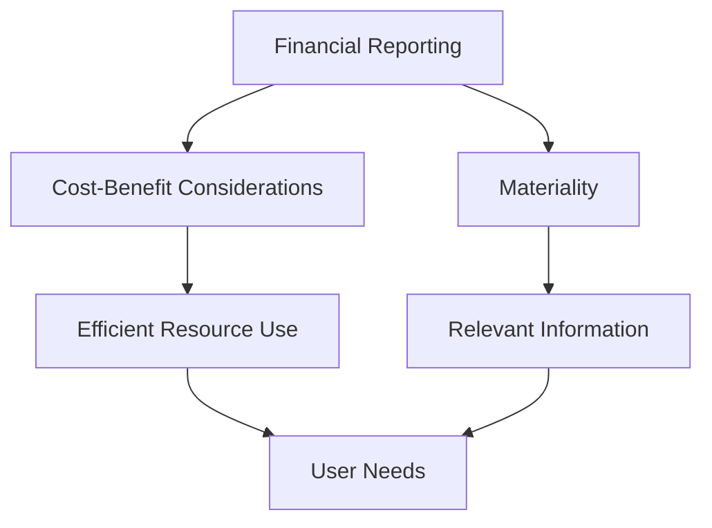

## 3.8 Constraints in Financial Reporting

In the realm of financial reporting, constraints play a pivotal role in shaping how financial information is prepared and presented. These constraints ensure that financial reporting remains practical, relevant, and efficient, balancing the needs of users with the resources available to preparers. In this section, we delve into two primary constraints: cost-benefit considerations and materiality. Both are crucial for accountants in Canada, especially when applying International Financial Reporting Standards (IFRS) and Canadian Accounting Standards for Private Enterprises (ASPE).

### Understanding Constraints in Financial Reporting

Constraints in financial reporting are limitations or boundaries that guide the preparation and presentation of financial statements. They ensure that the information provided is both useful and feasible to produce. These constraints help maintain a balance between the qualitative characteristics of financial information and the practicalities of financial reporting.

### Cost-Benefit Considerations

#### Definition and Importance

The cost-benefit consideration is a fundamental constraint in financial reporting. It posits that the benefits derived from financial information should outweigh the costs of providing that information. This constraint ensures that resources are used efficiently and that financial reporting does not become an undue burden on the entity preparing the reports.

#### Application in Canadian Accounting

In Canada, both IFRS and ASPE recognize the importance of cost-benefit considerations. For instance, IFRS emphasizes that the cost of providing information should not exceed its usefulness to users. Similarly, ASPE acknowledges that private enterprises may have limited resources, and thus, the cost of compliance should be justified by the benefits.

#### Practical Examples

1. **Disclosure Requirements:** Companies must decide which disclosures are necessary. If a disclosure provides minimal additional value to users but incurs significant costs, it may be deemed unnecessary.
   
2. **Complex Valuation Techniques:** Employing advanced valuation techniques can be costly. If simpler methods provide sufficiently accurate information, they may be preferred.

#### Challenges and Best Practices

- **Assessing Costs and Benefits:** Quantifying costs and benefits can be challenging. Companies should regularly evaluate the relevance and utility of the information provided.
  
- **Stakeholder Engagement:** Engaging with stakeholders can help determine the value of certain information, ensuring that reporting meets user needs without incurring excessive costs.

### Materiality

#### Definition and Importance

Materiality is a key concept in financial reporting, referring to the significance of financial information to users. Information is considered material if its omission or misstatement could influence the economic decisions of users. Materiality ensures that financial statements focus on the most relevant information, enhancing their usefulness.

#### Application in Canadian Accounting

Materiality is a cornerstone of both IFRS and ASPE. It guides the preparation of financial statements, ensuring that they provide a true and fair view of an entity's financial position and performance. In Canada, materiality is applied at both the individual item level and the aggregate level, influencing decisions on recognition, measurement, and disclosure.

#### Practical Examples

1. **Thresholds for Recognition:** Companies may set thresholds for recognizing certain items. For example, small expenses may be expensed immediately rather than capitalized if they are deemed immaterial.
   
2. **Aggregation of Information:** Similar items may be aggregated in financial statements if their individual presentation does not affect users' decisions.

#### Challenges and Best Practices

- **Determining Materiality:** Assessing what is material can be subjective. Companies should consider both qualitative and quantitative factors, including the nature and size of the item.
  
- **Consistency and Transparency:** Consistent application of materiality judgments enhances comparability. Transparency in how materiality is determined can also build trust with users.

### Interplay Between Cost-Benefit and Materiality

The constraints of cost-benefit and materiality often interact in financial reporting. For instance, a piece of information may be material but costly to obtain. In such cases, companies must weigh the benefits of providing the information against the costs involved. This interplay requires careful judgment and a thorough understanding of user needs.

### Real-World Applications and Case Studies

#### Case Study: A Canadian Manufacturing Company

Consider a Canadian manufacturing company that must decide whether to implement a new accounting software system. The system promises enhanced reporting capabilities but comes with significant costs. The company must assess whether the benefits, such as improved decision-making and compliance, justify the investment. This decision involves both cost-benefit analysis and materiality considerations, as the system's impact on financial statement accuracy and user decisions must be evaluated.

#### Regulatory Scenarios

In Canada, regulatory bodies such as the Accounting Standards Board (AcSB) provide guidance on applying these constraints. For example, the AcSB may issue guidelines on materiality thresholds for specific industries, helping companies make informed decisions.

### Diagrams and Visual Aids

To enhance understanding, consider the following diagram illustrating the relationship between cost-benefit considerations and materiality in financial reporting:

### Exam Strategies and Tips

- **Understand the Concepts:** Ensure you have a clear understanding of both cost-benefit considerations and materiality. These concepts are often tested in Canadian accounting exams.
  
- **Apply to Scenarios:** Practice applying these constraints to real-world scenarios, as this will help you understand their practical implications.
  
- **Review Standards:** Familiarize yourself with relevant IFRS and ASPE standards, as these provide the framework for applying these constraints.

### Conclusion

Constraints in financial reporting, particularly cost-benefit considerations and materiality, are essential for ensuring that financial information is both useful and feasible to produce. By understanding and applying these constraints, accountants can enhance the quality and relevance of financial reporting, ultimately supporting informed decision-making by users.

---

## **Ready to Test Your Knowledge?**



### What is the primary purpose of cost-benefit considerations in financial reporting?

- [x] To ensure the benefits of information outweigh the costs
- [ ] To maximize the amount of information provided
- [ ] To minimize the costs of financial reporting
- [ ] To ensure compliance with all accounting standards

> **Explanation:** Cost-benefit considerations ensure that the benefits derived from financial information justify the costs of providing it, balancing efficiency and utility.

### How does materiality influence financial reporting?

- [x] By focusing on information that affects users' decisions
- [ ] By ensuring all information is disclosed
- [ ] By reducing the complexity of financial statements
- [ ] By standardizing financial reporting across industries

> **Explanation:** Materiality ensures that financial statements emphasize information that could influence users' economic decisions, enhancing their relevance.

### Which of the following is an example of applying cost-benefit considerations?

- [x] Choosing not to disclose immaterial information
- [ ] Reporting all transactions in detail
- [ ] Implementing costly reporting systems without analysis
- [ ] Ignoring user needs in financial reporting

> **Explanation:** Applying cost-benefit considerations involves evaluating whether the cost of providing certain information is justified by its usefulness to users.

### What role does materiality play in the recognition of financial statement items?

- [x] It determines whether items are recognized based on their significance
- [ ] It ensures all items are recognized regardless of size
- [ ] It standardizes recognition across all companies
- [ ] It focuses on qualitative characteristics only

> **Explanation:** Materiality helps determine whether items are recognized in financial statements based on their potential impact on users' decisions.

### How can companies determine the materiality of an item?

- [x] By considering both qualitative and quantitative factors
- [ ] By focusing solely on the item's monetary value
- [ ] By adhering strictly to industry standards
- [ ] By consulting only internal stakeholders

> **Explanation:** Determining materiality involves assessing both qualitative and quantitative aspects, including the nature and size of the item.

### What is a key challenge in applying cost-benefit considerations?

- [x] Quantifying the benefits of financial information
- [ ] Ensuring all costs are minimized
- [ ] Maximizing the amount of disclosed information
- [ ] Standardizing reporting across industries

> **Explanation:** A significant challenge is quantifying the benefits of financial information to ensure they outweigh the costs of providing it.

### In what way do cost-benefit considerations and materiality interact?

- [x] Both influence decisions on what information to provide
- [ ] They operate independently in financial reporting
- [ ] Materiality always takes precedence over cost-benefit
- [ ] Cost-benefit considerations only apply to large companies

> **Explanation:** Cost-benefit considerations and materiality often interact, as both influence decisions on the relevance and feasibility of providing certain information.

### What is an example of a materiality threshold?

- [x] Setting a minimum amount for capitalizing expenses
- [ ] Disclosing all transactions regardless of size
- [ ] Using the same threshold for all companies
- [ ] Ignoring qualitative factors in materiality judgments

> **Explanation:** A materiality threshold might involve setting a minimum amount for recognizing certain expenses, ensuring only significant items are capitalized.

### Why is stakeholder engagement important in applying cost-benefit considerations?

- [x] It helps determine the value of information to users
- [ ] It ensures compliance with all standards
- [ ] It minimizes the costs of financial reporting
- [ ] It standardizes financial reporting practices

> **Explanation:** Engaging with stakeholders helps assess the value of information, ensuring reporting meets user needs without incurring excessive costs.

### True or False: Materiality only considers the quantitative size of an item.

- [ ] True
- [x] False

> **Explanation:** Materiality considers both quantitative size and qualitative factors, such as the nature of the item and its potential impact on users' decisions.


