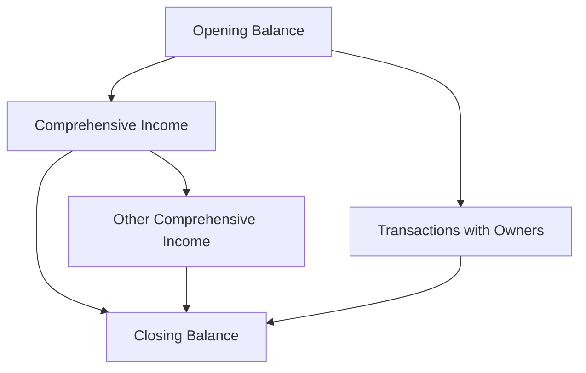

## 5.3 The Statement of Changes in Equity

The Statement of Changes in Equity is a crucial component of financial reporting that provides a detailed account of the changes in a company's equity over a specific accounting period. This statement is essential for understanding how various transactions and events impact the equity of a business, offering insights into the company's financial health and operational efficiency. In this section, we will explore the structure, components, and significance of the Statement of Changes in Equity within the Canadian accounting context, focusing on both International Financial Reporting Standards (IFRS) and Accounting Standards for Private Enterprises (ASPE).

### Understanding the Statement of Changes in Equity

The Statement of Changes in Equity is a financial statement that reconciles the opening and closing balances of equity accounts. It provides a comprehensive view of the factors contributing to changes in equity, including profits or losses, dividends, issuance or repurchase of shares, and other comprehensive income.

#### Key Components of the Statement of Changes in Equity

1. **Opening Balance of Equity**: This represents the equity balance at the beginning of the accounting period. It includes share capital, retained earnings, and other reserves.

2. **Comprehensive Income**: This includes net income from the income statement and other comprehensive income (OCI) items that are not included in net income, such as foreign currency translation adjustments and unrealized gains or losses on available-for-sale securities.

3. **Transactions with Owners**: These include dividends paid, share issuances, share repurchases, and other transactions that directly affect equity.

4. **Adjustments**: These may include prior period adjustments, changes in accounting policies, or corrections of errors.

5. **Closing Balance of Equity**: This is the equity balance at the end of the accounting period, reflecting all the changes that have occurred during the period.

### Importance of the Statement of Changes in Equity

The Statement of Changes in Equity is vital for several reasons:

- **Transparency**: It provides stakeholders with a clear view of how a company's equity is affected by its financial performance and other transactions.
- **Decision-Making**: Investors and analysts use this statement to assess a company's financial stability and growth potential.
- **Compliance**: It ensures compliance with accounting standards and regulatory requirements, providing a standardized format for reporting equity changes.

### IFRS and ASPE: A Comparative Overview

In Canada, public companies are required to follow IFRS, while private enterprises can choose between IFRS and ASPE. Both frameworks have specific requirements for the Statement of Changes in Equity.

#### IFRS Requirements

Under IFRS, the Statement of Changes in Equity must include:

- Total comprehensive income for the period, showing separately the total amounts attributable to owners of the parent and to non-controlling interests.
- For each component of equity, the effects of retrospective application or retrospective restatement recognized in accordance with IAS 8.
- Reconciliation between the carrying amount at the beginning and the end of the period, separately disclosing each change.

#### ASPE Requirements

ASPE provides a more simplified approach compared to IFRS. The key requirements include:

- Presentation of changes in retained earnings separately from other changes in equity.
- Disclosure of dividends declared and paid during the period.
- Presentation of a reconciliation of the opening and closing balances of equity components.

### Practical Examples and Case Studies

To illustrate the application of the Statement of Changes in Equity, let's consider a practical example:

**Example: ABC Corporation**

ABC Corporation, a Canadian public company, reports the following changes in equity for the year ended December 31, 2023:

- **Opening Balance**: $500,000
- **Net Income**: $150,000
- **Dividends Paid**: $50,000
- **Other Comprehensive Income**: $20,000 (unrealized gain on available-for-sale securities)
- **Share Issuance**: $100,000

**Statement of Changes in Equity for ABC Corporation**

| Component                      | Amount ($) |
|--------------------------------|------------|
| Opening Balance                | 500,000    |
| Net Income                     | 150,000    |
| Other Comprehensive Income     | 20,000     |
| Total Comprehensive Income     | 170,000    |
| Dividends Paid                 | (50,000)   |
| Share Issuance                 | 100,000    |
| Closing Balance                | 720,000    |

This example demonstrates how various transactions and events are reflected in the Statement of Changes in Equity, providing a comprehensive view of the company's equity changes.

### Real-World Applications and Regulatory Scenarios

In the real world, the Statement of Changes in Equity is used by various stakeholders, including investors, analysts, and regulators, to assess a company's financial performance and compliance with accounting standards. For instance, regulators may review this statement to ensure that companies are accurately reporting their equity changes and complying with disclosure requirements.

### Best Practices and Common Pitfalls

When preparing the Statement of Changes in Equity, it is essential to adhere to best practices to ensure accuracy and compliance:

- **Consistency**: Ensure consistency in the presentation and classification of equity components across periods.
- **Disclosure**: Provide detailed disclosures for significant changes in equity, including the nature and amount of each change.
- **Accuracy**: Verify the accuracy of calculations and reconciliations to avoid errors that could impact financial reporting.

Common pitfalls to avoid include:

- **Omitting Material Changes**: Failing to disclose material changes in equity can lead to regulatory scrutiny and loss of stakeholder trust.
- **Inconsistent Presentation**: Inconsistent presentation of equity components can confuse stakeholders and hinder comparability.

### Step-by-Step Guidance for Preparing the Statement of Changes in Equity

1. **Gather Financial Data**: Collect all relevant financial data, including net income, dividends, share transactions, and other comprehensive income items.

2. **Calculate Comprehensive Income**: Determine the total comprehensive income by adding net income and other comprehensive income.

3. **Record Transactions with Owners**: Document all transactions with owners, such as dividends paid and share issuances.

4. **Prepare Reconciliation**: Reconcile the opening and closing balances of each equity component, ensuring all changes are accounted for.

5. **Review and Disclose**: Review the statement for accuracy and completeness, and provide detailed disclosures for significant changes.

### Diagrams and Visual Aids

To enhance understanding, let's use a Mermaid.js diagram to illustrate the flow of changes in equity:

This diagram visually represents the flow of changes in equity, highlighting the relationship between opening balance, comprehensive income, transactions with owners, and the closing balance.

### Summary and Key Takeaways

The Statement of Changes in Equity is a vital financial statement that provides insights into a company's equity changes over an accounting period. Understanding its components and significance is crucial for stakeholders, including investors, analysts, and regulators. By adhering to best practices and avoiding common pitfalls, companies can ensure accurate and compliant financial reporting.

### Additional Resources and References

For further exploration of the Statement of Changes in Equity, consider the following resources:

- **IFRS Standards**: Visit the IFRS Foundation website for detailed guidance on IFRS requirements.
- **CPA Canada**: Explore CPA Canada's resources for insights into Canadian accounting standards and practices.
- **Textbooks and Study Guides**: Refer to accounting textbooks and study guides for in-depth explanations and examples.

### Practice Questions and Exercises

To reinforce your understanding of the Statement of Changes in Equity, consider working through practice questions and exercises. These can help you apply the concepts and principles discussed in this section, preparing you for exams and professional practice.

## **Ready to Test Your Knowledge?**



### What is the primary purpose of the Statement of Changes in Equity?

- [x] To provide a detailed account of changes in a company's equity over an accounting period.
- [ ] To summarize the company's cash flows.
- [ ] To report the company's financial position at a specific point in time.
- [ ] To list all the company's assets and liabilities.

> **Explanation:** The Statement of Changes in Equity provides a detailed account of changes in a company's equity over an accounting period, including comprehensive income and transactions with owners.

### Which of the following is included in the Statement of Changes in Equity under IFRS?

- [x] Total comprehensive income for the period.
- [ ] Only net income for the period.
- [ ] A detailed list of all the company's liabilities.
- [ ] The company's cash flow from operating activities.

> **Explanation:** Under IFRS, the Statement of Changes in Equity includes total comprehensive income for the period, showing separately the amounts attributable to owners of the parent and non-controlling interests.

### What is a common pitfall when preparing the Statement of Changes in Equity?

- [x] Omitting material changes in equity.
- [ ] Including too much detail in the cash flow statement.
- [ ] Failing to list all the company's assets.
- [ ] Overstating the company's liabilities.

> **Explanation:** A common pitfall is omitting material changes in equity, which can lead to regulatory scrutiny and loss of stakeholder trust.

### How does ASPE differ from IFRS in terms of the Statement of Changes in Equity?

- [x] ASPE provides a more simplified approach compared to IFRS.
- [ ] ASPE requires more detailed disclosures than IFRS.
- [ ] ASPE does not require a Statement of Changes in Equity.
- [ ] ASPE focuses solely on cash flow reporting.

> **Explanation:** ASPE provides a more simplified approach compared to IFRS, with less detailed disclosure requirements for changes in equity.

### What is the significance of the opening balance in the Statement of Changes in Equity?

- [x] It represents the equity balance at the beginning of the accounting period.
- [ ] It shows the company's total liabilities.
- [ ] It indicates the company's cash flow from investing activities.
- [ ] It lists all the company's assets.

> **Explanation:** The opening balance represents the equity balance at the beginning of the accounting period, serving as the starting point for tracking changes in equity.

### Which component of the Statement of Changes in Equity includes dividends paid?

- [x] Transactions with Owners
- [ ] Comprehensive Income
- [ ] Other Comprehensive Income
- [ ] Closing Balance

> **Explanation:** Dividends paid are included under Transactions with Owners, as they represent a distribution of earnings to shareholders.

### What is the role of other comprehensive income in the Statement of Changes in Equity?

- [x] It includes items not included in net income, such as unrealized gains or losses.
- [ ] It reports the company's cash flow from financing activities.
- [ ] It lists all the company's liabilities.
- [ ] It summarizes the company's net income.

> **Explanation:** Other comprehensive income includes items not included in net income, such as unrealized gains or losses on available-for-sale securities.

### What is the closing balance in the Statement of Changes in Equity?

- [x] The equity balance at the end of the accounting period.
- [ ] The total liabilities at the end of the period.
- [ ] The company's cash flow from operating activities.
- [ ] The company's total assets at the end of the period.

> **Explanation:** The closing balance is the equity balance at the end of the accounting period, reflecting all changes that have occurred during the period.

### Which of the following is a best practice when preparing the Statement of Changes in Equity?

- [x] Ensure consistency in the presentation and classification of equity components.
- [ ] Include only net income and ignore other comprehensive income.
- [ ] Focus solely on cash flow reporting.
- [ ] Avoid disclosing significant changes in equity.

> **Explanation:** Ensuring consistency in the presentation and classification of equity components is a best practice, as it aids in comparability and clarity.

### True or False: The Statement of Changes in Equity is only required for public companies in Canada.

- [ ] True
- [x] False

> **Explanation:** False. While public companies in Canada are required to prepare the Statement of Changes in Equity under IFRS, private enterprises may also prepare it under ASPE if they choose to do so.



By understanding and mastering the Statement of Changes in Equity, you will be well-prepared for the Canadian Accounting Exams and equipped with the knowledge to excel in your accounting career.
