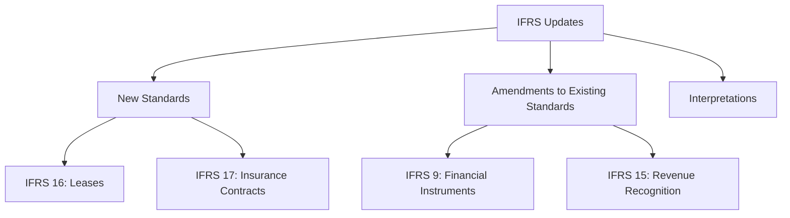

## 6.8 Updates and Amendments to IFRS Standards

In the ever-evolving landscape of accounting, staying updated with the latest amendments to the International Financial Reporting Standards (IFRS) is crucial for accountants, especially those preparing for Canadian accounting exams. This section provides a comprehensive overview of recent changes to IFRS, their implications for Canadian accounting practices, and practical insights to help you excel in your exams and professional endeavors.

### Understanding IFRS Updates

The International Accounting Standards Board (IASB) is responsible for developing and issuing IFRS standards. These standards are periodically updated to reflect changes in the global business environment, address emerging accounting issues, and improve the clarity and consistency of financial reporting. Updates to IFRS can include new standards, amendments to existing standards, and interpretations that provide guidance on specific accounting issues.

### Key Recent Updates and Amendments

#### IFRS 16: Leases

One of the significant updates in recent years is IFRS 16, which replaced IAS 17. This standard requires lessees to recognize most leases on their balance sheets, reflecting the right-of-use asset and corresponding lease liability. This change aims to provide a more accurate picture of a company's financial position and improve transparency.

**Example:** Consider a Canadian retail company that leases multiple store locations. Under IFRS 16, the company must recognize the leased properties as assets and liabilities, impacting its balance sheet and financial ratios.

#### IFRS 9: Financial Instruments

IFRS 9 introduced a new model for classifying and measuring financial instruments, replacing IAS 39. It includes a forward-looking expected credit loss model for impairment, which requires entities to account for expected credit losses from the time a financial instrument is recognized.

**Example:** A Canadian bank must assess the credit risk of its loan portfolio and recognize expected credit losses, affecting its profit and loss statement and capital adequacy ratios.

#### IFRS 15: Revenue from Contracts with Customers

IFRS 15 established a comprehensive framework for revenue recognition, replacing several previous standards and interpretations. It introduced a five-step model for recognizing revenue, focusing on the transfer of control rather than the transfer of risks and rewards.

**Example:** A Canadian software company must identify performance obligations in its contracts and recognize revenue as it satisfies each obligation, impacting its revenue recognition timing and financial statements.

#### IFRS 17: Insurance Contracts

IFRS 17 is a new standard that provides a consistent accounting model for insurance contracts. It requires insurers to measure insurance liabilities at current value and recognize profits as they deliver insurance services.

**Example:** A Canadian insurance company must apply IFRS 17 to its insurance contracts, affecting its financial statements and potentially leading to more volatile profit reporting.

### Implications for Canadian Accounting Practices

The adoption of IFRS standards in Canada means that Canadian accountants must be well-versed in these updates and amendments. Understanding the implications of these changes is crucial for accurate financial reporting and compliance with regulatory requirements.

#### Impact on Financial Statements

Updates to IFRS can significantly impact the presentation and disclosure of financial statements. For example, the recognition of lease liabilities under IFRS 16 can affect a company's debt-to-equity ratio and other key financial metrics.

#### Compliance and Reporting Requirements

Canadian companies must ensure compliance with the latest IFRS standards to meet regulatory requirements and maintain investor confidence. This involves updating accounting policies, systems, and processes to align with the new standards.

#### Exam Preparation and Professional Development

For those preparing for Canadian accounting exams, staying informed about IFRS updates is essential. Understanding the rationale behind these changes and their practical applications can enhance your exam performance and professional competence.

### Practical Examples and Case Studies

To illustrate the impact of IFRS updates, consider the following case studies:

**Case Study 1: Retail Company and IFRS 16**

A Canadian retail company leases several properties for its stores. Under IFRS 16, the company must recognize these leases on its balance sheet, affecting its financial ratios and potentially its borrowing capacity. The company must also disclose detailed information about its lease liabilities and right-of-use assets in its financial statements.

**Case Study 2: Bank and IFRS 9**

A Canadian bank has a diverse loan portfolio. With the introduction of IFRS 9, the bank must assess the credit risk of its loans and recognize expected credit losses. This requires significant judgment and estimation, impacting the bank's financial statements and regulatory capital requirements.

**Case Study 3: Software Company and IFRS 15**

A Canadian software company enters into contracts with customers that include multiple performance obligations, such as software licenses and support services. Under IFRS 15, the company must allocate the transaction price to each performance obligation and recognize revenue as it satisfies each one. This affects the timing of revenue recognition and requires detailed disclosures in the financial statements.

### Real-World Applications and Regulatory Scenarios

Understanding the real-world applications of IFRS updates is crucial for Canadian accountants. Consider the following scenarios:

**Scenario 1: Lease Accounting and Financial Ratios**

A Canadian manufacturing company adopts IFRS 16 and recognizes significant lease liabilities on its balance sheet. This affects its debt-to-equity ratio, potentially impacting its credit rating and borrowing costs. The company must communicate these changes to stakeholders and adjust its financial strategy accordingly.

**Scenario 2: Revenue Recognition and Contract Management**

A Canadian telecommunications company implements IFRS 15 and revises its contract management processes to ensure compliance. The company must identify performance obligations in its contracts and recognize revenue as it satisfies each one, requiring collaboration between accounting, sales, and legal teams.

**Scenario 3: Insurance Contracts and Profit Volatility**

A Canadian insurance company adopts IFRS 17 and experiences increased profit volatility due to the current value measurement of insurance liabilities. The company must communicate these changes to investors and analysts, providing detailed disclosures and explanations in its financial statements.

### Step-by-Step Guidance for Applying IFRS Updates

Applying IFRS updates requires a systematic approach to ensure compliance and accurate financial reporting. Consider the following steps:

1. **Review the Latest Standards and Amendments:** Stay informed about the latest IFRS updates by reviewing official publications from the IASB and CPA Canada.

2. **Assess the Impact on Your Organization:** Evaluate how the updates affect your organization's financial statements, accounting policies, and systems.

3. **Update Accounting Policies and Procedures:** Revise your accounting policies and procedures to align with the new standards, ensuring consistency and compliance.

4. **Train Your Team:** Provide training and resources to your accounting team to ensure they understand the updates and can apply them effectively.

5. **Communicate with Stakeholders:** Inform stakeholders, including investors, analysts, and regulators, about the impact of the updates on your financial statements and business operations.

6. **Monitor Ongoing Developments:** Stay updated on ongoing developments and interpretations related to IFRS updates, ensuring continuous compliance and best practices.

### Diagrams and Visual Aids

To enhance your understanding of IFRS updates, consider the following visual aids:

### Best Practices, Common Pitfalls, and Strategies

#### Best Practices

- **Stay Informed:** Regularly review updates from the IASB and CPA Canada to stay informed about the latest IFRS changes.
- **Engage with Professional Networks:** Participate in professional networks and forums to discuss IFRS updates and share insights with peers.
- **Leverage Technology:** Use accounting software and tools that support IFRS compliance and streamline financial reporting processes.

#### Common Pitfalls

- **Underestimating the Impact:** Failing to assess the full impact of IFRS updates on financial statements and business operations can lead to compliance issues and financial misstatements.
- **Inadequate Training:** Insufficient training and resources for accounting teams can result in errors and inconsistencies in applying IFRS updates.
- **Poor Communication:** Failing to communicate the impact of IFRS updates to stakeholders can lead to misunderstandings and reputational risks.

#### Strategies to Overcome Challenges

- **Conduct Impact Assessments:** Regularly assess the impact of IFRS updates on your organization and develop action plans to address potential challenges.
- **Invest in Training and Development:** Provide ongoing training and development opportunities for your accounting team to ensure they are equipped to handle IFRS updates.
- **Enhance Communication:** Develop clear communication strategies to inform stakeholders about the impact of IFRS updates on your financial statements and business operations.

### References and Additional Resources

For further exploration of IFRS updates, consider the following resources:

- **IASB Website:** Access the latest IFRS standards, amendments, and interpretations from the official IASB website.
- **CPA Canada:** Explore resources and publications from CPA Canada, including guidance on applying IFRS updates in the Canadian context.
- **IFRS Foundation:** Review educational materials and resources from the IFRS Foundation to deepen your understanding of IFRS standards.

### Summary and Key Points

In summary, staying informed about updates and amendments to IFRS standards is essential for Canadian accountants. Understanding the implications of these changes, applying them effectively, and communicating their impact to stakeholders are crucial for accurate financial reporting and compliance. By following best practices, avoiding common pitfalls, and leveraging resources and technology, you can navigate the complexities of IFRS updates and excel in your exams and professional career.

## **Ready to Test Your Knowledge?**



### Which standard replaced IAS 17 and requires lessees to recognize most leases on their balance sheets?

- [x] IFRS 16
- [ ] IFRS 9
- [ ] IFRS 15
- [ ] IFRS 17

> **Explanation:** IFRS 16 replaced IAS 17 and requires lessees to recognize most leases on their balance sheets as right-of-use assets and corresponding lease liabilities.

### What model did IFRS 9 introduce for impairment of financial instruments?

- [x] Expected credit loss model
- [ ] Historical cost model
- [ ] Fair value model
- [ ] Amortized cost model

> **Explanation:** IFRS 9 introduced the expected credit loss model for impairment, requiring entities to account for expected credit losses from the time a financial instrument is recognized.

### Which IFRS standard established a five-step model for revenue recognition?

- [x] IFRS 15
- [ ] IFRS 9
- [ ] IFRS 16
- [ ] IFRS 17

> **Explanation:** IFRS 15 established a five-step model for revenue recognition, focusing on the transfer of control rather than the transfer of risks and rewards.

### What is the primary focus of IFRS 17?

- [x] Insurance contracts
- [ ] Leases
- [ ] Revenue recognition
- [ ] Financial instruments

> **Explanation:** IFRS 17 provides a consistent accounting model for insurance contracts, requiring insurers to measure insurance liabilities at current value.

### Which of the following is a common pitfall when implementing IFRS updates?

- [x] Underestimating the impact
- [ ] Overestimating the impact
- [ ] Comprehensive training
- [ ] Effective communication

> **Explanation:** A common pitfall is underestimating the impact of IFRS updates on financial statements and business operations, leading to compliance issues.

### What is a key strategy to overcome challenges related to IFRS updates?

- [x] Conduct impact assessments
- [ ] Ignore updates
- [ ] Reduce training
- [ ] Limit communication

> **Explanation:** Conducting impact assessments helps organizations evaluate the effects of IFRS updates and develop action plans to address potential challenges.

### Which organization is responsible for developing and issuing IFRS standards?

- [x] IASB
- [ ] CPA Canada
- [ ] IFRS Foundation
- [ ] Canadian Securities Administrators

> **Explanation:** The International Accounting Standards Board (IASB) is responsible for developing and issuing IFRS standards.

### What should Canadian accountants do to stay informed about IFRS updates?

- [x] Regularly review updates from the IASB and CPA Canada
- [ ] Ignore updates
- [ ] Only review updates once a year
- [ ] Rely solely on accounting software

> **Explanation:** Canadian accountants should regularly review updates from the IASB and CPA Canada to stay informed about the latest IFRS changes.

### What is the impact of recognizing lease liabilities under IFRS 16?

- [x] Affects debt-to-equity ratio
- [ ] Increases revenue
- [ ] Decreases expenses
- [ ] Reduces assets

> **Explanation:** Recognizing lease liabilities under IFRS 16 affects a company's debt-to-equity ratio and other key financial metrics.

### True or False: IFRS 15 focuses on the transfer of risks and rewards for revenue recognition.

- [ ] True
- [x] False

> **Explanation:** False. IFRS 15 focuses on the transfer of control rather than the transfer of risks and rewards for revenue recognition.


