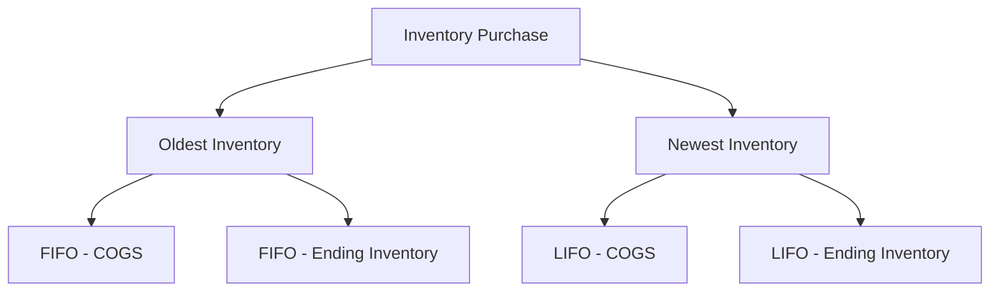

## 8.10 Inventory Accounting

Inventory accounting is a critical aspect of financial reporting that directly impacts a company's financial statements and tax obligations. In Canada, businesses must adhere to either International Financial Reporting Standards (IFRS) or Accounting Standards for Private Enterprises (ASPE) when accounting for inventory. This section will delve into the inventory accounting methods—LIFO (Last-In, First-Out), FIFO (First-In, First-Out), and weighted-average—under both standards, highlighting key differences, practical applications, and compliance considerations.

### Understanding Inventory Accounting

Inventory accounting involves tracking and valuing goods a company holds for sale. The choice of inventory valuation method affects the cost of goods sold (COGS), net income, and inventory valuation on the balance sheet. Each method has its advantages and drawbacks, and the choice can significantly impact financial analysis and decision-making.

### Inventory Valuation Methods

#### 1. First-In, First-Out (FIFO)

**Concept:**
FIFO assumes that the oldest inventory items are sold first. This method aligns with the natural flow of inventory, especially for perishable goods.

**Advantages:**
- Reflects current market prices in the ending inventory.
- Provides a higher net income during inflationary periods as older, cheaper costs are matched against current revenues.

**Disadvantages:**
- May not match the actual physical flow of goods.
- Can result in higher tax liabilities during inflationary times due to higher reported profits.

**Application under IFRS and ASPE:**
Both IFRS and ASPE permit the use of FIFO for inventory valuation. The method is straightforward and widely accepted, making it a popular choice among Canadian businesses.

#### 2. Last-In, First-Out (LIFO)

**Concept:**
LIFO assumes that the most recently acquired inventory is sold first. This method is less common and is not permitted under IFRS.

**Advantages:**
- Matches current costs with current revenues, providing a better reflection of current market conditions.
- Can result in tax savings during inflationary periods as higher costs are matched against revenues, reducing taxable income.

**Disadvantages:**
- Not allowed under IFRS, limiting its applicability in Canada.
- Can result in outdated inventory valuations on the balance sheet.

**Application under IFRS and ASPE:**
LIFO is not permitted under IFRS, which is the standard for public companies in Canada. ASPE does not explicitly prohibit LIFO, but its use is rare due to the alignment with IFRS and the potential for complexity in financial reporting.

#### 3. Weighted-Average Cost

**Concept:**
The weighted-average cost method calculates the cost of goods sold and ending inventory based on the average cost of all inventory items available for sale during the period.

**Advantages:**
- Smoothens out price fluctuations over time.
- Simple to apply and understand.

**Disadvantages:**
- May not reflect current market conditions as accurately as FIFO.
- Can result in less precise inventory valuations during periods of significant price changes.

**Application under IFRS and ASPE:**
Both IFRS and ASPE allow the use of the weighted-average cost method. It is particularly useful for businesses with large volumes of similar inventory items.

### Key Differences Between IFRS and ASPE

While both IFRS and ASPE permit the use of FIFO and weighted-average methods, there are notable differences in their application and reporting requirements.

#### IFRS

- **Prohibition of LIFO:** IFRS does not allow the use of LIFO due to its potential to distort financial statements and lack of alignment with the actual flow of goods.
- **Disclosure Requirements:** IFRS requires detailed disclosures regarding inventory accounting policies, including the cost formulas used, carrying amounts, and any write-downs or reversals.
- **Impairment and Reversal:** Under IFRS, inventory is measured at the lower of cost and net realizable value. Any write-downs to net realizable value can be reversed if the circumstances that caused the impairment no longer exist.

#### ASPE

- **Flexibility:** ASPE provides more flexibility in inventory valuation methods, although LIFO is still rarely used in practice.
- **Disclosure Requirements:** ASPE requires less detailed disclosures compared to IFRS, focusing primarily on the cost formulas used and the carrying amount of inventory.
- **Impairment:** Similar to IFRS, ASPE requires inventory to be measured at the lower of cost and net realizable value. However, unlike IFRS, ASPE does not permit the reversal of inventory write-downs.

### Practical Applications and Compliance Considerations

When choosing an inventory accounting method, Canadian businesses must consider several factors, including tax implications, financial reporting objectives, and industry practices. Here are some practical applications and compliance considerations:

1. **Tax Implications:**
   - The choice of inventory method can significantly impact taxable income. FIFO typically results in higher taxable income during inflationary periods, while LIFO (if permitted) can reduce taxable income.

2. **Industry Practices:**
   - Different industries may have standard practices for inventory accounting. For example, the retail industry often uses FIFO due to the high turnover of goods.

3. **Financial Reporting Objectives:**
   - Companies may choose a method that aligns with their financial reporting objectives, such as maximizing net income or minimizing tax liabilities.

4. **Regulatory Compliance:**
   - Public companies in Canada must comply with IFRS, which prohibits LIFO. Private enterprises have more flexibility under ASPE but should consider the potential complexity and lack of comparability with IFRS.

### Real-World Examples and Case Studies

To illustrate the application of inventory accounting methods, consider the following examples:

**Example 1: Retail Company Using FIFO**

A Canadian retail company sells electronics and uses the FIFO method for inventory accounting. During an inflationary period, the company reports higher net income as older, cheaper inventory costs are matched against current sales revenues. This results in higher tax liabilities but provides a more accurate reflection of current inventory values on the balance sheet.

**Example 2: Manufacturing Company Using Weighted-Average**

A manufacturing company in Canada produces standardized components and uses the weighted-average method. This approach smoothens out cost fluctuations and simplifies inventory valuation, making it easier to manage large volumes of inventory.

### Step-by-Step Guidance for Inventory Accounting

To effectively apply inventory accounting methods, follow these steps:

1. **Determine the Inventory Valuation Method:**
   - Choose between FIFO, LIFO (if applicable), or weighted-average based on business needs and regulatory requirements.

2. **Calculate Cost of Goods Sold (COGS):**
   - For FIFO, use the oldest inventory costs.
   - For LIFO, use the most recent inventory costs.
   - For weighted-average, calculate the average cost of all available inventory.

3. **Value Ending Inventory:**
   - For FIFO, use the most recent inventory costs.
   - For LIFO, use the oldest inventory costs.
   - For weighted-average, apply the average cost to the remaining inventory.

4. **Prepare Financial Statements:**
   - Report COGS and ending inventory on the income statement and balance sheet, respectively.

5. **Disclose Inventory Accounting Policies:**
   - Provide detailed disclosures in the financial statements regarding the inventory valuation method used and any significant judgments or estimates.

### Diagrams and Visual Aids

Below is a diagram illustrating the flow of inventory costs under FIFO and LIFO:

### Best Practices and Common Pitfalls

**Best Practices:**
- Regularly review inventory accounting policies to ensure compliance with current standards.
- Consider the impact of inventory valuation methods on financial ratios and performance metrics.
- Maintain accurate and up-to-date inventory records to support financial reporting.

**Common Pitfalls:**
- Failing to update inventory valuations in response to market changes.
- Inadequate disclosure of inventory accounting policies, leading to regulatory scrutiny.
- Overlooking the tax implications of inventory valuation methods.

### References and Additional Resources

- **CPA Canada:** Provides guidance on accounting standards and best practices for inventory accounting.
- **IFRS Foundation:** Offers resources and updates on IFRS standards, including inventory accounting.
- **Canadian Tax Foundation:** Provides insights into the tax implications of inventory accounting methods.

### Conclusion

Inventory accounting is a vital component of financial reporting that requires careful consideration of valuation methods, regulatory compliance, and industry practices. By understanding the differences between IFRS and ASPE, Canadian businesses can make informed decisions that align with their financial objectives and reporting requirements.

## **Ready to Test Your Knowledge?**



### Which inventory valuation method is not permitted under IFRS?

- [ ] FIFO
- [x] LIFO
- [ ] Weighted-Average
- [ ] Specific Identification

> **Explanation:** LIFO is not permitted under IFRS due to its potential to distort financial statements.

### What is the main advantage of using the FIFO method during inflationary periods?

- [x] Higher net income
- [ ] Lower tax liabilities
- [ ] Better matching of current costs with revenues
- [ ] Simplicity in application

> **Explanation:** FIFO results in higher net income during inflationary periods as older, cheaper costs are matched against current revenues.

### Under ASPE, can inventory write-downs be reversed?

- [ ] Yes
- [x] No

> **Explanation:** ASPE does not permit the reversal of inventory write-downs, unlike IFRS.

### What is the primary disadvantage of the weighted-average method?

- [ ] Complexity in calculation
- [x] Less accurate reflection of current market conditions
- [ ] Higher tax liabilities
- [ ] Limited applicability

> **Explanation:** The weighted-average method may not reflect current market conditions as accurately as FIFO.

### Which method smoothens out price fluctuations over time?

- [ ] FIFO
- [ ] LIFO
- [x] Weighted-Average
- [ ] Specific Identification

> **Explanation:** The weighted-average method smoothens out price fluctuations by averaging the cost of all inventory items.

### What is a common pitfall in inventory accounting?

- [ ] Regularly updating inventory valuations
- [x] Inadequate disclosure of accounting policies
- [ ] Maintaining accurate inventory records
- [ ] Choosing FIFO during inflation

> **Explanation:** Inadequate disclosure of inventory accounting policies can lead to regulatory scrutiny.

### Which method aligns with the natural flow of inventory for perishable goods?

- [x] FIFO
- [ ] LIFO
- [ ] Weighted-Average
- [ ] Specific Identification

> **Explanation:** FIFO aligns with the natural flow of inventory, especially for perishable goods.

### What should companies consider when choosing an inventory accounting method?

- [ ] Only tax implications
- [ ] Only industry practices
- [x] Tax implications, industry practices, and financial reporting objectives
- [ ] Only financial reporting objectives

> **Explanation:** Companies should consider tax implications, industry practices, and financial reporting objectives when choosing an inventory accounting method.

### Which inventory method can result in outdated inventory valuations on the balance sheet?

- [ ] FIFO
- [x] LIFO
- [ ] Weighted-Average
- [ ] Specific Identification

> **Explanation:** LIFO can result in outdated inventory valuations on the balance sheet as it uses the oldest costs for ending inventory.

### True or False: IFRS requires detailed disclosures regarding inventory accounting policies.

- [x] True
- [ ] False

> **Explanation:** IFRS requires detailed disclosures regarding inventory accounting policies, including cost formulas and carrying amounts.


