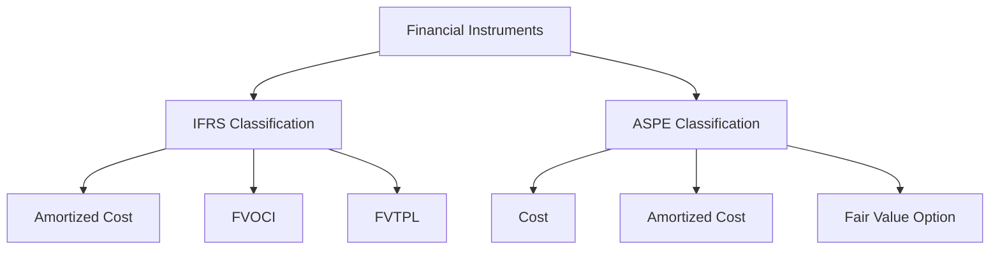

## 8.3 Financial Instruments Accounting

Financial instruments accounting is a critical area in the field of accounting, especially when preparing for Canadian accounting exams. Understanding the differences between International Financial Reporting Standards (IFRS) and Accounting Standards for Private Enterprises (ASPE) is essential for both exam success and practical application in the Canadian context. This section provides a comprehensive overview of the accounting principles and standards related to financial instruments, highlighting the key differences between IFRS and ASPE.

### Introduction to Financial Instruments

Financial instruments are contracts that give rise to a financial asset for one entity and a financial liability or equity instrument for another. They include a wide range of financial products such as cash, equity instruments, bonds, derivatives, and loans. The accounting for financial instruments involves recognizing, measuring, presenting, and disclosing these instruments in financial statements.

### Key Differences between IFRS and ASPE

#### Recognition and Measurement

**IFRS:**

- **IFRS 9 Financial Instruments** is the primary standard governing financial instruments under IFRS. It introduces a classification and measurement model that is based on the business model and the contractual cash flow characteristics of the financial asset.
- Financial assets are classified into three categories: amortized cost, fair value through other comprehensive income (FVOCI), and fair value through profit or loss (FVTPL).
- Financial liabilities are generally measured at amortized cost, except for those designated at FVTPL.

**ASPE:**

- **Section 3856 Financial Instruments** is the relevant standard under ASPE. It provides a simpler classification model compared to IFRS.
- Financial assets and liabilities are generally measured at cost or amortized cost, with an option to measure certain instruments at fair value.
- ASPE does not have an equivalent to the FVOCI category found in IFRS.

#### Impairment

**IFRS:**

- IFRS 9 introduces an expected credit loss (ECL) model for impairment, which requires entities to recognize credit losses based on forward-looking information.
- The ECL model applies to financial assets measured at amortized cost and FVOCI, lease receivables, contract assets, and certain loan commitments and financial guarantee contracts.

**ASPE:**

- ASPE uses an incurred loss model for impairment, which means that impairment is recognized only when there is objective evidence of a loss event that affects the estimated future cash flows of the financial asset.
- This model is less complex and does not require the same level of forward-looking information as IFRS.

#### Hedge Accounting

**IFRS:**

- IFRS 9 provides a more flexible approach to hedge accounting, allowing entities to better align their accounting with risk management activities.
- It introduces three types of hedges: fair value hedges, cash flow hedges, and hedges of a net investment in a foreign operation.

**ASPE:**

- ASPE allows hedge accounting but has more restrictive criteria for qualifying hedges.
- The standard provides guidance on fair value hedges and cash flow hedges but does not explicitly address hedges of net investments in foreign operations.

#### Presentation and Disclosure

**IFRS:**

- IFRS requires extensive disclosures about financial instruments, including information about the significance of financial instruments for the entity's financial position and performance, and the nature and extent of risks arising from financial instruments.

**ASPE:**

- ASPE requires less extensive disclosures compared to IFRS. The focus is on providing information that is necessary for understanding the financial statements.

### Practical Examples and Case Studies

#### Example 1: Classification of Financial Assets

Consider a Canadian company that holds a portfolio of debt securities. Under IFRS, the company would classify these securities based on its business model and the contractual cash flow characteristics. If the business model is to collect contractual cash flows, and the cash flows are solely payments of principal and interest, the securities would be measured at amortized cost. Under ASPE, the company would likely measure these securities at cost or amortized cost, with an option to measure at fair value.

#### Example 2: Impairment of Trade Receivables

A Canadian retailer has a significant amount of trade receivables. Under IFRS, the retailer would apply the ECL model, considering historical loss rates, current conditions, and forward-looking information to estimate credit losses. Under ASPE, the retailer would recognize impairment only when there is objective evidence of a loss event, such as a customer filing for bankruptcy.

### Real-World Applications and Regulatory Scenarios

#### Application in Financial Reporting

Understanding the differences in accounting for financial instruments is crucial for preparing financial statements that comply with Canadian regulations. Companies listed on Canadian stock exchanges must follow IFRS, while private enterprises have the option to use ASPE. This choice can significantly impact the financial statements and the perception of financial health by investors and creditors.

#### Compliance Considerations

Compliance with the relevant standards is essential for avoiding regulatory penalties and maintaining investor confidence. Companies must ensure that their accounting policies for financial instruments are aligned with either IFRS or ASPE, depending on their reporting framework.

### Step-by-Step Guidance for Accounting Procedures

#### Step 1: Determine the Classification

- **IFRS:** Assess the business model and contractual cash flow characteristics to classify financial assets.
- **ASPE:** Determine whether the financial instrument should be measured at cost, amortized cost, or fair value.

#### Step 2: Measure the Financial Instrument

- **IFRS:** Use the appropriate measurement basis (amortized cost, FVOCI, or FVTPL) based on the classification.
- **ASPE:** Apply the cost or amortized cost model, with an option for fair value measurement.

#### Step 3: Assess Impairment

- **IFRS:** Apply the ECL model to estimate credit losses.
- **ASPE:** Recognize impairment based on objective evidence of a loss event.

#### Step 4: Apply Hedge Accounting (if applicable)

- **IFRS:** Align hedge accounting with risk management activities and document the hedge relationship.
- **ASPE:** Ensure the hedge meets the criteria for hedge accounting and document the hedge relationship.

### Diagrams and Visual Aids

Below is a diagram illustrating the classification and measurement of financial assets under IFRS and ASPE:

### Best Practices and Common Pitfalls

#### Best Practices

- Stay updated with the latest amendments to IFRS and ASPE.
- Ensure that the classification and measurement of financial instruments align with the entity's business model and risk management strategy.
- Provide clear and comprehensive disclosures to enhance transparency.

#### Common Pitfalls

- Misclassification of financial instruments due to a lack of understanding of the business model.
- Failure to recognize impairment losses in a timely manner.
- Inadequate documentation for hedge accounting relationships.

### References and Additional Resources

- **CPA Canada:** Provides resources and guidance on applying IFRS and ASPE.
- **IFRS Foundation:** Offers comprehensive information on IFRS standards and updates.
- **Canadian Accounting Standards Board (AcSB):** Responsible for setting ASPE and providing related resources.

### Summary and Key Points

- Financial instruments accounting under IFRS and ASPE involves significant differences in classification, measurement, impairment, and disclosure.
- IFRS offers a more complex and flexible framework, while ASPE provides a simpler approach.
- Understanding these differences is crucial for preparing accurate financial statements and complying with Canadian regulations.

### Ready to Test Your Knowledge?



### Which standard introduces the expected credit loss model for impairment?

- [x] IFRS 9
- [ ] ASPE Section 3856
- [ ] IFRS 15
- [ ] ASPE Section 3065

> **Explanation:** IFRS 9 introduces the expected credit loss model for impairment, which requires forward-looking information.

### Under ASPE, how are financial assets generally measured?

- [x] Cost or amortized cost
- [ ] Fair value through profit or loss
- [ ] Fair value through other comprehensive income
- [ ] Historical cost

> **Explanation:** ASPE generally measures financial assets at cost or amortized cost, with an option for fair value measurement.

### What is a key difference in hedge accounting between IFRS and ASPE?

- [x] IFRS allows more flexibility in aligning with risk management activities.
- [ ] ASPE provides more types of hedges.
- [ ] IFRS requires more restrictive criteria for qualifying hedges.
- [ ] ASPE allows hedges of net investments in foreign operations.

> **Explanation:** IFRS provides more flexibility in hedge accounting, allowing better alignment with risk management activities.

### Which category does not exist under ASPE for financial asset classification?

- [x] Fair value through other comprehensive income (FVOCI)
- [ ] Cost
- [ ] Amortized cost
- [ ] Fair value option

> **Explanation:** ASPE does not have a FVOCI category; it uses cost, amortized cost, and fair value option.

### What is the primary focus of IFRS disclosures for financial instruments?

- [x] Significance of financial instruments and risk information
- [ ] Historical cost information
- [ ] Tax implications
- [ ] Non-financial asset valuation

> **Explanation:** IFRS disclosures focus on the significance of financial instruments and the nature and extent of risks.

### What model does ASPE use for impairment of financial assets?

- [x] Incurred loss model
- [ ] Expected credit loss model
- [ ] Historical cost model
- [ ] Fair value model

> **Explanation:** ASPE uses an incurred loss model, recognizing impairment based on objective evidence of a loss event.

### How does IFRS classify financial assets?

- [x] Based on business model and cash flow characteristics
- [ ] Based on historical cost
- [ ] Based on tax implications
- [ ] Based on management discretion

> **Explanation:** IFRS classifies financial assets based on the business model and contractual cash flow characteristics.

### Which of the following is a type of hedge under IFRS?

- [x] Fair value hedge
- [ ] Cost hedge
- [ ] Tax hedge
- [ ] Historical hedge

> **Explanation:** IFRS includes fair value hedges, cash flow hedges, and hedges of net investments in foreign operations.

### What is the main benefit of IFRS 9's approach to hedge accounting?

- [x] Better alignment with risk management activities
- [ ] Simplicity and ease of application
- [ ] Reduced disclosure requirements
- [ ] Elimination of impairment recognition

> **Explanation:** IFRS 9 allows better alignment of hedge accounting with an entity's risk management activities.

### True or False: ASPE requires more extensive disclosures than IFRS for financial instruments.

- [ ] True
- [x] False

> **Explanation:** ASPE requires less extensive disclosures compared to IFRS, focusing on necessary information for understanding financial statements.


