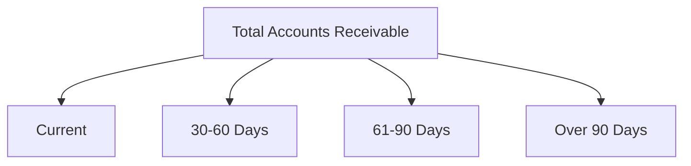

## 9.2 Accounts Receivable and Bad Debts

Accounts receivable represent the amounts owed to a company by its customers for goods or services delivered on credit. Managing accounts receivable is crucial for maintaining a healthy cash flow and ensuring the financial stability of a business. In this section, we will delve into the principles and practices surrounding accounts receivable and bad debts in the context of Canadian accounting, focusing on recognition, measurement, and management.

### Understanding Accounts Receivable

Accounts receivable (AR) are a key component of a company's current assets and are critical for liquidity management. They arise when a company sells goods or services on credit, creating a legal obligation for the customer to pay at a later date. 

#### Recognition of Accounts Receivable

Under both IFRS and ASPE, accounts receivable are recognized when a company has an enforceable right to receive payment. This typically occurs when the goods or services are delivered, and the risks and rewards of ownership have transferred to the buyer.

**Example:**
A Canadian manufacturing company sells $50,000 worth of equipment to a customer on credit. The sale is recognized as accounts receivable once the equipment is delivered and the customer has accepted the terms of payment.

#### Measurement of Accounts Receivable

Accounts receivable are initially measured at their transaction price, which is the amount of consideration expected to be received. This measurement may be adjusted for any trade discounts, volume rebates, or other similar items.

**Example:**
If the same manufacturing company offers a 5% trade discount for early payment, the accounts receivable would be recorded at $47,500 ($50,000 less 5%).

### Managing Accounts Receivable

Effective management of accounts receivable involves establishing credit policies, monitoring customer payments, and implementing collection procedures. Companies often use aging schedules to track outstanding receivables and identify potential collection issues.

#### Aging Schedule

An aging schedule categorizes accounts receivable based on how long they have been outstanding. This tool helps in assessing the creditworthiness of customers and identifying overdue accounts that may require follow-up.



### Allowance for Doubtful Accounts

Not all accounts receivable will be collected, and companies must account for this uncertainty by establishing an allowance for doubtful accounts. This allowance is a contra-asset account that reduces the total accounts receivable to reflect the estimated uncollectible amounts.

#### Estimating Bad Debts

There are several methods for estimating bad debts, including:

1. **Percentage of Sales Method:** Estimates bad debts as a percentage of total credit sales.
2. **Aging of Accounts Receivable Method:** Estimates bad debts based on the age of each account, with older accounts more likely to be uncollectible.

**Example:**
A company with $100,000 in credit sales estimates that 2% will be uncollectible. Using the percentage of sales method, the allowance for doubtful accounts would be $2,000.

#### Recording Bad Debts

When it becomes apparent that a specific account is uncollectible, it is written off against the allowance for doubtful accounts.

**Journal Entry:**
```
   Debit: Allowance for Doubtful Accounts $1,000
   Credit: Accounts Receivable $1,000
```

### IFRS and ASPE Considerations

#### IFRS 9: Financial Instruments

Under IFRS 9, companies must use an expected credit loss (ECL) model to estimate bad debts. This approach requires consideration of historical, current, and forward-looking information to assess credit risk.

#### ASPE Section 3856: Financial Instruments

ASPE allows for a simpler approach, where companies can use either the incurred loss model or the expected loss model to estimate bad debts. The choice depends on the company's specific circumstances and judgment.

### Real-World Applications and Challenges

In practice, managing accounts receivable and bad debts involves balancing risk and reward. Companies must extend credit to grow sales while minimizing the risk of non-payment.

**Case Study:**
A Canadian retail chain experienced a significant increase in bad debts due to an economic downturn. By revising its credit policies and implementing stricter collection procedures, the company was able to reduce its bad debt expense by 30% over the following year.

### Best Practices and Strategies

1. **Establish Clear Credit Policies:** Define credit terms and conditions to minimize risk.
2. **Regularly Review Aging Schedules:** Identify overdue accounts and take timely action.
3. **Implement Effective Collection Procedures:** Use reminders, follow-up calls, and legal action if necessary.
4. **Use Technology:** Leverage accounting software to automate tracking and reporting.

### Common Pitfalls and How to Avoid Them

- **Overextending Credit:** Avoid granting excessive credit to customers with poor payment histories.
- **Ignoring Aging Reports:** Regularly review aging schedules to prevent accounts from becoming too old.
- **Inadequate Allowance for Doubtful Accounts:** Ensure the allowance reflects current economic conditions and customer creditworthiness.

### Conclusion

Accounts receivable and bad debts are integral to a company's financial health. By understanding and applying the principles outlined in this section, you can effectively manage these assets and minimize financial risk. Remember to stay informed about changes in accounting standards and adapt your practices accordingly.

### References and Further Reading

- CPA Canada Handbook: Accounting Standards for Private Enterprises
- IFRS 9: Financial Instruments
- ASPE Section 3856: Financial Instruments
- Canadian Institute of Chartered Accountants (CICA) Publications

## **Ready to Test Your Knowledge?**



### What is the primary purpose of accounts receivable?

- [x] To record amounts owed by customers for credit sales
- [ ] To track inventory levels
- [ ] To manage cash flow
- [ ] To calculate tax liabilities

> **Explanation:** Accounts receivable are used to record amounts owed by customers for goods or services delivered on credit.

### How is the allowance for doubtful accounts classified?

- [x] As a contra-asset account
- [ ] As a liability
- [ ] As an expense
- [ ] As revenue

> **Explanation:** The allowance for doubtful accounts is a contra-asset account that reduces the total accounts receivable to reflect estimated uncollectible amounts.

### Which method estimates bad debts based on the age of accounts?

- [x] Aging of Accounts Receivable Method
- [ ] Percentage of Sales Method
- [ ] Direct Write-off Method
- [ ] Expected Credit Loss Model

> **Explanation:** The aging of accounts receivable method estimates bad debts based on the age of each account, with older accounts more likely to be uncollectible.

### Under IFRS 9, what model is used to estimate bad debts?

- [x] Expected Credit Loss Model
- [ ] Incurred Loss Model
- [ ] Direct Write-off Method
- [ ] Percentage of Sales Method

> **Explanation:** IFRS 9 requires the use of an expected credit loss model to estimate bad debts, considering historical, current, and forward-looking information.

### What is a common pitfall in managing accounts receivable?

- [x] Overextending credit to customers with poor payment histories
- [ ] Offering discounts for early payment
- [ ] Using technology to automate tracking
- [ ] Reviewing aging schedules regularly

> **Explanation:** Overextending credit to customers with poor payment histories can increase the risk of non-payment and bad debts.

### Which accounting standard applies to financial instruments under ASPE?

- [x] Section 3856
- [ ] IFRS 9
- [ ] Section 1500
- [ ] IFRS 15

> **Explanation:** ASPE Section 3856 applies to financial instruments, including accounts receivable and bad debts.

### How should a company record a specific account deemed uncollectible?

- [x] Debit Allowance for Doubtful Accounts; Credit Accounts Receivable
- [ ] Debit Bad Debt Expense; Credit Cash
- [ ] Debit Accounts Receivable; Credit Allowance for Doubtful Accounts
- [ ] Debit Cash; Credit Accounts Receivable

> **Explanation:** When an account is deemed uncollectible, it is written off by debiting the allowance for doubtful accounts and crediting accounts receivable.

### What is the initial measurement of accounts receivable?

- [x] At the transaction price
- [ ] At fair value
- [ ] At historical cost
- [ ] At net realizable value

> **Explanation:** Accounts receivable are initially measured at the transaction price, which is the amount of consideration expected to be received.

### What tool helps assess the creditworthiness of customers?

- [x] Aging Schedule
- [ ] Cash Flow Statement
- [ ] Income Statement
- [ ] Balance Sheet

> **Explanation:** An aging schedule categorizes accounts receivable based on how long they have been outstanding, helping assess customer creditworthiness.

### True or False: The percentage of sales method estimates bad debts based on the age of accounts.

- [ ] True
- [x] False

> **Explanation:** The percentage of sales method estimates bad debts as a percentage of total credit sales, not based on the age of accounts.


