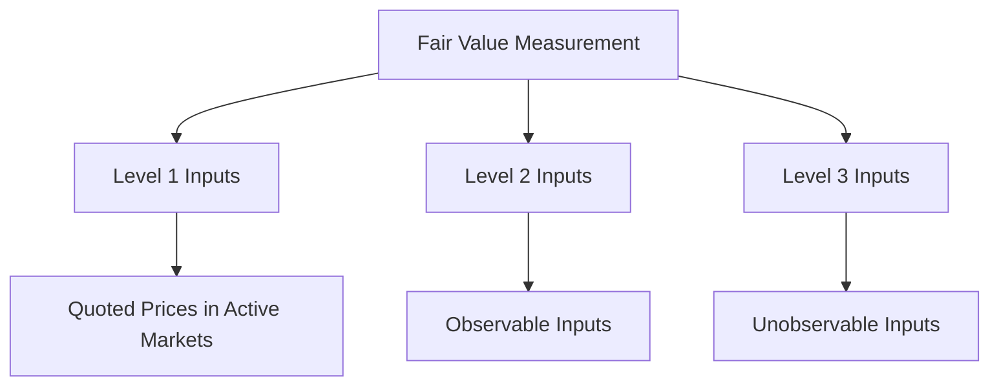

## 9.8 Fair Value Measurement

Fair value measurement is a critical aspect of financial reporting and asset accounting in Canada. It involves determining the price at which an asset could be exchanged or a liability settled between knowledgeable, willing parties in an arm's length transaction. This section delves into the principles, applications, and regulatory frameworks governing fair value measurement, emphasizing its importance in both International Financial Reporting Standards (IFRS) and Canadian Accounting Standards for Private Enterprises (ASPE).

### Understanding Fair Value

Fair value is defined as the price that would be received to sell an asset or paid to transfer a liability in an orderly transaction between market participants at the measurement date. This definition emphasizes the market-based nature of fair value, reflecting current market conditions rather than historical cost.

#### Key Concepts

1. **Market Participants**: These are buyers and sellers in the principal (or most advantageous) market for the asset or liability, who are independent, knowledgeable, and willing to transact.

2. **Orderly Transaction**: This implies a transaction that is not forced or distressed, allowing sufficient time for marketing activities that are usual and customary for transactions involving such assets or liabilities.

3. **Measurement Date**: Fair value is determined as of a specific date, which is typically the reporting date for financial statements.

### Fair Value Hierarchy

The fair value hierarchy categorizes the inputs used in valuation techniques into three levels, providing a framework for determining the reliability of fair value measurements:

- **Level 1 Inputs**: Quoted prices in active markets for identical assets or liabilities that the entity can access at the measurement date.

- **Level 2 Inputs**: Inputs other than quoted prices included within Level 1 that are observable for the asset or liability, either directly or indirectly.

- **Level 3 Inputs**: Unobservable inputs for the asset or liability, reflecting the entity's own assumptions about the assumptions market participants would use in pricing the asset or liability.

### Valuation Techniques

Entities use various valuation techniques to measure fair value, selecting the method that is most appropriate under the circumstances. The three primary valuation techniques are:

1. **Market Approach**: This approach uses prices and other relevant information generated by market transactions involving identical or comparable assets or liabilities.

2. **Cost Approach**: This approach reflects the amount that would be required currently to replace the service capacity of an asset (often referred to as current replacement cost).

3. **Income Approach**: This approach converts future amounts (e.g., cash flows or income and expenses) to a single current (discounted) amount. The fair value measurement is determined on the basis of the value indicated by current market expectations about those future amounts.

### Application of Fair Value Measurement

#### IFRS Guidelines

Under IFRS, fair value measurement is extensively applied across various standards, including:

- **IFRS 13 Fair Value Measurement**: Provides a framework for measuring fair value and requires disclosures about fair value measurements.

- **IAS 16 Property, Plant and Equipment**: Allows revaluation of assets to fair value.

- **IAS 40 Investment Property**: Requires investment properties to be measured at fair value if the fair value model is chosen.

#### ASPE Guidelines

ASPE also incorporates fair value measurement, though its application is more limited compared to IFRS:

- **Section 3856 Financial Instruments**: Provides guidance on measuring financial instruments at fair value.

- **Section 3063 Impairment of Long-lived Assets**: Requires fair value measurement in impairment testing.

### Practical Examples and Case Studies

#### Example 1: Fair Value Measurement of Investment Property

A Canadian real estate company holds several investment properties. Under IFRS, the company chooses to measure these properties at fair value. The company engages an independent appraiser to determine the fair value of each property, using the market approach by analyzing recent sales of comparable properties in the same area.

#### Example 2: Fair Value of Financial Instruments

A Canadian bank holds a portfolio of financial instruments, including stocks and bonds. The bank uses Level 1 inputs for stocks traded on active markets and Level 2 inputs for bonds, using observable market data such as interest rates and credit spreads.

### Challenges and Best Practices

#### Common Challenges

1. **Subjectivity in Level 3 Inputs**: Entities often face challenges in determining fair value using Level 3 inputs due to the lack of observable market data.

2. **Market Volatility**: Rapid changes in market conditions can affect the reliability of fair value measurements.

3. **Complexity in Valuation Techniques**: Selecting and applying appropriate valuation techniques can be complex and require significant judgment.

#### Best Practices

1. **Use of Professional Valuers**: Engaging independent valuers can enhance the reliability of fair value measurements.

2. **Regular Review of Valuation Techniques**: Periodically reviewing and updating valuation techniques ensures they remain appropriate and reflect current market conditions.

3. **Comprehensive Disclosures**: Providing detailed disclosures about fair value measurements, including the methods and assumptions used, enhances transparency and user understanding.

### Regulatory and Compliance Considerations

#### Canadian Regulatory Framework

In Canada, fair value measurement is governed by both IFRS and ASPE, with oversight from the Accounting Standards Board (AcSB). Entities must comply with the specific requirements of the applicable standards and provide adequate disclosures in their financial statements.

#### International Comparisons

While fair value measurement principles are consistent globally, differences may arise in application due to varying local regulations and market conditions. Canadian entities must consider these differences, especially when operating in multiple jurisdictions.

### Diagrams and Visual Aids

To enhance understanding, the following diagram illustrates the fair value hierarchy and its application:

### Summary

Fair value measurement is a fundamental aspect of financial reporting in Canada, providing a market-based perspective on asset and liability valuation. Understanding the fair value hierarchy, selecting appropriate valuation techniques, and adhering to regulatory requirements are essential for accurate and transparent financial reporting. By mastering these concepts, you will be well-prepared for the Canadian Accounting Exams and equipped to apply fair value measurement principles in professional practice.

### Ready to Test Your Knowledge?



### What is the primary purpose of fair value measurement in accounting?

- [x] To provide a market-based perspective on asset and liability valuation
- [ ] To determine historical cost of assets
- [ ] To calculate tax liabilities
- [ ] To assess company profitability

> **Explanation:** Fair value measurement aims to provide a market-based perspective on the valuation of assets and liabilities, reflecting current market conditions.

### Which level of the fair value hierarchy uses quoted prices in active markets?

- [x] Level 1
- [ ] Level 2
- [ ] Level 3
- [ ] Level 4

> **Explanation:** Level 1 inputs are quoted prices in active markets for identical assets or liabilities.

### What is a key characteristic of Level 3 inputs in the fair value hierarchy?

- [ ] Based on quoted prices
- [ ] Observable in the market
- [x] Unobservable inputs
- [ ] Derived from historical cost

> **Explanation:** Level 3 inputs are unobservable and reflect the entity's own assumptions about market participant assumptions.

### Which valuation technique converts future amounts to a single current amount?

- [ ] Market Approach
- [ ] Cost Approach
- [x] Income Approach
- [ ] Historical Approach

> **Explanation:** The income approach converts future amounts (e.g., cash flows) to a single current (discounted) amount.

### Under IFRS, which standard provides a framework for measuring fair value?

- [ ] IAS 16
- [x] IFRS 13
- [ ] IAS 40
- [ ] IFRS 9

> **Explanation:** IFRS 13 provides a framework for measuring fair value and requires disclosures about fair value measurements.

### What is a common challenge in fair value measurement?

- [x] Subjectivity in Level 3 inputs
- [ ] Availability of Level 1 inputs
- [ ] Simplicity of valuation techniques
- [ ] Lack of regulatory guidance

> **Explanation:** Subjectivity in Level 3 inputs is a common challenge due to the lack of observable market data.

### Which approach uses prices from market transactions for valuation?

- [x] Market Approach
- [ ] Cost Approach
- [ ] Income Approach
- [ ] Replacement Approach

> **Explanation:** The market approach uses prices and other relevant information from market transactions involving identical or comparable assets or liabilities.

### What is emphasized in the definition of fair value?

- [ ] Historical cost
- [x] Market-based nature
- [ ] Tax implications
- [ ] Profitability

> **Explanation:** Fair value emphasizes the market-based nature, reflecting current market conditions rather than historical cost.

### Which Canadian regulatory body oversees fair value measurement standards?

- [x] Accounting Standards Board (AcSB)
- [ ] Canadian Securities Administrators (CSA)
- [ ] Financial Accounting Standards Board (FASB)
- [ ] International Accounting Standards Board (IASB)

> **Explanation:** The Accounting Standards Board (AcSB) oversees fair value measurement standards in Canada.

### True or False: Fair value measurement only applies to financial instruments.

- [ ] True
- [x] False

> **Explanation:** Fair value measurement applies to various assets and liabilities, not just financial instruments.


