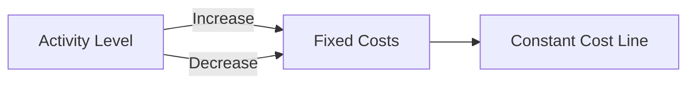
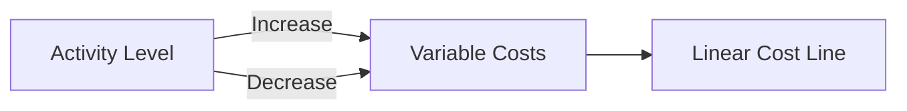
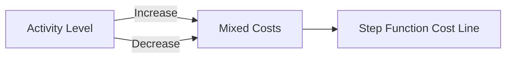

## 11.2 Cost Behavior and Estimation

Understanding cost behavior and estimation is crucial for effective management accounting. This section delves into the nature of fixed, variable, and mixed costs, providing a comprehensive overview that is essential for Canadian accounting exams. By exploring these concepts, you will gain insights into how costs react to changes in business activity levels and learn how to estimate costs accurately for budgeting and decision-making purposes.

### **1. Introduction to Cost Behavior**

Cost behavior refers to how costs change in response to variations in business activity levels. Understanding cost behavior is vital for budgeting, forecasting, and strategic planning. It helps managers predict future costs and make informed decisions about pricing, production, and resource allocation.

#### **1.1 Importance of Cost Behavior Analysis**

- **Budgeting and Forecasting:** Accurate cost behavior analysis allows for more precise budgeting and forecasting, which are critical for financial planning and control.
- **Decision-Making:** Understanding how costs behave helps managers make informed decisions about pricing, production levels, and cost control measures.
- **Performance Evaluation:** Analyzing cost behavior aids in evaluating the efficiency and effectiveness of business operations.

### **2. Types of Costs**

Costs can be classified into three main categories based on their behavior: fixed costs, variable costs, and mixed costs. Each type of cost behaves differently in relation to changes in business activity levels.

#### **2.1 Fixed Costs**

Fixed costs remain constant regardless of changes in the level of business activity. These costs do not fluctuate with production volume or sales levels within a relevant range. Examples include rent, salaries of permanent staff, and depreciation of fixed assets.

- **Characteristics of Fixed Costs:**
  - **Invariance:** Fixed costs do not change with the level of production or sales.
  - **Time-Related:** These costs are often time-related, such as monthly rent or annual insurance premiums.
  - **Capacity Costs:** Fixed costs are often associated with maintaining the capacity to produce goods or services.

- **Examples of Fixed Costs:**
  - **Rent:** The monthly rent for a factory or office space remains constant regardless of production levels.
  - **Salaries:** Salaries of permanent staff, such as administrative personnel, do not vary with output.
  - **Depreciation:** Depreciation on buildings and machinery is a fixed cost as it is based on the asset's useful life.

- **Graphical Representation:**

#### **2.2 Variable Costs**

Variable costs change in direct proportion to changes in the level of business activity. These costs increase as production or sales increase and decrease as production or sales decrease. Examples include raw materials, direct labor, and sales commissions.

- **Characteristics of Variable Costs:**
  - **Proportionality:** Variable costs vary directly with the level of production or sales.
  - **Unit-Based:** These costs are often calculated on a per-unit basis.
  - **Direct Costs:** Variable costs are typically associated with direct production activities.

- **Examples of Variable Costs:**
  - **Raw Materials:** The cost of raw materials increases with the number of units produced.
  - **Direct Labor:** Wages paid to workers based on the number of units produced are variable costs.
  - **Sales Commissions:** Commissions paid to sales staff based on sales volume are variable costs.

- **Graphical Representation:**

#### **2.3 Mixed Costs**

Mixed costs, also known as semi-variable costs, contain both fixed and variable components. These costs change with the level of activity but not in direct proportion. Examples include utility bills and maintenance costs.

- **Characteristics of Mixed Costs:**
  - **Combination:** Mixed costs have both a fixed and a variable component.
  - **Step Function:** The variable component changes with activity levels, while the fixed component remains constant.
  - **Complexity:** Mixed costs require separation into fixed and variable components for analysis.

- **Examples of Mixed Costs:**
  - **Utility Bills:** A base charge plus a variable charge based on usage.
  - **Maintenance Costs:** A fixed monthly fee plus additional costs based on the level of service required.

- **Graphical Representation:**

### **3. Estimating Costs**

Estimating costs accurately is essential for budgeting, forecasting, and decision-making. Various methods can be used to estimate costs, each with its advantages and limitations.

#### **3.1 Methods of Cost Estimation**

- **High-Low Method:** This method uses the highest and lowest activity levels to estimate variable and fixed cost components. It is simple but may not be accurate if the data points are outliers.

- **Regression Analysis:** A statistical method that estimates the relationship between cost and activity levels. It provides a more accurate estimate by considering all data points.

- **Account Analysis:** This method involves reviewing each account to classify costs as fixed, variable, or mixed. It relies on managerial judgment and experience.

- **Engineering Approach:** This method uses technical analysis to estimate costs based on physical relationships between inputs and outputs. It is useful for new products or processes.

#### **3.2 Steps in Cost Estimation**

1. **Identify Cost Drivers:** Determine the factors that cause costs to change, such as production volume or sales levels.
2. **Collect Data:** Gather historical data on costs and activity levels.
3. **Choose Estimation Method:** Select an appropriate method based on the data and context.
4. **Estimate Costs:** Use the chosen method to estimate fixed and variable cost components.
5. **Validate Estimates:** Compare estimates with actual costs to assess accuracy.

### **4. Practical Examples and Case Studies**

#### **4.1 Example: High-Low Method**

Consider a manufacturing company that incurs the following costs at different production levels:

- **Highest Activity Level:** 10,000 units, $50,000 total cost
- **Lowest Activity Level:** 5,000 units, $35,000 total cost

**Calculation:**

1. **Variable Cost per Unit:**
   
   \text{Variable Cost per Unit} = \frac{\text{Change in Total Cost}}{\text{Change in Activity Level}} = \frac{50,000 - 35,000}{10,000 - 5,000} = \frac{15,000}{5,000} = 3
   

2. **Fixed Cost:**
   
   \text{Fixed Cost} = \text{Total Cost} - (\text{Variable Cost per Unit} \times \text{Activity Level}) = 50,000 - (3 \times 10,000) = 20,000
   

#### **4.2 Case Study: Regression Analysis**

A retail company uses regression analysis to estimate costs based on sales volume. The analysis reveals a strong correlation between sales and costs, allowing the company to predict future costs accurately and adjust pricing strategies accordingly.

### **5. Challenges and Best Practices**

#### **5.1 Common Challenges**

- **Data Quality:** Inaccurate or incomplete data can lead to incorrect cost estimates.
- **Complexity of Mixed Costs:** Separating fixed and variable components of mixed costs can be challenging.
- **External Factors:** Changes in market conditions or regulations can affect cost behavior.

#### **5.2 Best Practices**

- **Regular Review:** Continuously review and update cost estimates to reflect changes in business conditions.
- **Use Multiple Methods:** Combine different estimation methods for more accurate results.
- **Involve Experts:** Engage experts in cost estimation to enhance accuracy and reliability.

### **6. Real-World Applications**

Understanding cost behavior and estimation is crucial for various business applications, including:

- **Pricing Strategies:** Setting competitive prices based on cost behavior analysis.
- **Cost Control:** Identifying areas for cost reduction and efficiency improvement.
- **Strategic Planning:** Aligning business strategies with cost structures to achieve financial goals.

### **7. Conclusion**

Cost behavior and estimation are fundamental concepts in management accounting. By understanding how costs behave and how to estimate them accurately, you can make informed decisions that enhance business performance and achieve strategic objectives. This knowledge is essential for success in Canadian accounting exams and professional practice.

## **Ready to Test Your Knowledge?**



### Which of the following is a characteristic of fixed costs?

- [x] They remain constant regardless of production levels.
- [ ] They vary directly with sales volume.
- [ ] They are always time-related.
- [ ] They include raw materials.

> **Explanation:** Fixed costs remain constant regardless of production levels, unlike variable costs, which change with sales volume.

### What is the primary advantage of using regression analysis for cost estimation?

- [x] It considers all data points for more accurate estimates.
- [ ] It is the simplest method to apply.
- [ ] It relies on managerial judgment.
- [ ] It uses only the highest and lowest activity levels.

> **Explanation:** Regression analysis considers all data points, providing more accurate estimates than methods like the high-low method, which uses only two data points.

### Which cost estimation method involves reviewing each account to classify costs?

- [x] Account Analysis
- [ ] High-Low Method
- [ ] Regression Analysis
- [ ] Engineering Approach

> **Explanation:** Account analysis involves reviewing each account to classify costs as fixed, variable, or mixed, relying on managerial judgment.

### What is a common challenge in estimating mixed costs?

- [x] Separating fixed and variable components
- [ ] Identifying cost drivers
- [ ] Collecting historical data
- [ ] Choosing an estimation method

> **Explanation:** A common challenge in estimating mixed costs is separating the fixed and variable components accurately.

### Which of the following is an example of a variable cost?

- [x] Raw materials
- [ ] Rent
- [x] Sales commissions
- [ ] Depreciation

> **Explanation:** Variable costs, such as raw materials and sales commissions, change with production or sales levels, unlike fixed costs like rent and depreciation.

### What is the first step in the cost estimation process?

- [x] Identify cost drivers
- [ ] Collect data
- [ ] Choose estimation method
- [ ] Validate estimates

> **Explanation:** The first step in the cost estimation process is to identify cost drivers, which are factors that cause costs to change.

### Which of the following best describes mixed costs?

- [x] They have both fixed and variable components.
- [ ] They remain constant regardless of activity levels.
- [x] They change in direct proportion to production levels.
- [ ] They are always time-related.

> **Explanation:** Mixed costs have both fixed and variable components, making them more complex to analyze than purely fixed or variable costs.

### What is a key benefit of understanding cost behavior?

- [x] Improved decision-making
- [ ] Increased sales volume
- [ ] Reduced fixed costs
- [ ] Enhanced product quality

> **Explanation:** Understanding cost behavior improves decision-making by providing insights into how costs change with activity levels, aiding in budgeting and strategic planning.

### Which cost estimation method uses technical analysis based on physical relationships?

- [x] Engineering Approach
- [ ] High-Low Method
- [ ] Regression Analysis
- [ ] Account Analysis

> **Explanation:** The engineering approach uses technical analysis to estimate costs based on physical relationships between inputs and outputs.

### True or False: Fixed costs are always time-related.

- [x] False
- [ ] True

> **Explanation:** While many fixed costs are time-related, such as monthly rent, not all fixed costs are strictly time-related.


