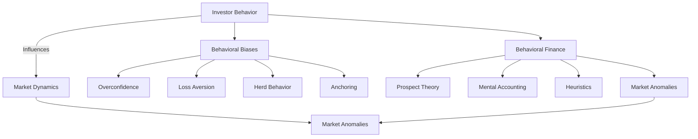

## 14.6 Investor Behavior and Behavioral Finance

Investor behavior and behavioral finance are critical components in understanding the dynamics of capital markets. This section delves into how psychological factors influence investor decisions, leading to market phenomena that traditional financial theories struggle to explain. By examining the principles of behavioral finance, we gain insights into the complexities of market behavior and the implications for accounting and financial reporting.

### Understanding Investor Behavior

Investor behavior refers to the decision-making processes and actions of individuals or institutions in the financial markets. Traditional finance assumes that investors are rational actors who make decisions based on available information to maximize utility. However, real-world observations often contradict this assumption, revealing that investors are influenced by psychological biases and emotions.

#### Key Psychological Biases

1. **Overconfidence Bias**: Investors often overestimate their knowledge and ability to predict market movements, leading to excessive trading and risk-taking.

2. **Anchoring**: This bias occurs when investors rely too heavily on an initial piece of information (the "anchor") when making decisions, even if it is irrelevant.

3. **Herd Behavior**: Investors tend to follow the actions of a larger group, often leading to market bubbles or crashes.

4. **Loss Aversion**: Investors are more sensitive to losses than gains, which can result in holding onto losing investments longer than is rational.

5. **Confirmation Bias**: Investors favor information that confirms their existing beliefs and ignore contradictory evidence.

6. **Regret Aversion**: The fear of making a wrong decision can lead investors to avoid taking action, even when it is beneficial.

### Behavioral Finance: Bridging Psychology and Economics

Behavioral finance integrates insights from psychology with economic theory to better understand how investors make decisions. It challenges the traditional assumption of rationality in financial markets and provides explanations for market anomalies.

#### Key Concepts in Behavioral Finance

1. **Prospect Theory**: Developed by Daniel Kahneman and Amos Tversky, this theory suggests that people value gains and losses differently, leading to irrational decision-making. It introduces the concept of loss aversion, where losses have a more significant emotional impact than an equivalent amount of gains.

2. **Mental Accounting**: This concept refers to the tendency of individuals to categorize and treat money differently depending on its source or intended use. This can lead to irrational spending and investment decisions.

3. **Heuristics**: Investors use mental shortcuts or "rules of thumb" to make complex decisions more manageable. While heuristics can be helpful, they can also lead to systematic errors.

4. **Market Anomalies**: Behavioral finance explains phenomena such as the January effect, momentum, and the equity premium puzzle, which cannot be accounted for by traditional financial theories.

### Implications for Accounting and Financial Reporting

Understanding investor behavior and behavioral finance has significant implications for accounting and financial reporting. It highlights the importance of transparency, communication, and the presentation of financial information.

#### Enhancing Financial Reporting

1. **Clear Communication**: Financial statements should be presented clearly and concisely to minimize misinterpretation by investors influenced by biases.

2. **Transparency**: Providing comprehensive disclosures can help mitigate the effects of confirmation bias and improve investor decision-making.

3. **Investor Education**: Educating investors about common biases and heuristics can enhance their ability to make informed decisions.

4. **Regulatory Considerations**: Regulators can use insights from behavioral finance to design policies that protect investors from their biases, such as requiring standardized disclosures.

### Real-World Applications and Case Studies

#### Case Study: The Dot-Com Bubble

The late 1990s saw a surge in technology stock prices, driven by overconfidence and herd behavior among investors. Many investors believed that the internet would revolutionize business, leading to unrealistic valuations. The bubble burst in 2000, resulting in significant losses.

#### Example: The 2008 Financial Crisis

The 2008 financial crisis highlighted the role of behavioral biases in market dynamics. Overconfidence and excessive risk-taking by financial institutions, combined with herd behavior among investors, contributed to the housing bubble and subsequent market collapse.

### Strategies for Mitigating Behavioral Biases

1. **Diversification**: Spreading investments across different asset classes can reduce the impact of biases such as overconfidence and loss aversion.

2. **Setting Clear Investment Goals**: Defining specific, measurable, and achievable goals can help investors avoid emotional decision-making.

3. **Regular Portfolio Review**: Periodically reviewing and rebalancing portfolios can counteract the effects of anchoring and confirmation bias.

4. **Seeking Professional Advice**: Financial advisors can provide objective perspectives and help investors recognize and mitigate their biases.

### Diagrams and Visuals

To enhance understanding, let's visualize the relationship between investor behavior, market dynamics, and behavioral finance concepts.

### Conclusion

Investor behavior and behavioral finance provide valuable insights into the complexities of financial markets. By understanding the psychological factors that influence decision-making, accountants and financial professionals can enhance financial reporting, improve investor communication, and design strategies to mitigate biases. This knowledge is crucial for navigating the dynamic landscape of capital markets and ensuring informed decision-making.

## **Ready to Test Your Knowledge?**



### Which of the following is a key psychological bias affecting investor behavior?

- [x] Overconfidence Bias
- [ ] Rational Decision-Making
- [ ] Efficient Market Hypothesis
- [ ] Arbitrage

> **Explanation:** Overconfidence bias leads investors to overestimate their abilities and knowledge, influencing their decision-making processes.

### What does Prospect Theory suggest about investor behavior?

- [x] Investors value gains and losses differently.
- [ ] Investors are always rational.
- [ ] Investors ignore market trends.
- [ ] Investors prefer high-risk investments.

> **Explanation:** Prospect Theory, developed by Kahneman and Tversky, indicates that investors react differently to gains and losses, often valuing losses more heavily.

### How can financial reporting be enhanced to mitigate investor biases?

- [x] Clear Communication
- [ ] Complex Financial Statements
- [ ] Limited Disclosures
- [ ] Hidden Fees

> **Explanation:** Clear communication in financial reporting helps minimize misinterpretation and reduces the impact of biases on investor decisions.

### What role does mental accounting play in investor behavior?

- [x] It leads investors to categorize money differently based on its source.
- [ ] It ensures rational investment decisions.
- [ ] It prevents market anomalies.
- [ ] It guarantees profit maximization.

> **Explanation:** Mental accounting causes investors to treat money differently depending on its source or intended use, which can lead to irrational decisions.

### Which strategy can help mitigate the effects of overconfidence bias?

- [x] Diversification
- [ ] Concentrated Investments
- [x] Seeking Professional Advice
- [ ] Ignoring Market Trends

> **Explanation:** Diversification and seeking professional advice can help counteract overconfidence by providing objective perspectives and reducing risk.

### What is herd behavior in the context of investor behavior?

- [x] Following the actions of a larger group
- [ ] Making independent investment decisions
- [ ] Ignoring market trends
- [ ] Always buying low and selling high

> **Explanation:** Herd behavior occurs when investors follow the actions of a larger group, often leading to market bubbles or crashes.

### How does behavioral finance differ from traditional finance?

- [x] It incorporates psychological factors in decision-making.
- [ ] It assumes investors are always rational.
- [x] It explains market anomalies.
- [ ] It ignores investor psychology.

> **Explanation:** Behavioral finance integrates psychology with economic theory to explain investor behavior and market anomalies, unlike traditional finance, which assumes rationality.

### What is the impact of loss aversion on investor decisions?

- [x] Investors are more sensitive to losses than gains.
- [ ] Investors always seek high returns.
- [ ] Investors ignore risk.
- [ ] Investors focus solely on short-term gains.

> **Explanation:** Loss aversion causes investors to be more affected by losses than equivalent gains, influencing their decision-making processes.

### Which of the following is an example of a market anomaly explained by behavioral finance?

- [x] January Effect
- [ ] Efficient Market Hypothesis
- [ ] Rational Decision-Making
- [ ] Arbitrage

> **Explanation:** The January Effect is a market anomaly where stock prices tend to rise in January, explained by behavioral finance.

### True or False: Behavioral finance suggests that all investors make decisions based solely on available information.

- [x] False
- [ ] True

> **Explanation:** Behavioral finance indicates that investors are influenced by psychological biases and emotions, not just available information.


