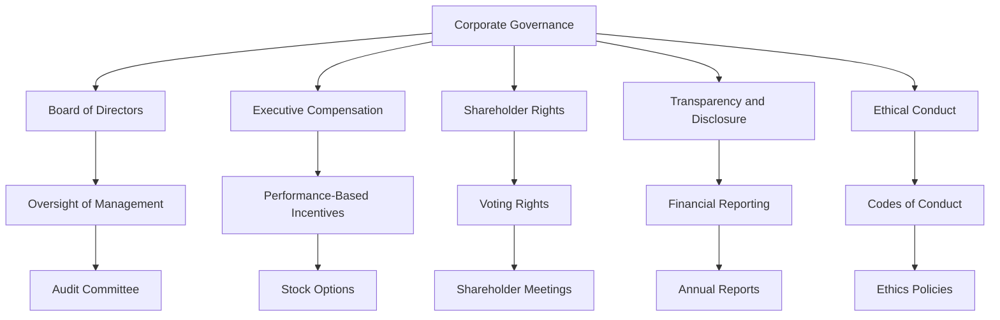

## 14.9 Corporate Governance and Shareholder Relations

Corporate governance and shareholder relations are pivotal in ensuring that the interests of management align with those of shareholders. This alignment is crucial for maintaining investor confidence, enhancing corporate performance, and ensuring compliance with accounting standards. In this section, we will delve into the mechanisms of corporate governance, explore the dynamics of shareholder relations, and examine how these elements interact within the framework of Canadian accounting standards.

### Understanding Corporate Governance

Corporate governance refers to the system of rules, practices, and processes by which a company is directed and controlled. It encompasses the mechanisms through which companies, and those in control, are held accountable to stakeholders, including shareholders, employees, customers, and the community at large.

#### Key Components of Corporate Governance

1. **Board of Directors**: The board is responsible for overseeing the company's management and ensuring that the company acts in the best interests of its shareholders. The board's composition, independence, and effectiveness are critical to good governance.

2. **Executive Compensation**: Aligning executive compensation with company performance is essential to ensure that management's interests are aligned with those of shareholders. This can include performance-based bonuses, stock options, and other incentives.

3. **Shareholder Rights**: Protecting shareholder rights is a fundamental aspect of corporate governance. This includes the right to vote on key issues, such as the election of directors and major corporate transactions.

4. **Transparency and Disclosure**: Companies must provide accurate and timely information to shareholders and the public. This includes financial statements, management discussion and analysis, and other disclosures required by accounting standards.

5. **Ethical Conduct**: Corporate governance frameworks often include codes of conduct and ethics policies to guide the behavior of directors, executives, and employees.

#### The Role of Corporate Governance in Accounting

Corporate governance plays a crucial role in ensuring the integrity of financial reporting. It helps prevent fraudulent financial reporting and ensures compliance with accounting standards. The board of directors, particularly the audit committee, is responsible for overseeing the financial reporting process and the work of external auditors.

### Shareholder Relations

Shareholder relations involve the communication and interaction between a company and its shareholders. Effective shareholder relations are essential for building trust and confidence in the company.

#### Strategies for Effective Shareholder Relations

1. **Regular Communication**: Companies should provide regular updates to shareholders through earnings releases, annual reports, and shareholder meetings. This helps keep shareholders informed about the company's performance and strategic direction.

2. **Engagement and Feedback**: Companies should actively engage with shareholders and seek their feedback on key issues. This can be done through surveys, focus groups, and direct communication with investor relations teams.

3. **Addressing Shareholder Concerns**: Companies should be responsive to shareholder concerns and take appropriate action to address them. This can help prevent shareholder activism and proxy battles.

4. **Transparency and Honesty**: Companies should be transparent and honest in their communications with shareholders. This includes providing clear and accurate information about the company's financial performance and strategic initiatives.

### Aligning Management and Shareholder Interests

Aligning the interests of management and shareholders is a key objective of corporate governance. This alignment can be achieved through various mechanisms, including:

1. **Performance-Based Compensation**: Tying executive compensation to company performance can help align management's interests with those of shareholders. This can include bonuses, stock options, and other incentives based on financial and non-financial performance metrics.

2. **Share Ownership Requirements**: Requiring executives and directors to own a certain amount of company stock can help align their interests with those of shareholders.

3. **Long-Term Incentives**: Providing long-term incentives, such as restricted stock units or performance shares, can encourage management to focus on the company's long-term success rather than short-term gains.

4. **Clawback Provisions**: Implementing clawback provisions in executive compensation agreements can help ensure that executives are held accountable for their actions and that they do not benefit from fraudulent or unethical behavior.

### Case Studies and Examples

#### Case Study 1: The Role of the Board in Corporate Governance

Consider a Canadian company that faced a major accounting scandal due to fraudulent financial reporting. The board of directors played a crucial role in addressing the issue by conducting an independent investigation, implementing stronger internal controls, and enhancing the company's corporate governance framework. This case highlights the importance of an effective board in maintaining the integrity of financial reporting.

#### Case Study 2: Shareholder Activism and Corporate Governance

A Canadian mining company faced shareholder activism due to concerns about environmental practices and executive compensation. The company engaged with shareholders, addressed their concerns, and made changes to its governance practices, including enhancing its environmental policies and revising its executive compensation structure. This case illustrates the importance of effective shareholder relations in addressing shareholder concerns and improving corporate governance.

### Regulatory Framework and Standards

In Canada, corporate governance and shareholder relations are governed by a combination of laws, regulations, and best practices. Key regulatory bodies and standards include:

1. **Canadian Securities Administrators (CSA)**: The CSA is responsible for regulating securities markets in Canada. It provides guidance on corporate governance practices and disclosure requirements.

2. **Toronto Stock Exchange (TSX) Listing Requirements**: The TSX has specific listing requirements related to corporate governance, including board composition, audit committee responsibilities, and disclosure obligations.

3. **CPA Canada Handbook**: The CPA Canada Handbook provides guidance on financial reporting and auditing standards, including those related to corporate governance and shareholder relations.

4. **International Financial Reporting Standards (IFRS)**: As adopted in Canada, IFRS provides the framework for financial reporting and disclosure, which is critical for maintaining transparency and accountability in corporate governance.

### Best Practices and Common Pitfalls

#### Best Practices

- **Establish a Strong and Independent Board**: Ensure that the board of directors is composed of independent and qualified individuals who can effectively oversee the company's management and financial reporting.

- **Enhance Transparency and Disclosure**: Provide clear and comprehensive information to shareholders and the public, including financial statements, management discussion and analysis, and other required disclosures.

- **Engage with Shareholders**: Actively engage with shareholders and seek their feedback on key issues. This can help build trust and confidence in the company.

- **Align Compensation with Performance**: Ensure that executive compensation is aligned with company performance and shareholder interests. This can help motivate management to act in the best interests of shareholders.

#### Common Pitfalls

- **Lack of Board Independence**: A lack of independence on the board of directors can undermine its ability to effectively oversee management and ensure the integrity of financial reporting.

- **Inadequate Disclosure**: Failing to provide accurate and timely information to shareholders can erode trust and confidence in the company.

- **Ignoring Shareholder Concerns**: Failing to address shareholder concerns can lead to shareholder activism and proxy battles, which can be costly and disruptive for the company.

- **Misalignment of Compensation and Performance**: If executive compensation is not aligned with company performance, it can lead to short-term decision-making and undermine shareholder value.

### Practical Examples and Scenarios

#### Example 1: Implementing a Clawback Provision

A Canadian technology company implemented a clawback provision in its executive compensation agreements. This provision allows the company to recover bonuses and other incentives if it is later determined that the executive engaged in fraudulent or unethical behavior. This example illustrates how clawback provisions can help align management interests with those of shareholders.

#### Example 2: Enhancing Shareholder Engagement

A Canadian retail company enhanced its shareholder engagement efforts by conducting regular surveys and focus groups to gather feedback from shareholders. The company used this feedback to improve its corporate governance practices and address shareholder concerns. This example highlights the importance of effective shareholder engagement in building trust and confidence in the company.

### Diagrams and Visuals

To better understand the relationship between corporate governance and shareholder relations, consider the following diagram illustrating the key components of corporate governance and their interaction with shareholder relations:

### Conclusion

Corporate governance and shareholder relations are critical components of a company's success. By aligning management interests with those of shareholders, companies can enhance their performance, maintain investor confidence, and ensure compliance with accounting standards. Understanding the mechanisms of corporate governance and the dynamics of shareholder relations is essential for accountants, auditors, and other professionals involved in financial reporting and corporate governance.

### References and Further Reading

- Canadian Securities Administrators (CSA) guidelines on corporate governance
- Toronto Stock Exchange (TSX) listing requirements
- CPA Canada Handbook on financial reporting and auditing standards
- International Financial Reporting Standards (IFRS) as adopted in Canada

## **Ready to Test Your Knowledge?**



### Which of the following is a key component of corporate governance?

- [x] Board of Directors
- [ ] Marketing Strategy
- [ ] Product Development
- [ ] Customer Service

> **Explanation:** The Board of Directors is a key component of corporate governance, responsible for overseeing the company's management and ensuring that the company acts in the best interests of its shareholders.

### What is the main purpose of executive compensation in corporate governance?

- [x] To align management's interests with those of shareholders
- [ ] To increase company profits
- [ ] To reduce employee turnover
- [ ] To enhance customer satisfaction

> **Explanation:** Executive compensation is designed to align management's interests with those of shareholders by tying compensation to company performance.

### Which regulatory body is responsible for securities regulation in Canada?

- [x] Canadian Securities Administrators (CSA)
- [ ] Financial Accounting Standards Board (FASB)
- [ ] International Accounting Standards Board (IASB)
- [ ] Securities and Exchange Commission (SEC)

> **Explanation:** The Canadian Securities Administrators (CSA) is responsible for regulating securities markets in Canada.

### What is a common pitfall in corporate governance?

- [x] Lack of Board Independence
- [ ] Excessive Transparency
- [ ] Over-Engagement with Shareholders
- [ ] High Executive Compensation

> **Explanation:** A lack of board independence can undermine the board's ability to effectively oversee management and ensure the integrity of financial reporting.

### How can companies enhance shareholder engagement?

- [x] Conducting regular surveys and focus groups
- [ ] Reducing financial disclosures
- [ ] Limiting shareholder meetings
- [ ] Increasing executive compensation

> **Explanation:** Conducting regular surveys and focus groups can help companies gather feedback from shareholders and enhance engagement.

### What is the role of the audit committee in corporate governance?

- [x] Overseeing the financial reporting process
- [ ] Developing marketing strategies
- [ ] Managing customer relations
- [ ] Designing product lines

> **Explanation:** The audit committee is responsible for overseeing the financial reporting process and the work of external auditors.

### Which of the following is a strategy for aligning management and shareholder interests?

- [x] Performance-Based Compensation
- [ ] Reducing shareholder rights
- [ ] Increasing product prices
- [ ] Limiting transparency

> **Explanation:** Performance-based compensation aligns management's interests with those of shareholders by tying compensation to company performance.

### What is the purpose of clawback provisions in executive compensation agreements?

- [x] To recover bonuses in cases of fraudulent behavior
- [ ] To increase executive salaries
- [ ] To enhance customer satisfaction
- [ ] To reduce employee turnover

> **Explanation:** Clawback provisions allow companies to recover bonuses and other incentives if it is later determined that the executive engaged in fraudulent or unethical behavior.

### Which of the following is NOT a component of corporate governance?

- [ ] Board of Directors
- [ ] Executive Compensation
- [ ] Shareholder Rights
- [x] Product Development

> **Explanation:** Product development is not a component of corporate governance. Corporate governance focuses on the system of rules, practices, and processes by which a company is directed and controlled.

### True or False: Transparency and disclosure are not important in corporate governance.

- [ ] True
- [x] False

> **Explanation:** Transparency and disclosure are critical components of corporate governance, as they ensure that companies provide accurate and timely information to shareholders and the public.


