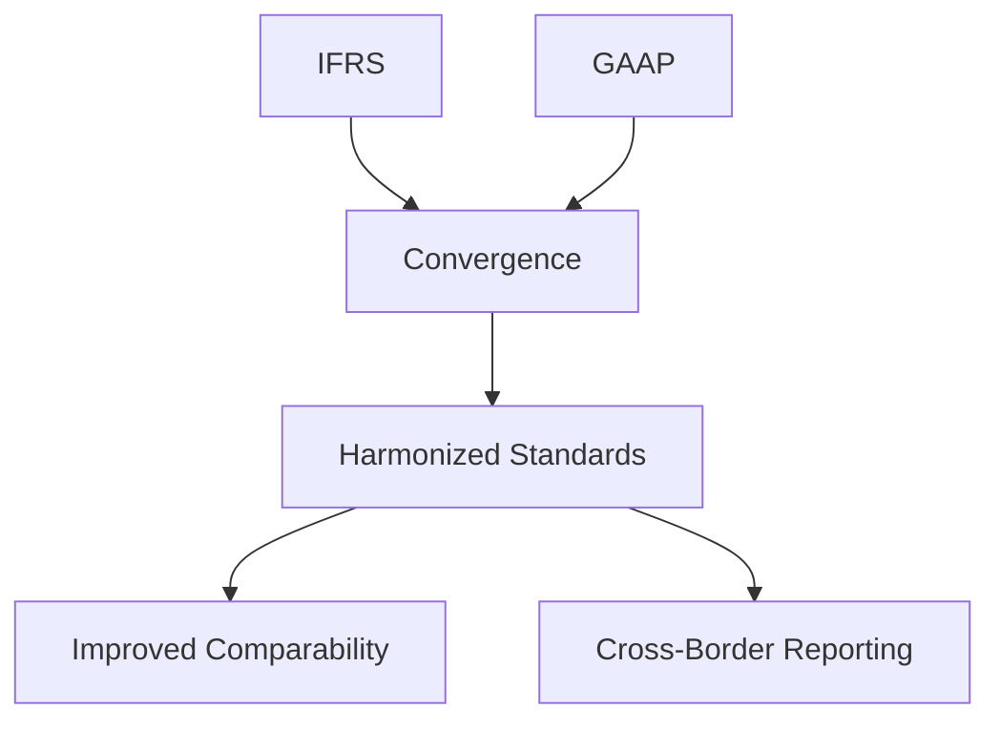

## 15.15 Globalization 4.0 and Accounting

### Introduction to Globalization 4.0

Globalization 4.0 represents the latest phase in the evolution of global interconnectedness, characterized by rapid technological advancements, increased digitalization, and a shift towards a more integrated global economy. Unlike previous waves of globalization, which primarily focused on trade and economic integration, Globalization 4.0 is driven by the convergence of digital technologies, artificial intelligence (AI), and the Internet of Things (IoT). These developments are reshaping industries, including accounting, by altering traditional practices and introducing new challenges and opportunities.

### The Impact of Globalization 4.0 on Accounting Practices

#### Technological Advancements and Automation

One of the most significant impacts of Globalization 4.0 on accounting is the integration of advanced technologies such as AI, blockchain, and big data analytics. These technologies are automating routine accounting tasks, allowing accountants to focus on more strategic activities. For instance, AI-powered software can process large volumes of transactions quickly and accurately, reducing the need for manual data entry and minimizing errors.

**Example:** A Canadian accounting firm implemented AI-driven software to automate its accounts payable process. This technology reduced processing time by 50% and improved accuracy, allowing accountants to allocate more time to financial analysis and advisory services.

#### Blockchain and Transparent Financial Reporting

Blockchain technology is revolutionizing the way financial transactions are recorded and verified. By providing a decentralized and immutable ledger, blockchain enhances transparency and trust in financial reporting. This is particularly beneficial for multinational corporations operating across different jurisdictions, as it ensures consistency and reliability in financial data.

**Case Study:** A multinational corporation adopted blockchain for its supply chain management, enabling real-time tracking of transactions and reducing the risk of fraud. This increased transparency improved stakeholder confidence and streamlined the audit process.

#### Big Data Analytics and Decision-Making

The ability to analyze vast amounts of data in real-time is transforming decision-making processes in accounting. Big data analytics allows accountants to derive insights from complex datasets, enhancing their ability to forecast trends, identify risks, and make informed strategic decisions.

**Scenario:** A Canadian retail company utilized big data analytics to analyze customer purchasing patterns. This information was used to optimize inventory levels, resulting in a 20% reduction in holding costs and improved cash flow management.

### International Accounting Standards and Harmonization

#### Convergence of Accounting Standards

Globalization 4.0 is driving the convergence of accounting standards, with a focus on harmonizing International Financial Reporting Standards (IFRS) and Generally Accepted Accounting Principles (GAAP). This convergence aims to facilitate cross-border financial reporting and improve comparability for investors and stakeholders.

**Mermaid Diagram:**

#### The Role of Standard-Setting Bodies

Organizations such as the International Accounting Standards Board (IASB) and the Financial Accounting Standards Board (FASB) play a crucial role in developing and promoting international accounting standards. Their efforts are essential in ensuring that financial reporting remains relevant and reliable in a globalized economy.

**Example:** The IASB and FASB collaborated to develop the IFRS 15 standard on revenue recognition, providing a unified framework for recognizing revenue across different industries and jurisdictions.

### The Evolving Role of Accountants in a Globalized Economy

#### Strategic Advisory and Value Creation

As routine tasks become automated, accountants are increasingly taking on strategic advisory roles, focusing on value creation and business strategy. This shift requires accountants to develop new skills, such as data analysis, strategic thinking, and effective communication.

**Practical Example:** A Canadian accountant transitioned from traditional bookkeeping to a strategic advisory role, helping clients develop growth strategies and optimize financial performance through data-driven insights.

#### Ethical Considerations and Corporate Governance

Globalization 4.0 also brings ethical challenges, as accountants must navigate complex regulatory environments and ensure compliance with international standards. Strong corporate governance and ethical practices are essential to maintaining trust and integrity in financial reporting.

**Case Study:** A Canadian corporation faced ethical dilemmas related to tax avoidance strategies in multiple jurisdictions. By adhering to ethical guidelines and promoting transparency, the company maintained its reputation and avoided legal repercussions.

### Real-World Applications and Regulatory Scenarios

#### Cross-Border Transactions and Taxation

Accountants must manage the complexities of cross-border transactions and international taxation, ensuring compliance with diverse regulatory requirements. This involves understanding transfer pricing, tax treaties, and the implications of digital taxation.

**Scenario:** A Canadian technology company expanded into European markets, requiring a comprehensive understanding of EU tax regulations and transfer pricing policies to optimize its tax strategy and ensure compliance.

#### Environmental, Social, and Governance (ESG) Reporting

Globalization 4.0 emphasizes the importance of ESG reporting, as stakeholders demand greater transparency and accountability in corporate practices. Accountants play a key role in developing and implementing ESG reporting frameworks, ensuring that companies meet stakeholder expectations and regulatory requirements.

**Example:** A Canadian mining company adopted an ESG reporting framework to disclose its environmental impact and social initiatives. This transparency improved stakeholder relations and enhanced the company's reputation in the global market.

### Challenges and Strategies for Overcoming Them

#### Adapting to Rapid Technological Change

Accountants must continuously update their skills and knowledge to keep pace with technological advancements. This involves embracing lifelong learning and leveraging professional development opportunities to stay relevant in a rapidly changing environment.

**Strategy:** Accountants can participate in workshops, online courses, and certification programs focused on emerging technologies and data analytics to enhance their skill sets and remain competitive.

#### Navigating Regulatory Complexity

The global regulatory landscape is becoming increasingly complex, requiring accountants to stay informed about changes in international standards and regulations. This necessitates a proactive approach to compliance and risk management.

**Strategy:** Accountants can utilize regulatory technology (RegTech) solutions to streamline compliance processes and ensure adherence to international standards, reducing the risk of non-compliance and associated penalties.

### Conclusion

Globalization 4.0 is reshaping the accounting profession, presenting both challenges and opportunities for accountants. By embracing technological advancements, harmonizing international standards, and adapting to new roles, accountants can thrive in a globalized economy. As the profession evolves, accountants must remain committed to ethical practices, continuous learning, and strategic value creation to succeed in this dynamic environment.

## **Ready to Test Your Knowledge?**



### What is a key characteristic of Globalization 4.0?

- [x] Integration of digital technologies
- [ ] Focus on trade and economic integration
- [ ] Emphasis on local markets
- [ ] Reduction in global interconnectedness

> **Explanation:** Globalization 4.0 is characterized by the integration of digital technologies, such as AI and IoT, which are reshaping industries and global interconnectedness.

### How does blockchain technology impact financial reporting?

- [x] Enhances transparency and trust
- [ ] Increases manual data entry
- [ ] Reduces the need for audits
- [ ] Complicates financial transactions

> **Explanation:** Blockchain provides a decentralized and immutable ledger that enhances transparency and trust in financial reporting, reducing the risk of fraud.

### What role do accountants play in ESG reporting?

- [x] Developing and implementing reporting frameworks
- [ ] Reducing the need for transparency
- [ ] Focusing solely on financial metrics
- [ ] Ignoring stakeholder expectations

> **Explanation:** Accountants are crucial in developing and implementing ESG reporting frameworks to ensure companies meet stakeholder expectations and regulatory requirements.

### What is a benefit of big data analytics in accounting?

- [x] Enhances decision-making processes
- [ ] Increases manual data processing
- [ ] Reduces the need for strategic thinking
- [ ] Limits data availability

> **Explanation:** Big data analytics enhances decision-making processes by allowing accountants to derive insights from complex datasets, improving forecasting and risk management.

### What is a challenge accountants face due to Globalization 4.0?

- [x] Navigating regulatory complexity
- [ ] Decrease in technological advancements
- [ ] Simplified cross-border transactions
- [ ] Reduced need for compliance

> **Explanation:** Accountants face the challenge of navigating regulatory complexity due to diverse international standards and regulations in a globalized economy.

### How does AI impact accounting practices?

- [x] Automates routine tasks
- [ ] Increases manual workload
- [ ] Reduces accuracy in financial reporting
- [ ] Limits data analysis capabilities

> **Explanation:** AI automates routine accounting tasks, allowing accountants to focus on strategic activities and improving accuracy in financial reporting.

### What is a strategy for accountants to adapt to technological change?

- [x] Participate in workshops and online courses
- [ ] Avoid learning new technologies
- [ ] Focus solely on traditional accounting methods
- [ ] Ignore professional development opportunities

> **Explanation:** Accountants can adapt to technological change by participating in workshops, online courses, and certification programs to enhance their skills and remain competitive.

### What is the role of standard-setting bodies in globalization?

- [x] Developing international accounting standards
- [ ] Reducing the need for harmonization
- [ ] Focusing solely on local regulations
- [ ] Ignoring global economic trends

> **Explanation:** Standard-setting bodies like IASB and FASB develop international accounting standards to facilitate cross-border financial reporting and improve comparability.

### How can accountants manage cross-border transactions effectively?

- [x] Understanding transfer pricing and tax treaties
- [ ] Ignoring international regulations
- [ ] Focusing only on domestic tax laws
- [ ] Avoiding digital taxation implications

> **Explanation:** Accountants can manage cross-border transactions effectively by understanding transfer pricing, tax treaties, and digital taxation implications to ensure compliance.

### True or False: Globalization 4.0 reduces the need for ethical practices in accounting.

- [ ] True
- [x] False

> **Explanation:** False. Globalization 4.0 increases the need for ethical practices in accounting, as accountants must navigate complex regulatory environments and ensure compliance with international standards.


