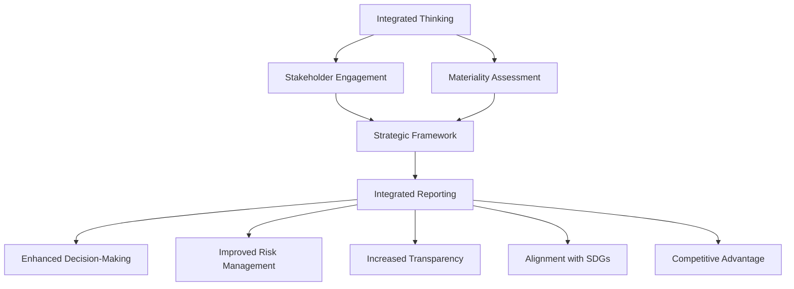

## 15.4 Integrated Thinking in Business Strategy

Integrated thinking is a holistic approach that aligns an organization's strategy, governance, performance, and prospects with the context of its external environment. It is a process that results in integrated reporting, which communicates how an organization creates value over time. This section explores the influence of integrated thinking on strategic planning, its implications for accounting practices, and its relevance to Canadian accounting standards and global practices.

### Understanding Integrated Thinking

Integrated thinking involves considering the relationships between various operating and functional units within an organization and the capitals that the organization uses or affects. These capitals include financial, manufactured, intellectual, human, social and relationship, and natural capitals. By understanding these interconnections, organizations can make more informed decisions that align with their long-term strategic objectives.

#### Key Components of Integrated Thinking

1. **Holistic Viewpoint**: Integrated thinking requires a comprehensive understanding of the organization’s operations and their impact on various capitals. This involves recognizing the interconnectedness of different business activities and their cumulative effect on value creation.

2. **Stakeholder Engagement**: Engaging with stakeholders is crucial in integrated thinking. It ensures that the organization considers the needs and expectations of different stakeholders, including investors, employees, customers, and the community.

3. **Long-term Focus**: Unlike traditional financial reporting, which often focuses on short-term financial performance, integrated thinking emphasizes long-term value creation and sustainability.

4. **Strategic Alignment**: Integrated thinking aligns the organization’s strategy with its mission, vision, and values, ensuring that all business activities contribute to the overarching strategic goals.

5. **Innovation and Adaptability**: Organizations practicing integrated thinking are better positioned to innovate and adapt to changes in the business environment, as they have a clearer understanding of the factors influencing their operations.

### Integrated Reporting and Its Influence on Strategic Planning

Integrated reporting is the outcome of integrated thinking. It provides a comprehensive view of the organization’s ability to create value over time. The International Integrated Reporting Council (IIRC) has developed a framework that guides organizations in preparing integrated reports. This framework emphasizes the importance of connectivity between financial and non-financial information.

#### The Role of Integrated Reporting in Strategic Planning

1. **Enhanced Decision-Making**: Integrated reporting provides management with a broader perspective on the organization’s performance, enabling more informed strategic decisions.

2. **Improved Risk Management**: By understanding the interdependencies between different capitals, organizations can better identify and manage risks that may impact their strategic objectives.

3. **Increased Transparency and Accountability**: Integrated reporting enhances transparency by providing stakeholders with a clear view of how the organization creates value. This fosters accountability and trust among stakeholders.

4. **Alignment with Sustainable Development Goals (SDGs)**: Integrated reporting encourages organizations to align their strategies with global sustainability goals, such as the United Nations SDGs, promoting long-term sustainability.

5. **Competitive Advantage**: Organizations that adopt integrated reporting can differentiate themselves from competitors by demonstrating their commitment to sustainable value creation.

### Practical Examples and Case Studies

#### Example 1: A Canadian Mining Company

A Canadian mining company implemented integrated thinking by aligning its business strategy with environmental sustainability goals. By engaging with local communities and environmental groups, the company identified key areas where it could reduce its environmental impact. The integrated report highlighted the company’s efforts to minimize water usage and reduce carbon emissions, which enhanced its reputation and attracted socially responsible investors.

#### Example 2: A Global Technology Firm

A global technology firm adopted integrated thinking to improve its innovation processes. By recognizing the importance of intellectual and human capital, the firm invested in employee training and development programs. The integrated report showcased the firm’s commitment to fostering a culture of innovation, which led to the development of new products and services that aligned with customer needs and market trends.

### Real-World Applications and Regulatory Scenarios

In Canada, integrated reporting is gaining traction as organizations recognize the benefits of providing a holistic view of their operations. The Canadian Securities Administrators (CSA) have encouraged companies to consider the relevance of integrated reporting in their disclosure practices. Additionally, the adoption of International Financial Reporting Standards (IFRS) in Canada supports the integration of financial and non-financial information, aligning with global best practices.

#### Regulatory Considerations

1. **Compliance with IFRS**: Canadian organizations must ensure that their integrated reports comply with IFRS, which provides guidelines for financial reporting. This includes the disclosure of material information that may impact the organization’s financial performance.

2. **Sustainability Reporting**: The Global Reporting Initiative (GRI) and the Sustainability Accounting Standards Board (SASB) provide frameworks for sustainability reporting that can complement integrated reporting efforts.

3. **CPA Canada Guidelines**: CPA Canada offers resources and guidance for organizations looking to adopt integrated reporting, emphasizing the importance of transparency and accountability in financial disclosures.

### Step-by-Step Guidance for Implementing Integrated Thinking

1. **Conduct a Materiality Assessment**: Identify the key issues that impact the organization’s ability to create value. This involves engaging with stakeholders to understand their concerns and expectations.

2. **Develop a Strategic Framework**: Align the organization’s strategy with its mission, vision, and values. This framework should consider the interdependencies between different capitals and their impact on value creation.

3. **Integrate Financial and Non-Financial Information**: Ensure that the organization’s reporting processes capture both financial and non-financial information. This may involve updating information systems and processes to support integrated reporting.

4. **Engage with Stakeholders**: Foster open communication with stakeholders to understand their needs and expectations. This can help the organization identify opportunities for improvement and innovation.

5. **Monitor and Evaluate Performance**: Regularly assess the organization’s performance against its strategic objectives. This involves tracking key performance indicators (KPIs) and making adjustments as needed to ensure alignment with long-term goals.

### Diagrams and Visual Aids

To enhance understanding, the following Mermaid.js diagram illustrates the process of integrated thinking and reporting:

### Best Practices, Common Pitfalls, and Strategies

#### Best Practices

- **Engage with a Diverse Range of Stakeholders**: Involve stakeholders from different sectors to gain a comprehensive understanding of the issues impacting the organization.

- **Focus on Long-Term Value Creation**: Prioritize strategies that contribute to sustainable value creation rather than short-term financial gains.

- **Foster a Culture of Innovation**: Encourage employees to think creatively and explore new ideas that align with the organization’s strategic objectives.

#### Common Pitfalls

- **Lack of Stakeholder Engagement**: Failing to engage with stakeholders can result in a narrow perspective that overlooks critical issues.

- **Inadequate Integration of Information**: Organizations may struggle to integrate financial and non-financial information, leading to incomplete reporting.

- **Resistance to Change**: Employees and management may resist adopting integrated thinking due to a lack of understanding or fear of change.

#### Strategies to Overcome Challenges

- **Provide Training and Education**: Offer training programs to help employees understand the benefits of integrated thinking and reporting.

- **Leverage Technology**: Use technology to streamline the integration of financial and non-financial information, improving the accuracy and efficiency of reporting processes.

- **Communicate the Benefits**: Clearly communicate the benefits of integrated thinking to all stakeholders, emphasizing its role in enhancing decision-making and long-term value creation.

### References to Canadian Accounting Standards and Resources

- **International Financial Reporting Standards (IFRS)**: As adopted in Canada, IFRS provides guidelines for financial reporting that support integrated reporting efforts.

- **CPA Canada**: Offers resources and guidance on integrated thinking and reporting, emphasizing the importance of transparency and accountability.

- **Global Reporting Initiative (GRI)**: Provides a framework for sustainability reporting that complements integrated reporting.

- **Sustainability Accounting Standards Board (SASB)**: Offers standards for sustainability reporting that align with integrated reporting principles.

### Conclusion

Integrated thinking is a transformative approach that aligns an organization’s strategy with its long-term objectives and stakeholder expectations. By adopting integrated reporting, organizations can enhance transparency, improve decision-making, and create sustainable value. As Canadian organizations increasingly recognize the benefits of integrated thinking, it is essential to stay informed about regulatory developments and best practices to remain competitive in the global market.

## **Ready to Test Your Knowledge?**



### What is the primary focus of integrated thinking in business strategy?

- [x] Long-term value creation
- [ ] Short-term financial gains
- [ ] Cost reduction
- [ ] Market expansion

> **Explanation:** Integrated thinking emphasizes long-term value creation by considering the interconnections between various business activities and their impact on different capitals.

### Which of the following is a key component of integrated thinking?

- [ ] Cost-cutting measures
- [x] Stakeholder engagement
- [ ] Product diversification
- [ ] Market segmentation

> **Explanation:** Stakeholder engagement is crucial in integrated thinking as it ensures that the organization considers the needs and expectations of different stakeholders.

### How does integrated reporting influence strategic planning?

- [x] By providing a comprehensive view of the organization's performance
- [ ] By focusing solely on financial metrics
- [ ] By reducing the need for stakeholder engagement
- [ ] By limiting transparency

> **Explanation:** Integrated reporting provides management with a broader perspective on the organization’s performance, enabling more informed strategic decisions.

### Which regulatory framework supports integrated reporting in Canada?

- [ ] Generally Accepted Accounting Principles (GAAP)
- [x] International Financial Reporting Standards (IFRS)
- [ ] Canadian Accounting Standards for Private Enterprises (ASPE)
- [ ] Financial Accounting Standards Board (FASB)

> **Explanation:** IFRS, as adopted in Canada, supports the integration of financial and non-financial information, aligning with global best practices.

### What is a common pitfall in implementing integrated thinking?

- [x] Lack of stakeholder engagement
- [ ] Overemphasis on innovation
- [ ] Excessive focus on short-term gains
- [ ] Ignoring financial metrics

> **Explanation:** Failing to engage with stakeholders can result in a narrow perspective that overlooks critical issues impacting the organization.

### Which of the following is a benefit of integrated reporting?

- [ ] Reduced transparency
- [ ] Decreased stakeholder trust
- [x] Enhanced decision-making
- [ ] Limited risk management

> **Explanation:** Integrated reporting enhances decision-making by providing a comprehensive view of the organization’s ability to create value over time.

### How can organizations overcome resistance to integrated thinking?

- [ ] By ignoring stakeholder feedback
- [ ] By focusing solely on financial metrics
- [x] By providing training and education
- [ ] By reducing transparency

> **Explanation:** Offering training programs can help employees understand the benefits of integrated thinking and reporting, reducing resistance to change.

### What is the role of technology in integrated reporting?

- [x] To streamline the integration of financial and non-financial information
- [ ] To replace stakeholder engagement
- [ ] To limit transparency
- [ ] To reduce innovation

> **Explanation:** Technology can streamline the integration of financial and non-financial information, improving the accuracy and efficiency of reporting processes.

### Which framework provides guidelines for sustainability reporting?

- [ ] Financial Accounting Standards Board (FASB)
- [ ] Canadian Accounting Standards for Private Enterprises (ASPE)
- [x] Global Reporting Initiative (GRI)
- [ ] Generally Accepted Accounting Principles (GAAP)

> **Explanation:** The Global Reporting Initiative (GRI) provides a framework for sustainability reporting that complements integrated reporting efforts.

### True or False: Integrated thinking focuses solely on financial performance.

- [ ] True
- [x] False

> **Explanation:** Integrated thinking considers both financial and non-financial factors, emphasizing long-term value creation and sustainability.


