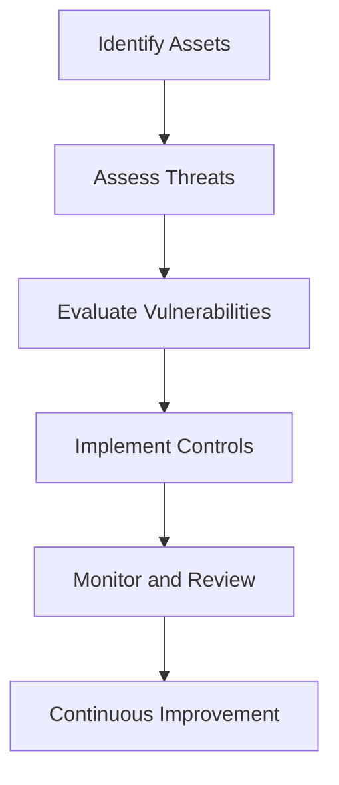

## 15.8 The Role of Accountants in Cybersecurity

In today's digital age, cybersecurity has become a paramount concern for organizations worldwide. As custodians of financial information, accountants play a pivotal role in ensuring the security and integrity of financial data. This section explores the multifaceted role of accountants in cybersecurity, emphasizing their responsibilities in safeguarding information, managing risks, and ensuring compliance with regulatory standards.

### The Intersection of Accounting and Cybersecurity

Accountants are traditionally associated with financial reporting, auditing, and compliance. However, the increasing reliance on digital systems for financial transactions and data storage has necessitated a broader scope of responsibilities. Cybersecurity intersects with accounting in several critical areas:

1. **Data Integrity and Accuracy**: Accountants must ensure that financial data is accurate and free from unauthorized alterations. Cybersecurity measures help protect against data breaches and fraud, maintaining the integrity of financial statements.

2. **Risk Management**: Accountants are integral to identifying and mitigating risks associated with cyber threats. They assess the potential financial impact of cybersecurity incidents and develop strategies to minimize these risks.

3. **Compliance and Regulatory Requirements**: Accountants ensure that organizations comply with cybersecurity regulations and standards, such as the General Data Protection Regulation (GDPR) and the Personal Information Protection and Electronic Documents Act (PIPEDA) in Canada.

4. **Fraud Prevention and Detection**: Cybersecurity tools and techniques are essential in preventing and detecting financial fraud. Accountants use these tools to monitor transactions and identify suspicious activities.

### Key Responsibilities of Accountants in Cybersecurity

Accountants play several crucial roles in the cybersecurity landscape, including:

#### 1. Implementing Cybersecurity Controls

Accountants are responsible for implementing and maintaining cybersecurity controls to protect financial data. These controls include:

- **Access Controls**: Limiting access to financial systems and data to authorized personnel only.
- **Encryption**: Ensuring that sensitive financial data is encrypted both in transit and at rest.
- **Regular Audits**: Conducting regular audits of financial systems to identify vulnerabilities and ensure compliance with cybersecurity policies.

#### 2. Conducting Risk Assessments

Accountants conduct comprehensive risk assessments to identify potential cybersecurity threats and vulnerabilities. This involves:

- **Identifying Assets**: Cataloging all financial data and systems that require protection.
- **Assessing Threats**: Evaluating potential cyber threats, such as hacking, phishing, and malware attacks.
- **Evaluating Vulnerabilities**: Identifying weaknesses in existing cybersecurity measures and recommending improvements.

#### 3. Ensuring Compliance with Cybersecurity Regulations

Compliance with cybersecurity regulations is critical for avoiding legal penalties and maintaining stakeholder trust. Accountants ensure compliance by:

- **Staying Informed**: Keeping up-to-date with the latest cybersecurity regulations and standards.
- **Documenting Policies**: Developing and documenting cybersecurity policies and procedures.
- **Training Employees**: Conducting regular training sessions to educate employees about cybersecurity best practices.

#### 4. Collaborating with IT and Security Teams

Effective cybersecurity requires collaboration between accountants, IT professionals, and security teams. Accountants:

- **Communicate Financial Risks**: Work with IT teams to communicate the financial implications of cybersecurity threats.
- **Develop Incident Response Plans**: Collaborate on developing and testing incident response plans to ensure a swift and effective response to cybersecurity incidents.
- **Monitor Cybersecurity Metrics**: Track key cybersecurity metrics to assess the effectiveness of security measures.

### Practical Examples and Case Studies

#### Case Study: Data Breach at a Financial Institution

Consider a financial institution that experienced a data breach due to a phishing attack. Accountants played a critical role in:

- **Identifying the Breach**: Using cybersecurity tools to detect unauthorized access to financial systems.
- **Assessing the Impact**: Evaluating the financial impact of the breach, including potential fines and loss of customer trust.
- **Implementing Remedial Measures**: Collaborating with IT teams to implement stronger access controls and employee training programs to prevent future breaches.

#### Example: Implementing a Cybersecurity Framework

A multinational corporation implemented a cybersecurity framework to protect its financial data. Accountants were involved in:

- **Risk Assessment**: Conducting a thorough risk assessment to identify vulnerabilities in the company's financial systems.
- **Control Implementation**: Implementing cybersecurity controls, such as multi-factor authentication and data encryption.
- **Continuous Monitoring**: Establishing a continuous monitoring program to detect and respond to cybersecurity threats in real-time.

### Real-World Applications and Regulatory Scenarios

#### Compliance with PIPEDA in Canada

Under PIPEDA, organizations must protect personal information, including financial data, from unauthorized access. Accountants ensure compliance by:

- **Conducting Privacy Impact Assessments**: Evaluating how financial data is collected, used, and stored to identify privacy risks.
- **Implementing Data Protection Measures**: Ensuring that appropriate data protection measures, such as encryption and access controls, are in place.
- **Reporting Data Breaches**: Developing procedures for reporting data breaches to the Office of the Privacy Commissioner of Canada.

#### Global Cybersecurity Standards

Accountants must also be aware of global cybersecurity standards, such as the International Organization for Standardization (ISO) 27001, which provides a framework for managing information security. Compliance with these standards involves:

- **Developing an Information Security Management System (ISMS)**: Establishing policies and procedures to manage information security risks.
- **Conducting Regular Audits**: Performing regular audits to ensure compliance with ISO 27001 requirements.
- **Continuous Improvement**: Continuously improving the ISMS based on audit findings and emerging cybersecurity threats.

### Step-by-Step Guidance for Accountants

#### Developing a Cybersecurity Strategy

1. **Identify Key Assets**: Determine which financial data and systems are most critical to the organization.
2. **Assess Risks**: Conduct a risk assessment to identify potential cybersecurity threats and vulnerabilities.
3. **Implement Controls**: Develop and implement cybersecurity controls to protect key assets.
4. **Monitor and Review**: Continuously monitor cybersecurity measures and review their effectiveness regularly.

#### Conducting a Cybersecurity Audit

1. **Plan the Audit**: Define the scope and objectives of the cybersecurity audit.
2. **Gather Information**: Collect information about the organization's cybersecurity policies, procedures, and controls.
3. **Evaluate Controls**: Assess the effectiveness of existing cybersecurity controls and identify areas for improvement.
4. **Report Findings**: Document audit findings and provide recommendations for enhancing cybersecurity measures.

### Diagrams and Visual Aids

To enhance understanding, consider the following Mermaid.js diagram that illustrates the cybersecurity risk management process:

### Best Practices, Common Pitfalls, and Challenges

#### Best Practices

- **Regular Training**: Conduct regular cybersecurity training sessions for employees to raise awareness of potential threats.
- **Incident Response Planning**: Develop and test incident response plans to ensure a swift and effective response to cybersecurity incidents.
- **Continuous Monitoring**: Implement continuous monitoring tools to detect and respond to cybersecurity threats in real-time.

#### Common Pitfalls

- **Lack of Awareness**: Failing to educate employees about cybersecurity risks can lead to increased vulnerability to cyber attacks.
- **Inadequate Controls**: Implementing insufficient cybersecurity controls can result in unauthorized access to financial data.
- **Poor Incident Response**: A lack of a well-defined incident response plan can lead to delayed responses to cybersecurity incidents.

#### Challenges

- **Evolving Threat Landscape**: Cybersecurity threats are constantly evolving, requiring accountants to stay informed about the latest trends and technologies.
- **Resource Constraints**: Limited resources can make it challenging to implement comprehensive cybersecurity measures.
- **Balancing Security and Accessibility**: Ensuring robust cybersecurity without hindering access to financial data can be difficult.

### References and Additional Resources

- **CPA Canada**: Offers resources and guidance on cybersecurity for accountants.
- **International Financial Reporting Standards (IFRS)**: Provides standards for financial reporting that include considerations for data protection.
- **ISO 27001**: A global standard for information security management systems.
- **Office of the Privacy Commissioner of Canada**: Provides guidelines on complying with PIPEDA.

### Encouraging Practice and Application

To reinforce learning, consider the following practice questions and exercises:

- **Scenario Analysis**: Analyze a cybersecurity incident and identify the steps an accountant should take to respond effectively.
- **Risk Assessment Exercise**: Conduct a risk assessment for a hypothetical organization and develop a cybersecurity strategy.

### Exam Strategies and Tips

- **Understand Key Concepts**: Focus on understanding the key concepts and responsibilities of accountants in cybersecurity.
- **Practice Scenario-Based Questions**: Practice answering scenario-based questions that test your ability to apply cybersecurity principles in real-world situations.
- **Stay Informed**: Keep up-to-date with the latest cybersecurity trends and regulations to ensure you are prepared for exam questions on emerging issues.

### Summary

Accountants play a crucial role in cybersecurity, ensuring the protection of financial data and compliance with regulatory standards. By implementing cybersecurity controls, conducting risk assessments, and collaborating with IT and security teams, accountants help safeguard organizations against cyber threats. Understanding the intersection of accounting and cybersecurity is essential for success in the Canadian Accounting Exams and in professional practice.

## **Ready to Test Your Knowledge?**



### What is one of the primary roles of accountants in cybersecurity?

- [x] Ensuring data integrity and accuracy
- [ ] Developing software applications
- [ ] Conducting marketing campaigns
- [ ] Designing user interfaces

> **Explanation:** Accountants are responsible for ensuring the integrity and accuracy of financial data, which is a key aspect of cybersecurity.

### Which of the following is a key responsibility of accountants in cybersecurity?

- [x] Conducting risk assessments
- [ ] Writing code for security software
- [ ] Designing company logos
- [ ] Managing social media accounts

> **Explanation:** Accountants conduct risk assessments to identify potential cybersecurity threats and vulnerabilities.

### How do accountants ensure compliance with cybersecurity regulations?

- [x] By staying informed about the latest regulations
- [ ] By developing new software applications
- [ ] By creating marketing strategies
- [ ] By designing office layouts

> **Explanation:** Accountants ensure compliance by staying informed about the latest cybersecurity regulations and standards.

### What is a common pitfall in cybersecurity for accountants?

- [x] Lack of awareness among employees
- [ ] Excessive spending on cybersecurity
- [ ] Overstaffing in the IT department
- [ ] Too much focus on marketing

> **Explanation:** A common pitfall is a lack of awareness among employees about cybersecurity risks, which can increase vulnerability to attacks.

### Which global standard provides a framework for managing information security?

- [x] ISO 27001
- [ ] ISO 9001
- [ ] ISO 14001
- [ ] ISO 45001

> **Explanation:** ISO 27001 is a global standard that provides a framework for managing information security.

### What is the purpose of conducting a cybersecurity audit?

- [x] To evaluate the effectiveness of cybersecurity controls
- [ ] To design new marketing materials
- [ ] To develop new software applications
- [ ] To manage employee benefits

> **Explanation:** A cybersecurity audit evaluates the effectiveness of existing controls and identifies areas for improvement.

### How can accountants collaborate with IT teams in cybersecurity?

- [x] By developing incident response plans
- [ ] By designing office furniture
- [ ] By managing social media accounts
- [ ] By creating fashion designs

> **Explanation:** Accountants collaborate with IT teams to develop and test incident response plans for cybersecurity incidents.

### What is a challenge faced by accountants in cybersecurity?

- [x] Evolving threat landscape
- [ ] Excessive focus on marketing
- [ ] Overstaffing in the finance department
- [ ] Designing office layouts

> **Explanation:** The evolving threat landscape is a challenge as cybersecurity threats are constantly changing.

### Which of the following is a best practice in cybersecurity for accountants?

- [x] Regular training for employees
- [ ] Designing new office furniture
- [ ] Creating fashion designs
- [ ] Managing social media accounts

> **Explanation:** Regular training for employees is a best practice to raise awareness of potential cybersecurity threats.

### True or False: Accountants are responsible for managing social media accounts as part of their cybersecurity role.

- [ ] True
- [x] False

> **Explanation:** Accountants are not responsible for managing social media accounts; their role in cybersecurity focuses on protecting financial data and ensuring compliance.


