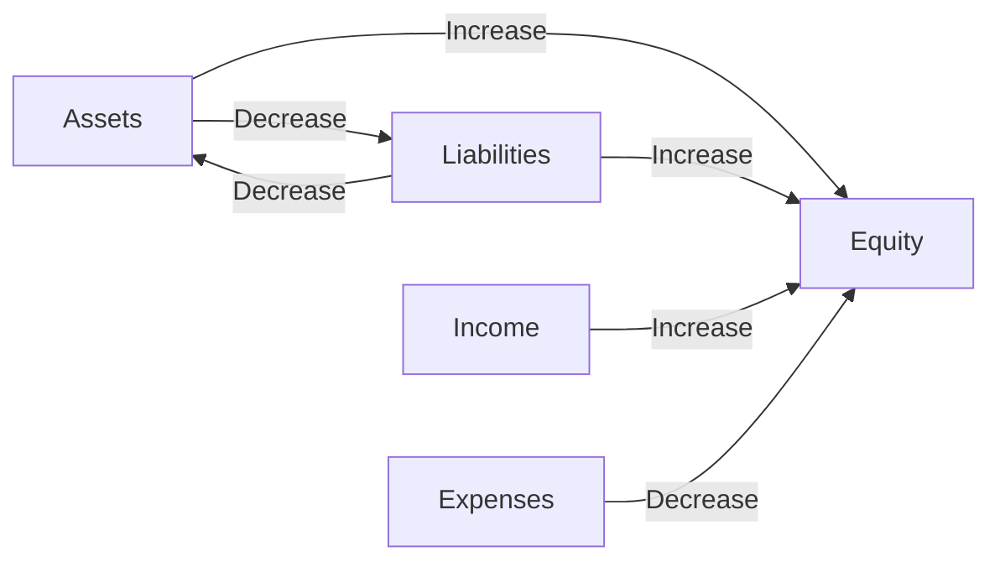

## 2.3 Elements of Financial Statements

In the realm of accounting, financial statements serve as the cornerstone for conveying the financial health and performance of an entity. Understanding the elements of financial statements is crucial for anyone preparing for Canadian accounting exams, as these elements form the basis for financial reporting and analysis. This section delves into the five fundamental elements of financial statements as defined by the conceptual framework: assets, liabilities, equity, income, and expenses. Each element is explored in detail, providing you with the knowledge necessary to excel in your exams and professional practice.

### **Assets**

#### **Definition and Characteristics**

Assets are resources controlled by an entity as a result of past events and from which future economic benefits are expected to flow to the entity. The key characteristics of assets include:

- **Control:** The entity must have control over the asset, meaning it can direct the use of the asset and obtain the benefits from it.
- **Past Event:** The asset must have arisen from a past transaction or event.
- **Future Economic Benefits:** The asset is expected to provide future economic benefits, such as cash inflows or reduced cash outflows.

#### **Types of Assets**

Assets can be classified into various categories, including:

- **Current Assets:** These are assets expected to be realized or consumed within one year or the operating cycle, whichever is longer. Examples include cash, accounts receivable, and inventory.
- **Non-Current Assets:** These are assets that are not expected to be realized within one year. They include property, plant, and equipment (PPE), intangible assets, and long-term investments.

#### **Recognition and Measurement**

Assets are recognized in the financial statements when it is probable that future economic benefits will flow to the entity and the asset has a cost or value that can be measured reliably. Measurement bases for assets include historical cost, fair value, and value in use.

#### **Example**

Consider a company that purchases a piece of machinery for $100,000. This machinery is an asset because the company controls it, it was acquired through a past transaction, and it is expected to generate future economic benefits by producing goods for sale.

### **Liabilities**

#### **Definition and Characteristics**

Liabilities are present obligations of an entity arising from past events, the settlement of which is expected to result in an outflow of resources embodying economic benefits. The characteristics of liabilities include:

- **Present Obligation:** The entity has a current responsibility to transfer resources to another party.
- **Past Event:** The obligation arises from a past transaction or event.
- **Outflow of Resources:** The settlement of the liability will result in an outflow of resources, such as cash or other assets.

#### **Types of Liabilities**

Liabilities can be categorized into:

- **Current Liabilities:** Obligations expected to be settled within one year or the operating cycle, whichever is longer. Examples include accounts payable, short-term debt, and accrued liabilities.
- **Non-Current Liabilities:** Obligations not expected to be settled within one year. These include long-term debt, deferred tax liabilities, and pension obligations.

#### **Recognition and Measurement**

Liabilities are recognized when it is probable that an outflow of resources will be required to settle the obligation and the amount of the obligation can be measured reliably. Measurement bases for liabilities include historical cost, fair value, and present value.

#### **Example**

A company issues a $50,000 bond payable in five years. This bond is a liability because it represents a present obligation to pay cash in the future, arising from the past event of issuing the bond.

### **Equity**

#### **Definition and Characteristics**

Equity represents the residual interest in the assets of an entity after deducting liabilities. It is essentially the ownership interest in the entity and is calculated as:

 \text{Equity} = \text{Assets} - \text{Liabilities} 

#### **Components of Equity**

Equity can be broken down into several components, including:

- **Share Capital:** The amount invested by shareholders in exchange for shares of the company.
- **Retained Earnings:** The accumulated profits of the company that have not been distributed to shareholders as dividends.
- **Other Reserves:** This may include revaluation surplus, foreign currency translation reserve, and other comprehensive income.

#### **Recognition and Measurement**

Equity is recognized in the financial statements based on the recognition and measurement of assets and liabilities. Changes in equity arise from transactions with owners, such as issuing shares or paying dividends, and from comprehensive income.

#### **Example**

If a company has assets worth $500,000 and liabilities of $300,000, its equity would be $200,000. This equity represents the shareholders' claim on the company's net assets.

### **Income**

#### **Definition and Characteristics**

Income is defined as increases in economic benefits during the accounting period in the form of inflows or enhancements of assets or decreases in liabilities that result in increases in equity, other than those relating to contributions from equity participants.

#### **Types of Income**

Income can be classified into:

- **Revenue:** Income arising in the course of the ordinary activities of an entity, such as sales revenue, service revenue, and interest income.
- **Gains:** Other items that meet the definition of income and may or may not arise in the course of the ordinary activities of an entity, such as gains from the sale of non-current assets.

#### **Recognition and Measurement**

Income is recognized when it is probable that future economic benefits will flow to the entity and these benefits can be measured reliably. Revenue recognition criteria are often detailed in specific accounting standards, such as IFRS 15.

#### **Example**

A company sells goods worth $10,000. This sale is recognized as revenue because it results in an inflow of economic benefits (cash or receivables) and increases equity.

### **Expenses**

#### **Definition and Characteristics**

Expenses are decreases in economic benefits during the accounting period in the form of outflows or depletions of assets or incurrences of liabilities that result in decreases in equity, other than those relating to distributions to equity participants.

#### **Types of Expenses**

Expenses can be categorized into:

- **Operating Expenses:** Costs incurred in the ordinary course of business, such as cost of goods sold, salaries, and rent.
- **Non-Operating Expenses:** Costs not directly related to the core operations, such as interest expense and losses from asset disposals.

#### **Recognition and Measurement**

Expenses are recognized when it is probable that an outflow of resources embodying economic benefits will result from the settlement of a present obligation and the amount can be measured reliably. The matching principle is often applied, where expenses are matched with the revenues they help generate.

#### **Example**

A company incurs $5,000 in rent expenses for its office space. This expense is recognized because it results in an outflow of economic benefits (cash) and decreases equity.

### **Interrelationships Among Elements**

The elements of financial statements are interrelated, and understanding these relationships is crucial for financial analysis and reporting. For instance:

- **Assets and Liabilities:** The balance between assets and liabilities determines the equity of an entity.
- **Income and Expenses:** The difference between income and expenses results in profit or loss, which affects retained earnings and, consequently, equity.

The following diagram illustrates the basic interrelationships among the elements of financial statements:

### **Practical Applications and Case Studies**

#### **Case Study: Retail Company**

Consider a retail company that reports the following elements in its financial statements:

- **Assets:** $1,000,000, including inventory, cash, and property.
- **Liabilities:** $600,000, including accounts payable and long-term debt.
- **Equity:** $400,000, comprising share capital and retained earnings.
- **Income:** $500,000 from sales revenue.
- **Expenses:** $450,000, including cost of goods sold and operating expenses.

The company's profit for the period is $50,000, calculated as income minus expenses. This profit increases retained earnings and, consequently, equity.

#### **Regulatory Considerations**

In Canada, financial statements must comply with the International Financial Reporting Standards (IFRS) as adopted by the Canadian Accounting Standards Board (AcSB). The elements of financial statements are defined and governed by the IFRS Conceptual Framework, which provides guidance on recognition, measurement, and presentation.

### **Common Pitfalls and Exam Tips**

- **Misclassification:** Ensure that you correctly classify elements as assets, liabilities, equity, income, or expenses. Misclassification can lead to incorrect financial analysis and reporting.
- **Recognition Criteria:** Pay close attention to the recognition criteria for each element. Understanding when and how to recognize elements is crucial for accurate financial reporting.
- **Measurement Bases:** Be familiar with different measurement bases, such as historical cost and fair value, and understand their implications for financial statements.

### **Conclusion**

The elements of financial statements are foundational to accounting and financial reporting. A thorough understanding of assets, liabilities, equity, income, and expenses is essential for anyone preparing for Canadian accounting exams. By mastering these elements, you will be well-equipped to analyze financial statements, make informed business decisions, and excel in your accounting career.

## **Ready to Test Your Knowledge?**



### What is the primary characteristic of an asset?

- [x] Control over the resource
- [ ] Obligation to transfer resources
- [ ] Increase in equity
- [ ] Decrease in liabilities

> **Explanation:** An asset is characterized by control over the resource, which allows the entity to direct its use and obtain future economic benefits.

### Which of the following is a current liability?

- [x] Accounts payable
- [ ] Long-term debt
- [ ] Property, plant, and equipment
- [ ] Retained earnings

> **Explanation:** Accounts payable is a current liability because it is expected to be settled within one year or the operating cycle.

### How is equity calculated?

- [x] Assets minus liabilities
- [ ] Income minus expenses
- [ ] Liabilities plus expenses
- [ ] Assets plus income

> **Explanation:** Equity is calculated as the residual interest in the assets of an entity after deducting liabilities, i.e., assets minus liabilities.

### What is the recognition criterion for income?

- [x] Probable future economic benefits
- [ ] Obligation to transfer resources
- [ ] Decrease in equity
- [ ] Control over the resource

> **Explanation:** Income is recognized when it is probable that future economic benefits will flow to the entity and can be measured reliably.

### Which of the following is an example of a non-operating expense?

- [x] Interest expense
- [ ] Cost of goods sold
- [ ] Salaries
- [ ] Rent

> **Explanation:** Interest expense is a non-operating expense as it is not directly related to the core operations of the business.

### What does the matching principle relate to?

- [x] Matching expenses with revenues
- [ ] Recognizing assets when probable
- [ ] Measuring liabilities at fair value
- [ ] Calculating equity as assets minus liabilities

> **Explanation:** The matching principle involves recognizing expenses in the same period as the revenues they help generate.

### Which element of financial statements represents the ownership interest?

- [x] Equity
- [ ] Assets
- [ ] Liabilities
- [ ] Income

> **Explanation:** Equity represents the ownership interest in the entity, calculated as assets minus liabilities.

### What is the primary purpose of income?

- [x] To increase equity
- [ ] To decrease liabilities
- [ ] To control resources
- [ ] To settle obligations

> **Explanation:** Income increases equity by providing inflows or enhancements of assets or decreases in liabilities.

### Which of the following is a characteristic of liabilities?

- [x] Present obligation
- [ ] Control over resources
- [ ] Increase in equity
- [ ] Future economic benefits

> **Explanation:** Liabilities are characterized by a present obligation to transfer resources to another party.

### True or False: Expenses result in an increase in equity.

- [ ] True
- [x] False

> **Explanation:** Expenses result in a decrease in equity as they represent outflows or depletions of assets or incurrences of liabilities.


