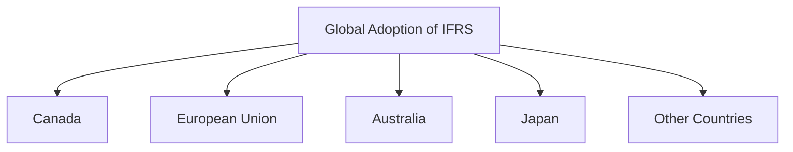
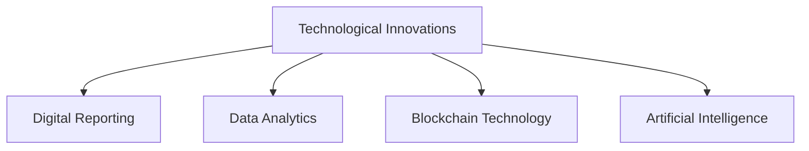

## 3.8 Impact of Political and Economic Factors

In the realm of accounting, political and economic factors play a pivotal role in shaping the standards and regulations that govern financial reporting. Understanding these influences is crucial for accounting professionals, as they navigate the complexities of compliance and ethical reporting. This section delves into the intricate relationship between accounting standards and the political and economic environment, providing insights into how these external factors influence the development and implementation of accounting regulations.

### **Political Factors Influencing Accounting Standards**

Political factors encompass the actions and policies of governments and regulatory bodies that impact accounting standards. These factors can include legislative changes, government interventions, and the influence of political ideologies on financial reporting practices.

#### **1. Government Legislation and Regulation**

Governments play a significant role in establishing the legal framework within which accounting standards operate. Legislative changes can directly affect accounting practices by introducing new regulations or amending existing ones. For instance, the adoption of the International Financial Reporting Standards (IFRS) in Canada was influenced by governmental decisions to align with global accounting practices, enhancing transparency and comparability.

**Example:** The Sarbanes-Oxley Act of 2002 in the United States, enacted in response to corporate scandals, introduced stringent regulations on financial reporting and auditing. Although a U.S. law, its implications were felt globally, influencing Canadian companies listed on U.S. exchanges to comply with its provisions.

#### **2. Influence of Regulatory Bodies**

Regulatory bodies, such as the International Accounting Standards Board (IASB) and the Financial Accounting Standards Board (FASB), are instrumental in developing accounting standards. These organizations operate within a political framework, often balancing the interests of various stakeholders, including governments, corporations, and investors.

**Case Study:** The convergence of IFRS and Generally Accepted Accounting Principles (GAAP) is a prime example of regulatory bodies working towards harmonization. Political pressures and lobbying from different interest groups can affect the pace and direction of this convergence, highlighting the political nature of standard-setting.

#### **3. Political Ideologies and Economic Policies**

Political ideologies and economic policies can shape the priorities and focus of accounting standards. For example, a government with a strong emphasis on environmental sustainability may push for enhanced sustainability reporting standards. Similarly, economic policies aimed at stimulating growth can influence tax regulations and financial reporting requirements.

**Scenario:** In Canada, the federal government's focus on environmental sustainability has led to increased emphasis on sustainability reporting, encouraging companies to disclose their environmental impact and carbon footprint.

### **Economic Factors Influencing Accounting Standards**

Economic factors refer to the broader economic environment that impacts accounting standards. These include economic cycles, globalization, and technological advancements, each playing a role in shaping the regulatory landscape.

#### **1. Economic Cycles and Financial Reporting**

Economic cycles, characterized by periods of growth and recession, can significantly influence accounting standards. During economic downturns, there may be increased scrutiny on financial reporting practices to ensure transparency and prevent financial misstatements.

**Example:** The global financial crisis of 2008 prompted a reevaluation of fair value accounting standards, as the volatility in financial markets raised concerns about the reliability of fair value measurements.

#### **2. Globalization and Harmonization of Standards**

Globalization has led to increased cross-border transactions and multinational operations, necessitating the harmonization of accounting standards. The adoption of IFRS by many countries, including Canada, reflects the need for a common financial reporting language to facilitate international trade and investment.

**Diagram: Global Adoption of IFRS**

#### **3. Technological Advancements and Digital Reporting**

Technological advancements have transformed the accounting landscape, introducing new challenges and opportunities for financial reporting. The rise of digital reporting and data analytics has influenced the development of accounting standards, emphasizing the need for real-time reporting and enhanced data transparency.

**Scenario:** The integration of blockchain technology in accounting systems offers the potential for increased accuracy and transparency in financial reporting, prompting discussions on the need for new standards to address these technological changes.

### **Interplay Between Political and Economic Factors**

The interplay between political and economic factors creates a dynamic environment for accounting standards. Political decisions can influence economic policies, and vice versa, creating a complex web of factors that accounting professionals must navigate.

#### **1. Lobbying and Interest Groups**

Lobbying by interest groups, including corporations, industry associations, and professional bodies, can significantly impact the development of accounting standards. These groups often seek to influence political decisions to align standards with their interests, highlighting the political nature of standard-setting.

**Example:** The oil and gas industry in Canada has been active in lobbying for accounting standards that consider the unique challenges and risks associated with resource extraction, influencing the development of industry-specific reporting guidelines.

#### **2. Economic Crises and Regulatory Responses**

Economic crises often lead to regulatory responses aimed at restoring confidence in financial markets. These responses can include the introduction of new accounting standards or amendments to existing ones, reflecting the need for enhanced transparency and accountability.

**Case Study:** The aftermath of the 2008 financial crisis saw significant changes in accounting standards, including the introduction of new disclosure requirements for financial instruments and increased emphasis on risk management practices.

### **Challenges and Opportunities in the Canadian Context**

In Canada, the impact of political and economic factors on accounting standards presents both challenges and opportunities for accounting professionals. Understanding these influences is crucial for navigating the complexities of the regulatory environment and ensuring compliance with evolving standards.

#### **1. Balancing National and International Standards**

Canada's adoption of IFRS reflects its commitment to aligning with international standards. However, balancing national interests with international requirements can be challenging, particularly when political and economic factors diverge.

**Scenario:** Canadian companies operating in industries with unique national characteristics, such as natural resources, may face challenges in applying international standards that do not fully address industry-specific issues.

#### **2. Adapting to Economic Changes**

Economic changes, such as shifts in commodity prices or fluctuations in exchange rates, can impact financial reporting practices in Canada. Accounting professionals must be adept at adapting to these changes, ensuring that financial statements accurately reflect the economic realities of the business environment.

**Example:** The volatility in oil prices has significant implications for financial reporting in Canada's energy sector, affecting asset valuations and impairment testing.

#### **3. Embracing Technological Innovations**

Technological innovations present opportunities for enhancing financial reporting practices in Canada. Embracing these innovations, such as digital reporting and data analytics, can improve the accuracy and timeliness of financial information, providing valuable insights for decision-making.

**Diagram: Technological Innovations in Accounting**

### **Conclusion**

The impact of political and economic factors on accounting standards is profound and multifaceted. Understanding these influences is essential for accounting professionals, as they navigate the complexities of financial reporting and compliance. By staying informed about political and economic developments, accounting professionals can better anticipate changes in the regulatory environment and adapt their practices accordingly.

### **Practical Tips for Exam Preparation**

- **Stay Updated:** Keep abreast of current political and economic developments that may impact accounting standards.
- **Understand the Interplay:** Recognize the dynamic relationship between political decisions and economic policies in shaping accounting regulations.
- **Focus on Canadian Context:** Pay attention to how political and economic factors specifically affect accounting standards in Canada.
- **Practice Application:** Use real-world scenarios to practice applying accounting standards in the context of political and economic influences.

## **Ready to Test Your Knowledge?**



### How do political factors influence accounting standards?

- [x] Through government legislation and regulation
- [ ] By technological advancements
- [ ] Through economic cycles
- [ ] By globalization

> **Explanation:** Political factors influence accounting standards primarily through government legislation and regulation, which establish the legal framework for financial reporting.

### What role do regulatory bodies play in accounting standards?

- [x] They develop and enforce accounting standards
- [ ] They create economic cycles
- [ ] They influence technological advancements
- [ ] They determine exchange rates

> **Explanation:** Regulatory bodies like the IASB and FASB are responsible for developing and enforcing accounting standards, operating within a political framework.

### How does globalization affect accounting standards?

- [x] It necessitates the harmonization of standards
- [ ] It reduces the need for international standards
- [ ] It limits cross-border transactions
- [ ] It decreases the complexity of financial reporting

> **Explanation:** Globalization increases cross-border transactions, necessitating the harmonization of accounting standards to facilitate international trade and investment.

### What impact do economic cycles have on financial reporting?

- [x] They influence the scrutiny and transparency of financial reporting
- [ ] They simplify accounting standards
- [ ] They eliminate the need for regulatory bodies
- [ ] They stabilize financial markets

> **Explanation:** Economic cycles, especially downturns, increase scrutiny on financial reporting practices to ensure transparency and prevent financial misstatements.

### How do technological advancements influence accounting standards?

- [x] By introducing new challenges and opportunities for reporting
- [ ] By stabilizing economic cycles
- [x] By enhancing data transparency
- [ ] By reducing the need for regulatory bodies

> **Explanation:** Technological advancements introduce new challenges and opportunities for financial reporting, emphasizing the need for real-time reporting and enhanced data transparency.

### What is the impact of lobbying on accounting standards?

- [x] It can influence the development of standards
- [ ] It eliminates political factors
- [ ] It reduces economic cycles
- [ ] It simplifies financial reporting

> **Explanation:** Lobbying by interest groups can significantly impact the development of accounting standards, as these groups seek to align standards with their interests.

### How do economic crises affect accounting standards?

- [x] They often lead to regulatory responses and changes in standards
- [ ] They stabilize financial markets
- [x] They enhance transparency and accountability
- [ ] They reduce the need for financial reporting

> **Explanation:** Economic crises often lead to regulatory responses, including the introduction of new accounting standards or amendments to existing ones, to enhance transparency and accountability.

### What challenges do Canadian companies face in balancing national and international standards?

- [x] Balancing national interests with international requirements
- [ ] Eliminating political factors
- [ ] Reducing economic cycles
- [ ] Simplifying financial reporting

> **Explanation:** Canadian companies face challenges in balancing national interests with international requirements, particularly when political and economic factors diverge.

### How do economic changes impact financial reporting in Canada?

- [x] They affect asset valuations and impairment testing
- [ ] They stabilize exchange rates
- [ ] They reduce the need for financial reporting
- [ ] They simplify accounting standards

> **Explanation:** Economic changes, such as shifts in commodity prices or exchange rates, can impact financial reporting practices in Canada, affecting asset valuations and impairment testing.

### True or False: Technological innovations present opportunities for enhancing financial reporting practices.

- [x] True
- [ ] False

> **Explanation:** Technological innovations, such as digital reporting and data analytics, present opportunities for enhancing financial reporting practices by improving accuracy and timeliness.


