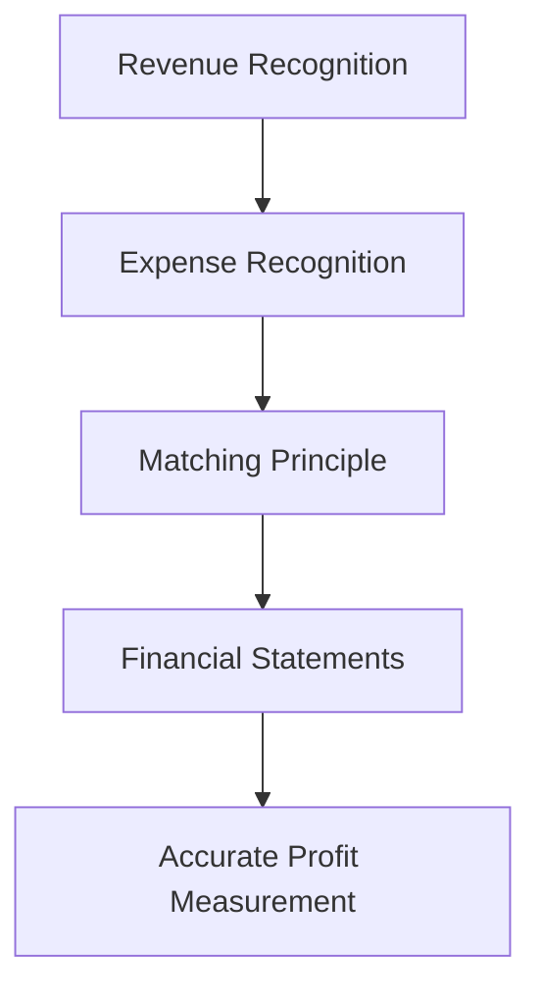

## 4.4 Expense Recognition and Matching Principle

Expense recognition and the matching principle are foundational concepts in accounting that ensure financial statements accurately reflect a company's financial performance. These principles are crucial for maintaining the integrity and comparability of financial information, which is essential for stakeholders such as investors, creditors, and regulatory bodies. This section delves into the intricacies of expense recognition and the matching principle, providing insights into their application within the Canadian accounting framework, including International Financial Reporting Standards (IFRS) and Accounting Standards for Private Enterprises (ASPE).

### Understanding Expense Recognition

Expense recognition involves determining when and how expenses should be recorded in the financial statements. The goal is to ensure that expenses are recognized in the same period as the revenues they help generate, providing a clear picture of a company's financial performance.

#### Key Concepts in Expense Recognition

1. **Accrual Basis Accounting**: Under the accrual basis, expenses are recognized when they are incurred, regardless of when cash is paid. This approach contrasts with cash basis accounting, where expenses are recorded only when cash is exchanged.

2. **Matching Principle**: This principle dictates that expenses should be matched with the revenues they help generate. For example, the cost of goods sold is matched with the revenue from the sale of those goods.

3. **Period Costs vs. Product Costs**: Expenses can be classified as period costs, which are expensed in the period incurred (e.g., administrative salaries), or product costs, which are capitalized as inventory and expensed when the product is sold.

4. **Expense Recognition Criteria**: According to IFRS and ASPE, an expense is recognized when it is probable that an outflow of resources will result in a decrease in economic benefits and the amount can be reliably measured.

### The Matching Principle in Detail

The matching principle is a cornerstone of accrual accounting, ensuring that financial statements reflect the true economic activity of a business. It requires that expenses be recorded in the same period as the related revenues, providing a more accurate depiction of profitability.

#### Application of the Matching Principle

- **Cost of Goods Sold (COGS)**: COGS is matched with sales revenue in the period the goods are sold. This ensures that the income statement reflects the cost of producing or purchasing the goods that were sold during the period.

- **Depreciation**: Depreciation expense is matched with the revenue generated by the use of long-term assets. This allocation spreads the cost of an asset over its useful life, aligning with the periods in which the asset contributes to revenue generation.

- **Amortization**: Similar to depreciation, amortization applies to intangible assets. It matches the cost of an intangible asset with the revenue it helps generate over its useful life.

- **Prepaid Expenses**: Prepaid expenses, such as insurance or rent, are initially recorded as assets and expensed over the period they benefit. This ensures that expenses are matched with the periods they relate to.

- **Accrued Liabilities**: Expenses incurred but not yet paid are recorded as accrued liabilities. This ensures that expenses are recognized in the period they are incurred, aligning with the matching principle.

### Practical Examples and Case Studies

#### Example 1: Matching Principle in Action

Consider a manufacturing company that incurs $100,000 in production costs in January for goods sold in February. Under the matching principle, these costs are recorded as COGS in February, when the related revenue is recognized, rather than in January when the costs were incurred.

#### Example 2: Depreciation and Revenue Matching

A company purchases machinery for $50,000 with a useful life of 10 years. The machinery is expected to generate revenue over its useful life. Using straight-line depreciation, the company records $5,000 as depreciation expense each year, matching the expense with the revenue generated by the machinery.

#### Case Study: Prepaid Insurance

A business pays $12,000 for a one-year insurance policy on January 1. The prepaid insurance is initially recorded as an asset. Each month, $1,000 is expensed, matching the insurance cost with the monthly periods it covers.

### Real-World Applications and Regulatory Scenarios

#### Canadian Accounting Standards

In Canada, the matching principle is embedded in both IFRS and ASPE. These standards provide guidelines for expense recognition, ensuring consistency and comparability across financial statements.

- **IFRS**: Under IFRS, the matching principle is integral to the conceptual framework, emphasizing the importance of recognizing expenses in the period they contribute to revenue generation.

- **ASPE**: For private enterprises, ASPE provides similar guidance, ensuring that financial statements reflect the economic reality of transactions.

#### Regulatory Considerations

Canadian regulatory bodies, such as the Canadian Securities Administrators (CSA), emphasize the importance of accurate financial reporting. Adherence to the matching principle ensures compliance with regulatory requirements and enhances the credibility of financial statements.

### Challenges and Best Practices

#### Common Challenges

- **Estimating Useful Lives**: Determining the useful life of assets for depreciation can be challenging, impacting the accuracy of expense recognition.

- **Judgment in Expense Allocation**: Allocating expenses to the correct period requires professional judgment, which can vary among accountants.

- **Complex Transactions**: Complex transactions, such as multi-element arrangements, can complicate the application of the matching principle.

#### Best Practices

- **Consistent Policies**: Establishing consistent policies for expense recognition ensures uniformity and comparability across financial periods.

- **Regular Reviews**: Regularly reviewing asset useful lives and expense allocation methods enhances accuracy and compliance.

- **Professional Judgment**: Leveraging professional judgment and consulting with experts can aid in complex scenarios, ensuring adherence to the matching principle.

### Diagrams and Visual Aids

To enhance understanding, consider the following diagram illustrating the matching principle in action:

### Summary and Key Takeaways

- **Expense Recognition**: Recognizing expenses in the period they are incurred ensures accurate financial reporting.

- **Matching Principle**: Aligning expenses with related revenues provides a true representation of financial performance.

- **Canadian Standards**: Adherence to IFRS and ASPE ensures compliance and consistency in financial reporting.

- **Challenges and Best Practices**: Understanding common challenges and implementing best practices enhances the accuracy and reliability of financial statements.

### References and Further Reading

- **International Financial Reporting Standards (IFRS)**: Explore the IFRS framework for detailed guidance on expense recognition.

- **Accounting Standards for Private Enterprises (ASPE)**: Review ASPE guidelines for expense recognition in private enterprises.

- **CPA Canada**: Access resources and publications from CPA Canada for further insights into Canadian accounting standards.

- **Canadian Securities Administrators (CSA)**: Understand regulatory requirements and their impact on financial reporting.

## **Ready to Test Your Knowledge?**



### Which accounting principle ensures that expenses are recorded in the same period as the revenues they help generate?

- [x] Matching Principle
- [ ] Revenue Recognition Principle
- [ ] Historical Cost Principle
- [ ] Full Disclosure Principle

> **Explanation:** The matching principle ensures that expenses are recorded in the same period as the revenues they help generate, providing an accurate depiction of profitability.

### Under which accounting basis are expenses recognized when they are incurred, regardless of when cash is paid?

- [x] Accrual Basis
- [ ] Cash Basis
- [ ] Modified Cash Basis
- [ ] Tax Basis

> **Explanation:** Under the accrual basis of accounting, expenses are recognized when they are incurred, regardless of when cash is paid.

### What is the primary purpose of the matching principle?

- [x] To align expenses with related revenues
- [ ] To ensure expenses are recorded when cash is paid
- [ ] To provide a comprehensive list of all expenses
- [ ] To allocate expenses evenly across periods

> **Explanation:** The primary purpose of the matching principle is to align expenses with the revenues they help generate, ensuring accurate financial reporting.

### Which of the following is an example of matching expenses with revenues?

- [x] Recording depreciation expense over the useful life of an asset
- [ ] Recording all expenses at the end of the fiscal year
- [ ] Recognizing revenue when cash is received
- [ ] Allocating expenses based on management discretion

> **Explanation:** Recording depreciation expense over the useful life of an asset is an example of matching expenses with the revenue generated by the asset.

### How are prepaid expenses initially recorded in the financial statements?

- [x] As an asset
- [ ] As a liability
- [ ] As an expense
- [ ] As equity

> **Explanation:** Prepaid expenses are initially recorded as an asset and expensed over the period they benefit.

### Which Canadian accounting standard emphasizes the importance of the matching principle?

- [x] IFRS
- [ ] GAAP
- [ ] AICPA
- [ ] PCAOB

> **Explanation:** The matching principle is emphasized in the International Financial Reporting Standards (IFRS), which are used in Canada.

### What is the impact of not applying the matching principle correctly?

- [x] Misstated financial performance
- [ ] Increased cash flow
- [ ] Improved asset valuation
- [ ] Enhanced revenue recognition

> **Explanation:** Not applying the matching principle correctly can result in misstated financial performance, affecting the accuracy of financial statements.

### What is the role of professional judgment in expense recognition?

- [x] To allocate expenses to the correct period
- [ ] To determine cash flow timing
- [ ] To enhance revenue recognition
- [ ] To improve asset valuation

> **Explanation:** Professional judgment is crucial in allocating expenses to the correct period, ensuring adherence to the matching principle.

### Which of the following is a challenge in applying the matching principle?

- [x] Estimating useful lives of assets
- [ ] Recording cash transactions
- [ ] Determining tax liabilities
- [ ] Allocating equity

> **Explanation:** Estimating the useful lives of assets is a challenge in applying the matching principle, impacting the accuracy of expense recognition.

### True or False: The matching principle is only applicable to large corporations.

- [ ] True
- [x] False

> **Explanation:** False. The matching principle is applicable to all entities, regardless of size, to ensure accurate financial reporting.


