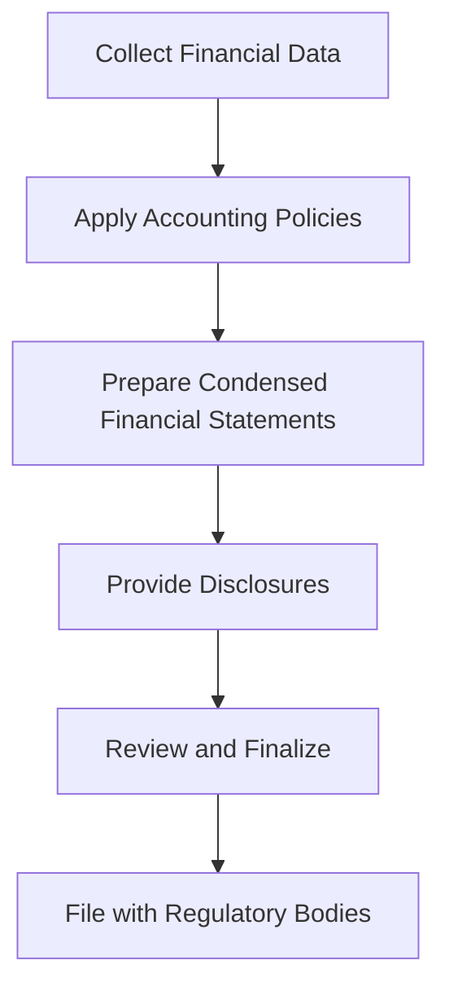

## 5.10 Interim Financial Reporting

Interim financial reporting is a crucial aspect of financial disclosure that provides stakeholders with timely and relevant information about a company's financial performance and position during a fiscal year. This section delves into the principles, standards, and practices of interim financial reporting, particularly within the Canadian context, aligning with the International Financial Reporting Standards (IFRS) and Accounting Standards for Private Enterprises (ASPE).

### Understanding Interim Financial Reporting

Interim financial reporting refers to the preparation and presentation of financial statements for periods shorter than a full fiscal year, typically on a quarterly or semi-annual basis. These reports are essential for providing timely insights into a company's financial health, enabling investors, regulators, and other stakeholders to make informed decisions.

#### Objectives of Interim Financial Reporting

1. **Timeliness**: To provide timely information that reflects the company's current financial status and performance.
2. **Comparability**: To ensure consistency and comparability with previous interim periods and annual financial statements.
3. **Transparency**: To enhance transparency and accountability in financial reporting.
4. **Decision-Making**: To aid stakeholders in making informed economic decisions based on the most recent financial data.

### Regulatory Framework for Interim Financial Reporting

In Canada, interim financial reporting is governed by both IFRS and ASPE, depending on whether the entity is publicly accountable or a private enterprise.

#### International Financial Reporting Standards (IFRS)

For publicly accountable enterprises, IFRS provides the framework for interim financial reporting. The primary standard is IAS 34, "Interim Financial Reporting," which outlines the minimum content required and the principles for recognition and measurement.

##### Key Aspects of IAS 34

- **Content of Interim Financial Reports**: IAS 34 requires a condensed set of financial statements, including a condensed statement of financial position, a condensed statement of profit or loss and other comprehensive income, a condensed statement of changes in equity, and a condensed statement of cash flows.
- **Disclosure Requirements**: The standard mandates disclosures that provide an explanation of events and transactions significant to understanding the changes in financial position and performance since the last annual reporting date.
- **Recognition and Measurement**: Interim financial reports should apply the same accounting policies as in the annual financial statements, ensuring consistency and comparability.

#### Accounting Standards for Private Enterprises (ASPE)

For private enterprises in Canada, ASPE Section 1701, "Interim Financial Statements," provides guidance on interim reporting. While not as prescriptive as IFRS, ASPE emphasizes the importance of consistency with annual financial statements and requires disclosures that are necessary to understand the interim results.

### Practical Considerations in Interim Financial Reporting

#### Challenges and Solutions

1. **Revenue Recognition**: Determining the appropriate timing and amount of revenue to recognize can be complex, especially with contracts that span multiple periods. Companies must ensure compliance with IFRS 15 or ASPE Section 3400.
   
2. **Expense Allocation**: Allocating expenses accurately across interim periods is crucial for reflecting true performance. This includes considerations for seasonal variations and one-time costs.

3. **Taxation**: Interim tax expense should be based on the estimated annual effective tax rate, which requires careful estimation and adjustment as the year progresses.

4. **Inventory Valuation**: Companies must assess inventory for obsolescence and adjust valuations as necessary, which can impact interim results significantly.

#### Best Practices

- **Consistent Policies**: Maintain consistency in accounting policies between interim and annual reports to ensure comparability.
- **Comprehensive Disclosures**: Provide detailed disclosures that explain significant changes and events affecting financial performance.
- **Regular Updates**: Continuously update estimates and assumptions to reflect current conditions and expectations.

### Case Studies and Examples

#### Example 1: Revenue Recognition in a Software Company

A Canadian software company recognizes revenue from subscription services. During the interim period, the company launches a new service, leading to a spike in subscriptions. The company must ensure that revenue is recognized over the service period, following IFRS 15 guidelines, and disclose the impact of the new service on interim results.

#### Example 2: Seasonal Business Impact

A retail company experiences significant seasonal variations, with higher sales during the holiday season. In its interim financial report, the company uses historical data to allocate marketing and inventory costs appropriately, ensuring that interim results reflect the seasonal nature of its business.

### Real-World Applications and Compliance

#### Regulatory Scenarios

- **Public Companies**: Must adhere to IFRS and provide interim reports that meet the requirements of securities regulators, such as the Canadian Securities Administrators (CSA).
- **Private Companies**: While not required to follow IFRS, private companies should ensure that interim reports provide sufficient information for stakeholders, aligning with ASPE guidelines.

#### Compliance Considerations

- **Audit and Review**: While interim reports are not typically audited, companies may engage auditors for a review to enhance credibility and reliability.
- **Regulatory Filings**: Public companies must file interim reports with regulatory bodies, ensuring compliance with filing deadlines and disclosure requirements.

### Step-by-Step Guidance for Preparing Interim Financial Reports

1. **Gather Financial Data**: Collect all relevant financial data for the interim period, ensuring completeness and accuracy.
2. **Apply Consistent Accounting Policies**: Use the same accounting policies as the annual financial statements, adjusting for any changes in standards or regulations.
3. **Prepare Condensed Financial Statements**: Create condensed versions of the statement of financial position, statement of profit or loss, statement of changes in equity, and statement of cash flows.
4. **Provide Detailed Disclosures**: Include disclosures that explain significant changes and events, ensuring stakeholders understand the interim results.
5. **Review and Finalize**: Conduct a thorough review of the interim report, engaging auditors if necessary, before finalizing and filing with regulatory bodies.

### Diagrams and Visual Aids

To enhance understanding, consider the following diagram illustrating the flow of interim financial reporting:

### Common Pitfalls and Strategies

#### Pitfalls

- **Inconsistent Policies**: Using different accounting policies for interim and annual reports can lead to discrepancies and confusion.
- **Inadequate Disclosures**: Failing to provide sufficient disclosures can result in misunderstandings and regulatory issues.
- **Poor Estimation**: Inaccurate estimates for taxes, inventory, and other items can distort interim results.

#### Strategies

- **Regular Training**: Ensure accounting staff are well-trained in interim reporting standards and practices.
- **Robust Systems**: Implement robust financial systems that facilitate accurate data collection and reporting.
- **Continuous Monitoring**: Regularly monitor financial performance and adjust estimates as necessary.

### Exam Preparation Tips

- **Understand Key Standards**: Focus on IFRS and ASPE standards relevant to interim reporting, particularly IAS 34 and ASPE Section 1701.
- **Practice with Examples**: Work through practical examples and case studies to reinforce understanding.
- **Review Past Exams**: Analyze past exam questions related to interim reporting to identify common themes and areas of focus.

### Summary

Interim financial reporting is a vital component of financial disclosure, providing stakeholders with timely insights into a company's financial performance. By adhering to IFRS and ASPE standards, companies can ensure that interim reports are consistent, comparable, and transparent. Understanding the principles and practices of interim reporting is essential for success in Canadian accounting exams and professional practice.

## **Ready to Test Your Knowledge?**



### What is the primary standard for interim financial reporting under IFRS?

- [x] IAS 34
- [ ] IFRS 15
- [ ] IAS 1
- [ ] IFRS 9

> **Explanation:** IAS 34 is the primary standard for interim financial reporting under IFRS, outlining the minimum content and principles for recognition and measurement.

### Which of the following is a key objective of interim financial reporting?

- [x] Timeliness
- [ ] Profit Maximization
- [ ] Tax Reduction
- [ ] Cost Minimization

> **Explanation:** Timeliness is a key objective of interim financial reporting, ensuring that stakeholders receive current and relevant financial information.

### What type of financial statements are typically included in interim reports?

- [x] Condensed financial statements
- [ ] Full financial statements
- [ ] Pro forma financial statements
- [ ] Unaudited financial statements

> **Explanation:** Interim reports typically include condensed financial statements, which provide a summary of financial position and performance.

### Under ASPE, which section provides guidance on interim financial reporting?

- [x] Section 1701
- [ ] Section 3400
- [ ] Section 1500
- [ ] Section 3856

> **Explanation:** ASPE Section 1701 provides guidance on interim financial reporting for private enterprises in Canada.

### Which of the following is a common challenge in interim financial reporting?

- [x] Revenue recognition
- [ ] Asset acquisition
- [ ] Debt issuance
- [ ] Equity financing

> **Explanation:** Revenue recognition is a common challenge in interim financial reporting, requiring careful consideration of timing and amount.

### What is the purpose of providing disclosures in interim financial reports?

- [x] To explain significant changes and events
- [ ] To reduce tax liabilities
- [ ] To increase company valuation
- [ ] To comply with labor laws

> **Explanation:** Disclosures in interim financial reports explain significant changes and events, helping stakeholders understand the interim results.

### Which of the following is NOT typically a part of interim financial reports?

- [x] Pro forma financial statements
- [ ] Condensed statement of financial position
- [ ] Condensed statement of profit or loss
- [ ] Condensed statement of cash flows

> **Explanation:** Pro forma financial statements are not typically part of interim financial reports, which include condensed financial statements.

### How should interim tax expense be estimated?

- [x] Based on the estimated annual effective tax rate
- [ ] Using last year's tax rate
- [ ] As a fixed percentage of revenue
- [ ] As a percentage of net income

> **Explanation:** Interim tax expense should be estimated based on the estimated annual effective tax rate, reflecting expected tax liabilities for the year.

### Which regulatory body oversees the filing of interim reports for public companies in Canada?

- [x] Canadian Securities Administrators (CSA)
- [ ] Financial Accounting Standards Board (FASB)
- [ ] International Accounting Standards Board (IASB)
- [ ] Public Company Accounting Oversight Board (PCAOB)

> **Explanation:** The Canadian Securities Administrators (CSA) oversee the filing of interim reports for public companies in Canada.

### True or False: Interim financial reports are typically audited.

- [ ] True
- [x] False

> **Explanation:** Interim financial reports are not typically audited, but companies may engage auditors for a review to enhance credibility.


