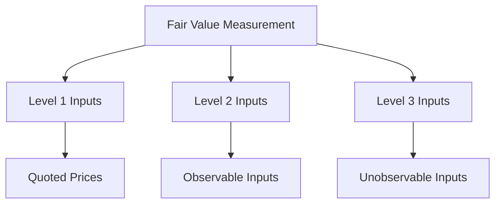

## 5.12 Fair Value Disclosures

Fair value disclosures are a critical component of financial reporting, providing transparency and insight into the valuation of assets and liabilities. This section delves into the requirements and best practices for fair value disclosures, focusing on Canadian accounting standards and global practices. Understanding these disclosures is essential for preparing accurate financial statements and ensuring compliance with regulatory requirements.

### **Introduction to Fair Value Disclosures**

Fair value is a market-based measurement, not an entity-specific measurement. It reflects the price that would be received to sell an asset or paid to transfer a liability in an orderly transaction between market participants at the measurement date. The concept of fair value is integral to financial reporting, as it provides users of financial statements with a more accurate picture of an entity's financial position and performance.

#### **Importance of Fair Value Disclosures**

Fair value disclosures enhance the transparency and comparability of financial statements. They provide stakeholders with vital information about the valuation techniques and inputs used in determining fair value. This information is crucial for investors, analysts, and other users of financial statements to assess the reliability and relevance of the reported values.

### **Regulatory Framework for Fair Value Disclosures**

#### **International Financial Reporting Standards (IFRS)**

Under IFRS, fair value measurement and disclosure requirements are primarily governed by IFRS 13, "Fair Value Measurement." This standard provides a single framework for measuring fair value and requires disclosures about fair value measurements. It applies to both financial and non-financial items measured at fair value.

#### **Generally Accepted Accounting Principles (GAAP)**

In Canada, the Accounting Standards for Private Enterprises (ASPE) and the Public Sector Accounting Standards (PSAS) provide guidance on fair value measurements. While ASPE is more aligned with IFRS, there are differences in the specific disclosure requirements. It's essential for Canadian accountants to understand these nuances to ensure compliance.

### **Key Components of Fair Value Disclosures**

#### **1. Fair Value Hierarchy**

The fair value hierarchy categorizes the inputs used in valuation techniques into three levels:

- **Level 1:** Quoted prices in active markets for identical assets or liabilities.
- **Level 2:** Inputs other than quoted prices included in Level 1 that are observable for the asset or liability, either directly or indirectly.
- **Level 3:** Unobservable inputs for the asset or liability.

Understanding the hierarchy is crucial for preparing fair value disclosures, as it affects the level of detail required in the disclosures.

#### **2. Valuation Techniques**

Entities must disclose the valuation techniques used to measure fair value. Common techniques include the market approach, income approach, and cost approach. Each technique has its own set of assumptions and inputs, which must be disclosed to provide transparency to users of financial statements.

#### **3. Significant Assumptions and Inputs**

Disclosures must include information about the significant assumptions and inputs used in the valuation process. This includes the rationale for choosing certain inputs and how they impact the fair value measurement. For Level 3 measurements, entities must provide a narrative description of the sensitivity of the fair value measurement to changes in unobservable inputs.

### **Practical Examples and Case Studies**

#### **Example 1: Valuation of Investment Property**

Consider a company that owns an investment property measured at fair value. The property is located in a bustling urban area, and its fair value is determined using the income approach. The company must disclose the following:

- The fair value hierarchy level (e.g., Level 3).
- The valuation technique (income approach).
- Significant inputs (e.g., rental income, discount rate).
- Sensitivity analysis for changes in rental income assumptions.

#### **Example 2: Fair Value of Financial Instruments**

A financial institution holds a portfolio of derivatives measured at fair value. The derivatives are valued using a market approach, with inputs from observable market data. The institution must disclose:

- The fair value hierarchy level (e.g., Level 2).
- The valuation technique (market approach).
- Observable inputs (e.g., interest rates, foreign exchange rates).

### **Challenges in Fair Value Disclosures**

#### **1. Measurement Uncertainty**

Fair value measurements often involve a degree of uncertainty, particularly for Level 3 inputs. Entities must provide disclosures that help users understand the uncertainty and its potential impact on the financial statements.

#### **2. Complexity of Valuation Techniques**

The complexity of certain valuation techniques can make fair value disclosures challenging. Entities must ensure that disclosures are clear and understandable, even when the underlying valuation techniques are complex.

#### **3. Regulatory Compliance**

Staying compliant with evolving regulatory requirements can be challenging. Entities must keep abreast of changes in accounting standards and ensure that their disclosures meet the latest requirements.

### **Best Practices for Fair Value Disclosures**

#### **1. Clear and Concise Disclosures**

Ensure that disclosures are clear, concise, and free of jargon. Use plain language to explain complex valuation techniques and assumptions.

#### **2. Consistency Across Periods**

Maintain consistency in the valuation techniques and inputs used across reporting periods. Any changes should be clearly disclosed and explained.

#### **3. Use of Visual Aids**

Incorporate tables, charts, and diagrams to enhance the clarity of disclosures. Visual aids can help users quickly grasp complex information.

### **Real-World Applications and Regulatory Scenarios**

#### **Case Study: Canadian Real Estate Sector**

In the Canadian real estate sector, fair value disclosures are crucial due to the volatility in property values. Companies must provide detailed disclosures about the valuation techniques and assumptions used, particularly for properties in less active markets.

#### **Regulatory Scenario: Financial Instruments**

For financial institutions, fair value disclosures for financial instruments are subject to stringent regulatory scrutiny. Institutions must ensure that their disclosures are comprehensive and comply with both IFRS and Canadian regulatory requirements.

### **Step-by-Step Guidance for Preparing Fair Value Disclosures**

1. **Identify the Assets and Liabilities Measured at Fair Value**

   Begin by identifying all assets and liabilities measured at fair value in the financial statements.

2. **Determine the Fair Value Hierarchy Level**

   Classify each item into the appropriate level of the fair value hierarchy based on the inputs used in the valuation.

3. **Select the Appropriate Valuation Technique**

   Choose the valuation technique that best reflects the fair value of the asset or liability. Ensure that the technique is consistent with prior periods unless a change is justified.

4. **Gather and Analyze Inputs**

   Collect the necessary inputs for the chosen valuation technique. Analyze the inputs to ensure they are reasonable and reflect current market conditions.

5. **Prepare the Disclosures**

   Draft the disclosures, ensuring they include all required information about the fair value hierarchy, valuation techniques, and significant inputs. Use visual aids to enhance clarity.

6. **Review and Finalize**

   Review the disclosures for accuracy and completeness. Ensure that they comply with the relevant accounting standards and regulatory requirements.

### **Common Pitfalls and Strategies to Overcome Them**

#### **1. Inadequate Disclosure of Assumptions**

   **Pitfall:** Failing to adequately disclose the assumptions used in fair value measurements can lead to a lack of transparency.

   **Strategy:** Provide detailed explanations of the assumptions and their impact on the fair value measurement. Use sensitivity analysis to illustrate the potential effects of changes in assumptions.

#### **2. Inconsistency in Valuation Techniques**

   **Pitfall:** Inconsistencies in the valuation techniques used across periods can confuse users of financial statements.

   **Strategy:** Maintain consistency in valuation techniques and clearly disclose any changes, along with the reasons for those changes.

#### **3. Overly Complex Language**

   **Pitfall:** Using complex language and jargon in disclosures can make them difficult to understand.

   **Strategy:** Use plain language and visual aids to make disclosures accessible to a broad audience.

### **References and Additional Resources**

- **International Financial Reporting Standards (IFRS 13):** Provides comprehensive guidance on fair value measurement and disclosures.
- **CPA Canada:** Offers resources and guidance on fair value disclosures in the Canadian context.
- **Accounting Standards for Private Enterprises (ASPE):** Provides specific guidance for private enterprises in Canada.

### **Conclusion**

Fair value disclosures are a vital aspect of financial reporting, providing transparency and insight into the valuation of assets and liabilities. By understanding the regulatory requirements and best practices for fair value disclosures, accountants can ensure that their financial statements are accurate, reliable, and compliant with the latest standards.

---

## **Ready to Test Your Knowledge?**



### What is the primary purpose of fair value disclosures in financial reporting?

- [x] To provide transparency and insight into the valuation of assets and liabilities
- [ ] To comply with tax regulations
- [ ] To determine the historical cost of assets
- [ ] To assess the liquidity of a company

> **Explanation:** Fair value disclosures are intended to provide transparency and insight into the valuation of assets and liabilities, helping users of financial statements understand the basis of these valuations.

### Which level of the fair value hierarchy involves quoted prices in active markets for identical assets or liabilities?

- [x] Level 1
- [ ] Level 2
- [ ] Level 3
- [ ] Level 4

> **Explanation:** Level 1 of the fair value hierarchy involves quoted prices in active markets for identical assets or liabilities.

### What is a common valuation technique used for fair value measurement?

- [x] Market approach
- [ ] Historical cost approach
- [ ] Depreciation method
- [ ] Amortization technique

> **Explanation:** The market approach is a common valuation technique used for fair value measurement, involving the use of market-based inputs.

### Which of the following is a challenge associated with fair value disclosures?

- [x] Measurement uncertainty
- [ ] Simplicity of valuation techniques
- [ ] Lack of regulatory requirements
- [ ] Consistency across periods

> **Explanation:** Measurement uncertainty is a challenge associated with fair value disclosures, particularly for Level 3 inputs.

### What should entities disclose about the valuation techniques used in fair value measurements?

- [x] The rationale for choosing certain inputs
- [ ] The historical cost of the asset
- [ ] The tax implications
- [ ] The liquidity of the asset

> **Explanation:** Entities should disclose the rationale for choosing certain inputs and how they impact the fair value measurement.

### How can entities enhance the clarity of fair value disclosures?

- [x] Use of visual aids
- [ ] Use of complex language
- [ ] Avoiding sensitivity analysis
- [ ] Limiting disclosure to Level 1 inputs

> **Explanation:** The use of visual aids, such as tables and charts, can enhance the clarity of fair value disclosures.

### What is a best practice for maintaining consistency in fair value disclosures?

- [x] Using the same valuation techniques across periods
- [ ] Changing valuation techniques frequently
- [ ] Avoiding disclosure of significant inputs
- [ ] Limiting disclosures to financial instruments

> **Explanation:** Using the same valuation techniques across periods is a best practice for maintaining consistency in fair value disclosures.

### Which regulatory framework primarily governs fair value measurement under IFRS?

- [x] IFRS 13
- [ ] IFRS 9
- [ ] IFRS 15
- [ ] IFRS 16

> **Explanation:** IFRS 13 primarily governs fair value measurement and disclosure requirements under IFRS.

### What is the role of sensitivity analysis in fair value disclosures?

- [x] To illustrate the potential effects of changes in assumptions
- [ ] To determine the historical cost of assets
- [ ] To assess the liquidity of a company
- [ ] To comply with tax regulations

> **Explanation:** Sensitivity analysis is used in fair value disclosures to illustrate the potential effects of changes in assumptions on the fair value measurement.

### True or False: Fair value disclosures are only required for financial instruments.

- [ ] True
- [x] False

> **Explanation:** False. Fair value disclosures are required for both financial and non-financial items measured at fair value.


