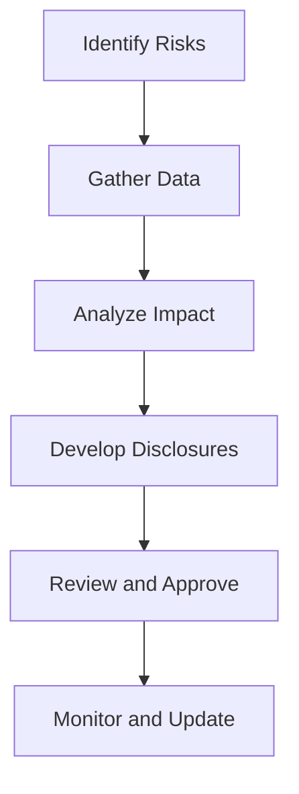

## 5.13 Risks and Uncertainties Disclosure

In the realm of financial reporting, the disclosure of risks and uncertainties is a critical component that provides stakeholders with a comprehensive view of the potential challenges an entity may face. This section delves into the intricacies of risks and uncertainties disclosure, focusing on Canadian accounting standards and practices. It aims to equip you with the knowledge necessary to understand, prepare, and analyze these disclosures, which are vital for informed decision-making.

### Understanding Risks and Uncertainties

**Risks** refer to the potential events or conditions that could negatively impact an entity's financial position or performance. These can arise from various sources, including market fluctuations, regulatory changes, operational challenges, and more. **Uncertainties**, on the other hand, are situations where the outcome is unknown, often due to a lack of information or inherent unpredictability.

#### Types of Risks and Uncertainties

1. **Market Risks**: These include interest rate risk, currency risk, and commodity price risk, which can affect the value of financial instruments and transactions.
2. **Credit Risks**: The risk that a counterparty will not meet its obligations, leading to financial loss.
3. **Liquidity Risks**: The risk that an entity will encounter difficulty in meeting obligations associated with financial liabilities.
4. **Operational Risks**: Risks arising from failed internal processes, people, systems, or external events.
5. **Regulatory Risks**: Risks associated with changes in laws and regulations that can impact business operations.
6. **Environmental and Social Risks**: Risks related to environmental impact and social responsibility, increasingly relevant in sustainability reporting.

### Importance of Risks and Uncertainties Disclosure

Disclosing risks and uncertainties is essential for several reasons:

- **Transparency**: Provides stakeholders with a clear understanding of the potential challenges and uncertainties facing the entity.
- **Decision-Making**: Enables investors, creditors, and other users of financial statements to make informed decisions.
- **Compliance**: Ensures adherence to accounting standards and regulatory requirements, reducing the risk of legal repercussions.
- **Risk Management**: Helps entities identify and manage risks proactively, enhancing overall governance and strategy.

### Regulatory Framework and Standards

In Canada, the disclosure of risks and uncertainties is governed by both the International Financial Reporting Standards (IFRS) and the Accounting Standards for Private Enterprises (ASPE). These frameworks provide guidance on the types of risks to disclose and the manner in which they should be presented.

#### IFRS Requirements

Under IFRS, several standards address the disclosure of risks and uncertainties:

- **IFRS 7 - Financial Instruments: Disclosures**: Requires entities to provide information about the significance of financial instruments, the nature and extent of risks arising from those instruments, and how they manage those risks.
- **IFRS 9 - Financial Instruments**: Covers the classification, measurement, and impairment of financial instruments, with implications for risk disclosure.
- **IFRS 15 - Revenue from Contracts with Customers**: Includes requirements for disclosing uncertainties related to revenue recognition.
- **IFRS 16 - Leases**: Requires disclosure of risks related to lease liabilities and right-of-use assets.

#### ASPE Requirements

For private enterprises in Canada, ASPE provides guidance on risk and uncertainty disclosures, particularly in:

- **Section 3856 - Financial Instruments**: Similar to IFRS 7, it requires disclosures about the nature and extent of risks arising from financial instruments.
- **Section 1508 - Measurement Uncertainty**: Addresses the need to disclose uncertainties in measurement estimates that could affect financial statement amounts.

### Key Components of Risks and Uncertainties Disclosure

Effective disclosure of risks and uncertainties involves several key components:

1. **Nature and Extent of Risks**: Clearly describe the types of risks the entity faces, including qualitative and quantitative information.
2. **Risk Management Strategies**: Outline the entity's approach to managing and mitigating risks, including policies, procedures, and controls.
3. **Sensitivity Analysis**: Provide analysis showing how changes in risk factors could impact financial performance and position.
4. **Forward-Looking Information**: Include projections or forecasts that highlight potential future risks and uncertainties.
5. **Significant Judgments and Estimates**: Disclose areas where significant judgments or estimates have been made, particularly where there is measurement uncertainty.

### Practical Examples and Case Studies

To illustrate the application of these principles, consider the following examples:

#### Example 1: Market Risk Disclosure

A Canadian manufacturing company with significant exports to the United States faces currency risk due to fluctuations in the CAD/USD exchange rate. In its financial statements, the company discloses:

- The nature of the currency risk and its potential impact on revenue and expenses.
- The use of forward contracts to hedge against currency fluctuations.
- A sensitivity analysis showing the effect of a 5% change in the exchange rate on net income.

#### Example 2: Credit Risk Disclosure

A financial institution with a large portfolio of loans discloses its credit risk management practices, including:

- The credit risk rating system used to assess borrowers.
- The diversification of the loan portfolio across different industries and geographies.
- The allowance for credit losses and the methodology used to estimate it.

### Challenges and Best Practices

Disclosing risks and uncertainties presents several challenges, including:

- **Complexity**: The need to balance comprehensive disclosure with clarity and conciseness.
- **Forward-Looking Information**: The difficulty of providing accurate forecasts and projections.
- **Judgment and Estimates**: The inherent uncertainty in making significant judgments and estimates.

To address these challenges, consider the following best practices:

- **Engage Stakeholders**: Involve key stakeholders in the risk assessment and disclosure process to ensure all relevant risks are identified.
- **Use Plain Language**: Avoid technical jargon and use clear, concise language to enhance understanding.
- **Regular Updates**: Continuously review and update risk disclosures to reflect changes in the business environment.
- **Leverage Technology**: Use data analytics and visualization tools to enhance the presentation and analysis of risk information.

### Real-World Applications and Regulatory Scenarios

In practice, the disclosure of risks and uncertainties is influenced by various regulatory and market factors. For instance, the increasing emphasis on sustainability and environmental risks has led to more detailed disclosures in these areas. Additionally, regulatory bodies such as the Canadian Securities Administrators (CSA) provide guidance on the disclosure of risks related to climate change and other emerging issues.

### Step-by-Step Guidance for Preparing Risk Disclosures

1. **Identify Risks**: Conduct a comprehensive risk assessment to identify all relevant risks and uncertainties.
2. **Gather Data**: Collect quantitative and qualitative data related to each identified risk.
3. **Analyze Impact**: Assess the potential impact of each risk on the entity's financial performance and position.
4. **Develop Disclosures**: Draft clear and concise disclosures that provide stakeholders with meaningful information.
5. **Review and Approve**: Obtain input and approval from senior management and the board of directors.
6. **Monitor and Update**: Regularly review and update risk disclosures to ensure they remain relevant and accurate.

### Diagrams and Visual Aids

To enhance understanding, consider using diagrams and visual aids to illustrate the relationship between different types of risks and their potential impact on financial statements. For example, a flowchart could depict the process of identifying, assessing, and disclosing risks.

### Conclusion

The disclosure of risks and uncertainties is a vital aspect of financial reporting that enhances transparency and supports informed decision-making. By understanding the regulatory requirements, best practices, and practical applications of risk disclosure, you can effectively prepare and analyze these disclosures, ensuring compliance and adding value to stakeholders.

### References and Additional Resources

- **CPA Canada**: Offers resources and guidance on financial reporting and risk management.
- **IFRS Foundation**: Provides access to IFRS standards and interpretations.
- **Canadian Securities Administrators (CSA)**: Offers guidance on risk disclosure, particularly in relation to climate change and other emerging issues.

## **Ready to Test Your Knowledge?**



### What is the primary purpose of disclosing risks and uncertainties in financial statements?

- [x] To provide stakeholders with a clear understanding of potential challenges and uncertainties
- [ ] To increase the complexity of financial statements
- [ ] To comply with tax regulations
- [ ] To enhance marketing efforts

> **Explanation:** The primary purpose of disclosing risks and uncertainties is to provide stakeholders with a clear understanding of potential challenges and uncertainties facing the entity, enabling informed decision-making.

### Which standard under IFRS specifically addresses the disclosure of risks arising from financial instruments?

- [x] IFRS 7
- [ ] IFRS 9
- [ ] IFRS 15
- [ ] IFRS 16

> **Explanation:** IFRS 7 - Financial Instruments: Disclosures specifically addresses the disclosure of risks arising from financial instruments.

### What type of risk involves the potential for a counterparty to default on its obligations?

- [x] Credit Risk
- [ ] Market Risk
- [ ] Liquidity Risk
- [ ] Operational Risk

> **Explanation:** Credit risk involves the potential for a counterparty to default on its obligations, leading to financial loss.

### Which of the following is a best practice for preparing risk disclosures?

- [x] Use plain language
- [ ] Use technical jargon
- [ ] Provide minimal information
- [ ] Avoid stakeholder engagement

> **Explanation:** Using plain language is a best practice for preparing risk disclosures, as it enhances understanding and clarity.

### What is a common challenge in disclosing forward-looking information?

- [x] Providing accurate forecasts and projections
- [ ] Engaging stakeholders
- [ ] Using plain language
- [ ] Gathering quantitative data

> **Explanation:** Providing accurate forecasts and projections is a common challenge in disclosing forward-looking information due to inherent uncertainties.

### Which Canadian regulatory body provides guidance on risk disclosure related to climate change?

- [x] Canadian Securities Administrators (CSA)
- [ ] CPA Canada
- [ ] IFRS Foundation
- [ ] Financial Accounting Standards Board (FASB)

> **Explanation:** The Canadian Securities Administrators (CSA) provides guidance on risk disclosure related to climate change and other emerging issues.

### What should be included in a sensitivity analysis for risk disclosure?

- [x] The effect of changes in risk factors on financial performance
- [ ] The historical performance of the entity
- [ ] The entity's marketing strategy
- [ ] The entity's tax obligations

> **Explanation:** A sensitivity analysis should include the effect of changes in risk factors on financial performance and position.

### Which ASPE section addresses the disclosure of uncertainties in measurement estimates?

- [x] Section 1508
- [ ] Section 3856
- [ ] Section 1000
- [ ] Section 3064

> **Explanation:** Section 1508 - Measurement Uncertainty addresses the disclosure of uncertainties in measurement estimates that could affect financial statement amounts.

### What is the role of technology in enhancing risk disclosure?

- [x] Use data analytics and visualization tools
- [ ] Increase the complexity of disclosures
- [ ] Replace human judgment
- [ ] Eliminate the need for risk assessment

> **Explanation:** Technology plays a role in enhancing risk disclosure by using data analytics and visualization tools to improve the presentation and analysis of risk information.

### True or False: Disclosing risks and uncertainties is only necessary for public companies.

- [ ] True
- [x] False

> **Explanation:** False. Disclosing risks and uncertainties is necessary for both public and private companies to provide stakeholders with meaningful information and ensure compliance with accounting standards.


