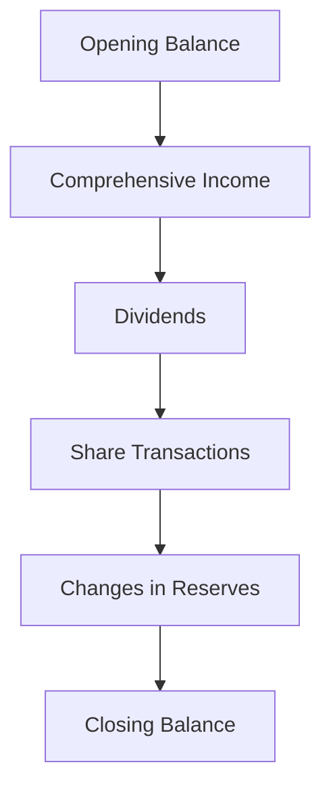

## 5.4 Statement of Changes in Equity

The Statement of Changes in Equity is a crucial component of financial reporting, providing insights into the changes in a company's equity over a specific period. It complements the balance sheet and income statement by detailing the movements in equity, including share capital, retained earnings, and reserves. This section will delve into the intricacies of the Statement of Changes in Equity, its components, significance, and practical applications, particularly in the context of Canadian accounting standards.

### Understanding the Statement of Changes in Equity

The Statement of Changes in Equity is a financial statement that outlines the changes in a company's equity during a reporting period. It provides a detailed account of the movements in equity components, such as:

- **Share Capital**: Reflects the funds raised by issuing shares.
- **Retained Earnings**: Represents the cumulative net income retained in the company after dividends are paid.
- **Reserves**: Includes various reserves created from retained earnings for specific purposes, such as legal reserves, revaluation reserves, and other comprehensive income.

#### Key Components of the Statement of Changes in Equity

1. **Opening Balance**: The equity balance at the beginning of the period.
2. **Comprehensive Income**: Total income, including net income and other comprehensive income.
3. **Dividends**: Distributions to shareholders, reducing retained earnings.
4. **Share Issuance or Repurchase**: Changes in share capital due to issuing new shares or repurchasing existing ones.
5. **Changes in Reserves**: Movements in various reserves, reflecting adjustments in equity.
6. **Closing Balance**: The equity balance at the end of the period.

### Importance of the Statement of Changes in Equity

The Statement of Changes in Equity is vital for several reasons:

- **Transparency**: Provides a clear view of how equity components change over time, enhancing transparency for stakeholders.
- **Decision-Making**: Assists investors and analysts in understanding the company's financial health and management's decisions regarding profit distribution and capital structure.
- **Compliance**: Ensures compliance with accounting standards, such as IFRS and ASPE, which require detailed reporting of equity changes.

### Examining the Components in Detail

#### Share Capital

Share capital represents the funds raised by a company through the issuance of shares. It is a critical component of equity, reflecting the ownership interest of shareholders. Changes in share capital occur due to:

- **Issuance of New Shares**: Increases share capital and provides additional funds for the company.
- **Share Repurchase**: Reduces share capital as the company buys back its shares from the market.

**Example**: A company issues 1,000 new shares at $10 each, increasing its share capital by $10,000. Later, it repurchases 500 shares at $12 each, reducing share capital by $6,000.

#### Retained Earnings

Retained earnings are the cumulative net income retained in the company after dividends are paid to shareholders. It reflects the company's ability to reinvest profits for growth and expansion.

**Example**: A company reports a net income of $50,000 and declares dividends of $10,000. The retained earnings increase by $40,000.

#### Reserves

Reserves are portions of retained earnings set aside for specific purposes, such as legal requirements, future expansion, or contingencies. Common types of reserves include:

- **Legal Reserves**: Mandated by law to protect creditors.
- **Revaluation Reserves**: Reflect changes in the value of assets.
- **Other Comprehensive Income**: Includes unrealized gains and losses on financial instruments.

**Example**: A company creates a legal reserve of $5,000 from its retained earnings to comply with regulatory requirements.

### Practical Application and Real-World Scenarios

#### Case Study: Canadian Corporation

Consider a Canadian corporation that reports the following changes in equity for the year:

- **Opening Balance**: $100,000
- **Net Income**: $30,000
- **Dividends Paid**: $10,000
- **Issuance of New Shares**: $20,000
- **Revaluation Surplus**: $5,000
- **Closing Balance**: $145,000

The Statement of Changes in Equity would detail these movements, providing stakeholders with a comprehensive view of the company's equity changes.

#### Regulatory Considerations

In Canada, companies must comply with IFRS or ASPE when preparing the Statement of Changes in Equity. These standards ensure consistency and comparability across financial statements, enhancing the reliability of financial reporting.

### Step-by-Step Guidance for Preparing the Statement

1. **Determine the Opening Balance**: Start with the equity balance at the beginning of the period.
2. **Calculate Comprehensive Income**: Include net income and other comprehensive income.
3. **Adjust for Dividends**: Subtract dividends paid to shareholders.
4. **Record Share Transactions**: Add or subtract changes in share capital due to issuance or repurchase.
5. **Update Reserves**: Reflect any changes in reserves, such as revaluation or legal reserves.
6. **Calculate the Closing Balance**: Sum the adjusted components to determine the closing equity balance.

### Diagrams and Visual Aids

To enhance understanding, consider the following diagram illustrating the flow of changes in equity:

### Best Practices and Common Pitfalls

#### Best Practices

- **Accuracy**: Ensure all components are accurately recorded and calculated.
- **Clarity**: Present information clearly and concisely for stakeholders.
- **Compliance**: Adhere to relevant accounting standards and regulations.

#### Common Pitfalls

- **Omitting Components**: Failing to include all relevant changes in equity.
- **Inaccurate Calculations**: Errors in calculating comprehensive income or dividends.
- **Non-Compliance**: Not following accounting standards, leading to unreliable reporting.

### Strategies for Exam Success

- **Understand the Components**: Familiarize yourself with each component of the Statement of Changes in Equity.
- **Practice Calculations**: Work through sample problems to master the calculations involved.
- **Review Standards**: Study relevant accounting standards, such as IFRS and ASPE, to ensure compliance.

### Summary

The Statement of Changes in Equity is a vital financial statement that provides insights into the changes in a company's equity over time. By understanding its components, significance, and practical applications, you can enhance your financial reporting skills and prepare effectively for the Canadian Accounting Exams.

### References and Further Reading

- **IFRS Standards**: [IFRS Foundation](https://www.ifrs.org/issued-standards/list-of-standards/)
- **CPA Canada**: [CPA Canada Handbook](https://www.cpacanada.ca/en/business-and-accounting-resources/cpa-canada-handbook)
- **ASPE Standards**: [CPA Canada ASPE](https://www.cpacanada.ca/en/business-and-accounting-resources/financial-and-non-financial-reporting/accounting-standards-for-private-enterprises-aspe)

## **Ready to Test Your Knowledge?**



### What is the primary purpose of the Statement of Changes in Equity?

- [x] To detail the changes in a company's equity components over a reporting period
- [ ] To provide a summary of a company's cash flows
- [ ] To report a company's liabilities
- [ ] To list a company's assets

> **Explanation:** The Statement of Changes in Equity provides a detailed account of the changes in equity components, such as share capital, retained earnings, and reserves, over a reporting period.

### Which of the following is NOT a component of the Statement of Changes in Equity?

- [ ] Share Capital
- [x] Cash Flow
- [ ] Retained Earnings
- [ ] Reserves

> **Explanation:** Cash flow is not a component of the Statement of Changes in Equity; it is reported in the Statement of Cash Flows.

### How does issuing new shares affect the Statement of Changes in Equity?

- [x] It increases share capital
- [ ] It decreases retained earnings
- [ ] It has no effect on equity
- [ ] It decreases share capital

> **Explanation:** Issuing new shares increases share capital, reflecting additional funds raised by the company.

### What happens to retained earnings when dividends are paid?

- [x] Retained earnings decrease
- [ ] Retained earnings increase
- [ ] Retained earnings remain unchanged
- [ ] Retained earnings are transferred to reserves

> **Explanation:** When dividends are paid, retained earnings decrease as profits are distributed to shareholders.

### Which accounting standard primarily governs the preparation of the Statement of Changes in Equity in Canada?

- [x] IFRS
- [ ] GAAP
- [ ] FASB
- [ ] SEC

> **Explanation:** In Canada, the preparation of the Statement of Changes in Equity is primarily governed by IFRS.

### What is the effect of a revaluation surplus on the Statement of Changes in Equity?

- [x] It increases reserves
- [ ] It decreases share capital
- [ ] It decreases retained earnings
- [ ] It has no effect on equity

> **Explanation:** A revaluation surplus increases reserves, reflecting changes in the value of assets.

### Which of the following is a common pitfall when preparing the Statement of Changes in Equity?

- [x] Omitting relevant changes in equity
- [ ] Overstating liabilities
- [ ] Understating assets
- [ ] Misclassifying expenses

> **Explanation:** Omitting relevant changes in equity is a common pitfall that can lead to inaccurate reporting.

### What is the closing balance in the Statement of Changes in Equity?

- [x] The equity balance at the end of the reporting period
- [ ] The total assets at the end of the reporting period
- [ ] The total liabilities at the end of the reporting period
- [ ] The net income for the period

> **Explanation:** The closing balance is the equity balance at the end of the reporting period, reflecting all changes during the period.

### How does a share repurchase affect the Statement of Changes in Equity?

- [x] It decreases share capital
- [ ] It increases retained earnings
- [ ] It has no effect on equity
- [ ] It increases share capital

> **Explanation:** A share repurchase decreases share capital as the company buys back its shares from the market.

### True or False: The Statement of Changes in Equity only includes changes in share capital.

- [ ] True
- [x] False

> **Explanation:** False. The Statement of Changes in Equity includes changes in share capital, retained earnings, and reserves.


