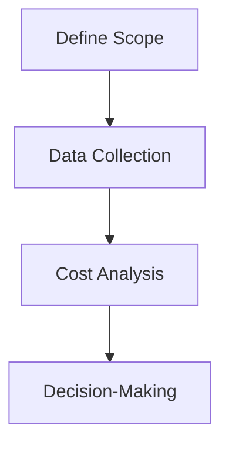
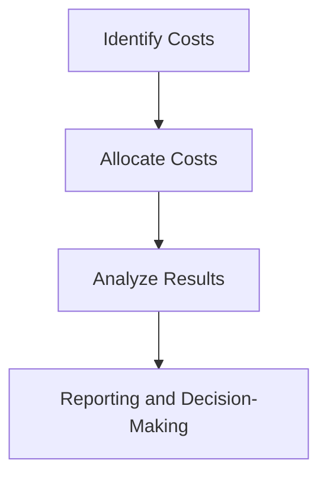

## 8.9 Life Cycle Costing and Full Cost Accounting

In the evolving landscape of accounting, where sustainability and environmental considerations are increasingly pivotal, Life Cycle Costing (LCC) and Full Cost Accounting (FCA) emerge as critical methodologies. These approaches extend beyond traditional financial metrics to incorporate environmental and social impacts, offering a holistic view of costs associated with products, services, and organizational operations. This section delves into the principles, applications, and implications of LCC and FCA, providing insights into their relevance for Canadian accounting exams and professional practice.

### Understanding Life Cycle Costing (LCC)

**Definition and Purpose:**

Life Cycle Costing is a comprehensive approach that evaluates the total cost of ownership of a product or service over its entire life cycle. This includes initial acquisition costs, operation and maintenance expenses, and end-of-life disposal costs. LCC aims to provide a complete picture of the financial implications associated with a product, enabling more informed decision-making.

**Key Components of LCC:**

1. **Acquisition Costs:** Initial costs incurred during the purchase or creation of a product, including design, manufacturing, and installation expenses.

2. **Operation and Maintenance Costs:** Ongoing expenses related to the use and upkeep of the product, such as energy consumption, repairs, and routine maintenance.

3. **End-of-Life Costs:** Costs associated with the disposal, recycling, or decommissioning of the product at the end of its useful life.

4. **Environmental and Social Costs:** Impacts on the environment and society, such as carbon emissions, resource depletion, and social equity considerations.

**LCC Process:**

The LCC process involves several steps:

1. **Define the Scope:** Identify the product or service to be analyzed and determine the boundaries of the life cycle.

2. **Data Collection:** Gather data on costs and impacts associated with each phase of the life cycle.

3. **Cost Analysis:** Calculate the total life cycle cost by summing the costs across all phases.

4. **Decision-Making:** Use the LCC results to inform decisions about product design, procurement, and sustainability initiatives.

**Example:**

Consider a company evaluating the purchase of a new fleet of vehicles. By applying LCC, the company assesses not only the purchase price but also fuel efficiency, maintenance costs, and potential resale value. Additionally, the environmental impact of emissions and the social implications of sourcing materials are factored into the decision.

### Full Cost Accounting (FCA)

**Definition and Purpose:**

Full Cost Accounting is an accounting method that captures all direct and indirect costs associated with a product or service, including environmental and social costs. FCA provides a more comprehensive view of financial performance by integrating non-financial impacts into the accounting framework.

**Key Components of FCA:**

1. **Direct Costs:** Costs directly attributable to the production of goods or services, such as raw materials and labor.

2. **Indirect Costs:** Overhead costs that are not directly tied to a specific product, including utilities and administrative expenses.

3. **Environmental Costs:** Costs related to environmental impacts, such as pollution control, waste management, and resource conservation.

4. **Social Costs:** Costs associated with social impacts, including community relations, employee well-being, and ethical sourcing.

**FCA Process:**

The FCA process involves several steps:

1. **Identify Costs:** Determine all relevant costs, including traditional financial costs and environmental and social impacts.

2. **Allocate Costs:** Assign costs to specific products or services using appropriate allocation methods.

3. **Analyze Results:** Evaluate the total cost profile to understand the full financial, environmental, and social implications.

4. **Reporting and Decision-Making:** Use FCA results to enhance transparency in financial reporting and guide strategic decisions.

**Example:**

A manufacturing company implements FCA to assess the true cost of its production processes. By accounting for waste disposal, emissions, and community impacts, the company identifies opportunities to reduce costs and improve sustainability.

### Integration of LCC and FCA in Sustainability Accounting

**Importance in Sustainability Accounting:**

LCC and FCA are integral to sustainability accounting, which seeks to incorporate environmental and social considerations into financial reporting. These methodologies provide a framework for understanding the broader impacts of business activities and support the development of sustainable business practices.

**Regulatory Context:**

In Canada, sustainability accounting is influenced by guidelines from CPA Canada, the International Financial Reporting Standards (IFRS), and the Global Reporting Initiative (GRI). These standards encourage the integration of environmental and social impacts into financial reporting, aligning with global sustainability goals.

**Practical Applications:**

1. **Product Development:** LCC and FCA can guide the design of sustainable products by highlighting cost-saving opportunities and environmental benefits.

2. **Investment Decisions:** Investors use LCC and FCA to evaluate the long-term viability and sustainability of investments, considering both financial returns and non-financial impacts.

3. **Corporate Reporting:** Companies incorporate LCC and FCA into sustainability reports to demonstrate their commitment to environmental and social responsibility.

**Challenges and Considerations:**

1. **Data Availability:** Accurate LCC and FCA require comprehensive data on costs and impacts, which may be challenging to obtain.

2. **Complexity:** The integration of environmental and social costs adds complexity to traditional accounting processes.

3. **Standardization:** The lack of standardized methods for calculating and reporting LCC and FCA can hinder comparability across organizations.

### Case Studies and Real-World Examples

**Case Study 1: Automotive Industry**

An automotive manufacturer applies LCC to assess the total cost of electric vehicles (EVs) compared to traditional internal combustion engine vehicles. By considering factors such as battery life, charging infrastructure, and emissions, the company identifies EVs as a more cost-effective and sustainable option over the long term.

**Case Study 2: Retail Sector**

A retail company uses FCA to evaluate the environmental and social costs of its supply chain. By accounting for carbon emissions, water usage, and labor practices, the company identifies areas for improvement and implements strategies to enhance sustainability and reduce costs.

### Diagram: Life Cycle Costing Process

### Diagram: Full Cost Accounting Framework

### Best Practices and Strategies

1. **Engage Stakeholders:** Involve stakeholders in the LCC and FCA processes to ensure comprehensive data collection and alignment with organizational goals.

2. **Leverage Technology:** Utilize software tools and data analytics to streamline LCC and FCA calculations and enhance accuracy.

3. **Focus on Continuous Improvement:** Regularly review and update LCC and FCA methodologies to reflect changes in technology, regulations, and market conditions.

4. **Promote Transparency:** Clearly communicate LCC and FCA results to stakeholders to build trust and demonstrate commitment to sustainability.

### Conclusion

Life Cycle Costing and Full Cost Accounting are essential tools for integrating environmental and social considerations into financial decision-making. By providing a comprehensive view of costs and impacts, these methodologies support the development of sustainable business practices and enhance transparency in financial reporting. As sustainability becomes increasingly important in the accounting profession, understanding and applying LCC and FCA will be crucial for success in Canadian accounting exams and professional practice.

## **Ready to Test Your Knowledge?**



### What is the primary purpose of Life Cycle Costing (LCC)?

- [x] To evaluate the total cost of ownership over the product's life cycle
- [ ] To calculate only the initial acquisition cost
- [ ] To focus solely on environmental costs
- [ ] To assess social impacts exclusively

> **Explanation:** Life Cycle Costing aims to provide a complete picture of the financial implications associated with a product over its entire life cycle, including acquisition, operation, and end-of-life costs.

### Which of the following is a key component of Full Cost Accounting (FCA)?

- [x] Environmental Costs
- [ ] Only Direct Costs
- [ ] Only Indirect Costs
- [ ] Only Financial Costs

> **Explanation:** Full Cost Accounting captures all direct and indirect costs, including environmental and social costs, to provide a comprehensive view of financial performance.

### In the context of LCC, what does "end-of-life costs" refer to?

- [x] Costs associated with disposal or recycling at the end of a product's life
- [ ] Initial costs incurred during purchase
- [ ] Ongoing maintenance expenses
- [ ] Costs related to product design

> **Explanation:** End-of-life costs are those incurred when a product is disposed of, recycled, or decommissioned at the end of its useful life.

### What is a significant challenge in implementing LCC and FCA?

- [x] Data Availability
- [ ] Simplicity of the process
- [ ] Lack of stakeholder interest
- [ ] Overabundance of standardized methods

> **Explanation:** Accurate LCC and FCA require comprehensive data on costs and impacts, which can be challenging to obtain.

### How can technology aid in the LCC and FCA processes?

- [x] By streamlining calculations and enhancing accuracy
- [ ] By increasing complexity
- [ ] By reducing stakeholder engagement
- [ ] By eliminating the need for data collection

> **Explanation:** Technology, such as software tools and data analytics, can streamline LCC and FCA calculations, making them more accurate and efficient.

### What role do stakeholders play in LCC and FCA?

- [x] They ensure comprehensive data collection and alignment with goals
- [ ] They complicate the process
- [ ] They are not involved
- [ ] They only review the final reports

> **Explanation:** Engaging stakeholders in the LCC and FCA processes ensures comprehensive data collection and alignment with organizational goals.

### Which regulatory body influences sustainability accounting in Canada?

- [x] CPA Canada
- [ ] SEC
- [ ] FASB
- [ ] AICPA

> **Explanation:** CPA Canada, along with IFRS and GRI, influences sustainability accounting practices in Canada.

### What is a benefit of incorporating LCC and FCA into corporate reporting?

- [x] Demonstrating commitment to environmental and social responsibility
- [ ] Increasing financial costs
- [ ] Reducing transparency
- [ ] Limiting stakeholder engagement

> **Explanation:** Incorporating LCC and FCA into corporate reporting demonstrates a company's commitment to environmental and social responsibility, enhancing transparency.

### What is a common application of LCC in the automotive industry?

- [x] Assessing the total cost of electric vehicles compared to traditional vehicles
- [ ] Calculating only the purchase price of vehicles
- [ ] Ignoring emissions and environmental impacts
- [ ] Focusing solely on fuel efficiency

> **Explanation:** LCC is used to assess the total cost of electric vehicles compared to traditional vehicles, considering factors like battery life, emissions, and maintenance.

### True or False: Full Cost Accounting only considers financial costs.

- [ ] True
- [x] False

> **Explanation:** Full Cost Accounting considers all direct and indirect costs, including environmental and social costs, not just financial costs.


