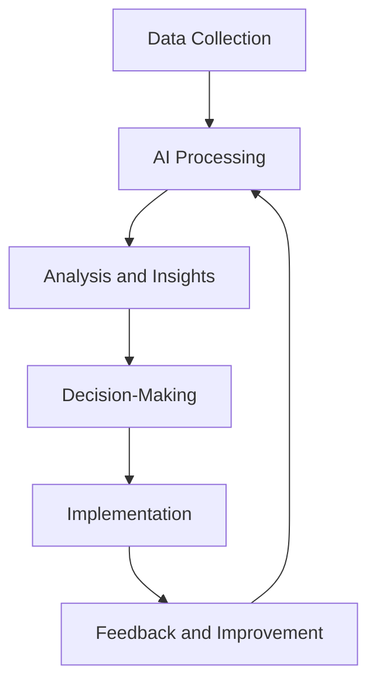

## 9.4 Automation and Artificial Intelligence (AI) in Accounting

The integration of Automation and Artificial Intelligence (AI) into accounting practices is revolutionizing the industry, enhancing efficiency, accuracy, and decision-making capabilities. This section delves into the transformative impact of these technologies on accounting processes, providing insights into their applications, benefits, and challenges, particularly within the Canadian accounting context.

### Understanding Automation and AI in Accounting

**Automation** refers to the use of technology to perform tasks with minimal human intervention. In accounting, automation can streamline repetitive processes such as data entry, invoice processing, and reconciliation. **Artificial Intelligence (AI)**, on the other hand, involves the simulation of human intelligence processes by machines, especially computer systems. AI applications in accounting include machine learning, natural language processing, and predictive analytics, which enable systems to learn from data, identify patterns, and make decisions.

### The Role of Automation in Accounting

Automation in accounting focuses on reducing manual effort and increasing efficiency. Key areas where automation is applied include:

- **Data Entry and Processing:** Automated systems can capture and process large volumes of data quickly and accurately, reducing the risk of human error.
- **Invoice Management:** Automation tools can handle invoice generation, approval workflows, and payment processing, ensuring timely and accurate transactions.
- **Reconciliation:** Automated reconciliation tools match transactions across different accounts and identify discrepancies, streamlining the reconciliation process.
- **Payroll Processing:** Automation simplifies payroll calculations, tax deductions, and compliance with regulatory requirements.

### Artificial Intelligence Applications in Accounting

AI technologies are transforming accounting by providing advanced capabilities such as:

- **Predictive Analytics:** AI can analyze historical data to predict future trends and financial outcomes, aiding in strategic planning and decision-making.
- **Fraud Detection:** AI algorithms can detect unusual patterns and anomalies in financial data, helping to identify potential fraud and reduce financial risk.
- **Natural Language Processing (NLP):** NLP enables AI systems to understand and process human language, facilitating tasks such as document analysis and report generation.
- **Chatbots and Virtual Assistants:** These AI-driven tools can handle customer inquiries, provide financial advice, and assist with routine accounting tasks.

### Benefits of Automation and AI in Accounting

The integration of automation and AI in accounting offers numerous benefits, including:

- **Increased Efficiency:** Automation reduces the time and effort required for manual tasks, allowing accountants to focus on more strategic activities.
- **Enhanced Accuracy:** AI systems can process data with high precision, reducing errors and improving the reliability of financial information.
- **Cost Savings:** By automating routine tasks, organizations can reduce labor costs and improve operational efficiency.
- **Improved Decision-Making:** AI provides valuable insights through data analysis, supporting informed decision-making and strategic planning.

### Challenges and Considerations

While automation and AI offer significant advantages, they also present challenges that must be addressed:

- **Data Security and Privacy:** The use of AI in accounting involves handling sensitive financial data, necessitating robust security measures to protect against breaches and unauthorized access.
- **Regulatory Compliance:** Organizations must ensure that automated and AI-driven processes comply with relevant accounting standards and regulations, such as IFRS and ASPE.
- **Skill Development:** Accountants need to develop new skills to work effectively with AI technologies, including data analysis and interpretation.
- **Ethical Considerations:** The use of AI raises ethical questions related to transparency, accountability, and the potential for bias in decision-making processes.

### Real-World Applications and Case Studies

To illustrate the impact of automation and AI in accounting, consider the following examples:

- **Case Study 1: Automated Invoice Processing at a Canadian Firm**
  A mid-sized Canadian accounting firm implemented an automated invoice processing system, reducing the time spent on manual data entry by 70%. The system uses optical character recognition (OCR) to extract data from invoices and integrates with the firm's accounting software, streamlining the approval and payment process.

- **Case Study 2: AI-Driven Fraud Detection in a Financial Institution**
  A major Canadian bank adopted an AI-based fraud detection system that analyzes transaction data in real-time. The system identifies suspicious patterns and alerts the bank's fraud team, enabling them to take swift action. As a result, the bank reported a 30% reduction in fraudulent activities within the first year of implementation.

### Step-by-Step Guide to Implementing AI in Accounting

Implementing AI in accounting involves several key steps:

1. **Identify Areas for Automation:** Assess your organization's accounting processes to identify tasks that can benefit from automation and AI.
2. **Select Appropriate Technologies:** Choose AI tools and platforms that align with your organization's needs and goals.
3. **Integrate with Existing Systems:** Ensure that AI solutions are compatible with your current accounting software and systems.
4. **Train Staff:** Provide training and support to help your team adapt to new technologies and develop the necessary skills.
5. **Monitor and Evaluate:** Continuously monitor the performance of AI systems and evaluate their impact on efficiency and accuracy.

### Diagrams and Visuals

To enhance understanding, consider the following diagram illustrating the integration of AI in accounting processes:

### Best Practices and Common Pitfalls

**Best Practices:**

- **Start Small:** Begin with pilot projects to test AI applications and assess their impact before scaling up.
- **Ensure Data Quality:** High-quality data is essential for accurate AI analysis and decision-making.
- **Collaborate with IT:** Work closely with IT teams to ensure seamless integration and support for AI systems.

**Common Pitfalls:**

- **Over-Reliance on Technology:** While AI can enhance accounting processes, human oversight is still necessary to ensure accuracy and ethical considerations.
- **Ignoring Regulatory Requirements:** Failing to comply with accounting standards and regulations can lead to legal and financial repercussions.

### Future Trends and Developments

The future of automation and AI in accounting is promising, with several trends emerging:

- **Increased Adoption of AI-Driven Analytics:** As AI technologies advance, their use in predictive analytics and strategic decision-making will become more prevalent.
- **Integration with Blockchain:** Combining AI with blockchain technology can enhance transparency and security in financial transactions.
- **AI-Powered Audits:** AI tools will increasingly be used in auditing to analyze large datasets and identify discrepancies more efficiently.

### Conclusion

Automation and Artificial Intelligence are reshaping the accounting landscape, offering significant benefits in terms of efficiency, accuracy, and decision-making. By understanding and leveraging these technologies, accountants can enhance their capabilities and provide greater value to their organizations. As you prepare for the Canadian Accounting Exams, consider the implications of AI and automation on the future of accounting and how they can be integrated into professional practice.

## **Ready to Test Your Knowledge?**



### Which of the following is a key benefit of automation in accounting?

- [x] Increased efficiency
- [ ] Increased manual effort
- [ ] Higher labor costs
- [ ] Reduced accuracy

> **Explanation:** Automation increases efficiency by reducing the time and effort required for manual tasks, allowing accountants to focus on more strategic activities.

### What is a primary application of AI in accounting?

- [x] Predictive analytics
- [ ] Manual data entry
- [ ] Paper-based invoicing
- [ ] Human oversight

> **Explanation:** AI is used in predictive analytics to analyze historical data and predict future trends, aiding in strategic planning and decision-making.

### Which AI technology enables systems to understand and process human language?

- [x] Natural Language Processing (NLP)
- [ ] Optical Character Recognition (OCR)
- [ ] Machine Learning (ML)
- [ ] Blockchain

> **Explanation:** Natural Language Processing (NLP) enables AI systems to understand and process human language, facilitating tasks such as document analysis and report generation.

### What is a common challenge associated with AI in accounting?

- [x] Data security and privacy
- [ ] Increased manual workload
- [ ] Reduced efficiency
- [ ] Lack of data

> **Explanation:** AI involves handling sensitive financial data, necessitating robust security measures to protect against breaches and unauthorized access.

### Which of the following is a best practice for implementing AI in accounting?

- [x] Start small with pilot projects
- [ ] Implement AI across all processes immediately
- [ ] Ignore data quality
- [ ] Avoid collaboration with IT

> **Explanation:** Starting small with pilot projects allows organizations to test AI applications and assess their impact before scaling up.

### How does AI enhance fraud detection in accounting?

- [x] By analyzing transaction data in real-time
- [ ] By increasing manual oversight
- [ ] By reducing data analysis
- [ ] By ignoring suspicious patterns

> **Explanation:** AI enhances fraud detection by analyzing transaction data in real-time, identifying suspicious patterns, and alerting fraud teams for swift action.

### What is a potential future trend in AI for accounting?

- [x] AI-powered audits
- [ ] Increased manual data entry
- [ ] Reduced use of predictive analytics
- [ ] Decreased integration with technology

> **Explanation:** AI-powered audits are a potential future trend, where AI tools analyze large datasets and identify discrepancies more efficiently.

### What is a common pitfall when implementing AI in accounting?

- [x] Over-reliance on technology
- [ ] Ensuring data quality
- [ ] Collaborating with IT
- [ ] Starting with pilot projects

> **Explanation:** Over-reliance on technology can lead to issues, as human oversight is still necessary to ensure accuracy and ethical considerations.

### Which technology can enhance transparency and security in financial transactions when combined with AI?

- [x] Blockchain
- [ ] Optical Character Recognition (OCR)
- [ ] Natural Language Processing (NLP)
- [ ] Manual data entry

> **Explanation:** Combining AI with blockchain technology can enhance transparency and security in financial transactions.

### True or False: AI can only be used for data entry in accounting.

- [ ] True
- [x] False

> **Explanation:** False. AI has a wide range of applications in accounting, including predictive analytics, fraud detection, and natural language processing, beyond just data entry.


