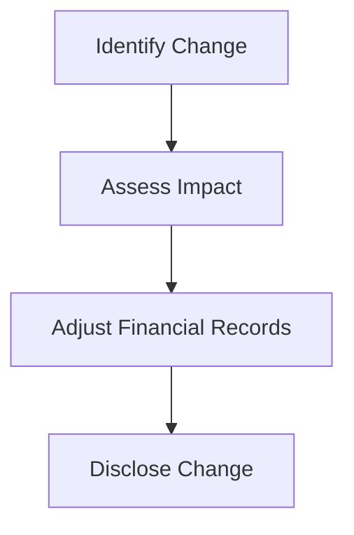

## 10.3 Changes in Accounting Estimates

### Introduction

In the dynamic world of accounting, estimates play a crucial role in financial reporting. These estimates, ranging from depreciation rates to provisions for doubtful debts, are integral to presenting a true and fair view of an entity's financial position. However, as circumstances evolve, so too must these estimates. Understanding how to handle changes in accounting estimates is vital for maintaining the accuracy and reliability of financial statements. This section delves into the nature of accounting estimates, the reasons for their changes, and the impact these changes have on financial reporting, particularly within the Canadian context.

### Understanding Accounting Estimates

Accounting estimates are approximations made by management to account for uncertainties in financial reporting. These estimates are necessary when precise data is unavailable, and they require a degree of judgment and foresight. Common examples include:

- **Depreciation and Amortization:** Estimating the useful life and residual value of assets.
- **Provisions for Doubtful Debts:** Estimating the amount of receivables that may not be collected.
- **Inventory Obsolescence:** Estimating the value of inventory that may become obsolete.
- **Warranty Liabilities:** Estimating future warranty claims.

### Reasons for Changes in Accounting Estimates

Changes in accounting estimates occur due to new information or developments that affect the assumptions on which the original estimates were based. Some common reasons include:

- **Technological Advancements:** New technologies may render existing assets obsolete sooner than expected.
- **Market Conditions:** Changes in economic conditions can affect the collectability of receivables or the value of inventory.
- **Regulatory Changes:** New laws or regulations may impact the estimated liabilities or asset valuations.
- **Operational Changes:** Changes in business operations, such as a shift in production methods, can affect asset utilization rates.

### Impact on Financial Statements

Changes in accounting estimates are accounted for prospectively, meaning they affect the current and future periods only. This approach aligns with the principle that estimates are inherently uncertain and subject to change as new information becomes available. The impact on financial statements includes:

- **Income Statement:** Changes in estimates can affect profit or loss, as they may alter expense recognition (e.g., depreciation, bad debt expense).
- **Balance Sheet:** Adjustments to asset valuations or liabilities can impact the financial position of the entity.
- **Cash Flow Statement:** Indirect effects may arise if changes in estimates influence operating cash flows.

### Accounting Standards and Guidelines

#### International Financial Reporting Standards (IFRS)

Under IFRS, changes in accounting estimates are governed by IAS 8, "Accounting Policies, Changes in Accounting Estimates and Errors." Key points include:

- **Prospective Application:** Changes are applied to the period of change and future periods.
- **Disclosure Requirements:** Entities must disclose the nature and amount of the change, and if applicable, the impact on future periods.

#### Accounting Standards for Private Enterprises (ASPE)

In Canada, ASPE Section 1506 provides guidance on changes in accounting estimates. It emphasizes:

- **Prospective Treatment:** Similar to IFRS, changes are recognized in the period of change and future periods.
- **Disclosure:** Entities must disclose the nature and effect of the change, including any impact on future periods.

### Practical Examples and Case Studies

#### Example 1: Depreciation Estimate Change

A manufacturing company initially estimated the useful life of its machinery to be 10 years. Due to technological advancements, the machinery is expected to become obsolete in 8 years. The company revises its depreciation estimate accordingly.

- **Impact:** The depreciation expense increases, reducing net income for the current and future periods.

#### Example 2: Provision for Doubtful Debts

A retail company experiences a downturn in the economy, leading to increased customer defaults. The company revises its estimate for doubtful debts from 2% to 5% of receivables.

- **Impact:** The bad debt expense increases, impacting the income statement and reducing net income.

### Step-by-Step Guidance for Handling Changes

1. **Identify the Change:** Determine the specific estimate that requires revision and the reasons for the change.
2. **Assess the Impact:** Evaluate how the change will affect the financial statements, both in the current period and future periods.
3. **Adjust the Financial Records:** Update the accounting records to reflect the revised estimate.
4. **Disclose the Change:** Ensure that the financial statements include appropriate disclosures about the nature and impact of the change.

### Diagrams and Visual Aids

To enhance understanding, consider the following diagram illustrating the process of handling changes in accounting estimates:

### Best Practices and Common Pitfalls

#### Best Practices

- **Regular Review:** Periodically review estimates to ensure they remain relevant and accurate.
- **Documentation:** Maintain thorough documentation of the assumptions and rationale behind estimates.
- **Communication:** Ensure clear communication between management and the accounting team regarding changes in estimates.

#### Common Pitfalls

- **Inadequate Disclosure:** Failing to provide sufficient disclosure can lead to misunderstandings and compliance issues.
- **Delayed Recognition:** Delaying the recognition of changes can result in inaccurate financial reporting.

### Real-World Applications and Regulatory Scenarios

In practice, changes in accounting estimates are commonplace across various industries. For instance, in the oil and gas sector, changes in reserve estimates can significantly impact asset valuations and financial results. Similarly, in the technology sector, rapid advancements may necessitate frequent revisions of asset useful lives.

### Exam Preparation and Practice Questions

To effectively prepare for the Canadian Accounting Exams, consider the following strategies:

- **Understand the Standards:** Familiarize yourself with IAS 8 and ASPE Section 1506.
- **Practice Scenarios:** Work through practice problems involving changes in estimates.
- **Review Disclosures:** Study examples of financial statement disclosures related to changes in estimates.

### Summary

Changes in accounting estimates are an essential aspect of financial reporting, reflecting the dynamic nature of business environments. By understanding the reasons for changes, their impact on financial statements, and the applicable accounting standards, you can ensure accurate and reliable financial reporting. Remember to stay informed about industry trends and regulatory developments that may influence accounting estimates.

## **Ready to Test Your Knowledge?**



### What is the primary reason for changes in accounting estimates?

- [x] New information or developments affecting assumptions
- [ ] Errors in previous estimates
- [ ] Changes in accounting policies
- [ ] Reclassification of financial statement items

> **Explanation:** Changes in accounting estimates occur due to new information or developments that affect the assumptions on which the original estimates were based.

### How are changes in accounting estimates accounted for?

- [x] Prospectively
- [ ] Retrospectively
- [ ] As a prior period adjustment
- [ ] Through restatement of financial statements

> **Explanation:** Changes in accounting estimates are accounted for prospectively, affecting the current and future periods only.

### Which accounting standard governs changes in accounting estimates under IFRS?

- [x] IAS 8
- [ ] IFRS 9
- [ ] IAS 16
- [ ] IFRS 15

> **Explanation:** IAS 8, "Accounting Policies, Changes in Accounting Estimates and Errors," governs changes in accounting estimates under IFRS.

### What is a common example of an accounting estimate?

- [x] Depreciation and amortization
- [ ] Revenue recognition
- [ ] Inventory valuation
- [ ] Foreign currency translation

> **Explanation:** Depreciation and amortization are common examples of accounting estimates, as they involve estimating the useful life and residual value of assets.

### What should be disclosed when there is a change in accounting estimates?

- [x] Nature and effect of the change
- [ ] Prior period adjustments
- [ ] New accounting policies
- [ ] Reclassification of items

> **Explanation:** Entities must disclose the nature and effect of the change, including any impact on future periods.

### Which of the following is NOT a reason for changes in accounting estimates?

- [ ] Technological advancements
- [ ] Market conditions
- [ ] Regulatory changes
- [x] Errors in financial statements

> **Explanation:** Errors in financial statements are not a reason for changes in accounting estimates; they are addressed through error corrections.

### How does a change in depreciation estimate affect financial statements?

- [x] Increases or decreases depreciation expense
- [ ] Changes revenue recognition
- [ ] Alters inventory valuation
- [ ] Affects foreign currency translation

> **Explanation:** A change in depreciation estimate affects depreciation expense, which impacts the income statement and net income.

### What is the impact of a change in estimate on the cash flow statement?

- [x] Indirect effects on operating cash flows
- [ ] Direct effects on investing cash flows
- [ ] Direct effects on financing cash flows
- [ ] No impact on cash flow statement

> **Explanation:** Changes in estimates can have indirect effects on operating cash flows, as they may alter expense recognition.

### Which Canadian standard provides guidance on changes in accounting estimates?

- [x] ASPE Section 1506
- [ ] ASPE Section 3856
- [ ] ASPE Section 3061
- [ ] ASPE Section 3400

> **Explanation:** ASPE Section 1506 provides guidance on changes in accounting estimates in Canada.

### True or False: Changes in accounting estimates require restatement of prior period financial statements.

- [ ] True
- [x] False

> **Explanation:** Changes in accounting estimates do not require restatement of prior period financial statements; they are accounted for prospectively.


