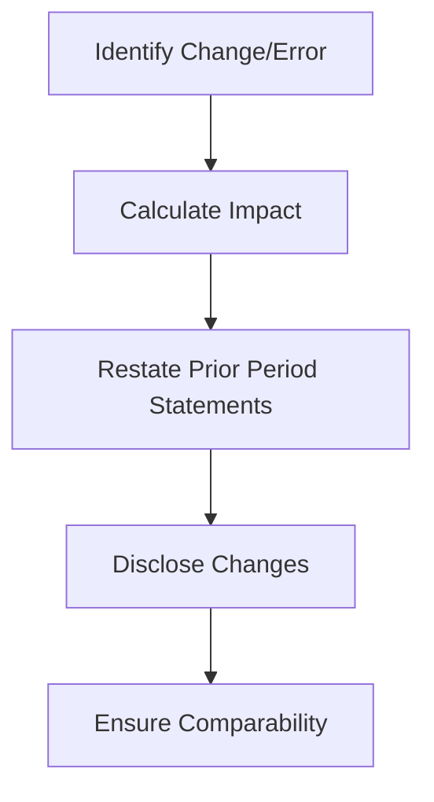

## 10.6 Impact on Comparative Financial Statements

In the realm of advanced accounting practices, understanding the impact of accounting changes and error corrections on comparative financial statements is crucial. This section delves into how these adjustments are made to ensure comparability across financial periods, a key aspect of financial reporting that is often tested in Canadian accounting exams.

### Introduction to Comparative Financial Statements

Comparative financial statements are financial reports that provide information for multiple periods, allowing stakeholders to analyze trends, performance, and financial position over time. They are essential for decision-making, enabling users to make informed judgments about an entity's financial health and operational efficiency.

### Importance of Comparability

Comparability is a fundamental qualitative characteristic of financial information, as outlined by the International Financial Reporting Standards (IFRS) and Generally Accepted Accounting Principles (GAAP). It allows users to identify similarities and differences between financial statements of different periods or entities. Without comparability, financial statements lose much of their usefulness, as stakeholders cannot reliably assess performance or make predictions about future outcomes.

### Accounting Changes and Their Impact

Accounting changes can significantly impact comparative financial statements. These changes are generally categorized into three types:

1. **Changes in Accounting Policies**: These occur when an entity adopts a new accounting policy or changes an existing one. Such changes can affect the recognition, measurement, and presentation of financial information.

2. **Changes in Accounting Estimates**: These involve adjustments to the carrying amount of an asset or liability or the amount of periodic consumption of an asset. Changes in estimates arise from new information or developments and are not corrections of errors.

3. **Corrections of Errors**: These are adjustments made to rectify mistakes in previously issued financial statements. Errors can result from mathematical mistakes, misinterpretations of facts, or oversight.

### Adjusting Comparative Financial Statements

When accounting changes or error corrections occur, entities must adjust their comparative financial statements to reflect these changes. This process involves:

- **Retrospective Application**: For changes in accounting policies and corrections of errors, entities must apply the change retrospectively, adjusting prior period financial statements as if the new policy had always been applied or the error had never occurred.

- **Prospective Application**: Changes in accounting estimates are applied prospectively, meaning they affect only the current and future periods.

#### Retrospective Application

Retrospective application requires restating prior period financial statements to reflect the change in accounting policy or correction of an error. This ensures that the financial statements are comparable across periods. The steps involved in retrospective application include:

1. **Identify the Change**: Determine whether the change is due to a new accounting policy or an error correction.

2. **Calculate the Impact**: Assess the cumulative effect of the change on prior periods.

3. **Adjust Prior Period Statements**: Restate the affected financial statements for each prior period presented.

4. **Disclose the Change**: Provide detailed disclosures explaining the nature of the change, the reasons for the change, and the impact on financial statements.

#### Prospective Application

Prospective application involves applying the change in accounting estimate to the current and future periods only. This approach is used because estimates are inherently uncertain and based on current information. The steps include:

1. **Determine the New Estimate**: Calculate the revised estimate based on new information.

2. **Apply the Estimate**: Adjust the financial statements for the current period and future periods as necessary.

3. **Disclose the Change**: Explain the nature of the change in estimate and its impact on financial statements.

### Practical Examples and Case Studies

#### Example 1: Change in Depreciation Method

Consider a company that changes its depreciation method from straight-line to declining balance. This change in accounting policy requires retrospective application. The company must restate its prior period financial statements to reflect the new depreciation method, ensuring comparability.

#### Example 2: Correction of Inventory Error

Suppose a company discovers an error in its inventory valuation from a previous year. The correction of this error requires retrospective application. The company must adjust its prior period financial statements to correct the inventory valuation, impacting cost of goods sold and net income.

### Real-World Applications and Regulatory Scenarios

In Canada, entities must adhere to IFRS as adopted by the Canadian Accounting Standards Board (AcSB). The AcSB provides guidance on how to apply IFRS in the Canadian context, ensuring that financial statements are comparable and reliable.

#### IFRS and GAAP Considerations

Both IFRS and GAAP require retrospective application for changes in accounting policies and corrections of errors. However, there may be differences in how these standards are applied, particularly in terms of disclosure requirements and the treatment of specific transactions.

### Step-by-Step Guidance for Adjusting Financial Statements

1. **Review Accounting Policies**: Regularly review and update accounting policies to ensure compliance with current standards.

2. **Identify Changes and Errors**: Conduct thorough reviews and audits to identify any changes in accounting policies or errors in financial statements.

3. **Calculate Adjustments**: Accurately calculate the impact of changes or errors on prior period financial statements.

4. **Restate Financial Statements**: Adjust prior period financial statements to reflect the changes or corrections.

5. **Provide Clear Disclosures**: Ensure that all changes and corrections are clearly disclosed in the financial statements, including the nature, reasons, and impact of the adjustments.

### Diagrams and Visual Aids

To enhance understanding, consider the following diagram illustrating the process of adjusting comparative financial statements:

### Best Practices and Common Pitfalls

#### Best Practices

- **Regularly Review Financial Statements**: Conduct regular reviews to identify any changes or errors early.

- **Maintain Clear Documentation**: Keep detailed records of all accounting policies, estimates, and changes.

- **Engage Professional Auditors**: Utilize external auditors to provide an objective review of financial statements.

#### Common Pitfalls

- **Failure to Identify Changes**: Overlooking changes in accounting policies or errors can lead to non-compliance and unreliable financial statements.

- **Inadequate Disclosures**: Failing to provide sufficient disclosures can mislead stakeholders and result in regulatory penalties.

### Summary of Key Points

- Comparative financial statements are essential for analyzing trends and making informed decisions.
- Changes in accounting policies and corrections of errors require retrospective application to ensure comparability.
- Changes in accounting estimates are applied prospectively.
- Clear disclosures are crucial for transparency and compliance.
- Regular reviews and audits help identify changes and errors early.

### Exam Strategies and Practical Tips

- Focus on understanding the differences between retrospective and prospective applications.
- Practice adjusting financial statements for changes in accounting policies and error corrections.
- Familiarize yourself with the disclosure requirements under IFRS and GAAP.
- Use mnemonic devices to remember key concepts and procedures.

### References and Additional Resources

- **CPA Canada**: Offers resources and guidance on applying IFRS in Canada.
- **International Financial Reporting Standards (IFRS)**: Provides the framework and standards for financial reporting.
- **Generally Accepted Accounting Principles (GAAP)**: Offers guidelines for financial reporting in Canada and the U.S.

## **Ready to Test Your Knowledge?**



### What is the primary purpose of comparative financial statements?

- [x] To allow stakeholders to analyze trends over multiple periods
- [ ] To provide a single period's financial performance
- [ ] To focus solely on current period results
- [ ] To highlight only the changes in accounting policies

> **Explanation:** Comparative financial statements provide information for multiple periods, enabling stakeholders to analyze trends and performance over time.

### How should changes in accounting policies be applied to financial statements?

- [x] Retrospectively
- [ ] Prospectively
- [ ] Only to current period statements
- [ ] Only to future period statements

> **Explanation:** Changes in accounting policies require retrospective application, adjusting prior period financial statements for comparability.

### What is the impact of correcting an error in financial statements?

- [x] Prior period financial statements must be restated
- [ ] Only current period statements are affected
- [ ] No adjustments are needed
- [ ] Future period statements are adjusted

> **Explanation:** Corrections of errors require restating prior period financial statements to reflect the correction.

### Which of the following is a change in accounting estimate?

- [x] Revising the useful life of an asset
- [ ] Adopting a new depreciation method
- [ ] Correcting an inventory valuation error
- [ ] Changing the revenue recognition policy

> **Explanation:** Changes in accounting estimates, such as revising the useful life of an asset, are applied prospectively.

### What is required when a company changes its depreciation method?

- [x] Restate prior period financial statements
- [ ] Only adjust current period statements
- [x] Provide detailed disclosures
- [ ] No action is needed

> **Explanation:** Changing a depreciation method requires retrospective application and detailed disclosures to ensure comparability.

### What is the role of disclosures in financial statements?

- [x] To provide transparency and explain changes
- [ ] To hide sensitive information
- [ ] To focus solely on financial performance
- [ ] To reduce the length of financial reports

> **Explanation:** Disclosures provide transparency, explaining changes and their impact on financial statements.

### How are changes in accounting estimates applied?

- [x] Prospectively
- [ ] Retrospectively
- [x] To current and future periods
- [ ] Only to prior periods

> **Explanation:** Changes in accounting estimates are applied prospectively, affecting only current and future periods.

### What is a common pitfall in adjusting comparative financial statements?

- [x] Inadequate disclosures
- [ ] Over-disclosing information
- [ ] Focusing too much on current period results
- [ ] Ignoring future period impacts

> **Explanation:** Inadequate disclosures can mislead stakeholders and result in non-compliance with regulatory standards.

### Why is comparability important in financial reporting?

- [x] It allows users to identify similarities and differences across periods
- [ ] It focuses only on current period results
- [ ] It reduces the need for detailed disclosures
- [ ] It highlights only financial performance

> **Explanation:** Comparability allows users to identify similarities and differences across periods, enhancing the usefulness of financial statements.

### True or False: Changes in accounting estimates require retrospective application.

- [ ] True
- [x] False

> **Explanation:** Changes in accounting estimates are applied prospectively, not retrospectively.


