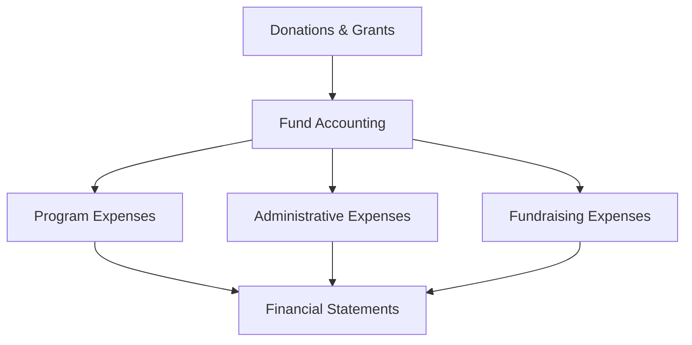

## 11.5 Accounting for Non-Profit Organizations

Accounting for non-profit organizations (NPOs) involves unique challenges and requirements that distinguish it from for-profit accounting. This section provides a comprehensive overview of the principles, standards, and practices relevant to non-profit accounting, with a focus on Canadian standards. Understanding these concepts is crucial for those preparing for Canadian accounting exams and for professionals working within the non-profit sector.

### Understanding Non-Profit Organizations

Non-profit organizations are entities that operate for purposes other than generating profit. They aim to serve the public interest or a specific community need, such as education, health, or social services. Unlike for-profit entities, NPOs reinvest any surplus revenues into their operations to further their mission.

#### Key Characteristics of Non-Profit Organizations

- **Mission-Driven:** NPOs are guided by a mission statement that defines their purpose and objectives.
- **No Ownership Interests:** There are no shareholders; instead, NPOs are accountable to their members, donors, and the public.
- **Revenue Sources:** NPOs primarily rely on donations, grants, and fundraising activities.
- **Tax-Exempt Status:** Many NPOs qualify for tax-exempt status under Canadian tax laws, provided they meet specific criteria.

### Accounting Standards for Non-Profit Organizations

In Canada, non-profit organizations follow the Accounting Standards for Not-for-Profit Organizations (ASNPO) as outlined by the Canadian Accounting Standards Board (AcSB). These standards are designed to address the unique financial reporting needs of NPOs.

#### Key Accounting Standards

1. **Revenue Recognition:** NPOs must recognize revenue when it is earned and measurable. This includes contributions, grants, and membership fees.
2. **Fund Accounting:** NPOs often use fund accounting to segregate resources according to their intended purpose. This involves maintaining separate accounts for different funding sources.
3. **Financial Statement Presentation:** NPOs must prepare financial statements that include a statement of financial position, statement of operations, statement of changes in net assets, and statement of cash flows.
4. **Disclosure Requirements:** NPOs are required to provide detailed disclosures about their financial activities, including the nature and purpose of restricted funds.

### Financial Reporting for Non-Profit Organizations

Financial reporting for NPOs involves presenting financial information in a manner that is transparent and understandable to stakeholders. The primary financial statements include:

#### Statement of Financial Position

This statement provides a snapshot of the organization's assets, liabilities, and net assets at a specific point in time. It is similar to a balance sheet in for-profit accounting.

- **Assets:** Include cash, receivables, investments, and property.
- **Liabilities:** Include accounts payable, deferred revenue, and long-term debt.
- **Net Assets:** Classified into unrestricted, temporarily restricted, and permanently restricted categories.

#### Statement of Operations

Also known as the income statement, this report outlines the organization's revenues and expenses over a period, showing the change in net assets.

- **Revenues:** Include donations, grants, and program fees.
- **Expenses:** Include program costs, administrative expenses, and fundraising costs.

#### Statement of Changes in Net Assets

This statement details the changes in each category of net assets over the reporting period, reflecting the impact of revenues, expenses, and transfers.

#### Statement of Cash Flows

The cash flow statement provides information about the cash inflows and outflows from operating, investing, and financing activities.

### Compliance and Regulatory Considerations

Non-profit organizations must adhere to various regulatory requirements to maintain their tax-exempt status and ensure transparency. Key compliance areas include:

- **Charitable Registration:** NPOs must register with the Canada Revenue Agency (CRA) to receive charitable status.
- **Annual Reporting:** NPOs are required to file annual returns and financial statements with the CRA.
- **Fundraising Regulations:** NPOs must comply with provincial fundraising laws, which may include licensing and reporting requirements.

### Challenges in Non-Profit Accounting

Non-profit accounting presents several challenges, including:

- **Revenue Recognition:** Determining when and how to recognize contributions and grants can be complex, especially with conditional funding.
- **Expense Allocation:** Accurately allocating expenses between program, administrative, and fundraising categories is crucial for transparency.
- **Restricted Funds:** Managing and reporting on restricted funds requires careful tracking and compliance with donor restrictions.

### Best Practices for Non-Profit Accounting

To effectively manage their finances, NPOs should adopt best practices such as:

- **Implementing Robust Internal Controls:** Ensure accurate financial reporting and prevent fraud.
- **Regular Financial Reviews:** Conduct periodic reviews to assess financial health and compliance.
- **Transparent Reporting:** Provide clear and comprehensive financial reports to stakeholders.

### Practical Examples and Case Studies

#### Example 1: Revenue Recognition

Consider a non-profit organization that receives a $100,000 grant to be used for a specific program over two years. The organization should recognize the revenue as it incurs expenses related to the program, rather than all at once when the grant is received.

#### Example 2: Fund Accounting

A non-profit receives donations for a new building project. The organization sets up a separate fund to track these donations and related expenses, ensuring that the funds are used solely for the intended purpose.

### Real-World Applications and Scenarios

Non-profit organizations often face real-world scenarios that require careful accounting and financial management. For example, an NPO may need to:

- **Navigate Complex Funding Arrangements:** Work with multiple funding sources, each with its own reporting requirements.
- **Manage Cash Flow:** Ensure sufficient liquidity to meet operational needs while adhering to donor restrictions.
- **Prepare for Audits:** Maintain accurate records and documentation to facilitate external audits.

### Step-by-Step Guidance for Non-Profit Accounting

#### Step 1: Establish a Chart of Accounts

Create a chart of accounts tailored to the organization's activities and funding sources. This will facilitate accurate tracking and reporting of financial transactions.

#### Step 2: Implement Fund Accounting

Set up fund accounting to segregate resources based on donor restrictions and organizational needs. This involves creating separate accounts for each fund.

#### Step 3: Develop a Budget

Prepare an annual budget that aligns with the organization's strategic goals and funding sources. Regularly review and adjust the budget as needed.

#### Step 4: Record Transactions

Accurately record all financial transactions, ensuring compliance with accounting standards and donor restrictions.

#### Step 5: Prepare Financial Statements

Compile financial statements that provide a clear and accurate picture of the organization's financial position and performance.

### Diagrams and Visuals

Below is a diagram illustrating the flow of funds in a non-profit organization:

### Common Pitfalls and Strategies to Overcome Them

- **Misclassification of Funds:** Ensure proper classification of funds by maintaining detailed records and understanding donor restrictions.
- **Inadequate Internal Controls:** Implement strong internal controls to prevent errors and fraud.
- **Lack of Financial Transparency:** Regularly communicate financial information to stakeholders to build trust and accountability.

### References and Additional Resources

- **CPA Canada:** Offers resources and guidance on non-profit accounting standards and practices.
- **Canada Revenue Agency (CRA):** Provides information on charitable registration and compliance requirements.
- **International Financial Reporting Standards (IFRS):** While not specifically for NPOs, IFRS principles can provide additional insights into financial reporting.

### Summary and Key Points

- Non-profit organizations operate with a mission-driven focus and must adhere to specific accounting standards.
- Financial reporting for NPOs involves unique challenges, such as revenue recognition and fund accounting.
- Compliance with regulatory requirements is essential for maintaining tax-exempt status.
- Best practices in non-profit accounting include implementing robust internal controls and transparent reporting.

## **Ready to Test Your Knowledge?**



### What is the primary purpose of a non-profit organization?

- [x] To serve a public interest or community need
- [ ] To generate profit for shareholders
- [ ] To maximize revenue
- [ ] To compete with for-profit businesses

> **Explanation:** Non-profit organizations are mission-driven entities that aim to serve the public interest or a specific community need, rather than generating profit for shareholders.

### Which accounting standard is primarily used by non-profit organizations in Canada?

- [x] Accounting Standards for Not-for-Profit Organizations (ASNPO)
- [ ] International Financial Reporting Standards (IFRS)
- [ ] Generally Accepted Accounting Principles (GAAP)
- [ ] Accounting Standards for Private Enterprises (ASPE)

> **Explanation:** In Canada, non-profit organizations follow the Accounting Standards for Not-for-Profit Organizations (ASNPO) as outlined by the Canadian Accounting Standards Board (AcSB).

### What is fund accounting?

- [x] A method of segregating resources according to their intended purpose
- [ ] A technique for maximizing investment returns
- [ ] A strategy for reducing operational costs
- [ ] A system for tracking inventory

> **Explanation:** Fund accounting is a method used by non-profit organizations to segregate resources according to their intended purpose, ensuring that funds are used appropriately.

### What is the purpose of the statement of financial position for a non-profit organization?

- [x] To provide a snapshot of the organization's assets, liabilities, and net assets
- [ ] To detail the organization's cash inflows and outflows
- [ ] To summarize the organization's revenues and expenses
- [ ] To outline the organization's strategic goals

> **Explanation:** The statement of financial position provides a snapshot of the organization's assets, liabilities, and net assets at a specific point in time, similar to a balance sheet.

### What are the three categories of net assets in non-profit accounting?

- [x] Unrestricted, temporarily restricted, permanently restricted
- [ ] Current, non-current, contingent
- [ ] Operational, capital, reserve
- [ ] Fixed, variable, discretionary

> **Explanation:** In non-profit accounting, net assets are classified into unrestricted, temporarily restricted, and permanently restricted categories.

### Why is revenue recognition challenging for non-profit organizations?

- [x] Because contributions and grants may have conditions attached
- [ ] Because revenue is not a primary focus for NPOs
- [ ] Because NPOs do not generate revenue
- [ ] Because NPOs have unlimited funding sources

> **Explanation:** Revenue recognition is challenging for non-profit organizations because contributions and grants may have conditions attached, requiring careful consideration of when and how to recognize revenue.

### What is a key compliance requirement for non-profit organizations in Canada?

- [x] Filing annual returns and financial statements with the CRA
- [ ] Paying corporate income tax
- [ ] Distributing profits to members
- [ ] Investing in for-profit ventures

> **Explanation:** Non-profit organizations in Canada are required to file annual returns and financial statements with the Canada Revenue Agency (CRA) to maintain their tax-exempt status.

### What is the role of internal controls in non-profit accounting?

- [x] To ensure accurate financial reporting and prevent fraud
- [ ] To increase revenue
- [ ] To reduce expenses
- [ ] To expand operations

> **Explanation:** Internal controls play a crucial role in ensuring accurate financial reporting and preventing fraud within non-profit organizations.

### What is the significance of transparent financial reporting for non-profit organizations?

- [x] It builds trust and accountability with stakeholders
- [ ] It increases the organization's tax liability
- [ ] It reduces the need for audits
- [ ] It allows for unlimited spending

> **Explanation:** Transparent financial reporting is significant for non-profit organizations as it builds trust and accountability with stakeholders, including donors and the public.

### True or False: Non-profit organizations can distribute profits to their members.

- [ ] True
- [x] False

> **Explanation:** False. Non-profit organizations cannot distribute profits to their members; any surplus revenues must be reinvested into the organization's mission and operations.


