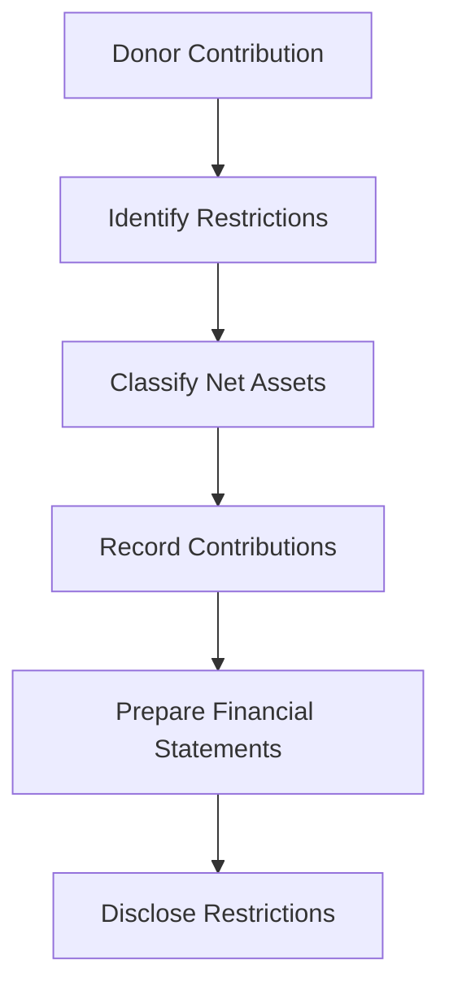

## 11.6 Donor Restrictions and Net Assets

In the realm of not-for-profit organizations, understanding donor restrictions and net assets is crucial for accurate financial reporting and compliance with accounting standards. This section delves into the classification and reporting of net assets based on donor-imposed restrictions, providing a comprehensive guide for advanced learners preparing for Canadian accounting exams.

### Understanding Donor Restrictions

Donor restrictions are conditions imposed by donors on the use of their contributions to not-for-profit organizations. These restrictions can significantly impact how an organization manages its resources and reports its financial position. There are two primary types of donor restrictions:

1. **Temporarily Restricted Net Assets:** These are resources that donors have restricted for a specific purpose or time period. Once the restriction is satisfied, these assets can be reclassified as unrestricted.

2. **Permanently Restricted Net Assets:** These are resources that donors have permanently restricted, meaning the principal amount must be maintained intact in perpetuity. Typically, only the income generated from these assets can be used, often for a specified purpose.

### Classification of Net Assets

The classification of net assets is a fundamental aspect of not-for-profit accounting. According to Canadian accounting standards, particularly the Accounting Standards for Not-for-Profit Organizations (ASNPO) under ASPE, net assets are classified into three categories:

- **Unrestricted Net Assets:** These are resources that are not subject to donor-imposed restrictions and can be used at the organization's discretion.

- **Restricted Net Assets:** This category includes both temporarily and permanently restricted net assets. The distinction between these two is crucial for financial reporting and compliance.

- **Endowment Funds:** Often classified under permanently restricted net assets, endowment funds are contributions where the principal is to be maintained intact, with only the income available for use.

### Reporting Donor Restrictions

Accurate reporting of donor restrictions is essential for transparency and accountability. Not-for-profit organizations must clearly disclose the nature and amount of donor-imposed restrictions in their financial statements. This includes:

- **Statement of Financial Position:** This statement should categorize net assets into unrestricted, temporarily restricted, and permanently restricted categories.

- **Statement of Activities:** This statement should reflect changes in each category of net assets, showing revenues, expenses, gains, and losses.

- **Notes to Financial Statements:** Detailed notes should explain the nature of restrictions, including any conditions or time limitations imposed by donors.

### Compliance with Canadian Accounting Standards

In Canada, not-for-profit organizations must adhere to specific accounting standards, primarily ASNPO under ASPE. These standards provide guidance on the recognition, measurement, presentation, and disclosure of donor restrictions and net assets. Key considerations include:

- **Recognition and Measurement:** Contributions should be recognized as revenue when received or receivable, provided the amount can be reasonably estimated and collection is reasonably assured.

- **Presentation and Disclosure:** Organizations must present net assets in their financial statements according to the categories of unrestricted, temporarily restricted, and permanently restricted. Disclosure should include the nature and purpose of restrictions.

### Practical Examples and Scenarios

To illustrate the application of these concepts, consider the following scenarios:

#### Example 1: Temporarily Restricted Donation

A donor contributes $50,000 to a not-for-profit organization, specifying that the funds must be used for a new community center. The organization records this as temporarily restricted net assets. Once the community center is built, the restriction is satisfied, and the funds are reclassified as unrestricted net assets.

#### Example 2: Permanently Restricted Endowment

A donor establishes an endowment fund of $100,000, with the stipulation that the principal must remain intact, and only the income generated can be used for scholarships. This contribution is recorded as permanently restricted net assets, with income recognized as unrestricted or temporarily restricted based on donor specifications.

### Challenges and Best Practices

Not-for-profit organizations face several challenges in managing and reporting donor restrictions:

- **Complexity of Restrictions:** Understanding and interpreting donor restrictions can be complex, particularly when conditions are vague or multifaceted.

- **Compliance and Transparency:** Ensuring compliance with accounting standards and maintaining transparency in financial reporting is critical for donor trust and regulatory compliance.

- **Resource Allocation:** Properly allocating resources according to donor restrictions requires robust financial management systems and processes.

To address these challenges, organizations should adopt best practices such as:

- **Clear Communication with Donors:** Establishing clear communication channels with donors to understand and document restrictions accurately.

- **Robust Financial Management Systems:** Implementing systems that track and manage restricted funds effectively.

- **Regular Training and Updates:** Providing regular training for staff on accounting standards and donor restrictions to ensure compliance and accuracy.

### Regulatory Scenarios and Real-World Applications

In the Canadian context, not-for-profit organizations must navigate a complex regulatory environment. Key regulatory considerations include:

- **Compliance with CPA Canada Guidelines:** Organizations should adhere to guidelines provided by CPA Canada, which offer additional insights into best practices for financial reporting and donor restrictions.

- **Adoption of IFRS for Not-for-Profit Organizations:** While ASNPO under ASPE is the primary standard, some organizations may choose to adopt IFRS for greater comparability with international peers.

- **Impact of Regulatory Changes:** Staying informed about changes in accounting standards and regulations is crucial for maintaining compliance and adapting financial reporting practices.

### Step-by-Step Guidance for Financial Reporting

To ensure accurate financial reporting of donor restrictions and net assets, follow these steps:

1. **Identify Donor Restrictions:** Review contribution agreements and donor communications to identify any restrictions on the use of funds.

2. **Classify Net Assets:** Categorize net assets into unrestricted, temporarily restricted, and permanently restricted based on donor-imposed conditions.

3. **Record Contributions:** Recognize contributions as revenue when received or receivable, ensuring compliance with recognition criteria.

4. **Prepare Financial Statements:** Present net assets in the statement of financial position and reflect changes in the statement of activities.

5. **Disclose Restrictions:** Provide detailed notes to financial statements explaining the nature and purpose of donor restrictions.

### Diagrams and Visual Aids

To enhance understanding, consider the following diagram illustrating the flow of donor-restricted funds:

### Conclusion

Understanding donor restrictions and net assets is essential for not-for-profit organizations to ensure accurate financial reporting and compliance with Canadian accounting standards. By classifying and reporting net assets based on donor-imposed restrictions, organizations can maintain transparency, accountability, and trust with donors and stakeholders.

### References and Further Reading

- CPA Canada. (2023). *Accounting Standards for Not-for-Profit Organizations (ASNPO)*.
- International Financial Reporting Standards (IFRS) Foundation. (2023). *IFRS for SMEs*.
- Chartered Professional Accountants of Canada (CPA Canada). (2023). *Financial Reporting in the Not-for-Profit Sector*.

---

## **Ready to Test Your Knowledge?**



### What are the two primary types of donor restrictions?

- [x] Temporarily restricted and permanently restricted
- [ ] Temporarily restricted and unrestricted
- [ ] Permanently restricted and unrestricted
- [ ] Restricted and unrestricted

> **Explanation:** Donor restrictions are classified into temporarily restricted and permanently restricted categories, impacting how net assets are managed and reported.

### How should a not-for-profit organization classify a donation with no donor-imposed restrictions?

- [x] As unrestricted net assets
- [ ] As temporarily restricted net assets
- [ ] As permanently restricted net assets
- [ ] As endowment funds

> **Explanation:** Donations without donor-imposed restrictions are classified as unrestricted net assets, allowing the organization to use them at its discretion.

### Which statement should reflect changes in each category of net assets?

- [x] Statement of Activities
- [ ] Statement of Financial Position
- [ ] Statement of Cash Flows
- [ ] Notes to Financial Statements

> **Explanation:** The Statement of Activities reflects changes in net assets, showing revenues, expenses, gains, and losses.

### What is the primary standard for not-for-profit accounting in Canada?

- [x] ASNPO under ASPE
- [ ] IFRS for SMEs
- [ ] GAAP
- [ ] CPA Canada Guidelines

> **Explanation:** The Accounting Standards for Not-for-Profit Organizations (ASNPO) under ASPE is the primary standard for not-for-profit accounting in Canada.

### What should be included in the notes to financial statements regarding donor restrictions?

- [x] Nature and purpose of restrictions
- [ ] Only the amount of restricted funds
- [ ] Donor names and contact information
- [ ] Future plans for restricted funds

> **Explanation:** Notes to financial statements should include the nature and purpose of donor restrictions to provide transparency and accountability.

### What is a key challenge in managing donor restrictions?

- [x] Complexity of restrictions
- [ ] Lack of donor communication
- [ ] Excessive unrestricted funds
- [ ] Over-reliance on endowment income

> **Explanation:** Understanding and interpreting complex donor restrictions can be challenging, requiring clear documentation and communication.

### How can organizations ensure compliance with accounting standards for donor restrictions?

- [x] Regular training and updates
- [ ] Ignoring minor restrictions
- [ ] Relying solely on external audits
- [ ] Minimizing donor interactions

> **Explanation:** Regular training and updates on accounting standards help ensure compliance and accuracy in financial reporting.

### What is the purpose of endowment funds?

- [x] To maintain the principal intact and use only the income
- [ ] To provide unrestricted funds for any purpose
- [ ] To cover operating expenses
- [ ] To support short-term projects

> **Explanation:** Endowment funds are intended to maintain the principal intact, with only the income generated available for use, often for a specified purpose.

### Which diagram best illustrates the flow of donor-restricted funds?

- [x] A flowchart showing identification, classification, recording, preparation, and disclosure
- [ ] A pie chart of net asset categories
- [ ] A bar graph of donation amounts
- [ ] A timeline of donor contributions

> **Explanation:** A flowchart effectively illustrates the process of managing donor-restricted funds, from identification to disclosure.

### True or False: Permanently restricted net assets can be reclassified as unrestricted once the restriction is satisfied.

- [ ] True
- [x] False

> **Explanation:** Permanently restricted net assets must remain intact in perpetuity and cannot be reclassified as unrestricted.


