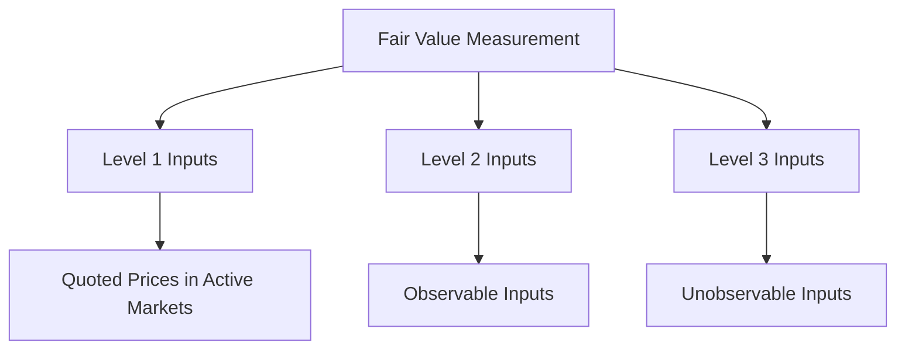

## 12.3 Fair Value Measurement

Fair value measurement is a fundamental concept in accounting, particularly when dealing with financial instruments and investments. It is crucial for accurately reflecting the value of assets and liabilities in financial statements. This section will delve into the fair value hierarchy, valuation techniques, and their application under International Financial Reporting Standards (IFRS) and Generally Accepted Accounting Principles (GAAP).

### Understanding Fair Value

Fair value is defined as the price that would be received to sell an asset or paid to transfer a liability in an orderly transaction between market participants at the measurement date. It is a market-based measurement rather than an entity-specific measurement, emphasizing the use of observable market inputs.

#### Key Concepts

- **Orderly Transaction:** A transaction that assumes exposure to the market for a period before the measurement date to allow for usual marketing activities.
- **Market Participants:** Buyers and sellers in the principal or most advantageous market for the asset or liability who are independent, knowledgeable, and willing to transact.

### Fair Value Hierarchy

The fair value hierarchy categorizes the inputs used in valuation techniques into three levels:

1. **Level 1 Inputs:** Quoted prices in active markets for identical assets or liabilities that the entity can access at the measurement date. These inputs provide the most reliable evidence of fair value.

2. **Level 2 Inputs:** Inputs other than quoted prices included in Level 1 that are observable for the asset or liability, either directly or indirectly. This includes quoted prices for similar assets in active markets or identical assets in inactive markets.

3. **Level 3 Inputs:** Unobservable inputs for the asset or liability. These inputs are used when observable inputs are not available, and they require significant judgment or estimation by the entity.

#### Diagram: Fair Value Hierarchy

### Valuation Techniques

Valuation techniques are used to determine fair value and should maximize the use of relevant observable inputs and minimize the use of unobservable inputs. Common valuation techniques include:

- **Market Approach:** Uses prices and other relevant information generated by market transactions involving identical or comparable assets or liabilities.

- **Cost Approach:** Reflects the amount that would be required currently to replace the service capacity of an asset (current replacement cost).

- **Income Approach:** Converts future amounts (e.g., cash flows or income and expenses) to a single current (discounted) amount. The fair value measurement is determined on the basis of the value indicated by current market expectations about those future amounts.

### Application of Valuation Techniques

#### Market Approach

The market approach is often used for valuing financial instruments such as stocks and bonds. For example, the fair value of a publicly traded equity security can be determined using the quoted market price on the stock exchange.

#### Cost Approach

The cost approach is typically applied to tangible assets like property, plant, and equipment. For instance, the fair value of a manufacturing plant might be estimated based on the cost to construct a similar facility at current prices.

#### Income Approach

The income approach is frequently used for valuing intangible assets or businesses. A common method under this approach is the discounted cash flow (DCF) analysis, which involves projecting future cash flows and discounting them to present value using an appropriate discount rate.

### Fair Value Measurement under IFRS and GAAP

Both IFRS and GAAP provide guidance on fair value measurement, though there are some differences in their approaches.

#### IFRS 13: Fair Value Measurement

IFRS 13 establishes a single framework for measuring fair value and requires disclosures about fair value measurements. It applies to all IFRS standards that require or permit fair value measurements or disclosures.

- **Objective:** To increase consistency and comparability in fair value measurements and related disclosures.
- **Disclosure Requirements:** Entities must provide information to help users of financial statements assess the valuation techniques and inputs used in fair value measurements.

#### ASC 820: Fair Value Measurement

ASC 820, under US GAAP, provides a framework for measuring fair value and requires disclosures about fair value measurements.

- **Objective:** Similar to IFRS 13, ASC 820 aims to increase consistency and comparability in fair value measurements.
- **Disclosure Requirements:** Entities must disclose the valuation techniques and inputs used, as well as the effect of Level 3 inputs on fair value measurements.

### Practical Examples and Case Studies

#### Example 1: Valuing a Publicly Traded Stock

Consider a company holding shares in a publicly traded company. The fair value of these shares is determined using Level 1 inputs, as the quoted market price on the stock exchange provides a reliable measure of fair value.

#### Example 2: Valuing a Private Company

For a private company, fair value measurement might rely on Level 3 inputs due to the lack of observable market data. The income approach, using a DCF analysis, could be employed to estimate the fair value based on projected cash flows and an appropriate discount rate.

### Challenges and Best Practices

#### Common Challenges

- **Lack of Observable Inputs:** For Level 3 measurements, the absence of market data can lead to increased estimation uncertainty.
- **Complexity of Valuation Models:** Advanced valuation models require significant expertise and judgment.
- **Volatility in Market Conditions:** Rapid changes in market conditions can affect the reliability of fair value measurements.

#### Best Practices

- **Use of Multiple Valuation Techniques:** Applying more than one valuation technique can enhance the reliability of fair value measurements.
- **Regular Review of Assumptions:** Continuously reviewing and updating assumptions used in valuation models is crucial for maintaining accuracy.
- **Robust Documentation:** Thorough documentation of the valuation process, including assumptions and inputs, supports transparency and auditability.

### Regulatory Considerations and Compliance

Entities must ensure compliance with applicable accounting standards and regulatory requirements when measuring fair value. This includes adhering to disclosure requirements and maintaining adequate internal controls over the valuation process.

### Exam Preparation Tips

- **Understand the Fair Value Hierarchy:** Familiarize yourself with the different levels of inputs and their implications for fair value measurement.
- **Practice Valuation Techniques:** Gain hands-on experience with market, cost, and income approaches through practical exercises and case studies.
- **Stay Updated on Standards:** Keep abreast of changes in IFRS and GAAP related to fair value measurement.

### Summary

Fair value measurement is a critical aspect of financial reporting, providing a market-based perspective on the value of assets and liabilities. By understanding the fair value hierarchy, mastering valuation techniques, and adhering to regulatory requirements, you can effectively apply fair value measurement principles in both exam scenarios and professional practice.

## **Ready to Test Your Knowledge?**



### What is the primary objective of fair value measurement?

- [x] To provide a market-based measurement of an asset or liability
- [ ] To determine the historical cost of an asset
- [ ] To calculate the book value of a liability
- [ ] To assess the intrinsic value of a company

> **Explanation:** Fair value measurement aims to provide a market-based measurement, reflecting the price that would be received to sell an asset or paid to transfer a liability in an orderly transaction.

### Which level of the fair value hierarchy uses quoted prices in active markets for identical assets?

- [x] Level 1
- [ ] Level 2
- [ ] Level 3
- [ ] Level 4

> **Explanation:** Level 1 inputs are quoted prices in active markets for identical assets or liabilities, providing the most reliable evidence of fair value.

### What valuation technique converts future amounts to a single current amount?

- [x] Income Approach
- [ ] Market Approach
- [ ] Cost Approach
- [ ] Historical Approach

> **Explanation:** The income approach converts future amounts, such as cash flows, to a single current (discounted) amount, reflecting current market expectations.

### Which standard provides guidance on fair value measurement under IFRS?

- [x] IFRS 13
- [ ] IFRS 9
- [ ] ASC 820
- [ ] IAS 16

> **Explanation:** IFRS 13 establishes a framework for measuring fair value and applies to all IFRS standards requiring fair value measurements or disclosures.

### Which of the following is a common challenge in fair value measurement?

- [x] Lack of observable inputs
- [ ] Excessive market data
- [ ] Simplicity of valuation models
- [ ] Stability in market conditions

> **Explanation:** A lack of observable inputs, particularly for Level 3 measurements, can lead to increased estimation uncertainty in fair value measurement.

### What is the purpose of using multiple valuation techniques?

- [x] To enhance the reliability of fair value measurements
- [ ] To simplify the valuation process
- [ ] To reduce the need for documentation
- [ ] To avoid using Level 1 inputs

> **Explanation:** Using multiple valuation techniques can enhance the reliability of fair value measurements by providing corroborative evidence.

### Which approach reflects the amount required to replace the service capacity of an asset?

- [x] Cost Approach
- [ ] Market Approach
- [ ] Income Approach
- [ ] Replacement Approach

> **Explanation:** The cost approach reflects the amount that would be required currently to replace the service capacity of an asset, also known as current replacement cost.

### What is a key disclosure requirement for fair value measurements?

- [x] Information about valuation techniques and inputs used
- [ ] The historical cost of the asset
- [ ] The book value of liabilities
- [ ] The intrinsic value of the company

> **Explanation:** Entities must disclose information about the valuation techniques and inputs used in fair value measurements to help users assess the reliability of the measurements.

### Which level of inputs requires significant judgment or estimation by the entity?

- [x] Level 3
- [ ] Level 1
- [ ] Level 2
- [ ] Level 4

> **Explanation:** Level 3 inputs are unobservable and require significant judgment or estimation by the entity, often due to a lack of market data.

### True or False: Fair value is an entity-specific measurement.

- [ ] True
- [x] False

> **Explanation:** Fair value is a market-based measurement, not an entity-specific one, reflecting the price in an orderly transaction between market participants.


