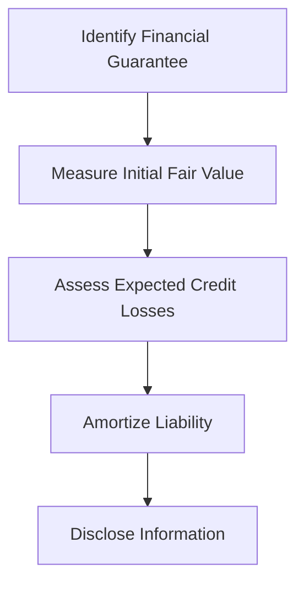

## 12.5 Accounting for Financial Guarantees

Financial guarantees are a critical component of financial instruments and investments, playing a significant role in risk management and financial stability. This section delves into the intricacies of accounting for financial guarantees, focusing on their recognition, measurement, and disclosure under Canadian accounting standards, including both IFRS and ASPE. As you prepare for the Canadian Accounting Exams, understanding these concepts will not only aid in your exam success but also enhance your professional competence in handling financial guarantees.

### Understanding Financial Guarantees

A financial guarantee is a contractual obligation where one party (the guarantor) agrees to compensate another party (the beneficiary) for a loss incurred if a third party (the debtor) fails to fulfill a financial obligation. Common examples include loan guarantees, bond insurance, and credit default swaps.

#### Key Characteristics of Financial Guarantees

- **Contingent Liability:** The guarantor's obligation is contingent upon the debtor's default.
- **Risk Transfer:** The risk of default is transferred from the beneficiary to the guarantor.
- **Credit Enhancement:** Financial guarantees often enhance the creditworthiness of the debtor.

### Recognition and Measurement

#### Initial Recognition

Under IFRS 9, financial guarantee contracts are recognized initially at fair value. The fair value is typically the premium received for issuing the guarantee, reflecting the market's assessment of the risk of default.

- **Example:** If a company issues a financial guarantee for a loan and receives a premium of $10,000, this amount represents the initial fair value of the guarantee.

#### Subsequent Measurement

After initial recognition, financial guarantees are measured at the higher of:

1. The amount determined in accordance with the expected credit loss model under IFRS 9.
2. The amount initially recognized less cumulative amortization recognized in accordance with IFRS 15.

- **Expected Credit Loss Model:** This model requires the estimation of credit losses based on historical, current, and forward-looking information.
- **Amortization:** The initial fair value is amortized over the term of the guarantee, reflecting the gradual release of the obligation.

#### ASPE Considerations

For entities reporting under ASPE, financial guarantees are recognized as liabilities when it is more likely than not that the guarantee will result in a future outflow of resources. The liability is initially measured at the best estimate of the amount required to settle the obligation.

### Disclosure Requirements

Financial guarantees require comprehensive disclosure to provide users of financial statements with relevant information about the nature, extent, and management of the risks associated with these instruments.

#### Key Disclosures Include:

- **Nature and Terms:** Description of the guarantee, including the parties involved and the terms of the contract.
- **Risk Management:** Information on how the entity manages the risk associated with financial guarantees.
- **Carrying Amounts:** The carrying amounts of financial guarantee liabilities.
- **Credit Risk Exposure:** Details of the maximum exposure to credit risk without considering collateral.

### Practical Examples and Case Studies

#### Example 1: Loan Guarantee

Company A guarantees a $500,000 loan for Company B. The fair value of the guarantee at inception is determined to be $15,000. Under IFRS 9, Company A recognizes a liability of $15,000. Over time, Company A must assess the expected credit losses and adjust the liability accordingly.

#### Example 2: Bond Insurance

An insurance company provides a financial guarantee on a bond issue, enhancing the bond's credit rating. The initial premium received is $50,000. The insurance company must recognize this amount as a liability and adjust it based on expected credit losses and amortization.

### Real-World Applications

Financial guarantees are prevalent in various industries, including banking, insurance, and corporate finance. Understanding their accounting treatment is crucial for professionals involved in financial reporting, risk management, and investment analysis.

### Regulatory Scenarios

#### IFRS vs. ASPE

While IFRS provides a detailed framework for accounting for financial guarantees, ASPE offers a more simplified approach. Professionals must be adept at navigating these differences, especially when transitioning between reporting frameworks.

### Step-by-Step Guidance

1. **Identify the Financial Guarantee:** Determine whether a contract meets the definition of a financial guarantee.
2. **Measure Initial Fair Value:** Calculate the fair value at inception, typically the premium received.
3. **Assess Expected Credit Losses:** Use historical, current, and forward-looking data to estimate credit losses.
4. **Amortize the Liability:** Gradually reduce the liability over the guarantee's term.
5. **Disclose Required Information:** Ensure all relevant disclosures are included in the financial statements.

### Diagrams and Visuals

Below is a diagram illustrating the flow of accounting for financial guarantees:

### Best Practices and Common Pitfalls

#### Best Practices

- **Regularly Update Estimates:** Continuously assess and update expected credit losses to reflect current conditions.
- **Comprehensive Disclosures:** Provide detailed disclosures to enhance transparency and user understanding.

#### Common Pitfalls

- **Underestimating Credit Losses:** Failing to accurately estimate credit losses can lead to significant financial misstatements.
- **Inadequate Disclosures:** Insufficient disclosures can obscure the financial position and risk exposure of the entity.

### References and Additional Resources

- **IFRS 9 Financial Instruments:** Comprehensive guide to accounting for financial instruments, including financial guarantees.
- **CPA Canada Handbook:** Provides authoritative guidance on Canadian accounting standards.
- **Accounting Standards for Private Enterprises (ASPE):** Framework for entities reporting under ASPE.

### Summary

Accounting for financial guarantees involves recognizing and measuring these contracts in accordance with applicable standards. By understanding the principles outlined in this guide, you can effectively navigate the complexities of financial guarantees, enhancing your exam preparation and professional expertise.

## **Ready to Test Your Knowledge?**



### What is the initial recognition of a financial guarantee under IFRS 9?

- [x] Fair value
- [ ] Amortized cost
- [ ] Historical cost
- [ ] Net realizable value

> **Explanation:** Under IFRS 9, financial guarantees are initially recognized at fair value, which is typically the premium received for issuing the guarantee.

### Which model is used to measure expected credit losses for financial guarantees?

- [x] Expected Credit Loss Model
- [ ] Historical Loss Model
- [ ] Current Loss Model
- [ ] Forward-Looking Loss Model

> **Explanation:** The Expected Credit Loss Model is used to estimate credit losses based on historical, current, and forward-looking information.

### What is the primary purpose of a financial guarantee?

- [x] To transfer risk from the beneficiary to the guarantor
- [ ] To increase the debtor's liability
- [ ] To decrease the guarantor's assets
- [ ] To eliminate the debtor's obligation

> **Explanation:** A financial guarantee transfers the risk of default from the beneficiary to the guarantor, providing credit enhancement.

### What is a common pitfall in accounting for financial guarantees?

- [x] Underestimating credit losses
- [ ] Overestimating fair value
- [ ] Misclassifying liabilities
- [ ] Ignoring amortization

> **Explanation:** Underestimating credit losses can lead to significant financial misstatements, impacting the accuracy of financial reporting.

### How should financial guarantees be disclosed in financial statements?

- [x] With comprehensive information about nature, terms, and risk management
- [ ] Only with the carrying amount
- [ ] Without any specific details
- [ ] With minimal information

> **Explanation:** Comprehensive disclosures provide users with relevant information about the nature, extent, and management of risks associated with financial guarantees.

### What is the fair value of a financial guarantee typically based on?

- [x] The premium received for issuing the guarantee
- [ ] The debtor's credit rating
- [ ] The guarantor's financial position
- [ ] The beneficiary's risk assessment

> **Explanation:** The fair value of a financial guarantee is typically the premium received, reflecting the market's assessment of the risk of default.

### What is the ASPE approach to recognizing financial guarantees?

- [x] Recognize as liabilities when it is more likely than not that the guarantee will result in a future outflow
- [ ] Recognize at fair value
- [ ] Recognize at historical cost
- [ ] Recognize only when the debtor defaults

> **Explanation:** Under ASPE, financial guarantees are recognized as liabilities when it is more likely than not that the guarantee will result in a future outflow of resources.

### What is the impact of financial guarantees on creditworthiness?

- [x] They enhance the creditworthiness of the debtor
- [ ] They decrease the creditworthiness of the guarantor
- [ ] They have no impact on creditworthiness
- [ ] They eliminate the need for credit assessment

> **Explanation:** Financial guarantees often enhance the creditworthiness of the debtor by providing assurance to the beneficiary.

### What is a key characteristic of financial guarantees?

- [x] Contingent liability
- [ ] Fixed asset
- [ ] Current liability
- [ ] Non-current asset

> **Explanation:** Financial guarantees are contingent liabilities, as the guarantor's obligation is contingent upon the debtor's default.

### True or False: Financial guarantees are only relevant in the banking industry.

- [ ] True
- [x] False

> **Explanation:** Financial guarantees are relevant across various industries, including banking, insurance, and corporate finance, due to their role in risk management and credit enhancement.


