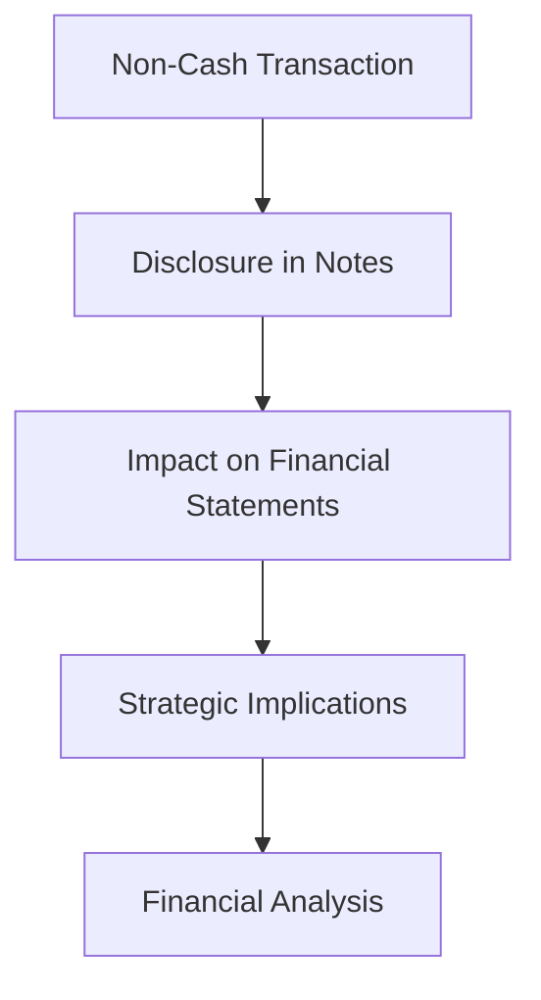

## 13.6 Non-Cash Investing and Financing Activities

In the realm of accounting, understanding non-cash investing and financing activities is crucial for accurate financial reporting and analysis. These activities, while not directly affecting cash flow, have significant implications for a company's financial health and strategic decisions. This section will delve into the nature of non-cash transactions, their reporting requirements, and their impact on consolidated cash flow statements, particularly within the context of Canadian accounting standards.

### Understanding Non-Cash Investing and Financing Activities

**Non-cash investing and financing activities** are transactions that do not involve direct cash flows but still affect a company's financial position. These activities are crucial for providing a complete picture of a company's financial activities and are typically disclosed in the notes to the financial statements rather than in the main body of the cash flow statement.

#### Key Characteristics

1. **No Immediate Cash Impact**: These transactions do not result in immediate cash inflows or outflows.
2. **Long-term Financial Implications**: They often involve significant changes in the company's assets or liabilities.
3. **Disclosure Requirements**: While not included in the cash flow statement, they must be disclosed in the financial statements to provide a comprehensive view of the company's financial activities.

#### Examples of Non-Cash Transactions

- **Issuance of Shares for Assets**: A company may issue shares in exchange for acquiring another company's assets.
- **Conversion of Debt to Equity**: A creditor may convert debt into equity, altering the company's capital structure without affecting cash flow.
- **Acquisition of Assets through Leases**: Under IFRS 16, many leases are recognized as assets and liabilities, impacting the balance sheet without immediate cash transactions.
- **Exchange of Non-Cash Assets**: Companies may swap assets, such as equipment or property, which affects their asset base without cash involvement.

### Reporting Non-Cash Investing and Financing Activities

According to Canadian accounting standards, specifically IFRS and ASPE, non-cash investing and financing activities must be disclosed in the notes to the financial statements. This disclosure ensures transparency and provides stakeholders with a complete understanding of the company's financial activities.

#### IFRS and ASPE Guidelines

- **IFRS (International Financial Reporting Standards)**: Under IFRS, entities must disclose significant non-cash transactions in the notes to the financial statements. This disclosure helps users understand the full scope of the company's investing and financing activities.
- **ASPE (Accounting Standards for Private Enterprises)**: Similar to IFRS, ASPE requires the disclosure of non-cash transactions to ensure that financial statements provide a true and fair view of the company's financial position.

### Impact on Cash Flow Statements

Non-cash investing and financing activities do not appear in the cash flow statement's main sections (operating, investing, and financing activities) because they do not involve cash transactions. However, their disclosure is crucial for understanding the company's financial strategy and resource allocation.

#### Example: Cash Flow Statement Presentation

Consider a company that issues shares to acquire a subsidiary. This transaction does not involve cash but significantly impacts the company's financial structure. In the cash flow statement, this transaction would be disclosed in the notes, providing context for the changes in the company's equity and asset base.

### Practical Examples and Case Studies

#### Case Study 1: Conversion of Convertible Bonds

A Canadian technology company issued convertible bonds worth $10 million. During the fiscal year, bondholders converted $5 million of these bonds into equity. This conversion did not involve cash but significantly altered the company's debt-to-equity ratio.

- **Disclosure**: The company disclosed this transaction in the notes to the financial statements, highlighting the impact on its capital structure.
- **Financial Implications**: The conversion improved the company's leverage ratios, potentially enhancing its creditworthiness.

#### Case Study 2: Asset Exchange between Companies

Two manufacturing companies agreed to exchange machinery valued at $2 million. This transaction, while not involving cash, affected both companies' asset bases and required disclosure in their financial statements.

- **Disclosure**: Both companies provided detailed notes explaining the nature and impact of the asset exchange.
- **Strategic Implications**: The exchange allowed both companies to optimize their production capabilities without affecting their cash reserves.

### Real-World Applications and Regulatory Scenarios

In practice, non-cash investing and financing activities are common in mergers and acquisitions, corporate restructurings, and strategic alliances. Understanding these transactions is essential for accountants and financial analysts, as they provide insights into a company's strategic direction and financial health.

#### Regulatory Considerations

- **Compliance with IFRS and ASPE**: Companies must adhere to the disclosure requirements set forth by IFRS and ASPE to ensure transparency and compliance with regulatory standards.
- **Audit Implications**: Auditors must verify the accuracy and completeness of non-cash transaction disclosures, as these can significantly impact the financial statements' integrity.

### Best Practices and Common Pitfalls

#### Best Practices

1. **Comprehensive Disclosure**: Ensure that all significant non-cash transactions are disclosed in the notes to the financial statements.
2. **Clear Documentation**: Maintain detailed records of non-cash transactions to support financial statement disclosures and audits.
3. **Regular Review**: Periodically review non-cash transactions to assess their impact on the company's financial position and strategic objectives.

#### Common Pitfalls

1. **Incomplete Disclosure**: Failing to disclose significant non-cash transactions can lead to misleading financial statements and regulatory non-compliance.
2. **Inadequate Documentation**: Poor record-keeping can hinder the accurate reporting and auditing of non-cash transactions.
3. **Overlooking Strategic Implications**: Ignoring the long-term impact of non-cash transactions can result in suboptimal financial and strategic decisions.

### Exam Strategies and Practical Tips

For those preparing for Canadian accounting exams, understanding non-cash investing and financing activities is essential. Here are some strategies to help you succeed:

1. **Familiarize Yourself with Standards**: Review IFRS and ASPE guidelines on non-cash transactions to understand their reporting requirements.
2. **Practice with Real-World Examples**: Analyze case studies and practice problems to apply theoretical concepts to practical scenarios.
3. **Focus on Disclosure**: Pay attention to how non-cash transactions are disclosed in financial statements, as this is a key area of examination.

### Sample Exam-Style Questions

To reinforce your understanding, consider the following practice questions related to non-cash investing and financing activities:

1. **What are non-cash investing and financing activities, and why are they important in financial reporting?**

2. **Explain how the conversion of debt to equity is reported in financial statements under IFRS.**

3. **Describe a scenario where a company might engage in a non-cash asset exchange and its implications for financial reporting.**

4. **What are the key disclosure requirements for non-cash transactions under ASPE?**

5. **How do non-cash transactions affect a company's cash flow statement and overall financial analysis?**

### Diagrams and Visual Aids

To enhance your understanding, consider the following diagram illustrating the flow of non-cash transactions and their impact on financial statements:

This diagram highlights the process from identifying a non-cash transaction to its strategic and financial implications, emphasizing the importance of comprehensive disclosure and analysis.

### Conclusion

Non-cash investing and financing activities, while not directly affecting cash flows, play a critical role in financial reporting and analysis. By understanding these transactions and their implications, accountants and financial analysts can provide a more accurate and comprehensive view of a company's financial health. As you prepare for your Canadian accounting exams, focus on mastering the disclosure requirements and strategic implications of non-cash transactions to excel in your studies and future career.

## **Ready to Test Your Knowledge?**



### What are non-cash investing and financing activities?

- [x] Transactions that do not involve direct cash flows but affect a company's financial position.
- [ ] Transactions that only involve cash inflows.
- [ ] Transactions that only involve cash outflows.
- [ ] Transactions that do not affect a company's financial position.

> **Explanation:** Non-cash investing and financing activities are transactions that do not involve direct cash flows but still impact a company's financial position, such as issuing shares for assets or converting debt to equity.

### How are non-cash transactions reported under IFRS?

- [x] Disclosed in the notes to the financial statements.
- [ ] Included in the main sections of the cash flow statement.
- [ ] Not reported at all.
- [ ] Only reported if they exceed a certain monetary threshold.

> **Explanation:** Under IFRS, non-cash transactions must be disclosed in the notes to the financial statements to provide a complete picture of the company's financial activities.

### Which of the following is an example of a non-cash transaction?

- [x] Conversion of debt to equity.
- [ ] Payment of dividends in cash.
- [ ] Purchase of inventory with cash.
- [ ] Sale of goods for cash.

> **Explanation:** The conversion of debt to equity is a non-cash transaction as it alters the company's capital structure without involving cash.

### What is the impact of non-cash transactions on the cash flow statement?

- [x] They are disclosed in the notes and do not appear in the main sections.
- [ ] They are included in the operating activities section.
- [ ] They are included in the investing activities section.
- [ ] They are included in the financing activities section.

> **Explanation:** Non-cash transactions are disclosed in the notes to the financial statements and do not appear in the main sections of the cash flow statement.

### Why is it important to disclose non-cash transactions?

- [x] To provide a complete view of the company's financial activities.
- [ ] To inflate the company's cash flow.
- [ ] To hide financial discrepancies.
- [ ] To comply with tax regulations.

> **Explanation:** Disclosing non-cash transactions is important to provide stakeholders with a complete understanding of the company's financial activities and strategic decisions.

### What is a common pitfall in reporting non-cash transactions?

- [x] Incomplete disclosure.
- [ ] Over-disclosure.
- [ ] Reporting them as cash transactions.
- [ ] Ignoring them in financial analysis.

> **Explanation:** A common pitfall is incomplete disclosure, which can lead to misleading financial statements and regulatory non-compliance.

### How can non-cash transactions affect a company's financial analysis?

- [x] By altering the company's financial position without affecting cash flow.
- [ ] By increasing the company's cash reserves.
- [ ] By decreasing the company's liabilities.
- [ ] By having no impact on the company's financial position.

> **Explanation:** Non-cash transactions can significantly alter a company's financial position, impacting financial analysis without affecting cash flow.

### What is the role of auditors in non-cash transaction reporting?

- [x] To verify the accuracy and completeness of disclosures.
- [ ] To prepare the financial statements.
- [ ] To hide non-cash transactions.
- [ ] To convert non-cash transactions into cash transactions.

> **Explanation:** Auditors must verify the accuracy and completeness of non-cash transaction disclosures to ensure the integrity of the financial statements.

### Which standard requires the disclosure of non-cash transactions in Canada?

- [x] Both IFRS and ASPE.
- [ ] Only IFRS.
- [ ] Only ASPE.
- [ ] Neither IFRS nor ASPE.

> **Explanation:** Both IFRS and ASPE require the disclosure of non-cash transactions to ensure transparency and a true and fair view of the company's financial position.

### True or False: Non-cash transactions are included in the cash flow statement's main sections.

- [ ] True
- [x] False

> **Explanation:** False. Non-cash transactions are not included in the main sections of the cash flow statement; they are disclosed in the notes to provide additional context.


