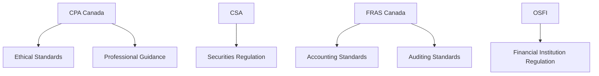

## 16.2 Legal and Regulatory Environment

In the realm of accounting, the legal and regulatory environment plays a pivotal role in shaping the practices and standards that professionals must adhere to. Understanding these regulations is not only crucial for compliance but also for maintaining the integrity and reliability of financial reporting. This section delves into the various laws and regulations that govern accounting practices, with a focus on the Canadian context, while also considering international standards and their implications.

### Overview of the Legal Environment in Accounting

The legal environment in accounting encompasses a broad spectrum of laws and regulations that dictate how financial transactions should be recorded, reported, and audited. These laws are designed to ensure transparency, accuracy, and fairness in financial reporting, protecting the interests of stakeholders such as investors, creditors, and the public.

#### Key Canadian Legislation Affecting Accounting

1. **Canada Business Corporations Act (CBCA):** This act governs the incorporation and operation of businesses in Canada, outlining requirements for financial reporting and disclosures.

2. **Securities Acts:** Each province and territory in Canada has its own securities legislation, which regulates the trading of securities and requires public companies to adhere to specific reporting standards.

3. **Income Tax Act:** This act outlines the tax obligations of individuals and corporations, influencing how financial transactions are recorded and reported for tax purposes.

4. **Bankruptcy and Insolvency Act:** This legislation affects how financial information is reported in cases of bankruptcy and insolvency.

5. **Privacy Legislation (PIPEDA):** The Personal Information Protection and Electronic Documents Act governs the collection, use, and disclosure of personal information, impacting how accountants manage client data.

### Regulatory Bodies and Their Roles

Regulatory bodies are essential in enforcing accounting standards and ensuring compliance with legal requirements. In Canada, several key organizations oversee the accounting profession:

1. **CPA Canada (Chartered Professional Accountants of Canada):** CPA Canada is the national organization representing the accounting profession, responsible for setting ethical standards and providing guidance on best practices.

2. **Canadian Securities Administrators (CSA):** The CSA is an umbrella organization of provincial and territorial securities regulators, working to harmonize securities regulation across Canada.

3. **Financial Reporting and Assurance Standards Canada (FRAS Canada):** This body oversees the setting of accounting and auditing standards in Canada, including the Accounting Standards Board (AcSB) and the Auditing and Assurance Standards Board (AASB).

4. **Office of the Superintendent of Financial Institutions (OSFI):** OSFI regulates and supervises federally regulated financial institutions, ensuring they adhere to sound accounting practices.

### International Standards and Their Influence

While Canadian accounting standards are primarily governed by national regulations, international standards also play a significant role. The two main international frameworks are:

1. **International Financial Reporting Standards (IFRS):** Adopted by publicly accountable enterprises in Canada, IFRS provides a global framework for financial reporting, promoting consistency and comparability across borders.

2. **Generally Accepted Accounting Principles (GAAP):** While Canadian GAAP has largely converged with IFRS, private enterprises may still use ASPE (Accounting Standards for Private Enterprises), which is based on GAAP principles.

### Compliance and Ethical Considerations

Compliance with legal and regulatory requirements is a fundamental responsibility of accounting professionals. Ethical considerations are equally important, as they guide accountants in making decisions that uphold the integrity of the profession. Key ethical principles include:

- **Integrity:** Accountants must be honest and forthright in all professional and business relationships.
- **Objectivity:** Accountants should not allow bias, conflict of interest, or undue influence to override professional judgments.
- **Professional Competence and Due Care:** Accountants must maintain professional knowledge and skill at the level required to ensure that clients or employers receive competent professional services.
- **Confidentiality:** Accountants must respect the confidentiality of information acquired as a result of professional and business relationships.
- **Professional Behavior:** Accountants must comply with relevant laws and regulations and avoid any action that discredits the profession.

### Practical Examples and Case Studies

#### Example 1: Compliance with IFRS in Canadian Public Companies

A Canadian public company, XYZ Corp, is required to prepare its financial statements in accordance with IFRS. This involves recognizing revenue according to the five-step model outlined in IFRS 15, which ensures that revenue is reported accurately and consistently.

#### Example 2: Privacy Legislation and Accounting Practices

An accounting firm, ABC Accounting, must comply with PIPEDA when handling client information. This involves implementing policies to protect personal data and ensuring that all staff are trained in privacy practices.

#### Case Study: The Impact of Non-Compliance

In 2018, a major Canadian corporation faced penalties for failing to comply with securities regulations. The company had not accurately disclosed certain financial information, leading to a loss of investor confidence and a significant drop in stock value. This case highlights the importance of adhering to regulatory requirements and the potential consequences of non-compliance.

### Real-World Applications and Regulatory Scenarios

Accountants must navigate complex regulatory environments, applying their knowledge to real-world scenarios. This includes:

- **Preparing Financial Statements:** Ensuring that financial statements comply with applicable standards and regulations.
- **Tax Compliance:** Accurately reporting taxable income and adhering to tax laws to avoid penalties.
- **Audit and Assurance Services:** Providing independent assurance that financial statements are free from material misstatement.

### Step-by-Step Guidance for Compliance

1. **Stay Informed:** Regularly update your knowledge of relevant laws and regulations through continuing professional education and resources provided by CPA Canada.

2. **Implement Internal Controls:** Establish robust internal controls to ensure compliance with accounting standards and regulations.

3. **Conduct Regular Audits:** Perform regular audits to identify and address any compliance issues promptly.

4. **Document Procedures:** Maintain thorough documentation of all accounting procedures and decisions to demonstrate compliance.

5. **Seek Professional Advice:** Consult with legal and accounting experts when faced with complex regulatory issues.

### Diagrams and Visual Aids

To enhance understanding, the following diagram illustrates the relationship between Canadian regulatory bodies and accounting standards:

### Best Practices and Common Pitfalls

**Best Practices:**

- **Regular Training:** Ensure all staff are trained in current accounting standards and regulatory requirements.
- **Ethical Culture:** Foster an organizational culture that prioritizes ethics and compliance.
- **Risk Management:** Implement a risk management framework to identify and mitigate compliance risks.

**Common Pitfalls:**

- **Ignoring Updates:** Failing to stay updated on changes in laws and regulations can lead to non-compliance.
- **Inadequate Documentation:** Poor documentation can make it difficult to demonstrate compliance during audits.
- **Overlooking Ethical Considerations:** Focusing solely on compliance without considering ethical implications can damage reputation.

### References and Additional Resources

- **CPA Canada:** [CPA Canada's Official Website](https://www.cpacanada.ca/)
- **IFRS Foundation:** [IFRS Standards](https://www.ifrs.org/)
- **Canadian Securities Administrators:** [CSA Website](https://www.securities-administrators.ca/)
- **Office of the Superintendent of Financial Institutions:** [OSFI Website](https://www.osfi-bsif.gc.ca/)

### Summary and Key Points

- The legal and regulatory environment in accounting is complex and multifaceted, requiring professionals to stay informed and compliant.
- Canadian accounting practices are governed by national legislation, regulatory bodies, and international standards such as IFRS.
- Ethical considerations are integral to maintaining the integrity of the accounting profession.
- Practical examples and case studies illustrate the importance of compliance and the potential consequences of non-compliance.
- Best practices include regular training, fostering an ethical culture, and implementing robust internal controls.

### Ready to Test Your Knowledge?



### Which Canadian act governs the incorporation and operation of businesses?

- [x] Canada Business Corporations Act (CBCA)
- [ ] Income Tax Act
- [ ] Bankruptcy and Insolvency Act
- [ ] Personal Information Protection and Electronic Documents Act (PIPEDA)

> **Explanation:** The Canada Business Corporations Act (CBCA) governs the incorporation and operation of businesses in Canada.

### What is the role of CPA Canada?

- [x] Setting ethical standards and providing guidance on best practices
- [ ] Regulating securities trading
- [ ] Supervising federally regulated financial institutions
- [ ] Enforcing privacy legislation

> **Explanation:** CPA Canada is responsible for setting ethical standards and providing guidance on best practices for the accounting profession.

### Which international standard is adopted by publicly accountable enterprises in Canada?

- [x] International Financial Reporting Standards (IFRS)
- [ ] Generally Accepted Accounting Principles (GAAP)
- [ ] Accounting Standards for Private Enterprises (ASPE)
- [ ] Canadian Securities Administrators (CSA)

> **Explanation:** International Financial Reporting Standards (IFRS) are adopted by publicly accountable enterprises in Canada.

### What is a key ethical principle in accounting?

- [x] Integrity
- [ ] Profit Maximization
- [ ] Competitive Advantage
- [ ] Market Share

> **Explanation:** Integrity is a key ethical principle in accounting, ensuring honesty and transparency in professional relationships.

### What is the primary focus of the Income Tax Act?

- [x] Tax obligations of individuals and corporations
- [ ] Incorporation of businesses
- [ ] Securities trading
- [ ] Privacy protection

> **Explanation:** The Income Tax Act outlines the tax obligations of individuals and corporations in Canada.

### Which body harmonizes securities regulation across Canada?

- [x] Canadian Securities Administrators (CSA)
- [ ] CPA Canada
- [ ] Office of the Superintendent of Financial Institutions (OSFI)
- [ ] Financial Reporting and Assurance Standards Canada (FRAS Canada)

> **Explanation:** The Canadian Securities Administrators (CSA) work to harmonize securities regulation across Canada.

### What is a common pitfall in accounting compliance?

- [x] Ignoring updates to laws and regulations
- [ ] Regular training of staff
- [ ] Implementing internal controls
- [ ] Conducting regular audits

> **Explanation:** Ignoring updates to laws and regulations can lead to non-compliance, which is a common pitfall in accounting.

### Which act governs the collection, use, and disclosure of personal information?

- [x] Personal Information Protection and Electronic Documents Act (PIPEDA)
- [ ] Canada Business Corporations Act (CBCA)
- [ ] Income Tax Act
- [ ] Bankruptcy and Insolvency Act

> **Explanation:** The Personal Information Protection and Electronic Documents Act (PIPEDA) governs the collection, use, and disclosure of personal information.

### What is the purpose of the Office of the Superintendent of Financial Institutions (OSFI)?

- [x] Regulating and supervising federally regulated financial institutions
- [ ] Setting ethical standards for accountants
- [ ] Harmonizing securities regulation
- [ ] Enforcing privacy legislation

> **Explanation:** The Office of the Superintendent of Financial Institutions (OSFI) regulates and supervises federally regulated financial institutions.

### True or False: Ethical considerations are separate from compliance in accounting.

- [ ] True
- [x] False

> **Explanation:** Ethical considerations are integral to compliance in accounting, guiding professionals in maintaining integrity and transparency.


