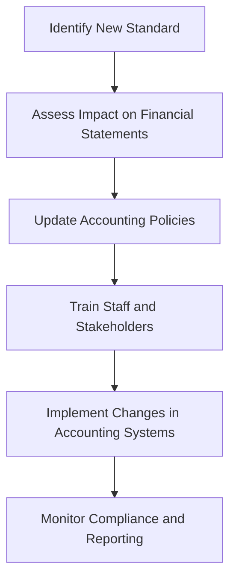

## 17.4 Changes in Regulatory Standards

In the dynamic world of accounting, regulatory standards are continually evolving to address emerging challenges, technological advancements, and global economic shifts. As a future accounting professional, understanding these changes is crucial for ensuring compliance and maintaining the integrity of financial reporting. This section provides an in-depth exploration of anticipated updates to accounting regulations and standards, with a focus on their implications for Canadian accounting practices.

### Understanding Regulatory Standards in Accounting

Regulatory standards in accounting are established to ensure consistency, transparency, and reliability in financial reporting. These standards are developed by authoritative bodies such as the International Accounting Standards Board (IASB) and the Financial Accounting Standards Board (FASB), which set the International Financial Reporting Standards (IFRS) and Generally Accepted Accounting Principles (GAAP), respectively. In Canada, the Accounting Standards Board (AcSB) is responsible for adopting and adapting these standards to suit the Canadian context.

### Key Drivers of Changes in Regulatory Standards

Several factors drive changes in regulatory standards, including:

1. **Technological Advancements:** The rise of digital technologies, such as blockchain and artificial intelligence, necessitates updates to standards to accommodate new ways of recording and verifying transactions.

2. **Globalization:** As businesses operate across borders, there is a need for harmonized standards that facilitate international trade and investment.

3. **Economic Shifts:** Changes in the global economy, such as financial crises or shifts in market dynamics, can lead to revisions in standards to address new risks and challenges.

4. **Stakeholder Expectations:** Investors, regulators, and the public demand greater transparency and accountability, prompting updates to standards that enhance disclosure and reporting.

5. **Environmental and Social Considerations:** Increasing awareness of environmental and social issues drives the integration of sustainability reporting into financial standards.

### Recent and Anticipated Changes in Accounting Standards

#### 1. International Financial Reporting Standards (IFRS)

The IFRS are continually updated to reflect the changing business environment. Some recent and anticipated changes include:

- **IFRS 17 - Insurance Contracts:** This standard, effective from January 2023, introduces a comprehensive framework for accounting for insurance contracts, aiming to increase transparency and comparability.

- **IFRS 16 - Leases:** This standard requires lessees to recognize most leases on the balance sheet, reflecting the true economic impact of lease obligations.

- **IFRS 9 - Financial Instruments:** Updates to this standard address the classification and measurement of financial instruments, impairment, and hedge accounting.

#### 2. Generally Accepted Accounting Principles (GAAP)

In the United States, GAAP is the primary accounting framework. Recent updates include:

- **Revenue Recognition (ASC 606):** This standard provides a five-step model for recognizing revenue from contracts with customers, emphasizing the transfer of control.

- **Leases (ASC 842):** Similar to IFRS 16, this standard requires lessees to recognize lease liabilities and right-of-use assets on the balance sheet.

- **Credit Losses (ASC 326):** This standard introduces the Current Expected Credit Loss (CECL) model, requiring earlier recognition of credit losses.

#### 3. Canadian Accounting Standards

In Canada, the AcSB adopts IFRS for publicly accountable enterprises and develops the Accounting Standards for Private Enterprises (ASPE) for private companies. Recent changes include:

- **ASPE 3065 - Leases:** Aligns with IFRS 16, requiring lessees to recognize lease liabilities and right-of-use assets.

- **ASPE 3856 - Financial Instruments:** Updates address the classification and measurement of financial instruments, similar to IFRS 9.

### Impact of Regulatory Changes on Canadian Accounting Practices

The changes in regulatory standards have significant implications for Canadian accounting practices, including:

1. **Increased Complexity:** New standards often introduce complex requirements that necessitate a deep understanding of accounting principles and meticulous attention to detail.

2. **Enhanced Transparency:** Updated standards aim to improve the transparency and comparability of financial statements, benefiting investors and other stakeholders.

3. **Compliance Challenges:** Adapting to new standards requires significant effort from organizations, including updating accounting systems, training staff, and revising internal controls.

4. **Strategic Opportunities:** While challenging, regulatory changes also present opportunities for organizations to enhance their financial reporting and gain a competitive edge.

### Practical Examples and Case Studies

To illustrate the impact of regulatory changes, consider the following examples:

#### Example 1: IFRS 16 - Leases

A Canadian retail company with numerous lease agreements must transition to IFRS 16. This requires recognizing lease liabilities and right-of-use assets on the balance sheet, impacting financial ratios and potentially altering loan covenants. The company must update its accounting systems and train staff to ensure compliance.

#### Example 2: IFRS 9 - Financial Instruments

A Canadian bank must implement IFRS 9, which changes how it classifies and measures financial instruments. The bank must develop new models to assess credit risk and estimate expected credit losses, impacting its financial statements and capital requirements.

### Real-World Applications and Compliance Considerations

In practice, accounting professionals must navigate the complexities of regulatory changes by:

1. **Staying Informed:** Regularly reviewing updates from authoritative bodies such as the AcSB, IASB, and FASB.

2. **Continuous Learning:** Engaging in professional development to enhance understanding of new standards and their implications.

3. **Implementing Robust Systems:** Developing accounting systems and internal controls that facilitate compliance with updated standards.

4. **Collaborating with Stakeholders:** Working closely with auditors, regulators, and other stakeholders to ensure accurate and compliant financial reporting.

### Diagrams and Visuals

To enhance understanding, consider the following diagram illustrating the process of adopting new accounting standards:

### Best Practices and Common Pitfalls

When navigating changes in regulatory standards, consider the following best practices:

- **Proactive Planning:** Anticipate changes and develop a plan for implementation well in advance of the effective date.

- **Comprehensive Training:** Ensure all relevant staff are trained on new standards and understand their implications.

- **Effective Communication:** Clearly communicate changes to stakeholders, including investors, auditors, and regulators.

Common pitfalls to avoid include:

- **Delayed Implementation:** Failing to implement changes in a timely manner can lead to non-compliance and financial penalties.

- **Inadequate Documentation:** Ensure all changes are well-documented to support compliance and facilitate audits.

### References and Additional Resources

For further exploration of regulatory changes, consider the following resources:

- **CPA Canada:** Provides updates on Canadian accounting standards and offers professional development opportunities.

- **IASB and FASB Websites:** Offer comprehensive information on IFRS and GAAP updates.

- **Accounting Journals and Publications:** Stay informed on emerging issues and best practices in accounting.

### Summary and Key Points

In summary, changes in regulatory standards are a constant in the accounting profession, driven by technological advancements, globalization, and stakeholder expectations. Understanding these changes is crucial for ensuring compliance and maintaining the integrity of financial reporting. By staying informed, engaging in continuous learning, and implementing robust systems, accounting professionals can navigate the evolving landscape of regulatory standards with confidence.

## **Ready to Test Your Knowledge?**



### What is the primary purpose of regulatory standards in accounting?

- [x] To ensure consistency, transparency, and reliability in financial reporting
- [ ] To increase the complexity of financial statements
- [ ] To reduce the need for professional accountants
- [ ] To limit the scope of financial audits

> **Explanation:** Regulatory standards are established to ensure consistency, transparency, and reliability in financial reporting, which is essential for stakeholders to make informed decisions.

### Which standard requires lessees to recognize most leases on the balance sheet?

- [x] IFRS 16
- [ ] IFRS 9
- [ ] ASC 606
- [ ] ASPE 3856

> **Explanation:** IFRS 16 requires lessees to recognize most leases on the balance sheet, reflecting the true economic impact of lease obligations.

### What is the focus of IFRS 17?

- [x] Insurance contracts
- [ ] Financial instruments
- [ ] Revenue recognition
- [ ] Lease accounting

> **Explanation:** IFRS 17 introduces a comprehensive framework for accounting for insurance contracts, aiming to increase transparency and comparability.

### Which standard introduces the Current Expected Credit Loss (CECL) model?

- [x] ASC 326
- [ ] ASC 842
- [ ] IFRS 9
- [ ] ASPE 3065

> **Explanation:** ASC 326 introduces the CECL model, requiring earlier recognition of credit losses.

### What is a key driver of changes in regulatory standards?

- [x] Technological advancements
- [ ] Decreased globalization
- [ ] Reduced stakeholder expectations
- [ ] Static economic conditions

> **Explanation:** Technological advancements drive changes in regulatory standards to accommodate new ways of recording and verifying transactions.

### Which Canadian body is responsible for adopting and adapting accounting standards?

- [x] Accounting Standards Board (AcSB)
- [ ] International Accounting Standards Board (IASB)
- [ ] Financial Accounting Standards Board (FASB)
- [ ] Canadian Public Accountability Board (CPAB)

> **Explanation:** The AcSB is responsible for adopting and adapting accounting standards to suit the Canadian context.

### What is a common pitfall when implementing new accounting standards?

- [x] Delayed implementation
- [ ] Comprehensive training
- [ ] Effective communication
- [ ] Proactive planning

> **Explanation:** Delayed implementation can lead to non-compliance and financial penalties, making it a common pitfall.

### Which standard provides a five-step model for recognizing revenue?

- [x] ASC 606
- [ ] IFRS 16
- [ ] IFRS 9
- [ ] ASPE 3065

> **Explanation:** ASC 606 provides a five-step model for recognizing revenue from contracts with customers, emphasizing the transfer of control.

### What is the role of the IASB?

- [x] To develop International Financial Reporting Standards (IFRS)
- [ ] To enforce Canadian accounting standards
- [ ] To audit financial statements
- [ ] To regulate financial markets

> **Explanation:** The IASB is responsible for developing IFRS, which are used globally to ensure consistency in financial reporting.

### True or False: Changes in regulatory standards only impact public companies.

- [ ] True
- [x] False

> **Explanation:** Changes in regulatory standards impact both public and private companies, as well as other entities that prepare financial statements.


