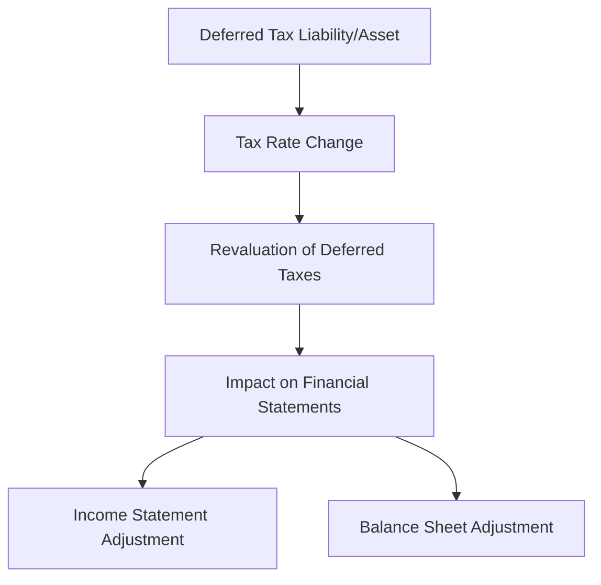

## 4.4 Tax Rate Changes and Effects

Understanding the implications of tax rate changes is crucial for accountants, especially when dealing with deferred taxes. This section provides an in-depth exploration of how changes in tax laws and rates impact deferred taxes, focusing on both theoretical and practical aspects. We'll delve into the accounting standards, provide real-world examples, and offer guidance on navigating these changes effectively.

### Overview of Deferred Taxes

Deferred taxes arise due to temporary differences between the carrying amount of an asset or liability in the financial statements and its tax base. These differences lead to deferred tax liabilities or assets, which represent future tax consequences of current transactions. 

#### Key Concepts:

- **Deferred Tax Liabilities (DTLs):** Occur when taxable income is less than accounting income due to temporary differences.
- **Deferred Tax Assets (DTAs):** Arise when taxable income is greater than accounting income, leading to future tax benefits.

### Impact of Tax Rate Changes

When tax rates change, they affect the measurement of deferred tax assets and liabilities. The key principle is that deferred tax amounts should reflect the tax rates expected to apply when the temporary differences reverse.

#### Key Effects:

1. **Revaluation of Deferred Taxes:** Adjustments must be made to reflect the new tax rates, impacting both the balance sheet and income statement.
2. **Impact on Earnings:** Changes in tax rates can lead to significant fluctuations in reported earnings due to the revaluation of deferred taxes.
3. **Strategic Planning:** Companies must consider the timing of recognizing deferred tax assets and liabilities to optimize their tax position.

### Accounting Standards and Guidelines

#### IFRS and IAS 12

Under IFRS, IAS 12 "Income Taxes" provides guidance on accounting for income taxes, including deferred taxes. Key points include:

- **Measurement:** Deferred tax assets and liabilities should be measured using the tax rates expected to apply when the asset is realized or the liability is settled.
- **Recognition:** Deferred tax assets are recognized only to the extent that it is probable that taxable profits will be available against which the temporary differences can be utilized.

#### ASPE and Section 3465

For private enterprises in Canada, ASPE Section 3465 outlines the accounting for income taxes. It aligns closely with IFRS but includes some differences in recognition and measurement criteria.

#### GAAP

Under U.S. GAAP, ASC 740 "Income Taxes" governs the accounting for income taxes, including deferred taxes. It emphasizes the use of enacted tax rates for measuring deferred tax assets and liabilities.

### Practical Examples and Scenarios

#### Example 1: Revaluation of Deferred Tax Liabilities

Consider a company with a deferred tax liability of $100,000, calculated at a tax rate of 30%. If the tax rate changes to 25%, the deferred tax liability must be revalued:

- **Old Liability:** $100,000
- **New Liability:** $100,000 * (25% / 30%) = $83,333

The adjustment of $16,667 is recognized in the income statement, impacting net income.

#### Example 2: Deferred Tax Assets and Valuation Allowances

A company with a deferred tax asset of $50,000 at a 35% tax rate must revalue the asset if the tax rate decreases to 30%:

- **Old Asset:** $50,000
- **New Asset:** $50,000 * (30% / 35%) = $42,857

The reduction of $7,143 is recognized as an expense, affecting earnings.

### Strategic Considerations

1. **Forecasting and Planning:** Companies should anticipate potential tax rate changes and adjust their tax planning strategies accordingly.
2. **Valuation Allowances:** When revaluing deferred tax assets, consider the need for valuation allowances if future taxable profits are uncertain.
3. **Communication with Stakeholders:** Clearly communicate the impact of tax rate changes on financial statements to stakeholders.

### Challenges and Best Practices

#### Common Challenges

- **Complex Calculations:** Revaluing deferred taxes requires precise calculations and understanding of tax laws.
- **Timing Issues:** Determining the appropriate period for recognizing adjustments can be challenging.
- **Regulatory Compliance:** Staying updated with changes in tax laws and accounting standards is essential.

#### Best Practices

- **Regular Reviews:** Conduct regular reviews of deferred tax balances to ensure accuracy and compliance.
- **Scenario Analysis:** Perform scenario analysis to assess the impact of potential tax rate changes.
- **Professional Development:** Stay informed about changes in tax laws and accounting standards through continuous professional education.

### Real-World Applications

#### Case Study: Impact of Tax Cuts and Jobs Act

The U.S. Tax Cuts and Jobs Act of 2017 significantly reduced corporate tax rates, leading to widespread revaluation of deferred tax assets and liabilities. Companies had to quickly adapt to the new rates, highlighting the importance of proactive planning and communication.

#### Canadian Context

In Canada, changes in provincial or federal tax rates can similarly impact deferred taxes. Accountants must be vigilant in monitoring legislative changes and adjusting their financial reporting accordingly.

### Diagrams and Visual Aids

To enhance understanding, consider the following diagram illustrating the flow of deferred tax adjustments due to tax rate changes:

### Conclusion

Understanding the effects of tax rate changes on deferred taxes is essential for accurate financial reporting and strategic planning. By staying informed about accounting standards and tax laws, accountants can effectively manage these changes and communicate their impact to stakeholders.

### References and Further Reading

- **IAS 12 - Income Taxes:** [IFRS Standards](https://www.ifrs.org/issued-standards/list-of-standards/ias-12-income-taxes/)
- **ASC 740 - Income Taxes:** [FASB Standards](https://asc.fasb.org/)
- **CPA Canada - Taxation Resources:** [CPA Canada](https://www.cpacanada.ca/en/business-and-accounting-resources/taxation)

---

## **Ready to Test Your Knowledge?**



### What is the primary impact of a tax rate change on deferred tax liabilities?

- [x] Revaluation of deferred tax liabilities
- [ ] Creation of new deferred tax liabilities
- [ ] Elimination of deferred tax liabilities
- [ ] No impact on deferred tax liabilities

> **Explanation:** A tax rate change requires the revaluation of existing deferred tax liabilities to reflect the new rates.

### How should deferred tax assets be measured under IFRS?

- [x] Using the tax rates expected to apply when the asset is realized
- [ ] Using the current tax rate
- [ ] Using the historical tax rate
- [ ] Using the average tax rate over the past five years

> **Explanation:** IFRS requires deferred tax assets to be measured using the tax rates expected to apply when the asset is realized.

### What is a deferred tax liability?

- [x] A future tax payment obligation due to temporary differences
- [ ] An immediate tax payment obligation
- [ ] A permanent tax difference
- [ ] A tax refund receivable

> **Explanation:** Deferred tax liabilities represent future tax payment obligations resulting from temporary differences between accounting and tax bases.

### Which accounting standard governs income taxes under U.S. GAAP?

- [x] ASC 740
- [ ] IAS 12
- [ ] ASPE Section 3465
- [ ] IFRS 16

> **Explanation:** ASC 740 is the U.S. GAAP standard that governs accounting for income taxes, including deferred taxes.

### What is the effect of a decrease in tax rates on deferred tax assets?

- [x] Decrease in the value of deferred tax assets
- [ ] Increase in the value of deferred tax assets
- [ ] No effect on deferred tax assets
- [ ] Creation of new deferred tax assets

> **Explanation:** A decrease in tax rates leads to a decrease in the value of deferred tax assets, as they are revalued at the lower rate.

### What is the purpose of a valuation allowance for deferred tax assets?

- [x] To reduce the carrying amount of deferred tax assets to the amount that is more likely than not to be realized
- [ ] To increase the carrying amount of deferred tax assets
- [ ] To eliminate deferred tax assets
- [ ] To create new deferred tax assets

> **Explanation:** A valuation allowance reduces the carrying amount of deferred tax assets to the amount that is more likely than not to be realized.

### What should companies do to prepare for potential tax rate changes?

- [x] Conduct scenario analysis and adjust tax planning strategies
- [ ] Ignore potential changes until they occur
- [ ] Immediately recognize all potential changes in financial statements
- [ ] Eliminate all deferred tax balances

> **Explanation:** Companies should conduct scenario analysis and adjust their tax planning strategies to prepare for potential tax rate changes.

### How does a tax rate change affect the income statement?

- [x] Through the revaluation of deferred taxes, impacting net income
- [ ] By directly changing revenue figures
- [ ] By altering cash flow statements
- [ ] By modifying equity balances

> **Explanation:** A tax rate change affects the income statement through the revaluation of deferred taxes, impacting net income.

### What is the role of IAS 12 in accounting for income taxes?

- [x] It provides guidance on accounting for income taxes, including deferred taxes
- [ ] It governs revenue recognition
- [ ] It addresses lease accounting
- [ ] It focuses on financial instruments

> **Explanation:** IAS 12 provides guidance on accounting for income taxes, including the treatment of deferred taxes.

### True or False: Deferred tax liabilities are always eliminated when tax rates change.

- [ ] True
- [x] False

> **Explanation:** Deferred tax liabilities are not eliminated when tax rates change; they are revalued to reflect the new rates.


