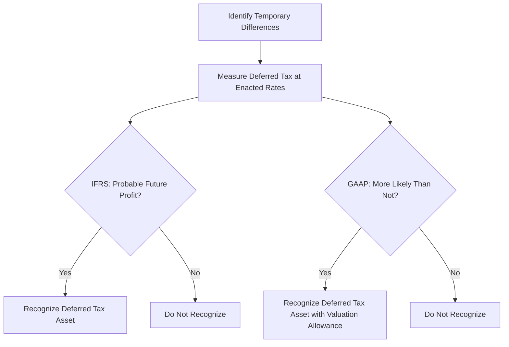

## 4.8 Tax Accounting under IFRS and GAAP

### Introduction

In the realm of advanced accounting, understanding the nuances between International Financial Reporting Standards (IFRS) and Generally Accepted Accounting Principles (GAAP) is crucial, especially when it comes to tax accounting. Both frameworks provide guidelines on how to account for income taxes, but they differ in several key areas. This section will delve into these differences, offering insights into how they impact financial reporting and decision-making. We will explore the principles underlying each framework, provide practical examples, and discuss the implications for Canadian accounting exams.

### Overview of Tax Accounting

Tax accounting involves the preparation of tax returns and the planning of tax strategies. It is a critical aspect of financial reporting that ensures compliance with tax laws and regulations. The primary components of tax accounting include current tax, deferred tax, and the recognition of tax liabilities and assets.

**Current Tax** refers to the amount of income taxes payable or refundable for the current period. It is calculated based on the taxable income of an entity.

**Deferred Tax** arises from temporary differences between the carrying amount of an asset or liability in the financial statements and its tax base. These differences can result in deferred tax liabilities or assets.

### Key Differences between IFRS and GAAP

#### Recognition and Measurement

**IFRS**: Under IFRS, income taxes are accounted for using the balance sheet approach. This approach focuses on the temporary differences between the carrying amounts of assets and liabilities in the financial statements and their tax bases. Deferred tax assets and liabilities are recognized for all temporary differences, except in certain situations such as initial recognition of goodwill.

**GAAP**: GAAP also uses the balance sheet approach but has more detailed guidance on the recognition and measurement of deferred tax assets and liabilities. GAAP requires a valuation allowance to be established if it is more likely than not that some portion or all of the deferred tax asset will not be realized.

#### Deferred Tax Assets and Liabilities

**IFRS**: Deferred tax assets and liabilities are measured at the tax rates that are expected to apply in the period when the asset is realized or the liability is settled. IFRS does not allow the use of a valuation allowance. Instead, deferred tax assets are recognized only if it is probable that sufficient taxable profit will be available to utilize the asset.

**GAAP**: Similar to IFRS, deferred tax assets and liabilities are measured at the enacted tax rates expected to apply. However, GAAP requires the use of a valuation allowance to reduce the carrying amount of deferred tax assets if it is more likely than not that they will not be realized.

#### Uncertain Tax Positions

**IFRS**: IFRS does not have specific guidance on uncertain tax positions. Instead, entities apply the general principles of IFRS to determine whether a liability should be recognized for uncertain tax positions.

**GAAP**: GAAP provides specific guidance on uncertain tax positions under ASC 740. It requires entities to recognize a tax benefit only if it is more likely than not that the position will be sustained upon examination by the taxing authority. The amount recognized is the largest amount that is greater than 50% likely to be realized.

#### Intraperiod Tax Allocation

**IFRS**: Intraperiod tax allocation is required under IFRS, meaning that the tax expense or benefit is allocated among continuing operations, discontinued operations, other comprehensive income, and equity.

**GAAP**: Similar to IFRS, GAAP requires intraperiod tax allocation. However, the specific rules and guidance may differ, particularly in how certain items are treated.

### Practical Examples and Case Studies

#### Example 1: Deferred Tax Asset Recognition

Consider a company that has a deferred tax asset arising from a net operating loss carryforward. Under IFRS, the company would assess whether it is probable that future taxable profits will be available to utilize the loss. If so, the deferred tax asset is recognized.

Under GAAP, the company would also assess the likelihood of realization but would establish a valuation allowance if it is more likely than not that some portion of the deferred tax asset will not be realized.

#### Example 2: Uncertain Tax Positions

A company has taken a tax position that is subject to uncertainty. Under GAAP, the company would apply the two-step process of recognition and measurement. First, it would determine if it is more likely than not that the tax position will be sustained. If so, the company would measure the benefit based on the largest amount that is greater than 50% likely to be realized.

Under IFRS, the company would apply the general principles of IFRS to determine whether a liability should be recognized, without specific guidance on uncertain tax positions.

### Real-World Applications and Regulatory Scenarios

In practice, the differences between IFRS and GAAP can have significant implications for financial reporting and tax planning. Companies operating in multiple jurisdictions may need to prepare financial statements under both frameworks, leading to complexities in tax accounting.

For example, a multinational corporation with operations in Canada and the United States may need to reconcile differences in deferred tax asset recognition and measurement. This requires a thorough understanding of both IFRS and GAAP, as well as the ability to apply these standards in practice.

### Step-by-Step Guidance for Accounting Procedures

#### Calculating Deferred Tax

1. **Identify Temporary Differences**: Determine the differences between the carrying amounts of assets and liabilities in the financial statements and their tax bases.

2. **Measure Deferred Tax**: Calculate the deferred tax assets and liabilities using the enacted tax rates expected to apply when the temporary differences reverse.

3. **Recognize Deferred Tax**: Under IFRS, recognize deferred tax assets only if it is probable that sufficient taxable profit will be available. Under GAAP, establish a valuation allowance if it is more likely than not that some portion of the deferred tax asset will not be realized.

4. **Disclose Deferred Tax**: Provide disclosures in the financial statements regarding the nature of temporary differences, the tax rates used, and any valuation allowances.

### Diagrams and Visual Aids

To enhance understanding, consider the following diagram illustrating the process of recognizing and measuring deferred tax assets and liabilities under IFRS and GAAP:

### Best Practices, Common Pitfalls, and Strategies

#### Best Practices

- **Stay Informed**: Keep up-to-date with changes in tax laws and accounting standards to ensure compliance and accurate financial reporting.
- **Use Professional Judgment**: Apply professional judgment when assessing the probability of future taxable profits and the realization of deferred tax assets.
- **Document Assumptions**: Clearly document the assumptions and estimates used in tax accounting to support the recognition and measurement of deferred tax assets and liabilities.

#### Common Pitfalls

- **Overlooking Temporary Differences**: Failing to identify all temporary differences can lead to incorrect deferred tax calculations.
- **Inadequate Valuation Allowance**: Under GAAP, not establishing an adequate valuation allowance can result in overstated deferred tax assets.

#### Strategies

- **Scenario Analysis**: Perform scenario analysis to assess the impact of different tax rates and future profit scenarios on deferred tax assets and liabilities.
- **Tax Planning**: Engage in tax planning to optimize the use of tax losses and credits, reducing the overall tax liability.

### References and Additional Resources

- **IFRS Standards**: Refer to the International Accounting Standards Board (IASB) for official IFRS standards and interpretations.
- **CPA Canada**: Access resources and guidance from CPA Canada for Canadian accounting standards and practices.
- **ASC 740**: Review the Financial Accounting Standards Board (FASB) guidance on accounting for income taxes under GAAP.

### Conclusion

Understanding the differences between IFRS and GAAP in tax accounting is essential for accurate financial reporting and compliance. By mastering these concepts, you will be better prepared for the Canadian accounting exams and equipped to handle complex tax accounting scenarios in your professional career.

## **Ready to Test Your Knowledge?**



### What is the primary approach used by both IFRS and GAAP for accounting for income taxes?

- [x] Balance sheet approach
- [ ] Income statement approach
- [ ] Cash flow approach
- [ ] Equity approach

> **Explanation:** Both IFRS and GAAP use the balance sheet approach, focusing on temporary differences between the carrying amounts of assets and liabilities and their tax bases.

### Under IFRS, when is a deferred tax asset recognized?

- [x] When it is probable that sufficient taxable profit will be available
- [ ] When it is certain that future taxable profit will be available
- [ ] When there is a valuation allowance
- [ ] When the tax rate is favorable

> **Explanation:** IFRS requires that deferred tax assets be recognized only if it is probable that sufficient taxable profit will be available to utilize the asset.

### How does GAAP handle uncertain tax positions?

- [x] Through a two-step process of recognition and measurement
- [ ] By immediate recognition of all uncertain positions
- [ ] By ignoring uncertain positions
- [ ] By deferring recognition until certainty is achieved

> **Explanation:** GAAP requires a two-step process for uncertain tax positions: recognition if it is more likely than not to be sustained, and measurement based on the largest amount more than 50% likely to be realized.

### What is a valuation allowance under GAAP?

- [x] A reduction in the carrying amount of deferred tax assets
- [ ] An increase in deferred tax liabilities
- [ ] A method to increase tax expenses
- [ ] A way to defer tax payments

> **Explanation:** A valuation allowance is used under GAAP to reduce the carrying amount of deferred tax assets if it is more likely than not that they will not be realized.

### Which standard provides specific guidance on uncertain tax positions?

- [x] ASC 740
- [ ] IAS 12
- [ ] IFRS 9
- [ ] GAAP 101

> **Explanation:** ASC 740 provides specific guidance on accounting for uncertain tax positions under GAAP.

### What is the focus of the balance sheet approach in tax accounting?

- [x] Temporary differences between financial and tax bases
- [ ] Permanent differences in tax rates
- [ ] Cash flow timing differences
- [ ] Equity adjustments

> **Explanation:** The balance sheet approach focuses on temporary differences between the carrying amounts of assets and liabilities in the financial statements and their tax bases.

### How are deferred tax assets measured under both IFRS and GAAP?

- [x] At the enacted tax rates expected to apply
- [ ] At the current tax rate
- [ ] At the average tax rate
- [ ] At the historical tax rate

> **Explanation:** Deferred tax assets and liabilities are measured at the enacted tax rates expected to apply when the temporary differences reverse under both IFRS and GAAP.

### What is intraperiod tax allocation?

- [x] Allocation of tax expense among different components of financial statements
- [ ] Allocation of tax expense within a single period
- [ ] Allocation of tax expense over multiple periods
- [ ] Allocation of tax expense to shareholders

> **Explanation:** Intraperiod tax allocation involves allocating the tax expense or benefit among continuing operations, discontinued operations, other comprehensive income, and equity.

### What is the purpose of a valuation allowance in GAAP?

- [x] To reduce deferred tax assets if realization is uncertain
- [ ] To increase deferred tax liabilities
- [ ] To adjust current tax expenses
- [ ] To defer tax payments

> **Explanation:** The valuation allowance reduces the carrying amount of deferred tax assets if it is more likely than not that they will not be realized.

### True or False: IFRS allows the use of a valuation allowance for deferred tax assets.

- [ ] True
- [x] False

> **Explanation:** IFRS does not allow the use of a valuation allowance. Instead, deferred tax assets are recognized only if it is probable that sufficient taxable profit will be available.


