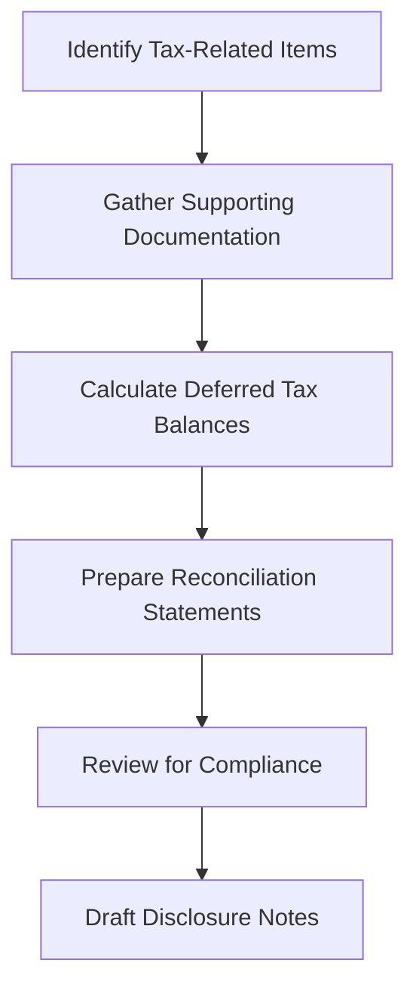

## 4.9 Tax Disclosures in Financial Statements

In the realm of financial reporting, tax disclosures play a pivotal role in providing transparency and insight into a company's tax-related activities and obligations. For those preparing for Canadian accounting exams, understanding the intricacies of tax disclosures is essential. This section delves into the required disclosures related to income taxes in financial statements, offering comprehensive insights and practical examples to aid your exam preparation.

### Understanding Tax Disclosures

Tax disclosures in financial statements are designed to inform stakeholders about a company's tax position, including current and deferred tax liabilities and assets, tax rate changes, and the impact of tax legislation. These disclosures are crucial for users of financial statements to assess the company's tax strategies, compliance, and potential risks.

#### Key Objectives of Tax Disclosures

1. **Transparency:** Provide clear and comprehensive information about tax-related items in the financial statements.
2. **Comparability:** Ensure consistency in tax reporting across different periods and entities.
3. **Relevance:** Offer insights that are pertinent to stakeholders' decision-making processes.
4. **Compliance:** Adhere to applicable accounting standards and regulatory requirements.

### Required Tax Disclosures under IFRS and GAAP

Both International Financial Reporting Standards (IFRS) and Generally Accepted Accounting Principles (GAAP) mandate specific tax disclosures. While there are similarities, there are also notable differences between the two frameworks.

#### IFRS Requirements

Under IFRS, particularly IAS 12 "Income Taxes," entities are required to disclose:

- **Current and Deferred Tax:** The amount of current and deferred tax recognized in the financial statements.
- **Tax Reconciliation:** A reconciliation of the effective tax rate to the statutory tax rate, explaining significant differences.
- **Deferred Tax Assets and Liabilities:** Details of the components of deferred tax assets and liabilities, including any unrecognized deferred tax assets.
- **Tax Rate Changes:** The impact of changes in tax rates on deferred tax balances.
- **Uncertain Tax Positions:** Information about uncertain tax positions and any related provisions.

#### GAAP Requirements

Under U.S. GAAP, ASC 740 "Income Taxes" outlines the following disclosure requirements:

- **Current and Deferred Tax Expense:** The total amount of current and deferred tax expense or benefit.
- **Effective Tax Rate Reconciliation:** A detailed reconciliation of the reported tax rate to the statutory rate.
- **Deferred Tax Assets and Liabilities:** Components of deferred tax assets and liabilities, including valuation allowances.
- **Uncertain Tax Positions:** Disclosures related to uncertain tax positions and the impact on financial statements.

### Practical Examples and Case Studies

To illustrate the application of tax disclosures, let's explore a few practical examples and case studies relevant to Canadian accounting practices.

#### Example 1: Deferred Tax Assets and Liabilities

Consider a Canadian corporation, MapleTech Inc., which has recognized significant deferred tax assets due to carryforward tax losses. In its financial statements, MapleTech Inc. must disclose:

- The nature and amount of deferred tax assets.
- The basis for recognizing these assets, including any valuation allowances.
- The expected realization period for these assets.

#### Example 2: Tax Rate Reconciliation

Suppose MapleTech Inc. operates in multiple jurisdictions with varying tax rates. The company must provide a reconciliation of its effective tax rate to the statutory rate, highlighting factors such as:

- Differences due to foreign tax rates.
- Tax credits and incentives.
- Non-deductible expenses.

### Real-World Applications and Regulatory Scenarios

Tax disclosures are not only theoretical concepts but have real-world applications and regulatory implications. Companies must navigate complex tax regulations and ensure compliance with both domestic and international standards.

#### Compliance Considerations

- **CPA Canada Guidelines:** Adherence to CPA Canada's guidelines and standards for tax disclosures is crucial for Canadian entities.
- **Cross-Border Transactions:** Companies engaged in cross-border transactions must consider the tax implications and disclosure requirements in multiple jurisdictions.
- **Tax Planning Strategies:** Effective tax planning can influence the nature and extent of tax disclosures, impacting stakeholders' perceptions.

### Step-by-Step Guidance for Preparing Tax Disclosures

Preparing tax disclosures requires a systematic approach to ensure accuracy and compliance. Here is a step-by-step guide to help you navigate this process:

1. **Identify Tax-Related Items:** Begin by identifying all tax-related items in the financial statements, including current and deferred taxes.
2. **Gather Supporting Documentation:** Collect relevant documentation, such as tax returns, tax assessments, and correspondence with tax authorities.
3. **Calculate Deferred Tax Balances:** Compute deferred tax assets and liabilities based on temporary differences and tax rates.
4. **Prepare Reconciliation Statements:** Develop reconciliation statements to explain differences between the effective and statutory tax rates.
5. **Review for Compliance:** Ensure that all disclosures comply with applicable accounting standards and regulatory requirements.
6. **Draft Disclosure Notes:** Write clear and concise disclosure notes, providing necessary explanations and context for stakeholders.

### Diagrams and Visual Aids

To enhance understanding, let's use a Mermaid.js diagram to illustrate the flow of tax disclosures in financial statements:

### Best Practices and Common Pitfalls

When preparing tax disclosures, it's important to adhere to best practices while being mindful of common pitfalls:

#### Best Practices

- **Consistency:** Maintain consistency in tax reporting across periods to facilitate comparability.
- **Clarity:** Use clear and concise language in disclosure notes to enhance stakeholder understanding.
- **Documentation:** Keep detailed records of all tax-related transactions and calculations.

#### Common Pitfalls

- **Omitting Key Disclosures:** Failing to disclose significant tax-related items can lead to non-compliance and stakeholder mistrust.
- **Inaccurate Calculations:** Errors in calculating deferred tax balances can result in misstated financial statements.
- **Lack of Transparency:** Insufficient transparency in tax disclosures can obscure stakeholders' understanding of the company's tax position.

### References and Additional Resources

For further exploration of tax disclosures in financial statements, consider the following resources:

- **CPA Canada Handbook:** Provides comprehensive guidance on accounting standards and tax disclosures.
- **IFRS Foundation:** Offers detailed information on IFRS standards, including IAS 12.
- **ASC 740 Guide:** A resource for understanding U.S. GAAP requirements for income tax disclosures.

### Summary and Key Points

In summary, tax disclosures in financial statements are a critical component of financial reporting, providing stakeholders with valuable insights into a company's tax position and strategies. By understanding the requirements under IFRS and GAAP, and applying best practices, you can effectively prepare for Canadian accounting exams and excel in your professional career.

### Ready to Test Your Knowledge?



### What is the primary objective of tax disclosures in financial statements?

- [x] To provide transparency and insight into a company's tax-related activities
- [ ] To calculate the exact tax liability of a company
- [ ] To determine the profitability of a company
- [ ] To assess the company's market position

> **Explanation:** The primary objective of tax disclosures is to provide transparency and insight into a company's tax-related activities, helping stakeholders understand the company's tax position and strategies.

### Under IFRS, which standard governs the disclosure of income taxes?

- [x] IAS 12
- [ ] IFRS 9
- [ ] IAS 16
- [ ] IFRS 15

> **Explanation:** IAS 12 "Income Taxes" is the standard under IFRS that governs the disclosure of income taxes in financial statements.

### Which of the following is a required disclosure under U.S. GAAP for income taxes?

- [x] Effective tax rate reconciliation
- [ ] Inventory valuation methods
- [ ] Revenue recognition policies
- [ ] Cash flow statement details

> **Explanation:** U.S. GAAP requires the disclosure of an effective tax rate reconciliation, explaining differences between the reported tax rate and the statutory rate.

### What is a common pitfall in preparing tax disclosures?

- [x] Omitting key disclosures
- [ ] Overstating revenue
- [ ] Misclassifying expenses
- [ ] Ignoring cash flow statements

> **Explanation:** A common pitfall in preparing tax disclosures is omitting key disclosures, which can lead to non-compliance and stakeholder mistrust.

### Which document provides comprehensive guidance on accounting standards and tax disclosures in Canada?

- [x] CPA Canada Handbook
- [ ] IFRS Foundation Guide
- [ ] ASC 740 Guide
- [ ] Financial Times

> **Explanation:** The CPA Canada Handbook provides comprehensive guidance on accounting standards and tax disclosures in Canada.

### What is the impact of tax rate changes on deferred tax balances?

- [x] They affect the calculation of deferred tax assets and liabilities
- [ ] They have no impact on deferred tax balances
- [ ] They only affect current tax expense
- [ ] They determine the company's revenue recognition policies

> **Explanation:** Tax rate changes affect the calculation of deferred tax assets and liabilities, as they influence the future tax consequences of temporary differences.

### Which of the following is a best practice for preparing tax disclosures?

- [x] Maintaining consistency in tax reporting across periods
- [ ] Using complex language in disclosure notes
- [ ] Omitting minor tax-related items
- [ ] Ignoring changes in tax legislation

> **Explanation:** Maintaining consistency in tax reporting across periods is a best practice, as it facilitates comparability and enhances stakeholder understanding.

### What is the role of documentation in tax disclosures?

- [x] To provide detailed records of all tax-related transactions and calculations
- [ ] To inflate the company's tax liabilities
- [ ] To obscure the company's tax position
- [ ] To eliminate the need for reconciliation statements

> **Explanation:** Documentation plays a crucial role in tax disclosures by providing detailed records of all tax-related transactions and calculations, ensuring accuracy and compliance.

### Which of the following is a component of deferred tax assets and liabilities?

- [x] Temporary differences
- [ ] Permanent differences
- [ ] Current tax expense
- [ ] Revenue recognition policies

> **Explanation:** Deferred tax assets and liabilities are based on temporary differences, which are differences between the tax base of an asset or liability and its carrying amount in the financial statements.

### True or False: Tax disclosures are only relevant for large multinational corporations.

- [ ] True
- [x] False

> **Explanation:** False. Tax disclosures are relevant for all entities, regardless of size, as they provide essential information about a company's tax position and compliance.


