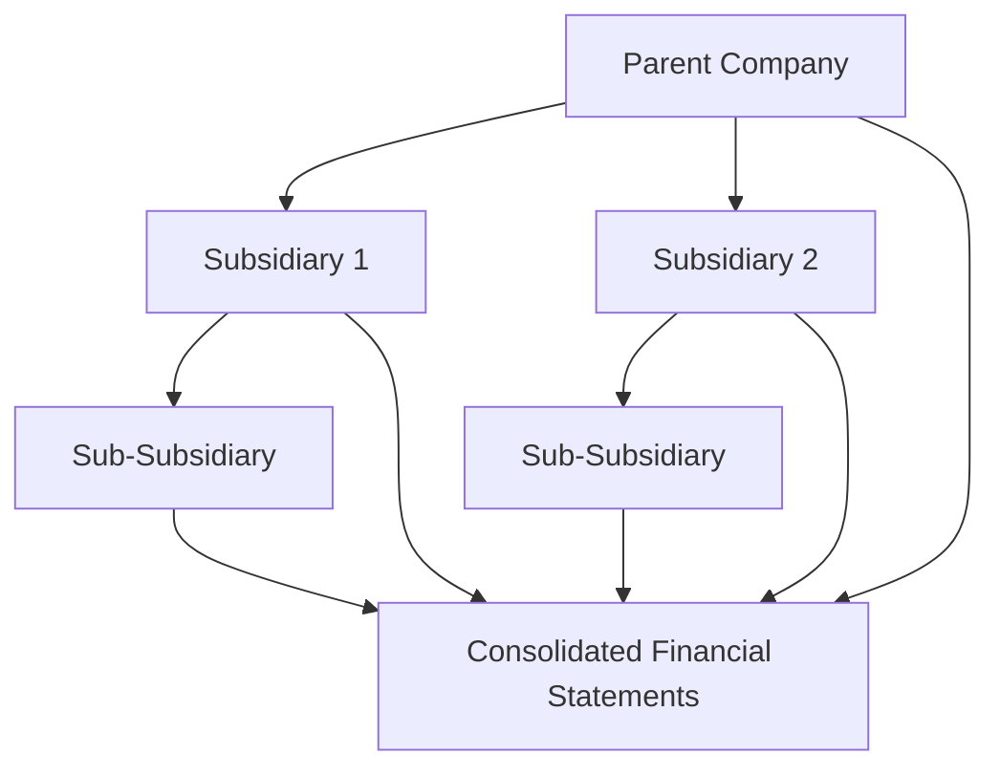

## 5.10 Consolidation under IFRS and GAAP

Consolidation is a critical aspect of financial reporting, especially for entities that have control over one or more subsidiaries. Understanding the differences and similarities between International Financial Reporting Standards (IFRS) and Generally Accepted Accounting Principles (GAAP) is essential for accountants, particularly those preparing for Canadian accounting exams. This section provides a comprehensive analysis of consolidation under IFRS and GAAP, focusing on key principles, methodologies, and practical applications.

### Introduction to Consolidation

Consolidation involves combining the financial statements of a parent company with its subsidiaries to present a single set of financial statements. This process ensures that the financial position and results of operations of the entire group are reflected accurately. Both IFRS and GAAP provide specific guidelines for consolidation, but there are notable differences in their approaches.

### Key Concepts in Consolidation

#### Control

- **IFRS (IFRS 10):** Control is defined as having power over the investee, exposure or rights to variable returns from involvement with the investee, and the ability to use power to affect those returns.
- **GAAP (ASC 810):** Control is primarily assessed based on voting rights, with a focus on the ability to direct activities that significantly affect the economic performance of the investee.

#### Subsidiary

- **IFRS:** A subsidiary is an entity controlled by another entity, known as the parent.
- **GAAP:** Similar to IFRS, a subsidiary is an entity controlled by another entity, but GAAP places more emphasis on legal control through voting rights.

### Consolidation Procedures

#### IFRS Consolidation Procedures

1. **Identify the Parent and Subsidiaries:** Determine which entities are to be consolidated based on control.
2. **Align Accounting Policies:** Ensure that the accounting policies of the parent and subsidiaries are consistent.
3. **Eliminate Intragroup Transactions:** Remove all intercompany transactions and balances.
4. **Non-Controlling Interests (NCI):** Recognize NCI in the consolidated financial statements.
5. **Goodwill Calculation:** Calculate goodwill or a gain from a bargain purchase at the acquisition date.

#### GAAP Consolidation Procedures

1. **Identify the Parent and Subsidiaries:** Similar to IFRS, identify entities based on control.
2. **Align Accounting Policies:** GAAP requires consistency in accounting policies across the group.
3. **Eliminate Intragroup Transactions:** Remove intercompany transactions and balances.
4. **Non-Controlling Interests:** Recognize and measure NCI in the consolidated financial statements.
5. **Goodwill and Bargain Purchase:** Calculate goodwill or a gain from a bargain purchase, similar to IFRS.

### Differences in Consolidation under IFRS and GAAP

#### Presentation of Non-Controlling Interests

- **IFRS:** Non-controlling interests are presented within equity, separately from the parent’s equity.
- **GAAP:** Non-controlling interests are also presented within equity but may have different presentation requirements.

#### Goodwill Impairment

- **IFRS (IAS 36):** Goodwill is tested for impairment annually or more frequently if there are indicators of impairment.
- **GAAP (ASC 350):** Goodwill impairment testing is a two-step process, although a simplified one-step process is available for private companies.

#### Variable Interest Entities (VIEs)

- **IFRS:** IFRS does not have a specific concept of VIEs but assesses control based on the power to direct relevant activities.
- **GAAP:** GAAP includes specific guidance for VIEs, focusing on the primary beneficiary that absorbs the majority of the VIE’s expected losses or receives a majority of the expected residual returns.

### Practical Examples and Case Studies

#### Example 1: Consolidation of a New Subsidiary

**Scenario:** A Canadian parent company acquires 80% of a foreign subsidiary. The subsidiary's financial statements are prepared under local GAAP.

- **IFRS Approach:** The parent consolidates the subsidiary by aligning accounting policies, translating financial statements to the parent’s reporting currency, and recognizing NCI.
- **GAAP Approach:** Similar steps are followed, with additional consideration for any VIE implications.

#### Example 2: Goodwill Impairment Testing

**Scenario:** A parent company identifies potential impairment indicators for a subsidiary acquired two years ago.

- **IFRS Approach:** Perform an impairment test by comparing the carrying amount of the cash-generating unit (CGU) to its recoverable amount.
- **GAAP Approach:** Follow the two-step impairment test, unless the simplified approach is elected.

### Real-World Applications

#### Regulatory Scenarios

- **IFRS in Canada:** Publicly accountable enterprises in Canada are required to use IFRS, aligning with international standards.
- **GAAP in the U.S.:** U.S.-based companies primarily use GAAP, but Canadian companies with U.S. operations may need to reconcile differences.

#### Compliance Considerations

- **IFRS Compliance:** Ensure compliance with IFRS 10 for consolidation, including disclosures related to control and NCI.
- **GAAP Compliance:** Adhere to ASC 810 for consolidation, with attention to VIEs and goodwill impairment testing.

### Step-by-Step Guidance

#### Preparing Consolidated Financial Statements

1. **Determine Control:** Assess control over subsidiaries using IFRS 10 or ASC 810 criteria.
2. **Align Accounting Policies:** Ensure uniform accounting policies across the group.
3. **Eliminate Intragroup Balances:** Remove intercompany transactions and balances.
4. **Calculate Goodwill:** Determine goodwill or bargain purchase gain at acquisition.
5. **Recognize NCI:** Present NCI in the equity section of the consolidated balance sheet.
6. **Perform Impairment Tests:** Conduct annual goodwill impairment tests as required.

### Diagrams and Visual Aids

### Best Practices and Common Pitfalls

- **Best Practices:**
  - Regularly review control assessments to ensure accurate consolidation.
  - Maintain consistent accounting policies across all entities.
  - Conduct thorough impairment tests to avoid overstated goodwill.

- **Common Pitfalls:**
  - Failing to eliminate all intragroup transactions can lead to overstated revenues or expenses.
  - Inaccurate NCI calculations can misrepresent equity positions.
  - Overlooking VIE implications under GAAP can result in non-compliance.

### References and Additional Resources

- **IFRS Standards:** Access the latest IFRS standards at [IFRS.org](https://www.ifrs.org).
- **CPA Canada:** Explore resources and guidelines at [CPA Canada](https://www.cpacanada.ca).
- **FASB:** Review GAAP standards at [FASB.org](https://www.fasb.org).

### Summary

Understanding consolidation under IFRS and GAAP is crucial for accountants, especially those preparing for Canadian accounting exams. This section has provided a detailed analysis of the key concepts, procedures, and differences between the two frameworks. By mastering these principles, you will be well-equipped to handle consolidation challenges in both academic and professional settings.

## **Ready to Test Your Knowledge?**



### Which standard defines control as having power over the investee, exposure or rights to variable returns, and the ability to use power to affect returns?

- [x] IFRS 10
- [ ] ASC 810
- [ ] IAS 36
- [ ] ASC 350

> **Explanation:** IFRS 10 provides the criteria for control, focusing on power, exposure to returns, and the ability to affect those returns.

### Under which framework are Non-Controlling Interests presented within equity, separately from the parent’s equity?

- [x] IFRS
- [ ] GAAP
- [ ] Both IFRS and GAAP
- [ ] Neither IFRS nor GAAP

> **Explanation:** IFRS requires NCI to be presented within equity, separately from the parent’s equity.

### What is the primary focus of GAAP when assessing control for consolidation?

- [x] Voting rights
- [ ] Power over investee
- [ ] Exposure to variable returns
- [ ] Ability to affect returns

> **Explanation:** GAAP primarily assesses control based on voting rights and the ability to direct activities affecting economic performance.

### Which of the following is NOT a step in the IFRS consolidation procedure?

- [ ] Identify the Parent and Subsidiaries
- [ ] Align Accounting Policies
- [ ] Eliminate Intragroup Transactions
- [x] Perform a two-step goodwill impairment test

> **Explanation:** The two-step goodwill impairment test is a GAAP procedure, not an IFRS procedure.

### Which framework includes specific guidance for Variable Interest Entities (VIEs)?

- [ ] IFRS
- [x] GAAP
- [ ] Both IFRS and GAAP
- [ ] Neither IFRS nor GAAP

> **Explanation:** GAAP includes specific guidance for VIEs, focusing on the primary beneficiary.

### What is the purpose of eliminating intragroup transactions in consolidation?

- [x] To avoid double counting of revenues and expenses
- [ ] To align accounting policies
- [ ] To calculate goodwill
- [ ] To recognize non-controlling interests

> **Explanation:** Eliminating intragroup transactions prevents double counting of revenues and expenses, ensuring accurate financial reporting.

### How is goodwill impairment tested under IFRS?

- [x] By comparing the carrying amount of the CGU to its recoverable amount
- [ ] By a two-step process
- [ ] By aligning accounting policies
- [ ] By eliminating intragroup transactions

> **Explanation:** IFRS tests goodwill impairment by comparing the carrying amount of the CGU to its recoverable amount.

### What is the primary beneficiary in the context of GAAP's VIE guidance?

- [x] The entity that absorbs the majority of the VIE’s expected losses or receives a majority of the expected residual returns
- [ ] The entity with the most voting rights
- [ ] The entity with the largest equity stake
- [ ] The entity that directs the most activities

> **Explanation:** The primary beneficiary is the entity that absorbs the majority of the VIE’s expected losses or receives a majority of the expected residual returns.

### Which of the following is a common pitfall in consolidation?

- [x] Failing to eliminate all intragroup transactions
- [ ] Aligning accounting policies
- [ ] Recognizing non-controlling interests
- [ ] Calculating goodwill

> **Explanation:** Failing to eliminate all intragroup transactions can lead to overstated revenues or expenses.

### True or False: Under IFRS, goodwill is tested for impairment annually or more frequently if there are indicators of impairment.

- [x] True
- [ ] False

> **Explanation:** IFRS requires annual impairment testing for goodwill, or more frequently if there are indicators of impairment.


