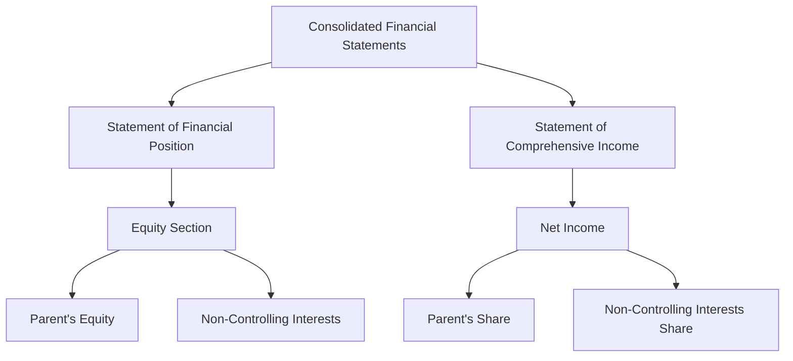

## 5.5 Non-Controlling Interests

In the realm of consolidated financial statements, non-controlling interests (NCI), often referred to as minority interests, represent the equity in a subsidiary not attributable to the parent company. Understanding and accurately accounting for NCIs is crucial for presenting a true and fair view of a group’s financial position and performance. This section delves into the accounting principles, methods, and standards governing NCIs, providing you with the knowledge and tools necessary for Canadian accounting exams and professional practice.

### Understanding Non-Controlling Interests

Non-controlling interests arise when a parent company owns less than 100% of a subsidiary. The portion of equity that is not owned by the parent is classified as NCI. This concept is essential in business combinations, where the parent company consolidates the financial statements of its subsidiaries.

#### Key Concepts

- **Parent Company:** The entity that has control over one or more subsidiaries.
- **Subsidiary:** An entity controlled by the parent company.
- **Control:** The power to govern the financial and operating policies of an entity to obtain benefits from its activities.

### Accounting for Non-Controlling Interests

The accounting for NCIs involves recognizing the minority shareholders' share of the subsidiary's net assets and results. This process is governed by International Financial Reporting Standards (IFRS) and Generally Accepted Accounting Principles (GAAP).

#### IFRS vs. GAAP

- **IFRS (IFRS 10):** Requires the presentation of NCIs in the consolidated statement of financial position within equity, separately from the equity of the owners of the parent.
- **GAAP (ASC 810):** Similar to IFRS, NCIs are presented as a component of equity in the consolidated balance sheet.

### Initial Recognition and Measurement

When a parent company acquires a controlling interest in a subsidiary, it must recognize the NCI at the acquisition date. There are two main methods for measuring NCIs:

1. **Fair Value Method:** NCIs are measured at their fair value at the acquisition date.
2. **Proportionate Share of Net Assets Method:** NCIs are measured based on their proportionate share of the subsidiary's identifiable net assets.

#### Example Calculation

Consider a parent company acquiring 80% of a subsidiary for $800,000. The fair value of the subsidiary's identifiable net assets is $1,000,000. The NCI can be calculated as follows:

- **Fair Value Method:** Assume the fair value of NCI is $250,000.
- **Proportionate Share Method:** NCI = 20% x $1,000,000 = $200,000.

### Subsequent Measurement

After initial recognition, NCIs are adjusted for their share of the subsidiary's profits or losses and other comprehensive income. Dividends paid to NCI holders also affect their carrying amount.

#### Journal Entries

To illustrate, consider a subsidiary earning $100,000 in profit, with NCIs holding 20%:

- **Profit Allocation:**
  - Debit: Retained Earnings (Parent's Share) $80,000
  - Debit: NCI $20,000
  - Credit: Consolidated Net Income $100,000

- **Dividend Payment:**
  - Debit: NCI $5,000
  - Credit: Cash $5,000

### Presentation in Financial Statements

NCIs are presented in the consolidated financial statements as follows:

- **Statement of Financial Position:** NCIs are shown within equity, separately from the parent’s equity.
- **Statement of Comprehensive Income:** The share of profit or loss attributable to NCIs is presented separately.

#### Example Presentation

Below is a simplified example of how NCIs might appear in the consolidated financial statements:

### Changes in Ownership Interests

Changes in the ownership interest of a subsidiary that do not result in a loss of control are accounted for as equity transactions. The carrying amount of NCIs is adjusted to reflect the changes in their ownership interest.

#### Example Scenario

If a parent company increases its ownership from 80% to 90%, the transaction is treated as an equity transaction, and the NCI is adjusted accordingly.

### Challenges and Considerations

Accounting for NCIs presents several challenges, including:

- **Fair Value Measurement:** Determining the fair value of NCIs can be complex and requires judgment.
- **Changes in Ownership:** Adjusting NCIs for changes in ownership without losing control requires careful accounting.
- **Disclosure Requirements:** Ensuring compliance with disclosure requirements under IFRS and GAAP.

### Best Practices

- **Regular Review:** Regularly review the carrying amount of NCIs to ensure accuracy.
- **Clear Documentation:** Maintain clear documentation of all transactions affecting NCIs.
- **Compliance:** Stay updated with changes in accounting standards and ensure compliance.

### Common Pitfalls

- **Incorrect Measurement:** Failing to accurately measure NCIs at the acquisition date can lead to misstated financial statements.
- **Inadequate Disclosure:** Insufficient disclosure of NCIs can result in non-compliance with accounting standards.

### Practical Examples and Case Studies

#### Case Study: Acquisition and Consolidation

Consider a case where Company A acquires 70% of Company B. The fair value of Company B's identifiable net assets is $500,000. The fair value of the NCI is determined to be $150,000.

- **Initial Recognition:**
  - Recognize the NCI at $150,000 using the fair value method.
  - Consolidate Company B’s financial statements with Company A.

- **Subsequent Measurement:**
  - Adjust the NCI for its share of Company B’s profits and losses.
  - Present the NCI separately in the consolidated financial statements.

### Regulatory Scenarios

In Canada, the accounting for NCIs is governed by IFRS as adopted by the Canadian Accounting Standards Board (AcSB). It is crucial to understand the specific requirements and guidance provided by CPA Canada and other regulatory bodies.

### Conclusion

Accounting for non-controlling interests is a vital aspect of consolidated financial statements. By understanding the principles and methods outlined in this section, you will be well-prepared for Canadian accounting exams and equipped to handle NCIs in professional practice. Remember to stay updated with the latest standards and apply best practices to ensure accurate and compliant financial reporting.

## **Ready to Test Your Knowledge?**



### What is the primary purpose of recognizing non-controlling interests in consolidated financial statements?

- [x] To reflect the equity interest of minority shareholders in a subsidiary
- [ ] To eliminate intercompany transactions
- [ ] To allocate profits solely to the parent company
- [ ] To adjust for currency exchange differences

> **Explanation:** Non-controlling interests represent the equity interest of minority shareholders in a subsidiary, ensuring that their share of net assets and results is accurately reflected in the consolidated financial statements.

### How are non-controlling interests initially measured under the fair value method?

- [x] At their fair value at the acquisition date
- [ ] At the book value of the subsidiary's net assets
- [ ] At the historical cost of the subsidiary
- [ ] At the market value of the parent company's shares

> **Explanation:** Under the fair value method, non-controlling interests are measured at their fair value at the acquisition date, reflecting the market's assessment of their worth.

### Which accounting standard governs the presentation of non-controlling interests under IFRS?

- [x] IFRS 10
- [ ] IFRS 9
- [ ] IFRS 15
- [ ] IFRS 16

> **Explanation:** IFRS 10 governs the presentation of non-controlling interests, requiring them to be shown within equity, separately from the equity of the owners of the parent.

### What happens to non-controlling interests when there is a change in ownership interest that does not result in a loss of control?

- [x] They are adjusted as an equity transaction
- [ ] They are remeasured at fair value
- [ ] They are eliminated from the financial statements
- [ ] They are recognized as a gain or loss

> **Explanation:** Changes in ownership interest that do not result in a loss of control are accounted for as equity transactions, adjusting the carrying amount of non-controlling interests accordingly.

### In which section of the consolidated statement of financial position are non-controlling interests presented?

- [x] Within equity
- [ ] As a liability
- [ ] As an asset
- [ ] As part of retained earnings

> **Explanation:** Non-controlling interests are presented within equity in the consolidated statement of financial position, separate from the parent's equity.

### How are dividends paid to non-controlling interest holders accounted for?

- [x] As a reduction in the carrying amount of non-controlling interests
- [ ] As an expense in the income statement
- [ ] As an increase in retained earnings
- [ ] As a liability

> **Explanation:** Dividends paid to non-controlling interest holders reduce the carrying amount of non-controlling interests in the consolidated financial statements.

### Which method measures non-controlling interests based on their proportionate share of the subsidiary's identifiable net assets?

- [x] Proportionate Share of Net Assets Method
- [ ] Fair Value Method
- [ ] Historical Cost Method
- [ ] Market Value Method

> **Explanation:** The Proportionate Share of Net Assets Method measures non-controlling interests based on their share of the subsidiary's identifiable net assets.

### What is a common challenge in accounting for non-controlling interests?

- [x] Determining the fair value of non-controlling interests
- [ ] Eliminating intercompany transactions
- [ ] Allocating profits solely to the parent company
- [ ] Adjusting for currency exchange differences

> **Explanation:** Determining the fair value of non-controlling interests can be challenging and requires careful judgment and estimation.

### How does IFRS 10 require non-controlling interests to be presented in the statement of comprehensive income?

- [x] Separately from the parent's share of profit or loss
- [ ] Combined with the parent's share of profit or loss
- [ ] As an expense
- [ ] As a liability

> **Explanation:** IFRS 10 requires the share of profit or loss attributable to non-controlling interests to be presented separately in the statement of comprehensive income.

### True or False: Changes in ownership interest that do not result in a loss of control are recognized as a gain or loss in the income statement.

- [ ] True
- [x] False

> **Explanation:** Changes in ownership interest that do not result in a loss of control are accounted for as equity transactions, not as a gain or loss in the income statement.


