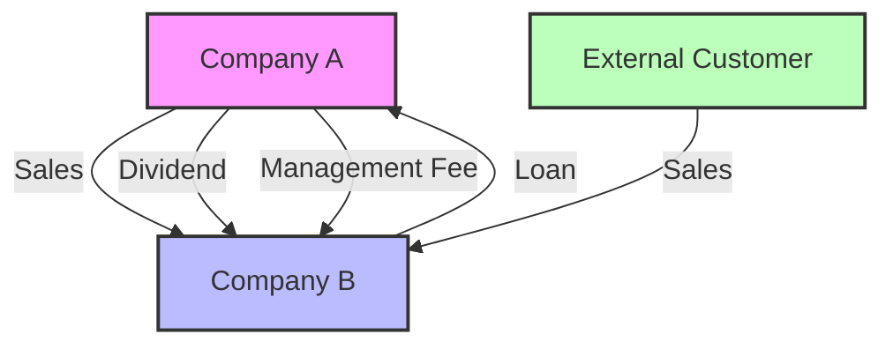

## 5.9 Intragroup Transactions

In the realm of advanced accounting, understanding and accurately accounting for intragroup transactions is crucial for preparing consolidated financial statements. Intragroup transactions refer to the financial activities that occur between entities within the same corporate group. These transactions can include sales, loans, dividends, and other financial exchanges. The primary goal in handling these transactions is to eliminate them from the consolidated financial statements to present a true and fair view of the group's financial position, performance, and cash flows.

### Understanding Intragroup Transactions

Intragroup transactions occur when one entity within a group engages in financial activities with another entity in the same group. These transactions can be diverse, including:

- **Sales and Purchases:** Goods or services sold by one group entity to another.
- **Loans and Advances:** Financial support extended between group entities.
- **Dividends:** Distribution of profits from a subsidiary to its parent company.
- **Intercompany Expenses:** Costs incurred by one entity on behalf of another.

These transactions must be eliminated during consolidation to avoid double counting and to ensure that the consolidated financial statements reflect only transactions with external parties.

### The Importance of Eliminating Intragroup Transactions

The elimination of intragroup transactions is essential for several reasons:

1. **Avoid Double Counting:** Including intragroup transactions would result in double counting of revenues, expenses, assets, and liabilities.
2. **Accurate Representation:** Consolidated financial statements should reflect the financial position and performance of the group as a single economic entity.
3. **Compliance with Standards:** Both IFRS and GAAP require the elimination of intragroup transactions to ensure compliance with accounting standards.

### Types of Intragroup Transactions

#### 1. **Intragroup Sales and Purchases**

When one entity within a group sells goods or services to another, the revenue and corresponding expense must be eliminated. This ensures that the consolidated income statement reflects only sales to external customers.

**Example:**
- Company A sells goods worth $100,000 to Company B. In the consolidated financial statements, both the sales revenue and the cost of goods sold must be eliminated.

#### 2. **Intragroup Loans and Advances**

Loans and advances between group entities must be eliminated to prevent overstating both assets and liabilities.

**Example:**
- Company A lends $50,000 to Company B. The loan receivable in Company A and the loan payable in Company B must be eliminated in the consolidation process.

#### 3. **Intragroup Dividends**

Dividends paid by a subsidiary to its parent company are eliminated to avoid double counting of income.

**Example:**
- Company B pays a dividend of $10,000 to Company A. This dividend income and the corresponding dividend expense must be eliminated.

#### 4. **Intragroup Expenses**

Expenses incurred by one entity on behalf of another, such as management fees, must be eliminated to ensure accurate expense reporting.

**Example:**
- Company A charges Company B a management fee of $5,000. This fee must be eliminated in the consolidated financial statements.

### Elimination Process in Consolidation

The elimination process involves several steps to ensure that intragroup transactions do not distort the consolidated financial statements:

1. **Identify Intragroup Transactions:** The first step is to identify all transactions that occur between entities within the group.
2. **Record Adjusting Entries:** Adjusting entries are made to eliminate the effects of intragroup transactions.
3. **Prepare Consolidated Financial Statements:** After adjustments, prepare the consolidated financial statements that reflect the group's financial position and performance as a single entity.

### Accounting Standards and Guidelines

Both IFRS and GAAP provide guidelines for the elimination of intragroup transactions:

- **IFRS 10 - Consolidated Financial Statements:** Requires the elimination of all intragroup transactions and balances.
- **ASC 810 - Consolidation (GAAP):** Provides similar requirements for eliminating intercompany transactions.

### Practical Examples and Case Studies

#### Case Study 1: Intragroup Sales

**Scenario:**
- Company A sells goods to Company B for $200,000, with a cost of $150,000. Company B sells these goods to an external customer for $250,000.

**Elimination Entries:**
- Eliminate the $200,000 sales revenue and $150,000 cost of goods sold from the consolidated income statement.

#### Case Study 2: Intragroup Loans

**Scenario:**
- Company A provides a loan of $100,000 to Company B. Company B pays $5,000 in interest to Company A.

**Elimination Entries:**
- Eliminate the $100,000 loan receivable and payable.
- Eliminate the $5,000 interest income and expense.

### Challenges and Common Pitfalls

1. **Complexity of Transactions:** Intragroup transactions can be complex, involving multiple entities and currencies.
2. **Timing Differences:** Transactions may occur at different times, leading to timing differences that need to be addressed.
3. **Currency Translation:** In multinational groups, currency translation can complicate the elimination process.

### Best Practices for Managing Intragroup Transactions

1. **Centralized Accounting Systems:** Use centralized systems to track and manage intragroup transactions.
2. **Regular Reconciliation:** Perform regular reconciliations to ensure all intragroup transactions are identified and eliminated.
3. **Clear Documentation:** Maintain clear documentation of all intragroup transactions to facilitate the elimination process.

### Regulatory Compliance and Real-World Applications

In Canada, compliance with IFRS is mandatory for publicly accountable enterprises. Private enterprises may choose to use ASPE, which also requires the elimination of intragroup transactions. Understanding these requirements is crucial for accountants preparing consolidated financial statements.

### Step-by-Step Guidance for Elimination

1. **Identify Transactions:** Review financial records to identify all intragroup transactions.
2. **Analyze Impact:** Determine the impact of each transaction on the financial statements.
3. **Record Adjustments:** Make necessary adjustments to eliminate the transactions.
4. **Review and Verify:** Review the adjustments to ensure accuracy and compliance with standards.

### Diagrams and Visual Aids

To enhance understanding, consider the following diagram illustrating the flow of intragroup transactions and their elimination:

### Summary and Key Takeaways

- Intragroup transactions must be eliminated to present accurate consolidated financial statements.
- Compliance with IFRS and GAAP is essential for proper financial reporting.
- Regular reconciliation and clear documentation are key to managing intragroup transactions effectively.

### Additional Resources

- **CPA Canada Handbook:** Provides comprehensive guidelines on accounting standards in Canada.
- **IFRS Foundation:** Offers resources and updates on international accounting standards.
- **Financial Accounting Standards Board (FASB):** Source for GAAP-related information.

### Conclusion

Mastering the elimination of intragroup transactions is a critical skill for accountants involved in preparing consolidated financial statements. By understanding the principles, challenges, and best practices, you can ensure compliance with accounting standards and present a true and fair view of the group's financial position.

## **Ready to Test Your Knowledge?**



### Which of the following is an example of an intragroup transaction?

- [x] Sale of goods from Company A to Company B within the same group
- [ ] Sale of goods from Company A to an external customer
- [ ] Purchase of equipment from an external supplier by Company B
- [ ] Payment of salaries by Company A to its employees

> **Explanation:** Intragroup transactions occur between entities within the same group, such as sales between Company A and Company B.

### What is the primary reason for eliminating intragroup transactions in consolidated financial statements?

- [x] To avoid double counting and present a true and fair view
- [ ] To increase the group's reported revenue
- [ ] To comply with tax regulations
- [ ] To simplify the accounting process

> **Explanation:** Eliminating intragroup transactions ensures that the consolidated financial statements reflect only external transactions, avoiding double counting.

### Under IFRS, which standard requires the elimination of intragroup transactions?

- [x] IFRS 10
- [ ] IFRS 15
- [ ] IFRS 16
- [ ] IFRS 9

> **Explanation:** IFRS 10 - Consolidated Financial Statements requires the elimination of all intragroup transactions and balances.

### In a case where Company A lends $100,000 to Company B, what should be eliminated in the consolidation process?

- [x] Loan receivable and loan payable
- [ ] Only the loan receivable
- [ ] Only the loan payable
- [ ] Interest income and expense

> **Explanation:** Both the loan receivable in Company A and the loan payable in Company B must be eliminated.

### What is a common challenge in eliminating intragroup transactions?

- [x] Complexity of transactions and timing differences
- [ ] Lack of accounting standards
- [ ] Insufficient financial data
- [ ] High transaction costs

> **Explanation:** Intragroup transactions can be complex, and timing differences may arise, making elimination challenging.

### Which of the following is NOT an intragroup transaction?

- [ ] Sale of goods from Company A to Company B
- [ ] Loan from Company A to Company B
- [x] Sale of goods from Company A to an external customer
- [ ] Dividend payment from Company B to Company A

> **Explanation:** Sales to external customers are not intragroup transactions; they involve parties outside the group.

### How should dividends paid by a subsidiary to its parent company be treated in consolidation?

- [x] Eliminated to avoid double counting of income
- [ ] Recognized as income in the consolidated statements
- [ ] Recorded as a liability
- [ ] Ignored in the consolidation process

> **Explanation:** Dividends paid by a subsidiary to its parent company should be eliminated to avoid double counting of income.

### What is the benefit of using a centralized accounting system for intragroup transactions?

- [x] Easier tracking and management of transactions
- [ ] Increased transaction costs
- [ ] Reduced compliance with standards
- [ ] Simplified financial statements

> **Explanation:** A centralized accounting system helps in tracking and managing intragroup transactions more efficiently.

### Which accounting standard provides guidelines for eliminating intercompany transactions under GAAP?

- [x] ASC 810
- [ ] ASC 606
- [ ] ASC 842
- [ ] ASC 320

> **Explanation:** ASC 810 - Consolidation provides guidelines for eliminating intercompany transactions under GAAP.

### True or False: Intragroup transactions must be included in the consolidated financial statements to reflect the group's total economic activity.

- [ ] True
- [x] False

> **Explanation:** Intragroup transactions must be eliminated to ensure that the consolidated financial statements reflect only external transactions.


