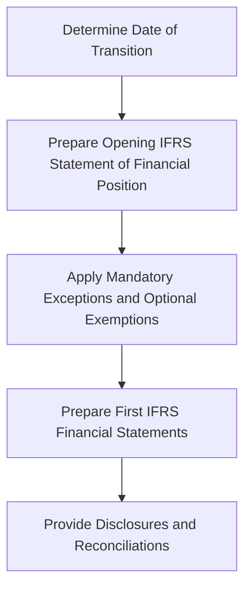

## 6.4 First-Time Adoption of IFRS

Transitioning to International Financial Reporting Standards (IFRS) for the first time is a significant milestone for any organization. This process involves a comprehensive understanding of IFRS 1, "First-time Adoption of International Financial Reporting Standards," which provides guidance for entities transitioning to IFRS. This section will delve into the intricacies of first-time adoption, offering insights and practical examples to help you navigate this complex process, particularly in the context of Canadian accounting standards.

### Understanding IFRS 1

IFRS 1 is designed to ensure that an entity's first IFRS financial statements contain high-quality information that is transparent, comparable, and provides a suitable starting point for accounting under IFRS. The standard outlines the procedures that an entity must follow when it adopts IFRS for the first time.

#### Key Objectives of IFRS 1

1. **Transparency and Comparability:** Ensure that the financial statements are transparent for users and comparable over all periods presented.
2. **Cost Efficiency:** Provide a suitable starting point for accounting under IFRS with cost efficiency in mind.
3. **Consistency:** Ensure that the financial statements are consistent with the standards and interpretations in force at the end of the first IFRS reporting period.

### Steps for First-Time Adoption

#### Step 1: Determine the Date of Transition

The date of transition is the starting point for preparing financial statements under IFRS. It is the beginning of the earliest period for which an entity presents full comparative information under IFRS in its first IFRS financial statements.

#### Step 2: Prepare an Opening IFRS Statement of Financial Position

The opening IFRS statement of financial position is prepared at the date of transition. This statement is crucial as it sets the foundation for all subsequent financial reporting under IFRS.

- **Recognition and Derecognition:** Recognize all assets and liabilities whose recognition is required by IFRS and derecognize items that do not qualify under IFRS.
- **Classification and Measurement:** Classify and measure all recognized assets and liabilities in accordance with IFRS.

#### Step 3: Apply Mandatory Exceptions and Optional Exemptions

IFRS 1 provides certain mandatory exceptions and optional exemptions to ease the transition process.

- **Mandatory Exceptions:** These include estimates, derecognition of financial assets and liabilities, hedge accounting, and non-controlling interests.
- **Optional Exemptions:** Entities can choose exemptions related to business combinations, share-based payment transactions, insurance contracts, and more.

#### Step 4: Prepare the First IFRS Financial Statements

The first IFRS financial statements must include at least three statements of financial position, two statements of profit or loss and other comprehensive income, two statements of cash flows, and two statements of changes in equity, along with related notes.

### Practical Examples and Case Studies

#### Example 1: Transitioning from ASPE to IFRS

Consider a Canadian company transitioning from Accounting Standards for Private Enterprises (ASPE) to IFRS. The company must adjust its financial statements to comply with IFRS, including changes in revenue recognition, lease accounting, and financial instruments.

- **Revenue Recognition:** Under IFRS 15, revenue is recognized based on the transfer of control rather than the transfer of risks and rewards.
- **Lease Accounting:** IFRS 16 requires lessees to recognize most leases on the balance sheet, impacting the company's financial position and performance metrics.

#### Example 2: Impact of IFRS 1 Exemptions

A company may choose to apply the exemption for business combinations, which allows it not to restate past business combinations. This decision can significantly impact the reported goodwill and intangible assets.

### Challenges and Common Pitfalls

Transitioning to IFRS can be challenging due to differences in accounting policies, the need for extensive data collection, and potential impacts on financial ratios and covenants. Common pitfalls include:

- **Inadequate Planning:** Failing to plan the transition process can lead to delays and increased costs.
- **Insufficient Training:** Lack of training for staff on IFRS principles can result in errors and inconsistencies.
- **Overlooking Disclosures:** IFRS requires extensive disclosures, which can be easily overlooked during the transition.

### Best Practices for a Smooth Transition

1. **Early Planning:** Start planning the transition process well in advance to identify potential challenges and allocate resources effectively.
2. **Comprehensive Training:** Provide thorough training for all relevant staff to ensure a deep understanding of IFRS requirements.
3. **Engage Experts:** Consider engaging external experts or consultants to assist with complex areas of the transition.
4. **Robust Systems:** Ensure that accounting systems are capable of handling IFRS requirements, including data collection and reporting.

### Real-World Applications and Regulatory Scenarios

In Canada, the adoption of IFRS is mandatory for publicly accountable enterprises. The transition process must align with the regulatory framework set by the Canadian Securities Administrators (CSA) and other relevant bodies. Entities must ensure compliance with both IFRS and Canadian-specific reporting requirements.

### Step-by-Step Guidance for Preparing Financial Statements

#### Preparing the Opening Statement of Financial Position

1. **Identify IFRS Differences:** Conduct a thorough analysis to identify differences between current accounting policies and IFRS requirements.
2. **Adjustments:** Make necessary adjustments to align with IFRS, including changes in recognition, measurement, and classification.
3. **Document Changes:** Maintain detailed documentation of all changes and the rationale behind them for audit and compliance purposes.

#### Preparing Comparative Financial Statements

1. **Restate Prior Periods:** Restate prior period financial statements to comply with IFRS, ensuring consistency and comparability.
2. **Disclosures:** Provide detailed disclosures explaining the transition process, including reconciliations of equity and profit or loss.

### Diagrams and Visual Aids

To enhance understanding, consider the following diagram illustrating the transition process under IFRS 1:

### Conclusion

The first-time adoption of IFRS is a complex but manageable process with the right planning and resources. By understanding the requirements of IFRS 1 and applying best practices, entities can achieve a smooth transition, ensuring compliance and enhancing the quality of financial reporting.

### Additional Resources

- **CPA Canada:** Offers a range of resources and guidance on IFRS adoption.
- **IFRS Foundation:** Provides comprehensive materials and updates on IFRS standards.
- **Canadian Securities Administrators (CSA):** Offers regulatory guidance for publicly accountable enterprises.

## **Ready to Test Your Knowledge?**



### What is the primary objective of IFRS 1?

- [x] To ensure that an entity's first IFRS financial statements contain high-quality information that is transparent and comparable.
- [ ] To simplify the accounting process for small businesses.
- [ ] To eliminate the need for financial statement disclosures.
- [ ] To provide tax benefits for companies adopting IFRS.

> **Explanation:** IFRS 1 aims to ensure that the first IFRS financial statements are transparent and comparable, providing a suitable starting point for accounting under IFRS.

### What is the date of transition in IFRS adoption?

- [x] The beginning of the earliest period for which an entity presents full comparative information under IFRS.
- [ ] The date the financial statements are approved by the board.
- [ ] The end of the first IFRS reporting period.
- [ ] The date of the first IFRS audit.

> **Explanation:** The date of transition is the start of the earliest period for which full comparative IFRS information is presented.

### Which of the following is a mandatory exception under IFRS 1?

- [x] Estimates
- [ ] Business combinations
- [ ] Share-based payments
- [ ] Insurance contracts

> **Explanation:** Estimates are a mandatory exception under IFRS 1, meaning they must be consistent with those made under previous GAAP.

### What is the purpose of the opening IFRS statement of financial position?

- [x] To provide a starting point for accounting under IFRS.
- [ ] To eliminate all previous accounting records.
- [ ] To simplify tax calculations.
- [ ] To reduce the number of financial disclosures required.

> **Explanation:** The opening IFRS statement of financial position serves as the foundation for all subsequent financial reporting under IFRS.

### Which of the following is an optional exemption under IFRS 1?

- [x] Business combinations
- [ ] Estimates
- [ ] Hedge accounting
- [ ] Non-controlling interests

> **Explanation:** Business combinations are an optional exemption, allowing entities not to restate past business combinations.

### What is a common pitfall during the IFRS transition?

- [x] Inadequate planning
- [ ] Over-disclosure
- [ ] Excessive training
- [ ] Simplified accounting processes

> **Explanation:** Inadequate planning is a common pitfall that can lead to delays and increased costs during the IFRS transition.

### How can entities ensure a smooth transition to IFRS?

- [x] Early planning and comprehensive training
- [ ] Reducing financial disclosures
- [ ] Eliminating comparative financial statements
- [ ] Simplifying accounting policies

> **Explanation:** Early planning and comprehensive training are crucial for a smooth transition to IFRS.

### What role do external experts play in IFRS adoption?

- [x] They assist with complex areas of the transition.
- [ ] They eliminate the need for internal accounting staff.
- [ ] They simplify tax calculations.
- [ ] They reduce the number of financial disclosures.

> **Explanation:** External experts can provide valuable assistance with complex areas of the IFRS transition.

### Which Canadian regulatory body provides guidance on IFRS adoption?

- [x] Canadian Securities Administrators (CSA)
- [ ] Canada Revenue Agency (CRA)
- [ ] Canadian Accounting Standards Board (AcSB)
- [ ] Financial Accounting Standards Board (FASB)

> **Explanation:** The Canadian Securities Administrators (CSA) provides regulatory guidance for publicly accountable enterprises adopting IFRS.

### True or False: IFRS 1 allows entities to choose not to restate past business combinations.

- [x] True
- [ ] False

> **Explanation:** IFRS 1 provides an optional exemption that allows entities not to restate past business combinations.


