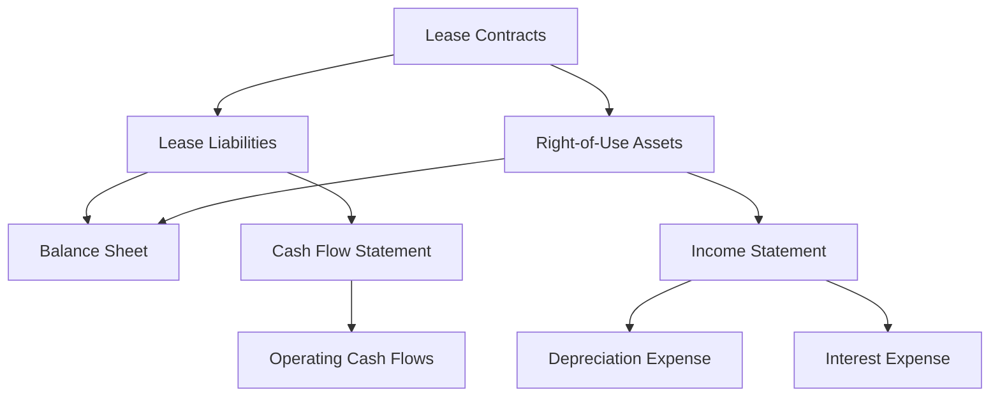

## 7.7 Disclosure Requirements for Leases

Lease accounting has undergone significant changes with the introduction of IFRS 16 and ASC 842, which have brought about comprehensive disclosure requirements. These standards aim to enhance transparency by ensuring that financial statements provide a faithful representation of lease transactions. Understanding these disclosure requirements is crucial for accounting professionals and students preparing for Canadian accounting exams. This guide will delve into the specifics of lease disclosures, focusing on both lessee and lessor perspectives, and provide practical examples to illustrate key concepts.

### Understanding Lease Disclosures

Lease disclosures are essential for providing stakeholders with a clear understanding of an entity's leasing activities and their impact on financial statements. These disclosures help users assess the amount, timing, and uncertainty of cash flows arising from leases.

#### Objectives of Lease Disclosures

1. **Transparency:** To offer a comprehensive view of lease obligations and rights.
2. **Comparability:** To allow users to compare lease-related financial information across different entities.
3. **Decision-Making:** To provide relevant information that aids stakeholders in making informed decisions.

### Key Disclosure Requirements under IFRS 16 and ASC 842

Both IFRS 16 and ASC 842 require entities to disclose qualitative and quantitative information about their leasing activities. While there are similarities between the two standards, there are also notable differences that entities must be aware of.

#### Lessee Disclosures

Lessee disclosures focus on providing information about the rights and obligations arising from lease contracts. Key disclosure requirements include:

1. **General Information:**
   - A description of the nature of leasing activities.
   - Information about lease terms, including renewal and termination options.
   - Details on any restrictions or covenants imposed by leases.

2. **Quantitative Disclosures:**
   - Total lease liabilities, distinguishing between current and non-current portions.
   - Right-of-use assets, broken down by class of underlying asset.
   - Lease expenses, including short-term, low-value, and variable lease payments.
   - Total cash outflows for leases during the reporting period.

3. **Maturity Analysis:**
   - A maturity analysis of lease liabilities, showing undiscounted cash flows for each of the first five years and the total thereafter.

4. **Reconciliation:**
   - A reconciliation of opening and closing balances of lease liabilities and right-of-use assets.

#### Lessor Disclosures

Lessor disclosures are designed to provide insights into the lessor's leasing activities and the risks associated with them. Key disclosure requirements include:

1. **General Information:**
   - A description of leasing arrangements and significant lease terms.
   - Information about lease modifications and reassessments.

2. **Quantitative Disclosures:**
   - Lease income, including variable lease payments and income from subleasing.
   - A maturity analysis of lease payments receivable, similar to lessee disclosures.

3. **Risk Management:**
   - Information about how the lessor manages risks associated with residual values.

### Practical Examples and Case Studies

To better understand these disclosure requirements, let's explore some practical examples and case studies that illustrate how entities might present lease information in their financial statements.

#### Example 1: Lessee Disclosure

**Company A**, a retail chain, has several lease agreements for its store locations. The company discloses the following information in its financial statements:

- **Nature of Leasing Activities:** Company A leases retail space with lease terms ranging from 5 to 10 years. Some leases include options to extend or terminate early.
- **Lease Liabilities:** Total lease liabilities amount to $10 million, with $2 million due within the next 12 months.
- **Right-of-Use Assets:** The carrying amount of right-of-use assets is $8 million, categorized by retail and office space.
- **Lease Expenses:** During the reporting period, Company A incurred $500,000 in short-term lease expenses and $200,000 in variable lease payments.

#### Example 2: Lessor Disclosure

**Company B**, an equipment leasing company, provides the following disclosures:

- **Nature of Leasing Activities:** Company B leases industrial equipment with terms ranging from 3 to 7 years. The leases include options for purchase at the end of the term.
- **Lease Income:** Total lease income for the period is $5 million, including $500,000 from variable lease payments.
- **Maturity Analysis:** The maturity analysis of lease payments receivable shows $3 million due within the next 12 months and $7 million thereafter.

### Real-World Applications and Regulatory Scenarios

Understanding the practical implications of lease disclosures is crucial for compliance and strategic decision-making. Here are some real-world applications and regulatory scenarios:

#### Impact on Financial Ratios

Lease disclosures can significantly impact financial ratios, such as the debt-to-equity ratio and return on assets. Entities must consider these effects when preparing financial statements and communicating with stakeholders.

#### Compliance with Canadian Standards

Canadian entities must comply with IFRS as adopted in Canada, which aligns with IFRS 16. However, private enterprises may follow ASPE, which has different disclosure requirements. It's essential to understand the applicable standards and ensure compliance.

### Step-by-Step Guidance for Preparing Lease Disclosures

Preparing lease disclosures involves several steps, from gathering necessary information to presenting it in financial statements. Here's a step-by-step guide to help you navigate this process:

1. **Identify Lease Contracts:** Review all contracts to determine if they meet the definition of a lease under IFRS 16 or ASC 842.
2. **Gather Information:** Collect data on lease terms, payments, and any modifications or reassessments.
3. **Calculate Lease Liabilities and Right-of-Use Assets:** Use the present value of future lease payments to calculate lease liabilities and recognize corresponding right-of-use assets.
4. **Prepare Maturity Analysis:** Develop a maturity analysis of lease liabilities or receivables.
5. **Draft Disclosures:** Prepare qualitative and quantitative disclosures, ensuring they meet the requirements of the applicable standard.
6. **Review and Finalize:** Review the disclosures for accuracy and completeness, and finalize them for inclusion in the financial statements.

### Diagrams and Visual Aids

To enhance understanding, let's incorporate a diagram illustrating the relationship between lease liabilities, right-of-use assets, and financial statement impacts.

### Best Practices and Common Pitfalls

When preparing lease disclosures, consider the following best practices and common pitfalls:

#### Best Practices

- **Maintain Consistency:** Ensure consistency in the presentation of lease information across reporting periods.
- **Use Clear Language:** Avoid jargon and use clear, concise language to enhance understanding.
- **Provide Context:** Offer additional context or explanations for complex lease arrangements.

#### Common Pitfalls

- **Incomplete Disclosures:** Failing to provide all required information can lead to non-compliance.
- **Inaccurate Calculations:** Errors in calculating lease liabilities or right-of-use assets can mislead stakeholders.
- **Omitting Qualitative Information:** Neglecting qualitative disclosures can result in a lack of transparency.

### References and Additional Resources

For further exploration of lease disclosures, consider the following resources:

- **IFRS 16 Leases Standard:** Available on the IFRS Foundation website.
- **ASC 842 Leases Standard:** Accessible through the Financial Accounting Standards Board (FASB) website.
- **CPA Canada Resources:** Offers guidance and publications on lease accounting and disclosures.

### Summary and Key Takeaways

Lease disclosures play a critical role in financial reporting, providing stakeholders with essential information about an entity's leasing activities. By understanding the requirements under IFRS 16 and ASC 842, and following best practices, entities can ensure compliance and enhance transparency. As you prepare for Canadian accounting exams, focus on mastering these disclosure requirements and applying them in practical scenarios.

## **Ready to Test Your Knowledge?**



### Which of the following is a key objective of lease disclosures?

- [x] Transparency
- [ ] Profit Maximization
- [ ] Cost Reduction
- [ ] Market Expansion

> **Explanation:** Lease disclosures aim to provide transparency by offering a comprehensive view of lease obligations and rights.

### What is the primary focus of lessee disclosures under IFRS 16?

- [x] Rights and obligations arising from lease contracts
- [ ] Profitability of lease operations
- [ ] Market share of leased assets
- [ ] Cost of leasehold improvements

> **Explanation:** Lessee disclosures focus on providing information about the rights and obligations arising from lease contracts.

### Under IFRS 16, what should a maturity analysis of lease liabilities include?

- [x] Undiscounted cash flows for each of the first five years and the total thereafter
- [ ] Discounted cash flows for each year
- [ ] Only the total undiscounted cash flows
- [ ] Only the discounted cash flows

> **Explanation:** A maturity analysis should show undiscounted cash flows for each of the first five years and the total thereafter.

### Which of the following is a common pitfall in preparing lease disclosures?

- [x] Incomplete Disclosures
- [ ] Overstating Lease Income
- [ ] Understating Lease Expenses
- [ ] Overestimating Market Share

> **Explanation:** Incomplete disclosures can lead to non-compliance and a lack of transparency.

### What type of information is typically included in lessor disclosures?

- [x] Lease income and maturity analysis of lease payments receivable
- [ ] Only the total lease income
- [ ] Only the maturity analysis
- [ ] Profitability of leasing operations

> **Explanation:** Lessor disclosures include lease income and a maturity analysis of lease payments receivable.

### Which standard governs lease disclosures for Canadian entities following IFRS?

- [x] IFRS 16
- [ ] ASC 842
- [ ] ASPE
- [ ] GAAP

> **Explanation:** Canadian entities following IFRS must comply with IFRS 16 for lease disclosures.

### What is a key component of lessee quantitative disclosures?

- [x] Total lease liabilities
- [ ] Total lease income
- [ ] Market value of leased assets
- [ ] Profitability of lease operations

> **Explanation:** Lessee quantitative disclosures include total lease liabilities, distinguishing between current and non-current portions.

### What should entities consider when preparing lease disclosures?

- [x] Consistency and accuracy
- [ ] Profitability and market share
- [ ] Cost reduction strategies
- [ ] Expansion plans

> **Explanation:** Entities should ensure consistency and accuracy in their lease disclosures to enhance transparency.

### What is the impact of lease disclosures on financial ratios?

- [x] They can significantly impact ratios such as debt-to-equity and return on assets.
- [ ] They have no impact on financial ratios.
- [ ] They only impact profitability ratios.
- [ ] They only impact liquidity ratios.

> **Explanation:** Lease disclosures can significantly impact financial ratios, such as the debt-to-equity ratio and return on assets.

### True or False: Lease disclosures under IFRS 16 and ASC 842 are identical.

- [ ] True
- [x] False

> **Explanation:** While IFRS 16 and ASC 842 have similarities, there are notable differences in their disclosure requirements.


