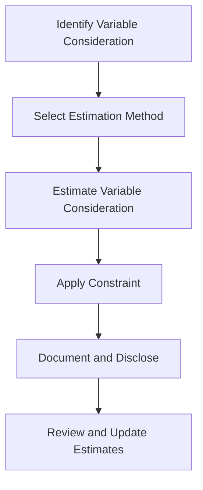

## 8.4 Variable Consideration and Constraints

In the realm of advanced accounting practices, understanding how to handle variable consideration and constraints is crucial for accurate revenue recognition. This section will delve into the complexities of variable payments, the estimation of revenue amounts, and the application of accounting standards such as IFRS 15 and ASPE 3400. As you prepare for the Canadian Accounting Exams, mastering these concepts will not only help you excel in your exams but also equip you with the skills necessary for professional practice.

### Understanding Variable Consideration

Variable consideration refers to the portion of a transaction price that is contingent on future events. This can include discounts, rebates, refunds, credits, price concessions, incentives, performance bonuses, penalties, and other similar items. The challenge for accountants is to estimate the amount of variable consideration that should be included in the transaction price at the time of revenue recognition.

#### Key Concepts in Variable Consideration

1. **Types of Variable Consideration:**
   - **Discounts and Rebates:** Offered to customers as a reduction in the selling price.
   - **Performance Bonuses and Penalties:** Based on achieving or failing to meet certain performance criteria.
   - **Price Concessions:** Agreed reductions in the selling price due to various factors.
   - **Refunds and Returns:** Expected returns of goods or refunds for services not rendered.

2. **Estimation Methods:**
   - **Expected Value Method:** This involves calculating a probability-weighted amount of possible outcomes.
   - **Most Likely Amount Method:** This involves selecting the single most likely amount from a range of possible outcomes.

3. **Constraints on Variable Consideration:**
   - The inclusion of variable consideration in the transaction price is subject to constraints to ensure that revenue is not overstated. The constraint is applied to the extent that it is highly probable that a significant reversal of cumulative revenue will not occur when the uncertainty is resolved.

### Applying IFRS 15 and ASPE 3400

#### IFRS 15: Revenue from Contracts with Customers

Under IFRS 15, the process of recognizing revenue involves five steps, with variable consideration playing a crucial role in determining the transaction price. The standard requires entities to estimate variable consideration using either the expected value or the most likely amount method, depending on which is more predictive of the amount of consideration to which the entity will be entitled.

- **Step 1: Identify the Contract with a Customer**
- **Step 2: Identify the Performance Obligations in the Contract**
- **Step 3: Determine the Transaction Price**
  - **Incorporating Variable Consideration:** Estimate the variable consideration and apply the constraint to ensure that it is highly probable that a significant reversal will not occur.
- **Step 4: Allocate the Transaction Price to the Performance Obligations**
- **Step 5: Recognize Revenue When (or as) the Entity Satisfies a Performance Obligation**

#### ASPE 3400: Revenue

For private enterprises in Canada, ASPE 3400 provides guidance on revenue recognition, including the treatment of variable consideration. While ASPE is less prescriptive than IFRS, it still requires careful estimation and consideration of constraints to ensure that revenue is not overstated.

### Practical Examples and Case Studies

#### Example 1: Performance Bonus in a Construction Contract

Consider a construction company that enters into a contract to build a bridge for $10 million, with a $1 million bonus if completed within 12 months. The company estimates a 70% probability of completing the project on time. Using the expected value method, the variable consideration is calculated as $700,000 (70% of $1 million). The company must then assess whether it is highly probable that a significant reversal will not occur.

#### Example 2: Volume Discounts in Retail

A retailer offers a 10% discount on purchases over $100,000. Based on historical data, the retailer estimates that 30% of customers will qualify for the discount. Using the expected value method, the retailer estimates the variable consideration as $3,000 for every $100,000 in sales. The retailer must apply the constraint to ensure that the estimate is reliable.

### Challenges and Best Practices

1. **Estimation Uncertainty:**
   - Estimating variable consideration involves significant judgment and uncertainty. It is essential to use reliable data and assumptions to make accurate estimates.

2. **Application of Constraints:**
   - Applying the constraint requires careful consideration of the likelihood and magnitude of potential reversals. Entities must document their assessment and rationale.

3. **Disclosure Requirements:**
   - Both IFRS and ASPE require entities to disclose information about the methods, inputs, and assumptions used in estimating variable consideration. This transparency helps users of financial statements understand the risks and uncertainties involved.

### Real-World Applications and Regulatory Scenarios

In practice, variable consideration can significantly impact financial statements and business decisions. Companies must navigate complex regulatory environments and ensure compliance with accounting standards. For example, in industries such as pharmaceuticals, technology, and construction, variable consideration is a common feature of contracts and requires careful management.

### Step-by-Step Guidance for Estimating Variable Consideration

1. **Identify the Types of Variable Consideration:**
   - Determine the nature and terms of any variable payments in the contract.

2. **Select the Appropriate Estimation Method:**
   - Choose between the expected value and most likely amount methods based on the nature of the variable consideration.

3. **Apply the Constraint:**
   - Assess the likelihood and magnitude of potential reversals and apply the constraint to ensure that revenue is not overstated.

4. **Document the Estimation Process:**
   - Maintain detailed records of the estimation process, including the methods, inputs, and assumptions used.

5. **Review and Update Estimates:**
   - Regularly review and update estimates as new information becomes available or as circumstances change.

### Diagrams and Visual Aids

To enhance understanding, consider the following diagram illustrating the process of estimating variable consideration and applying the constraint:

### Summary and Key Points

- Variable consideration involves estimating future payments that are contingent on uncertain events.
- The expected value and most likely amount methods are used to estimate variable consideration.
- Constraints are applied to ensure that revenue is not overstated by assessing the likelihood and magnitude of potential reversals.
- Compliance with IFRS 15 and ASPE 3400 requires careful estimation, documentation, and disclosure of variable consideration.

### Exam Strategies and Tips

- Focus on understanding the principles and methods for estimating variable consideration.
- Practice applying the constraint to ensure that revenue estimates are reliable.
- Familiarize yourself with the disclosure requirements and be prepared to explain the estimation process.

### Additional Resources

- CPA Canada Handbook: IFRS 15 and ASPE 3400
- International Financial Reporting Standards (IFRS) Foundation
- Accounting Standards Board (AcSB) of Canada

## **Ready to Test Your Knowledge?**



### What is variable consideration?

- [x] A portion of the transaction price that is contingent on future events
- [ ] A fixed amount agreed upon in the contract
- [ ] A discount offered to all customers
- [ ] A penalty for non-performance

> **Explanation:** Variable consideration refers to the part of the transaction price that depends on future events, such as discounts, rebates, or performance bonuses.

### Which method can be used to estimate variable consideration?

- [x] Expected value method
- [x] Most likely amount method
- [ ] Straight-line method
- [ ] Declining balance method

> **Explanation:** The expected value and most likely amount methods are used to estimate variable consideration, depending on which is more predictive of the outcome.

### What is the purpose of applying a constraint to variable consideration?

- [x] To ensure that revenue is not overstated
- [ ] To increase the transaction price
- [ ] To decrease the transaction price
- [ ] To eliminate variable consideration

> **Explanation:** The constraint is applied to ensure that it is highly probable that a significant reversal of cumulative revenue will not occur when the uncertainty is resolved.

### Under which accounting standard is variable consideration addressed?

- [x] IFRS 15
- [ ] ASPE 3200
- [ ] IAS 16
- [ ] IFRS 9

> **Explanation:** Variable consideration is addressed under IFRS 15, which provides guidance on revenue from contracts with customers.

### What should be documented during the estimation of variable consideration?

- [x] Methods, inputs, and assumptions used
- [ ] Only the final estimated amount
- [ ] The transaction price only
- [ ] The customer's financial statements

> **Explanation:** Entities must document the methods, inputs, and assumptions used in estimating variable consideration to ensure transparency and compliance.

### How often should estimates of variable consideration be reviewed?

- [x] Regularly, as new information becomes available
- [ ] Only at the end of the fiscal year
- [ ] Once at the beginning of the contract
- [ ] Never

> **Explanation:** Estimates should be reviewed regularly to ensure they remain accurate and reflect any changes in circumstances or new information.

### What is a common challenge in estimating variable consideration?

- [x] Estimation uncertainty
- [ ] Lack of accounting standards
- [ ] Fixed transaction prices
- [ ] Inflexible contracts

> **Explanation:** Estimation uncertainty is a common challenge, as it involves significant judgment and the use of reliable data and assumptions.

### Which of the following is NOT a type of variable consideration?

- [x] Fixed price
- [ ] Discounts
- [ ] Performance bonuses
- [ ] Refunds

> **Explanation:** A fixed price is not a type of variable consideration, as it does not depend on future events.

### What is the expected value method?

- [x] A probability-weighted calculation of possible outcomes
- [ ] The single most likely amount from a range of outcomes
- [ ] A method for calculating fixed prices
- [ ] A method for calculating penalties

> **Explanation:** The expected value method involves calculating a probability-weighted amount of possible outcomes to estimate variable consideration.

### True or False: Variable consideration can include rebates and incentives.

- [x] True
- [ ] False

> **Explanation:** True. Variable consideration can include rebates, incentives, and other similar items that depend on future events.


