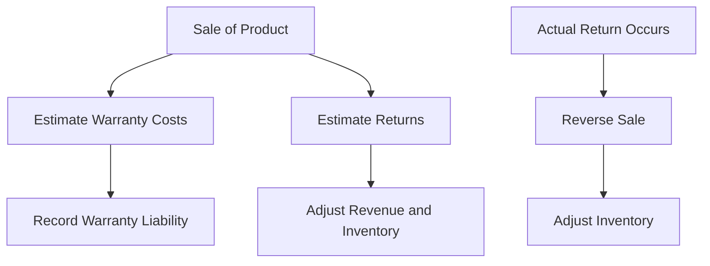

## 8.6 Warranties and Returns

In the realm of advanced accounting, warranties and returns play a pivotal role in revenue recognition and financial reporting. Understanding how to accurately account for these elements is crucial for ensuring compliance with Canadian accounting standards, including International Financial Reporting Standards (IFRS) and Generally Accepted Accounting Principles (GAAP). This section provides a comprehensive guide to the accounting practices for warranties and returns, offering insights into the principles, methodologies, and regulatory requirements that govern these transactions.

### Understanding Warranties

#### Types of Warranties

Warranties are commitments made by a seller to a buyer, assuring the quality, performance, or condition of a product over a specified period. They can be classified into two main types:

1. **Assurance-Type Warranties**: These warranties guarantee that the product will function as promised and comply with agreed-upon specifications. They are typically included in the sales price and do not result in a separate performance obligation.

2. **Service-Type Warranties**: These warranties provide additional services beyond the assurance of product performance, such as extended maintenance or repair services. They are considered separate performance obligations and require distinct accounting treatment.

#### Accounting for Warranties

The accounting treatment for warranties depends on their classification:

- **Assurance-Type Warranties**: The cost of providing these warranties is estimated and recognized as an expense at the time of sale. This involves creating a warranty liability based on historical data and expected future costs.

- **Service-Type Warranties**: Revenue from these warranties is recognized over the period the service is provided. The consideration received is allocated between the product and the warranty service based on their relative standalone selling prices.

#### Example: Accounting for Warranties

Consider a company that sells electronic devices with a one-year assurance warranty and offers an optional two-year extended warranty. The accounting entries would be as follows:

- **Assurance Warranty**: At the time of sale, the company estimates the warranty cost and records a liability. For instance, if the estimated warranty cost is $50 per device, the entry would be:

  ```
  Debit: Warranty Expense $50
  Credit: Warranty Liability $50
  ```

- **Extended Warranty**: Revenue from the extended warranty is deferred and recognized over the warranty period. If the extended warranty is sold for $100, the entry at the time of sale would be:

  ```
  Debit: Cash $100
  Credit: Deferred Revenue $100
  ```

  Revenue is then recognized periodically over the two-year period.

### Understanding Returns

#### Types of Returns

Product returns can occur for various reasons, such as defects, dissatisfaction, or changes in consumer preferences. Returns policies can significantly impact revenue recognition and financial reporting.

#### Accounting for Returns

The accounting for returns involves estimating the expected returns and adjusting revenue and inventory accordingly. This process typically includes:

- **Estimating Returns**: Companies must estimate the expected returns based on historical data and current trends. This estimate is used to adjust revenue and inventory accounts.

- **Recording Returns**: When a return occurs, the company reverses the original sale and adjusts inventory. For example, if a product sold for $200 is returned, the entry would be:

  ```
  Debit: Sales Returns and Allowances $200
  Credit: Accounts Receivable $200
  ```

  Additionally, the cost of goods sold is adjusted, and inventory is increased.

#### Example: Accounting for Returns

Suppose a company sells 1,000 units of a product at $100 each, with an expected return rate of 5%. The company would estimate returns as follows:

- **Estimated Returns**: 1,000 units x 5% = 50 units
- **Revenue Adjustment**: 50 units x $100 = $5,000

The entries to account for estimated returns at the time of sale would be:

```
Debit: Sales Returns and Allowances $5,000
Credit: Allowance for Sales Returns $5,000
```

When actual returns occur, the company adjusts the allowance and inventory accounts accordingly.

### Regulatory Framework and Standards

#### IFRS and GAAP

Both IFRS and GAAP provide guidance on accounting for warranties and returns. Key standards include:

- **IFRS 15: Revenue from Contracts with Customers**: This standard outlines the principles for recognizing revenue, including the treatment of warranties and returns. It emphasizes the identification of performance obligations and the allocation of transaction prices.

- **ASC 606: Revenue from Contracts with Customers**: Under GAAP, this standard mirrors IFRS 15 and provides detailed guidance on revenue recognition, including the accounting for warranties and returns.

#### Compliance and Disclosure

Companies must ensure compliance with relevant standards and provide adequate disclosures in their financial statements. This includes:

- **Disclosure of Warranty Obligations**: Companies must disclose the nature and terms of warranties, including the accounting policies used and any significant estimates or assumptions.

- **Disclosure of Returns Policies**: Information about returns policies, including the basis for estimating returns and the impact on revenue, must be disclosed.

### Practical Applications and Challenges

#### Best Practices

To effectively manage warranties and returns, companies should:

- **Develop Robust Estimation Processes**: Accurate estimation of warranty costs and returns is crucial for reliable financial reporting. Companies should use historical data, industry benchmarks, and statistical models to refine their estimates.

- **Implement Strong Internal Controls**: Effective internal controls help ensure the accuracy and completeness of warranty and return data. This includes regular reviews and reconciliations of warranty liabilities and returns allowances.

- **Enhance Customer Satisfaction**: By providing clear and fair warranties and returns policies, companies can enhance customer satisfaction and loyalty, potentially reducing the volume of returns.

#### Common Pitfalls

Companies may encounter several challenges in accounting for warranties and returns, including:

- **Inaccurate Estimates**: Over- or underestimating warranty costs and returns can lead to significant financial misstatements. Companies should regularly review and adjust their estimates based on actual experience.

- **Complex Contract Terms**: Complex warranty and return terms can complicate revenue recognition. Companies should ensure that contract terms are clearly defined and consistently applied.

- **Regulatory Changes**: Changes in accounting standards or regulatory requirements can impact the accounting for warranties and returns. Companies should stay informed of any changes and adjust their accounting policies accordingly.

### Case Studies and Scenarios

#### Case Study 1: Electronics Manufacturer

An electronics manufacturer offers a one-year assurance warranty and a three-year extended warranty on its products. The company estimates warranty costs based on historical data and industry trends. By implementing a robust estimation process and regularly reviewing its assumptions, the company ensures accurate financial reporting and compliance with IFRS 15.

#### Case Study 2: Retailer with High Return Rates

A retailer experiences high return rates due to seasonal products and changing consumer preferences. The company develops a detailed returns policy and uses statistical models to estimate returns. By enhancing its internal controls and regularly reviewing its estimates, the retailer minimizes the impact of returns on its financial statements.

### Diagrams and Visuals

To enhance understanding, consider the following diagram illustrating the accounting process for warranties and returns:



### Conclusion

Accounting for warranties and returns is a critical aspect of revenue recognition and financial reporting. By understanding the principles and methodologies outlined in this guide, you can ensure compliance with Canadian accounting standards and enhance the accuracy of your financial statements. Remember to stay informed of regulatory changes and continuously refine your estimation processes to adapt to evolving business environments.

## **Ready to Test Your Knowledge?**



### Which type of warranty guarantees that a product will function as promised and is included in the sales price?

- [x] Assurance-Type Warranty
- [ ] Service-Type Warranty
- [ ] Extended Warranty
- [ ] Performance Warranty

> **Explanation:** Assurance-type warranties are included in the sales price and guarantee the product's performance according to specifications.

### How should revenue from a service-type warranty be recognized?

- [ ] At the time of sale
- [x] Over the warranty period
- [ ] When the warranty is claimed
- [ ] When the product is returned

> **Explanation:** Revenue from service-type warranties is recognized over the period the service is provided, reflecting the separate performance obligation.

### What is the primary accounting standard for revenue recognition under IFRS?

- [ ] ASC 606
- [x] IFRS 15
- [ ] IAS 18
- [ ] GAAP 101

> **Explanation:** IFRS 15 outlines the principles for recognizing revenue from contracts with customers, including warranties and returns.

### What entry is made to adjust revenue for estimated returns?

- [x] Debit: Sales Returns and Allowances; Credit: Allowance for Sales Returns
- [ ] Debit: Cash; Credit: Revenue
- [ ] Debit: Inventory; Credit: Cost of Goods Sold
- [ ] Debit: Warranty Expense; Credit: Warranty Liability

> **Explanation:** Estimated returns are recorded by debiting sales returns and allowances and crediting an allowance for sales returns.

### Which of the following is a best practice for managing warranties and returns?

- [x] Develop robust estimation processes
- [ ] Ignore historical data
- [ ] Use a fixed percentage for all products
- [ ] Avoid disclosing warranty terms

> **Explanation:** Developing robust estimation processes ensures accurate financial reporting and compliance with accounting standards.

### What is the impact of overestimating warranty costs?

- [ ] Understated expenses
- [x] Overstated liabilities
- [ ] Overstated revenue
- [ ] Understated inventory

> **Explanation:** Overestimating warranty costs leads to overstated liabilities, affecting the financial statements' accuracy.

### How are assurance-type warranties typically accounted for?

- [ ] As a separate performance obligation
- [x] Included in the sales price
- [ ] Deferred revenue
- [ ] Direct expense

> **Explanation:** Assurance-type warranties are included in the sales price and do not create a separate performance obligation.

### What should companies disclose about their returns policies?

- [ ] Only the return rate
- [x] Basis for estimating returns and impact on revenue
- [ ] Only the financial impact
- [ ] No disclosure is necessary

> **Explanation:** Companies must disclose the basis for estimating returns and their impact on revenue to ensure transparency and compliance.

### Which accounting standard under GAAP is equivalent to IFRS 15?

- [x] ASC 606
- [ ] ASC 842
- [ ] ASC 718
- [ ] ASC 450

> **Explanation:** ASC 606 under GAAP mirrors IFRS 15, providing guidance on revenue recognition, including warranties and returns.

### True or False: Service-type warranties are recognized as revenue at the time of sale.

- [ ] True
- [x] False

> **Explanation:** Service-type warranties are recognized as revenue over the warranty period, reflecting the ongoing service obligation.


