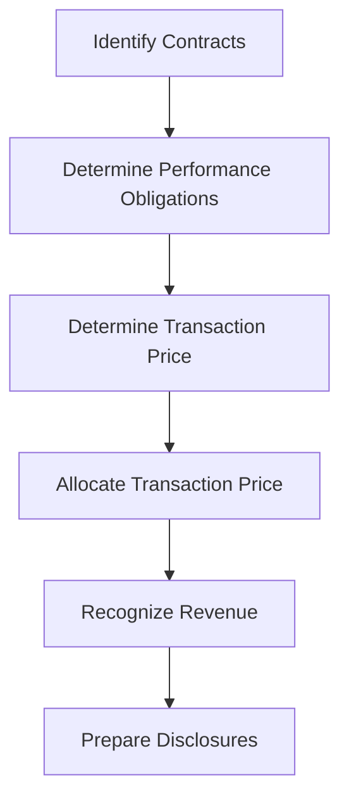

## 8.9 Revenue Disclosures and Reporting

Revenue disclosures and reporting are critical components of financial statements that provide transparency and insights into an entity's revenue recognition practices. For Canadian accounting professionals, understanding these disclosures is essential, as they are governed by both International Financial Reporting Standards (IFRS) as adopted in Canada and the Accounting Standards for Private Enterprises (ASPE). This section will delve into the mandatory disclosures related to revenue recognition, offering you a comprehensive guide to mastering this topic for your Canadian Accounting Exams.

### Understanding Revenue Disclosures

Revenue disclosures are designed to provide stakeholders with detailed information about the nature, amount, timing, and uncertainty of revenue and cash flows arising from contracts with customers. These disclosures are crucial for users of financial statements to assess the financial performance and prospects of an entity.

#### Key Objectives of Revenue Disclosures

1. **Transparency:** Ensure that financial statements clearly reflect the revenue recognition policies and practices of the entity.
2. **Comparability:** Allow users to compare revenue information across different entities and periods.
3. **Decision-Making:** Provide stakeholders with relevant information to make informed decisions about the entity's financial health and future prospects.

#### IFRS 15 and ASPE 3400

The primary standards governing revenue disclosures in Canada are IFRS 15, "Revenue from Contracts with Customers," and ASPE 3400, "Revenue." While IFRS 15 is applicable to public companies and other entities that follow IFRS, ASPE 3400 is relevant for private enterprises. Both standards emphasize the need for detailed disclosures to enhance the understanding of revenue recognition practices.

### Mandatory Revenue Disclosures under IFRS 15

IFRS 15 requires entities to disclose qualitative and quantitative information about their contracts with customers, significant judgments, and changes in those judgments. The following are key disclosure requirements under IFRS 15:

#### 1. Disaggregation of Revenue

Entities must disaggregate revenue into categories that depict how the nature, amount, timing, and uncertainty of revenue and cash flows are affected by economic factors. Common categories include:

- Type of good or service
- Geographical region
- Market or customer type
- Contract duration

**Example:** A software company might disaggregate revenue into categories such as software licenses, maintenance services, and consulting services.

#### 2. Contract Balances

Entities must disclose the opening and closing balances of contract assets and liabilities, along with the changes during the period. This includes information about:

- **Contract Assets:** Rights to consideration for goods or services transferred to a customer.
- **Contract Liabilities:** Obligations to transfer goods or services to a customer for which the entity has received consideration.

**Example:** A construction company might report contract liabilities related to advance payments received from customers.

#### 3. Performance Obligations

Entities must provide information about their performance obligations, including:

- Nature of goods or services promised
- Timing of satisfaction of performance obligations
- Significant payment terms

**Example:** A telecommunications company might disclose performance obligations related to bundled service contracts, such as internet and phone services.

#### 4. Significant Judgments

Entities must disclose the judgments made in applying IFRS 15 that significantly affect the determination of the amount and timing of revenue. This includes:

- Methods used to recognize revenue over time
- Determination of the transaction price
- Allocation of the transaction price to performance obligations

**Example:** A real estate developer might disclose judgments related to the timing of revenue recognition for long-term construction contracts.

#### 5. Practical Expedients

Entities must disclose the use of any practical expedients allowed under IFRS 15, such as the expedient for recognizing revenue at the amount invoiced for completed performance obligations.

### Revenue Disclosures under ASPE 3400

For private enterprises following ASPE 3400, the disclosure requirements are less extensive than those under IFRS 15. However, entities must still provide sufficient information to enable users to understand the nature, amount, timing, and uncertainty of revenue.

#### Key Disclosure Requirements under ASPE 3400

1. **Revenue Recognition Policies:** Entities must disclose their revenue recognition policies, including the basis for recognizing revenue and any significant judgments made.

2. **Nature of Revenue:** Entities must provide information about the nature of their revenue, such as the types of goods or services provided.

3. **Significant Estimates:** Entities must disclose any significant estimates made in determining revenue, such as estimates related to variable consideration.

### Practical Examples and Case Studies

To illustrate the application of revenue disclosures, consider the following practical examples and case studies relevant to the Canadian accounting profession:

#### Case Study 1: Technology Company

A technology company provides cloud-based software solutions and consulting services. Under IFRS 15, the company disaggregates its revenue into software subscriptions, consulting services, and hardware sales. The company discloses contract assets related to unbilled receivables for consulting services and contract liabilities for advance payments received for software subscriptions.

#### Case Study 2: Manufacturing Firm

A manufacturing firm produces and sells industrial equipment. The firm discloses its revenue recognition policy under ASPE 3400, highlighting that revenue is recognized when control of the equipment transfers to the customer. The firm also discloses significant estimates related to warranties and returns.

### Real-World Applications and Regulatory Scenarios

Revenue disclosures are not only important for compliance but also for providing insights into an entity's business model and performance. In practice, entities must navigate various regulatory scenarios and challenges, such as:

- **Complex Contracts:** Entities with complex contracts, such as those involving multiple performance obligations or variable consideration, must carefully assess and disclose their revenue recognition practices.
- **Regulatory Changes:** Changes in accounting standards or regulatory requirements may impact revenue disclosures, requiring entities to update their policies and disclosures accordingly.
- **Industry-Specific Considerations:** Different industries may have unique revenue recognition challenges and disclosure requirements. For example, the construction industry often deals with long-term contracts and percentage-of-completion accounting.

### Step-by-Step Guidance for Preparing Revenue Disclosures

To effectively prepare revenue disclosures, follow these step-by-step guidelines:

1. **Identify Contracts with Customers:** Review all contracts to determine which are within the scope of IFRS 15 or ASPE 3400.

2. **Determine Performance Obligations:** Identify distinct goods or services promised in each contract and assess whether they represent separate performance obligations.

3. **Determine the Transaction Price:** Calculate the amount of consideration expected to be received in exchange for transferring goods or services to the customer.

4. **Allocate the Transaction Price:** Allocate the transaction price to each performance obligation based on the relative standalone selling prices.

5. **Recognize Revenue:** Recognize revenue when (or as) the entity satisfies a performance obligation by transferring control of the promised good or service to the customer.

6. **Prepare Disclosures:** Compile the necessary qualitative and quantitative disclosures, ensuring compliance with the relevant accounting standards.

### Diagrams and Visuals

To enhance your understanding of revenue disclosures, consider the following diagrams and visuals:

This flowchart illustrates the process of revenue recognition and disclosure preparation, providing a visual representation of the steps involved.

### Best Practices and Common Pitfalls

When preparing revenue disclosures, consider the following best practices and common pitfalls:

#### Best Practices

- **Consistency:** Ensure consistency in revenue recognition policies and disclosures across reporting periods.
- **Clarity:** Use clear and concise language in disclosures to enhance understanding for users of financial statements.
- **Relevance:** Focus on providing relevant information that meets the needs of stakeholders.

#### Common Pitfalls

- **Omission of Key Information:** Failing to disclose significant judgments or estimates can lead to incomplete disclosures.
- **Inconsistent Application:** Inconsistent application of revenue recognition policies can result in misleading financial statements.
- **Lack of Detail:** Providing insufficient detail in disclosures can hinder stakeholders' ability to assess the entity's revenue recognition practices.

### References and Additional Resources

For further exploration of revenue disclosures and reporting, consider the following resources:

- **IFRS 15: Revenue from Contracts with Customers** - Available on the IFRS Foundation website.
- **ASPE 3400: Revenue** - Available on the CPA Canada website.
- **CPA Canada Handbook** - Provides comprehensive guidance on Canadian accounting standards.
- **Practice Exams and Study Materials** - Available through CPA Canada and other professional accounting organizations.

### Summary

Revenue disclosures and reporting are integral to financial statements, providing transparency and insights into an entity's revenue recognition practices. By understanding the requirements under IFRS 15 and ASPE 3400, you can effectively prepare for your Canadian Accounting Exams and enhance your professional practice. Remember to focus on providing clear, relevant, and consistent disclosures that meet the needs of stakeholders.

## **Ready to Test Your Knowledge?**



### What is the primary objective of revenue disclosures?

- [x] To provide transparency and insights into revenue recognition practices
- [ ] To increase the complexity of financial statements
- [ ] To obscure the true financial performance of an entity
- [ ] To reduce the amount of information available to stakeholders

> **Explanation:** The primary objective of revenue disclosures is to provide transparency and insights into an entity's revenue recognition practices, enabling stakeholders to make informed decisions.

### Under IFRS 15, what must entities disclose about performance obligations?

- [x] Nature of goods or services promised
- [x] Timing of satisfaction of performance obligations
- [ ] The exact amount of revenue recognized for each obligation
- [ ] The names of customers involved

> **Explanation:** Entities must disclose the nature of goods or services promised and the timing of satisfaction of performance obligations under IFRS 15.

### Which standard governs revenue disclosures for private enterprises in Canada?

- [ ] IFRS 15
- [x] ASPE 3400
- [ ] IAS 18
- [ ] ASC 606

> **Explanation:** ASPE 3400 governs revenue disclosures for private enterprises in Canada, while IFRS 15 applies to public companies and other entities following IFRS.

### What is a common pitfall in preparing revenue disclosures?

- [ ] Providing too much detail
- [x] Omitting significant judgments or estimates
- [ ] Using consistent language
- [ ] Ensuring clarity in disclosures

> **Explanation:** A common pitfall in preparing revenue disclosures is omitting significant judgments or estimates, which can lead to incomplete disclosures.

### What should entities disclose about contract balances under IFRS 15?

- [x] Opening and closing balances of contract assets and liabilities
- [x] Changes in contract balances during the period
- [ ] The names of customers with outstanding balances
- [ ] The exact amount of each contract balance

> **Explanation:** Entities must disclose the opening and closing balances of contract assets and liabilities, along with changes during the period, under IFRS 15.

### Which of the following is a best practice for revenue disclosures?

- [x] Ensuring consistency in revenue recognition policies
- [ ] Using complex language to enhance understanding
- [ ] Omitting key information to simplify disclosures
- [ ] Providing irrelevant information to stakeholders

> **Explanation:** Ensuring consistency in revenue recognition policies is a best practice for revenue disclosures, as it enhances comparability and reliability.

### What is the purpose of disaggregating revenue under IFRS 15?

- [x] To depict how economic factors affect revenue and cash flows
- [ ] To increase the complexity of financial statements
- [ ] To obscure the true financial performance of an entity
- [ ] To reduce the amount of information available to stakeholders

> **Explanation:** Disaggregating revenue under IFRS 15 helps depict how economic factors affect revenue and cash flows, providing stakeholders with valuable insights.

### What should entities disclose about significant judgments under IFRS 15?

- [x] Methods used to recognize revenue over time
- [x] Determination of the transaction price
- [ ] The names of the individuals making the judgments
- [ ] The exact amount of revenue recognized for each judgment

> **Explanation:** Entities must disclose methods used to recognize revenue over time and the determination of the transaction price as part of significant judgments under IFRS 15.

### What is a key difference between IFRS 15 and ASPE 3400?

- [x] IFRS 15 requires more extensive disclosures than ASPE 3400
- [ ] ASPE 3400 applies to public companies, while IFRS 15 applies to private enterprises
- [ ] IFRS 15 is less detailed than ASPE 3400
- [ ] ASPE 3400 requires disaggregation of revenue

> **Explanation:** IFRS 15 requires more extensive disclosures than ASPE 3400, reflecting its application to public companies and other entities following IFRS.

### True or False: Revenue disclosures are only important for compliance purposes.

- [ ] True
- [x] False

> **Explanation:** False. Revenue disclosures are important not only for compliance but also for providing insights into an entity's business model and performance, aiding stakeholders in decision-making.


