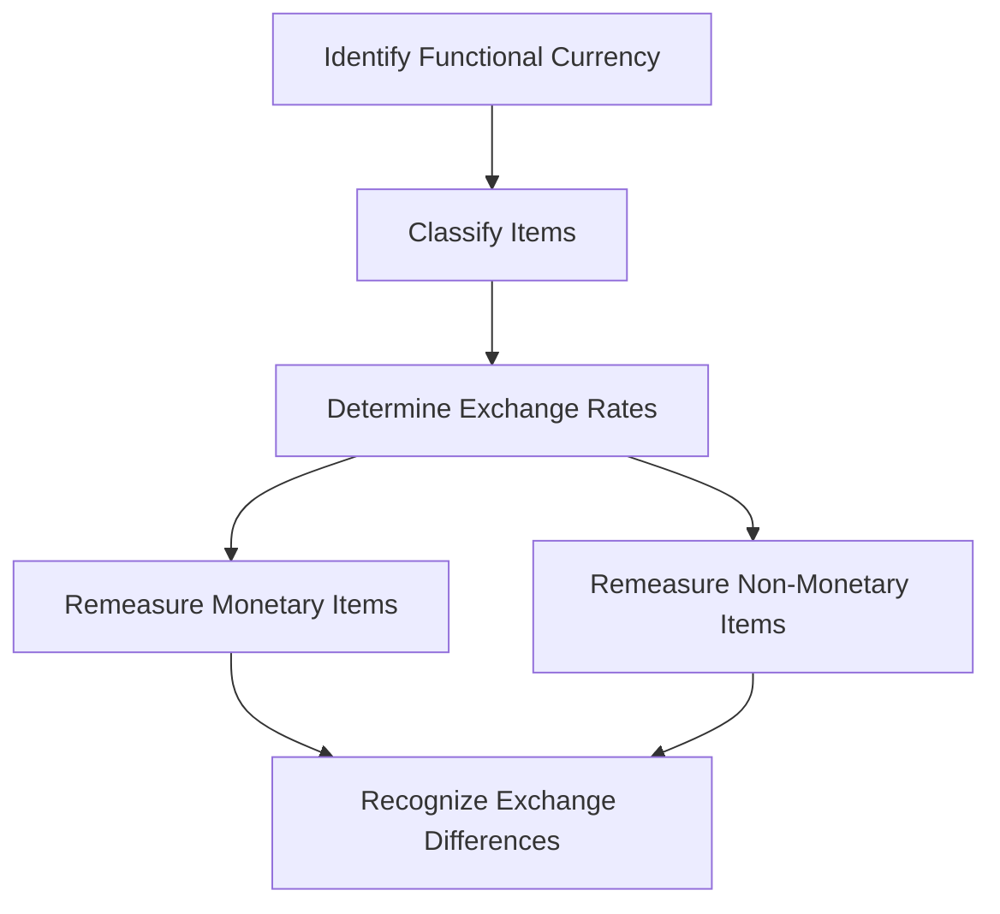

## 10.4 Remeasurement Process

In the realm of international business, transactions often occur in multiple currencies. For Canadian accountants, understanding the remeasurement process is crucial, especially when preparing consolidated financial statements. This section delves into the intricacies of remeasuring transactions that occur in a currency different from the functional currency, providing a comprehensive guide for Canadian accounting exams.

### Understanding Remeasurement

Remeasurement is the process of converting financial transactions and balances denominated in a foreign currency into the entity's functional currency. This is necessary when the currency of the transaction is different from the currency in which the entity primarily operates. The functional currency is defined as the currency of the primary economic environment in which the entity operates.

#### Key Concepts

- **Functional Currency:** The currency of the primary economic environment in which the entity operates.
- **Foreign Currency:** Any currency other than the functional currency of the entity.
- **Exchange Rate:** The rate at which one currency can be exchanged for another.

### Remeasurement vs. Translation

It's important to distinguish between remeasurement and translation. While both involve converting foreign currency amounts into the functional currency, they serve different purposes:

- **Remeasurement** is used when the foreign currency is the currency of the transaction, but not the functional currency of the entity. It affects the income statement as it involves monetary items like receivables and payables.
- **Translation** is applied when consolidating financial statements of foreign subsidiaries with different functional currencies. It primarily affects the equity section of the balance sheet.

### Steps in the Remeasurement Process

The remeasurement process involves several key steps:

1. **Identify the Functional Currency:** Determine the currency in which the entity primarily generates and expends cash.
2. **Classify Items:** Differentiate between monetary and non-monetary items. Monetary items are those that are settled in a fixed or determinable amount of currency, such as cash, receivables, and payables. Non-monetary items include inventory, property, plant, and equipment.
3. **Determine the Exchange Rates:** Use the appropriate exchange rates for remeasurement:
   - **Monetary Items:** Use the closing rate at the balance sheet date.
   - **Non-Monetary Items:** Use the historical rate at the date of the transaction.
4. **Remeasure Monetary Items:** Convert monetary items using the closing rate, recognizing any exchange differences in the income statement.
5. **Remeasure Non-Monetary Items:** Convert non-monetary items using the historical rate, with no impact on the income statement.
6. **Recognize Exchange Differences:** Record exchange differences arising from remeasurement in the income statement.

### Practical Example

Consider a Canadian company with a functional currency of CAD that has a USD-denominated receivable. At the transaction date, the exchange rate is 1 USD = 1.25 CAD. At the balance sheet date, the rate changes to 1 USD = 1.30 CAD.

- **Initial Recognition:** The receivable is recorded at 1.25 CAD per USD.
- **Remeasurement at Balance Sheet Date:** The receivable is remeasured at 1.30 CAD per USD.
- **Exchange Difference:** The difference due to the change in exchange rate is recognized in the income statement.

### Accounting Standards and Guidelines

#### IFRS Guidelines

Under IFRS, IAS 21 "The Effects of Changes in Foreign Exchange Rates" provides guidance on the remeasurement process. Key points include:

- **Functional Currency Determination:** Entities must assess various factors, including the currency that influences sales prices and costs.
- **Exchange Rate Use:** The closing rate is used for monetary items, while historical rates are used for non-monetary items.
- **Exchange Differences:** Recognized in profit or loss unless they relate to a net investment in a foreign operation, in which case they are recognized in other comprehensive income.

#### GAAP Guidelines

Under US GAAP, ASC 830 "Foreign Currency Matters" outlines the remeasurement process. Differences from IFRS include:

- **Functional Currency Assessment:** Similar to IFRS, but with additional emphasis on the currency of the primary economic environment.
- **Exchange Differences Treatment:** Generally recognized in the income statement, with specific exceptions for certain hedging relationships.

### Challenges and Best Practices

#### Common Challenges

- **Determining the Functional Currency:** This can be complex for multinational entities with operations in multiple countries.
- **Exchange Rate Fluctuations:** Volatile exchange rates can lead to significant exchange differences, impacting financial results.
- **Consistency in Application:** Ensuring consistent application of exchange rates and remeasurement principles across the organization.

#### Best Practices

- **Regular Review of Functional Currency:** Periodically assess the functional currency to ensure it reflects the current economic environment.
- **Hedging Strategies:** Consider using hedging instruments to mitigate the impact of exchange rate fluctuations.
- **Clear Documentation:** Maintain thorough documentation of exchange rates used and the rationale for functional currency determination.

### Case Study: Remeasurement in Practice

Let's examine a case study involving a Canadian manufacturing company, MapleTech Inc., which has a subsidiary in Germany. The subsidiary's functional currency is the Euro (EUR), but it conducts transactions in USD.

#### Scenario

MapleTech Inc. has a USD-denominated loan payable by its German subsidiary. The loan was initially recognized at an exchange rate of 1 USD = 0.85 EUR. At the year-end, the exchange rate is 1 USD = 0.90 EUR.

#### Remeasurement Process

1. **Identify the Functional Currency:** The subsidiary's functional currency is EUR.
2. **Classify the Loan:** The loan is a monetary item.
3. **Determine the Exchange Rate:** Use the closing rate of 0.90 EUR per USD for remeasurement.
4. **Remeasure the Loan:** Convert the loan balance using the closing rate.
5. **Recognize Exchange Difference:** The exchange difference due to the change in rate is recognized in the income statement of the subsidiary.

### Diagrams and Visual Aids

To enhance understanding, let's visualize the remeasurement process using a flowchart:

### Conclusion

The remeasurement process is a critical component of foreign currency accounting, impacting the financial statements of entities engaged in international transactions. By understanding the principles and guidelines outlined in this section, you will be better prepared to tackle related questions on the Canadian accounting exams. Remember to regularly review the functional currency, apply appropriate exchange rates, and recognize exchange differences accurately.

### Additional Resources

For further study, consider exploring the following resources:

- **CPA Canada:** Offers comprehensive materials on foreign currency transactions and remeasurement.
- **IFRS Foundation:** Provides detailed guidance on IAS 21 and related standards.
- **AICPA:** Offers resources on US GAAP and ASC 830 for comparative study.

## **Ready to Test Your Knowledge?**



### What is the primary purpose of remeasurement in foreign currency transactions?

- [x] To convert foreign currency transactions into the functional currency
- [ ] To consolidate financial statements of foreign subsidiaries
- [ ] To determine the fair value of foreign currency assets
- [ ] To hedge against foreign currency risks

> **Explanation:** Remeasurement is used to convert foreign currency transactions into the functional currency of the entity.

### Which exchange rate is used for remeasuring monetary items?

- [x] Closing rate at the balance sheet date
- [ ] Historical rate at the transaction date
- [ ] Average rate for the period
- [ ] Forward rate at the balance sheet date

> **Explanation:** The closing rate at the balance sheet date is used for remeasuring monetary items.

### How are exchange differences from remeasurement recognized under IFRS?

- [x] In the income statement
- [ ] In other comprehensive income
- [ ] As a direct adjustment to equity
- [ ] As a deferred tax asset

> **Explanation:** Exchange differences from remeasurement are recognized in the income statement under IFRS.

### What is a key challenge in the remeasurement process?

- [x] Determining the functional currency
- [ ] Calculating deferred tax liabilities
- [ ] Preparing cash flow statements
- [ ] Assessing impairment of goodwill

> **Explanation:** Determining the functional currency can be challenging, especially for multinational entities.

### Which of the following is a best practice for managing exchange rate fluctuations?

- [x] Implementing hedging strategies
- [ ] Ignoring exchange rate changes
- [ ] Using only historical exchange rates
- [ ] Avoiding foreign currency transactions

> **Explanation:** Implementing hedging strategies can help manage the impact of exchange rate fluctuations.

### What is the functional currency?

- [x] The currency of the primary economic environment in which the entity operates
- [ ] The currency in which the entity prepares its financial statements
- [ ] The currency of the country where the entity is headquartered
- [ ] The currency used for all international transactions

> **Explanation:** The functional currency is the currency of the primary economic environment in which the entity operates.

### Which standard provides guidance on remeasurement under IFRS?

- [x] IAS 21
- [ ] IFRS 9
- [ ] IAS 16
- [ ] IFRS 15

> **Explanation:** IAS 21 provides guidance on the effects of changes in foreign exchange rates, including remeasurement.

### What is the impact of remeasurement on non-monetary items?

- [x] No impact on the income statement
- [ ] Recognized in other comprehensive income
- [ ] Directly affects cash flow
- [ ] Adjusted through deferred tax

> **Explanation:** Remeasurement of non-monetary items has no impact on the income statement as they are converted using historical rates.

### How are exchange differences treated under US GAAP?

- [x] Generally recognized in the income statement
- [ ] Always recognized in other comprehensive income
- [ ] Deferred until realization
- [ ] Adjusted directly in equity

> **Explanation:** Under US GAAP, exchange differences are generally recognized in the income statement.

### True or False: Remeasurement is only necessary for monetary items.

- [ ] True
- [x] False

> **Explanation:** Remeasurement is necessary for both monetary and non-monetary items, but the impact differs.


