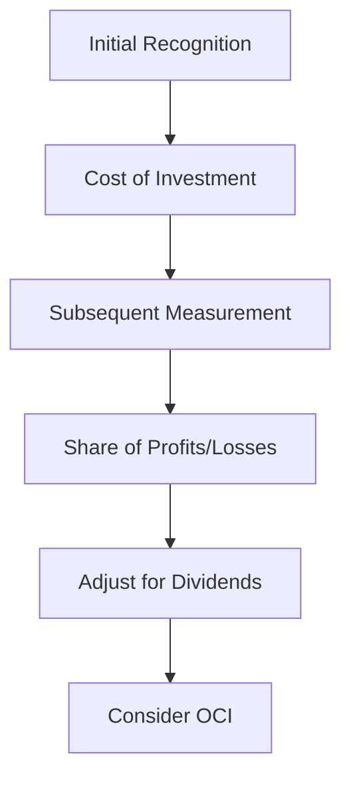

## 14.1 Overview of the Equity Method

The equity method of accounting is a crucial technique used in financial reporting for investments in associates. It provides a way to recognize the investor's share of the investee's profits or losses, reflecting the economic reality of such investments. This section will delve into the equity method's application, benefits, challenges, and provide practical examples relevant to the Canadian accounting profession.

### Understanding the Equity Method

The equity method is applied when an investor has significant influence over an investee, typically indicated by ownership of 20% to 50% of the voting shares. Unlike consolidation, where the investor controls the investee, the equity method recognizes the investor's share of the investee's net assets and results of operations.

#### Key Characteristics

- **Significant Influence:** The ability to participate in the financial and operating policy decisions of the investee, without having control or joint control.
- **Proportionate Share:** The investor recognizes its share of the investee's profits or losses in its financial statements.
- **Adjustments for Dividends:** Dividends received from the investee reduce the carrying amount of the investment.

### Application of the Equity Method

The equity method is used to account for investments in associates and joint ventures. The investor initially records the investment at cost and subsequently adjusts the carrying amount to recognize its share of the investee's profits or losses.

#### Step-by-Step Application

1. **Initial Recognition:** Record the investment at cost, including transaction costs.
2. **Subsequent Measurement:** Adjust the carrying amount for the investor's share of the investee's profits or losses.
3. **Dividends:** Reduce the carrying amount by the dividends received from the investee.
4. **Other Comprehensive Income (OCI):** Adjust for the investor's share of changes in the investee's OCI.

### Benefits of the Equity Method

- **Reflects Economic Reality:** Provides a realistic view of the investor's economic interest in the investee.
- **Alignment with Influence:** Aligns financial reporting with the level of influence the investor has over the investee.
- **Simplified Reporting:** Compared to full consolidation, the equity method is less complex and resource-intensive.

### Challenges and Limitations

- **Judgment in Significant Influence:** Determining the presence of significant influence can be subjective and requires judgment.
- **Complexity in Adjustments:** Adjustments for the investor's share of profits or losses can be complex, especially with OCI.
- **Limited Control:** The investor does not have control over the investee, which can limit the availability of information.

### Practical Examples

Consider a scenario where Company A acquires a 30% stake in Company B. Company A would use the equity method to account for its investment in Company B. If Company B reports a net income of $1,000,000, Company A would recognize $300,000 (30% of $1,000,000) as its share of Company B's profits.

### Real-World Applications

In Canada, the equity method is guided by International Financial Reporting Standards (IFRS) as adopted by the Canadian Accounting Standards Board (AcSB). Specifically, IAS 28 "Investments in Associates and Joint Ventures" outlines the requirements for applying the equity method.

#### Example: Canadian Telecommunications Industry

In the Canadian telecommunications industry, companies often hold significant stakes in other telecom entities. The equity method allows these companies to reflect their economic interest in the financial performance of their associates, providing investors with a comprehensive view of their financial position.

### Regulatory Scenarios

Under IFRS, the equity method is mandatory for investments in associates unless the investment is classified as held for sale. The application of the equity method ensures compliance with Canadian accounting standards and provides transparency in financial reporting.

### Step-by-Step Guidance

To effectively apply the equity method, follow these steps:

1. **Assess Significant Influence:** Evaluate whether the investor has significant influence over the investee.
2. **Initial Measurement:** Record the investment at cost, including any directly attributable transaction costs.
3. **Recognize Share of Profits/Losses:** Adjust the carrying amount of the investment for the investor's share of the investee's profits or losses.
4. **Adjust for Dividends:** Reduce the carrying amount by the dividends received from the investee.
5. **Consider OCI:** Adjust for the investor's share of changes in the investee's OCI.

### Diagrams and Visuals

To enhance understanding, consider the following diagram illustrating the flow of accounting transactions under the equity method:

### Best Practices and Common Pitfalls

- **Best Practices:**
  - Regularly assess the level of influence to ensure the appropriate application of the equity method.
  - Maintain clear documentation of the investor's share of profits or losses and any adjustments for OCI.

- **Common Pitfalls:**
  - Misjudging the level of influence, leading to incorrect application of the equity method.
  - Failing to adjust for the investor's share of OCI, resulting in inaccurate financial reporting.

### References and Additional Resources

- **IFRS Standards:** IAS 28 "Investments in Associates and Joint Ventures"
- **CPA Canada:** Resources and guidelines on applying the equity method
- **Canadian Accounting Standards Board (AcSB):** Updates and interpretations of IFRS in Canada

### Summary

The equity method is a vital accounting technique for investments in associates, providing a realistic view of the investor's economic interest. By understanding its application, benefits, and challenges, you can effectively prepare for the Canadian Accounting Exams and apply these principles in your professional practice.

## **Ready to Test Your Knowledge?**



### What is the equity method used for?

- [x] Accounting for investments in associates
- [ ] Consolidating financial statements
- [ ] Preparing cash flow statements
- [ ] Calculating tax liabilities

> **Explanation:** The equity method is used for accounting for investments in associates, reflecting the investor's share of the investee's profits or losses.

### What percentage of ownership typically indicates significant influence?

- [x] 20% to 50%
- [ ] 10% to 20%
- [ ] 50% to 70%
- [ ] Over 70%

> **Explanation:** Significant influence is typically indicated by ownership of 20% to 50% of the voting shares.

### How is the initial investment recorded under the equity method?

- [x] At cost, including transaction costs
- [ ] At fair value
- [ ] At book value
- [ ] At market value

> **Explanation:** The initial investment is recorded at cost, including any directly attributable transaction costs.

### How are dividends from the investee treated under the equity method?

- [x] They reduce the carrying amount of the investment
- [ ] They are recognized as income
- [ ] They increase the carrying amount of the investment
- [ ] They are ignored

> **Explanation:** Dividends from the investee reduce the carrying amount of the investment under the equity method.

### Which standard outlines the requirements for the equity method in Canada?

- [x] IAS 28
- [ ] IFRS 10
- [ ] ASC 810
- [ ] ASPE 1590

> **Explanation:** IAS 28 "Investments in Associates and Joint Ventures" outlines the requirements for the equity method in Canada.

### What is a key benefit of the equity method?

- [x] Reflects the economic reality of the investment
- [ ] Simplifies tax reporting
- [ ] Eliminates the need for consolidation
- [ ] Reduces financial statement complexity

> **Explanation:** The equity method reflects the economic reality of the investment, aligning financial reporting with the level of influence.

### What is a common challenge when applying the equity method?

- [x] Determining significant influence
- [ ] Calculating tax liabilities
- [ ] Preparing cash flow statements
- [ ] Consolidating financial statements

> **Explanation:** Determining significant influence can be subjective and requires judgment, making it a common challenge.

### How should changes in the investee's OCI be treated under the equity method?

- [x] Adjust the carrying amount of the investment
- [ ] Recognize as income
- [ ] Ignore
- [ ] Record as a liability

> **Explanation:** Changes in the investee's OCI should adjust the carrying amount of the investment under the equity method.

### What happens if the investor loses significant influence over the investee?

- [x] The equity method is discontinued
- [ ] The investment is consolidated
- [ ] The investment is written off
- [ ] The investment is revalued

> **Explanation:** If the investor loses significant influence, the equity method is discontinued.

### True or False: The equity method is less complex than full consolidation.

- [x] True
- [ ] False

> **Explanation:** The equity method is generally less complex than full consolidation, as it does not require the investor to consolidate the investee's financial statements.


