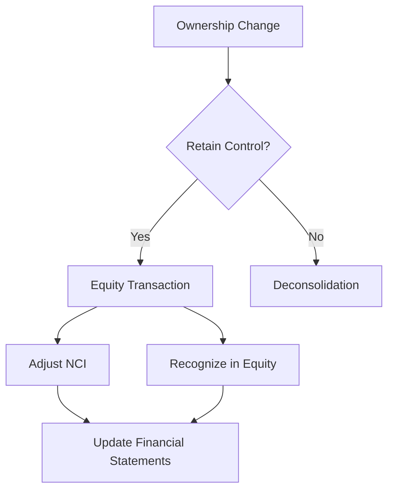

## 15.1 Accounting for Changes in Ownership without Loss of Control

In the dynamic world of business, ownership structures often change due to various strategic, financial, or operational reasons. Understanding how these changes impact consolidated financial statements, especially when control is retained, is crucial for accountants and financial analysts. This section delves into the accounting treatment for changes in ownership interests without a loss of control, focusing on Canadian accounting standards and practices.

### Understanding Ownership Changes and Control

Ownership changes occur when a parent company alters its stake in a subsidiary. These changes can result from buying or selling shares, issuing new shares, or other transactions. The key factor in determining the accounting treatment is whether the parent company retains control over the subsidiary.

**Control** is defined as the power to govern the financial and operating policies of an entity to obtain benefits from its activities. According to IFRS 10, control is established when the investor has:

1. Power over the investee.
2. Exposure or rights to variable returns from its involvement with the investee.
3. The ability to use its power to affect the returns.

### Accounting Treatment for Changes in Ownership without Loss of Control

When a parent company changes its ownership interest in a subsidiary but retains control, the transaction is accounted for as an equity transaction. This means that no gain or loss is recognized in profit or loss. Instead, the difference between the consideration paid or received and the change in the non-controlling interests (NCI) is recognized directly in equity.

#### Key Steps in Accounting for Ownership Changes

1. **Determine the Change in Ownership Interest:** Calculate the percentage change in ownership and its impact on the parent and non-controlling interests.

2. **Calculate the Consideration Paid or Received:** Determine the fair value of the consideration exchanged in the transaction.

3. **Adjust Non-Controlling Interests:** Adjust the NCI in the subsidiary to reflect the new ownership percentage.

4. **Recognize the Difference in Equity:** The difference between the consideration and the adjustment to NCI is recognized directly in equity, typically in a separate component such as "Changes in Ownership Interests."

5. **Update Consolidated Financial Statements:** Ensure that the consolidated financial statements reflect the new ownership structure, including updated equity and NCI balances.

### Practical Example

Consider a parent company, ABC Corp, which owns 80% of a subsidiary, XYZ Ltd. ABC Corp decides to purchase an additional 10% stake in XYZ Ltd, bringing its total ownership to 90%. The fair value of the consideration paid for the additional 10% is $500,000.

#### Step-by-Step Accounting

1. **Determine the Change in Ownership Interest:**
   - Original Ownership: 80%
   - New Ownership: 90%
   - Change in Ownership: 10%

2. **Calculate the Consideration Paid:**
   - Consideration for 10%: $500,000

3. **Adjust Non-Controlling Interests:**
   - Original NCI: 20%
   - New NCI: 10%
   - Change in NCI: 10%

4. **Recognize the Difference in Equity:**
   - The adjustment to NCI is the fair value of the 10% interest, which is $500,000.
   - Since the consideration paid equals the adjustment to NCI, there is no additional amount to recognize in equity.

5. **Update Consolidated Financial Statements:**
   - Reflect the new ownership structure in the equity section, showing the updated NCI and parent equity.

### Regulatory Framework and Standards

In Canada, the accounting for changes in ownership interests without loss of control is governed by IFRS 10, "Consolidated Financial Statements," and IAS 27, "Separate Financial Statements." These standards provide guidance on how to account for such transactions, ensuring consistency and transparency in financial reporting.

#### Key IFRS and GAAP Considerations

- **IFRS 10:** Emphasizes the control model, where changes in ownership that do not result in a loss of control are treated as equity transactions.
- **IAS 27:** Provides guidance on the accounting treatment for investments in subsidiaries, joint ventures, and associates in separate financial statements.
- **ASC Topic 810 (GAAP):** Similar to IFRS, under U.S. GAAP, changes in a parent's ownership interest in a subsidiary that do not result in a loss of control are accounted for as equity transactions.

### Common Pitfalls and Best Practices

#### Common Pitfalls

1. **Misidentifying the Transaction Type:** Confusing changes in ownership without loss of control with transactions that result in loss of control can lead to incorrect accounting treatment.

2. **Incorrect Calculation of Consideration:** Failing to accurately determine the fair value of consideration can result in errors in equity adjustments.

3. **Inadequate Disclosure:** Not providing sufficient disclosure about ownership changes can lead to a lack of transparency in financial statements.

#### Best Practices

1. **Thorough Analysis of Control:** Regularly assess control over subsidiaries to ensure accurate classification and accounting treatment.

2. **Accurate Valuation of Consideration:** Use reliable valuation techniques to determine the fair value of consideration exchanged in ownership changes.

3. **Comprehensive Disclosures:** Provide detailed disclosures about changes in ownership interests, including the impact on equity and NCI.

### Real-World Applications and Case Studies

#### Case Study: XYZ Ltd's Ownership Change

In a real-world scenario, XYZ Ltd, a Canadian technology company, underwent a change in ownership when its parent company increased its stake from 70% to 85%. The transaction was structured as an equity transaction, with the parent company paying $1 million for the additional 15% interest.

**Outcome:**

- The transaction was accounted for as an equity transaction, with the $1 million recognized directly in equity.
- The non-controlling interest was adjusted to reflect the new ownership percentage.
- The consolidated financial statements were updated to show the revised ownership structure and equity balances.

### Diagrams and Visual Aids

To enhance understanding, the following Mermaid.js diagram illustrates the flow of accounting for changes in ownership without loss of control:

### Summary

Accounting for changes in ownership without loss of control is a critical aspect of consolidated financial statements. By treating these transactions as equity transactions, companies can ensure accurate and transparent financial reporting. Understanding the regulatory framework, common pitfalls, and best practices will help you navigate these complex transactions effectively.

### Recommended Resources

- **CPA Canada:** Offers resources and guidance on accounting standards and practices in Canada.
- **IFRS Foundation:** Provides comprehensive information on IFRS standards, including IFRS 10 and IAS 27.
- **Financial Accounting Standards Board (FASB):** Offers insights into U.S. GAAP and ASC Topic 810.

### Practice Questions and Exercises

To reinforce your understanding, consider working through practice questions and exercises related to changes in ownership interests. These exercises will help you apply the concepts and principles discussed in this section.

## **Ready to Test Your Knowledge?**



### What is the primary accounting treatment for changes in ownership interests without loss of control?

- [x] Equity transaction
- [ ] Profit or loss recognition
- [ ] Asset revaluation
- [ ] Liability adjustment

> **Explanation:** Changes in ownership interests without loss of control are treated as equity transactions, with adjustments made directly in equity.

### Under IFRS, what is the key factor in determining whether a change in ownership results in a loss of control?

- [x] Control over the investee
- [ ] Percentage of ownership
- [ ] Amount of consideration paid
- [ ] Non-controlling interest

> **Explanation:** Control over the investee is the key factor in determining whether a change in ownership results in a loss of control under IFRS.

### When a parent company increases its ownership in a subsidiary without losing control, what happens to the non-controlling interest?

- [x] It decreases
- [ ] It increases
- [ ] It remains the same
- [ ] It is eliminated

> **Explanation:** When a parent company increases its ownership, the non-controlling interest decreases as the parent's share of ownership increases.

### What is the impact on profit or loss when accounting for changes in ownership without loss of control?

- [x] No impact
- [ ] Increase in profit
- [ ] Decrease in profit
- [ ] Recognition of a gain

> **Explanation:** There is no impact on profit or loss; the transaction is recognized directly in equity.

### Which IFRS standard provides guidance on accounting for changes in ownership interests without loss of control?

- [x] IFRS 10
- [ ] IFRS 9
- [ ] IFRS 15
- [ ] IFRS 16

> **Explanation:** IFRS 10 provides guidance on consolidated financial statements, including accounting for changes in ownership interests without loss of control.

### What is the typical disclosure requirement for changes in ownership interests without loss of control?

- [x] Detailed disclosure in equity section
- [ ] No disclosure required
- [ ] Disclosure in profit or loss
- [ ] Disclosure in cash flow statement

> **Explanation:** Detailed disclosure in the equity section is typically required to provide transparency about changes in ownership interests.

### How should the consideration paid in a change of ownership without loss of control be measured?

- [x] Fair value
- [ ] Historical cost
- [ ] Book value
- [ ] Amortized cost

> **Explanation:** The consideration paid should be measured at fair value to accurately reflect the transaction.

### What happens to the consolidated financial statements after a change in ownership without loss of control?

- [x] They are updated to reflect the new ownership structure
- [ ] They remain unchanged
- [ ] They are restated
- [ ] They are reissued

> **Explanation:** The consolidated financial statements are updated to reflect the new ownership structure, including changes in equity and NCI.

### True or False: Changes in ownership interests without loss of control result in the recognition of a gain or loss in profit or loss.

- [x] False
- [ ] True

> **Explanation:** False. Changes in ownership interests without loss of control do not result in the recognition of a gain or loss in profit or loss; they are treated as equity transactions.

### Which of the following is a common pitfall when accounting for changes in ownership without loss of control?

- [x] Misidentifying the transaction type
- [ ] Overstating profit
- [ ] Understating liabilities
- [ ] Ignoring cash flows

> **Explanation:** Misidentifying the transaction type can lead to incorrect accounting treatment, making it a common pitfall.


